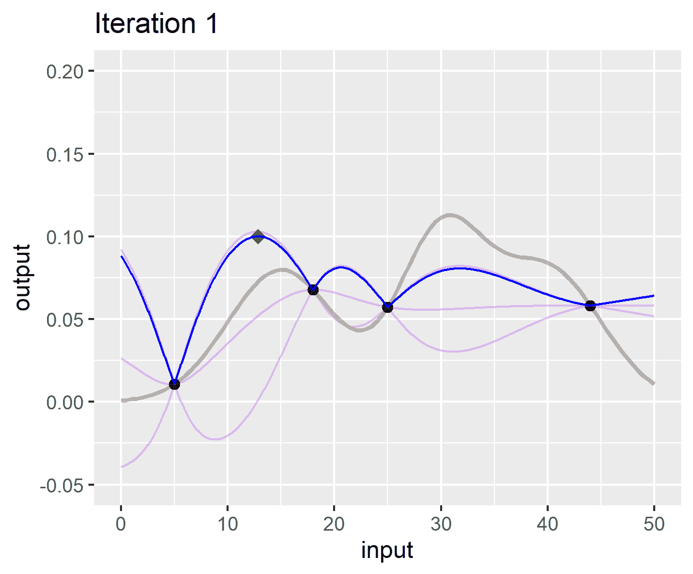
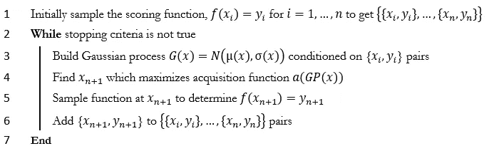
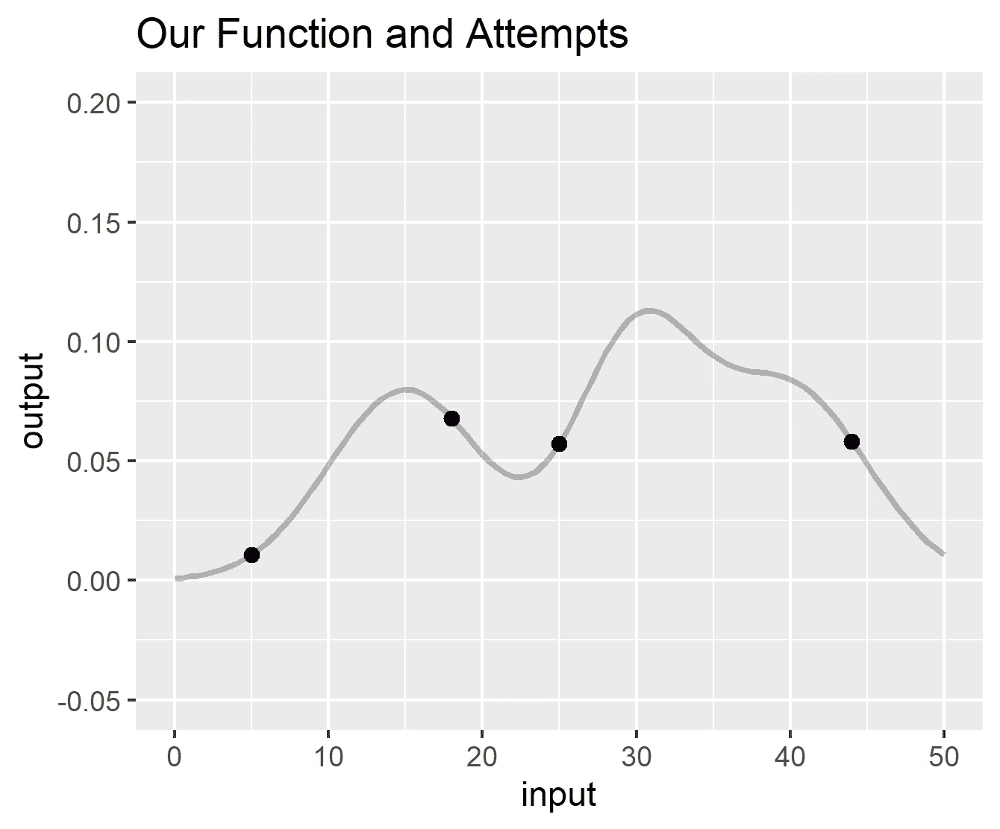
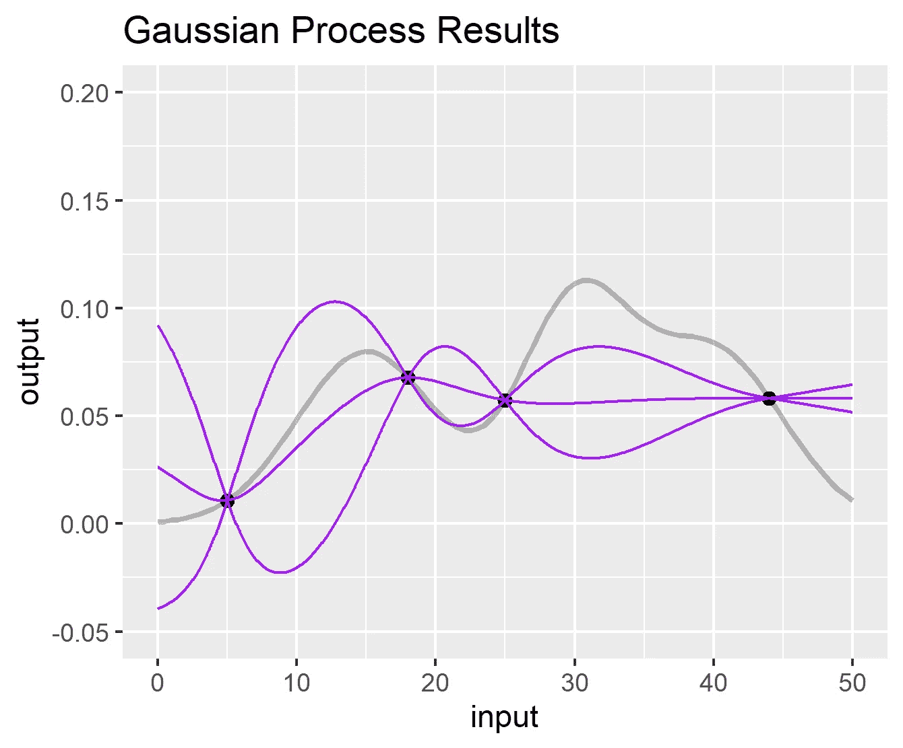
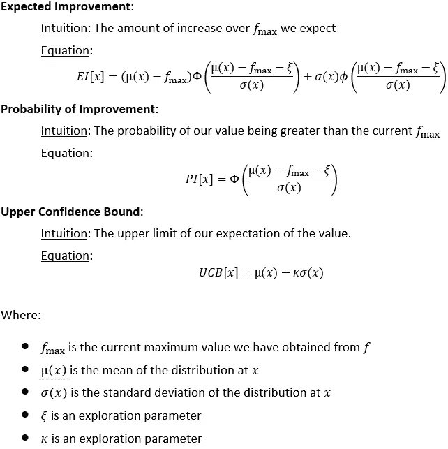
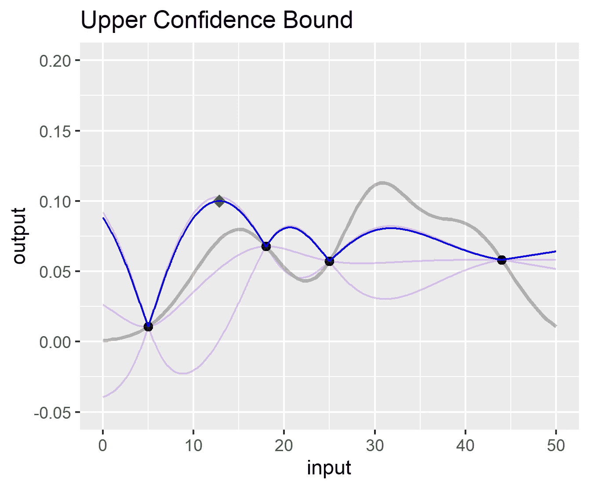
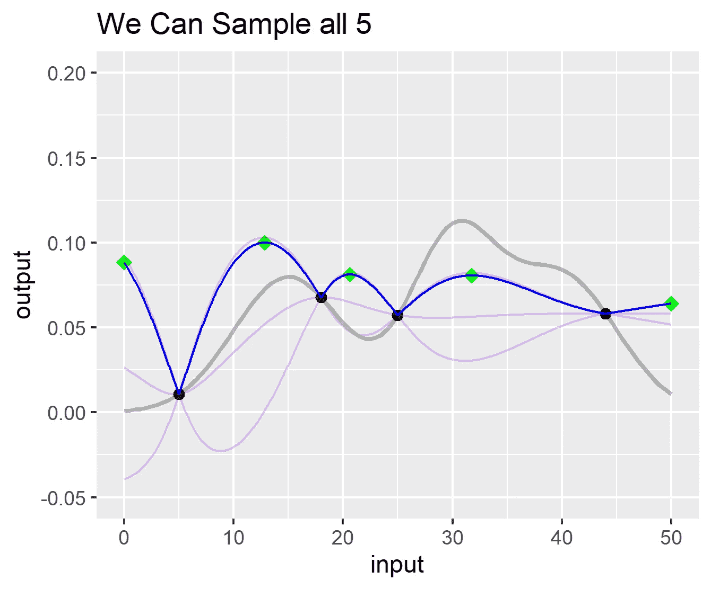

# 贝叶斯优化的并行实现

> 原文：<https://towardsdatascience.com/a-parallel-implementation-of-bayesian-optimization-2ffcdb2733a2?source=collection_archive---------20----------------------->

## 介绍一种适用于昂贵、不连续或不确定函数的并行优化方法。



作者上传的图片

“优化”的概念是数据科学的核心。我们通过优化神经网络中的权重来最小化损失。我们优化梯度增强树中的超参数，以找到最佳偏差-方差权衡。我们使用 A-B 测试来优化我们网站上的行为。无论我们的功能是神经网络、消费者行为，还是更险恶的东西，我们都有想要优化的东西。

有时，我们试图优化的功能是*昂贵的*，我们希望以尽可能少的步骤到达我们的目的地。有时我们希望确信我们找到了可能的最佳解决方案，有时我们的函数没有易处理的梯度，所以没有好的箭头来给我们指出正确的方向。通常，我们的函数有随机元素，所以我们真的试图优化 *f(x) = y + e，*其中 *e* 是一些随机误差元素。贝叶斯优化是一种函数优化器(maximizer)，在这些条件下蓬勃发展。

# 目录

1.  什么是贝叶斯优化
2.  从头开始实施
3.  并行实施
4.  最后的话

# 什么是贝叶斯优化

假设我们有一个函数 *f，*，我们想找到最大化(或最小化) *f(x)* 的 *x* 。我们有很多很多选择。然而，如果我们的函数符合目录上面的描述，我们肯定会考虑贝叶斯优化。

有几种不同的方法来执行贝叶斯优化。所有这些都涉及到创建一个关于某些事物如何分布的假设，基于这个假设做出一个决定，然后更新这个假设。

本文中的方法使用高斯过程来创建关于 *f(x)* 如何分布的假设。这些过程可以被认为是函数的分布——从高斯*分布*中抽取随机样本会产生一个数字，从高斯*过程*中抽取随机样本会产生一个函数。如果你不熟悉高斯过程，这有点难以想象。我推荐[这个视频](https://www.youtube.com/watch?v=92-98SYOdlY)，是它让我对这个概念产生了兴趣。

算法本身可以总结如下:



作者上传的图片

# 从头开始实施

在这里，我们不使用软件包，只进行一次贝叶斯优化迭代。这个过程非常简单。首先，我们定义一个玩具函数 *func* 我们想要最大化，然后我们采样它 4 次:

```
# Function to optimize
func <- function(input) {
  dnorm(input,15,5) + dnorm(input,30,4) + dnorm(input,40,5)
}# Sample the function 4 times
func_results <- data.frame(input = c(5,18,25,44))
func_results$output <- func(func_results$input)# Plot
library(ggplot2)
p <- ggplot(data = data.frame(input=c(0,50)),aes(input)) +
  stat_function(fun=func,size=1,alpha=0.25) +
  geom_point(data=func_results,aes(x=input,y=output),size=2) +
  ylab("output") +
  ylim(c(-0.05,0.2))
p + ggtitle("Our Function and Attempts")
```



作者上传的图片

我们假装不知道真正的函数，所以实际上我们看到的只是我们采样的 4 个点。为了保持这个演练的趣味性，我们在选择初始点时做了一件很糟糕的工作。让我们用高斯过程来拟合这 4 个点，以定义我们对每个输入的输出分布的假设。

```
library(DiceKriging)
set.seed(1991)
gp <- km(
    design = data.frame(input=func_results$input)
  , response = func_results$output
  , scaling = TRUE
)
```

让我们看看采样点旁边的高斯过程和真实函数值:

```
predGP <- function(x,grab) {
  predict(gp,data.frame(input=x),type = "UK")[[grab]]
}a=1
cl = "purple"
plotGP <- function(grab,cl,a) {
  stat_function(
    fun=predGP,args=list(grab=grab),color=cl,alpha=a,n=1000
  )
}
p + ggtitle("Gaussian Process Results") +
  plotGP("mean",cl,a) +
  plotGP("lower95",cl,a) +
  plotGP("upper95",cl,a)
```



作者上传的图片

高斯过程允许我们为每个输入定义输出*的正态分布。在上图中，紫色线条显示的是高斯过程。中间的线是平均值，上面/下面的线是该输入的正态分布的第 95 个百分位数。因此，举例来说，如果我们想知道如何假设输出在输入= 30 时分布，我们可以这样做:*

```
predict(gp,data.frame(input=30),type="UK")[c("mean","sd")]$mean
[1] 0.05580301

$sd
[1] 0.007755026
```

这说明我们假设，在输入= 30 时，我们的输出服从正态分布，均值= 0.0558，标准差= 0.0078。

既然我们已经定义了关于输出分布的假设，我们需要确定下一步在哪里对函数进行采样。要做到这一点，我们需要定义一个输入的“承诺”程度。我们通过定义一个获取函数来做到这一点。有几种可供选择:



作者上传的图片

其中，置信上限是最容易实现的，因此让我们定义该函数并将其绘制在图表上:

```
ucb <- function(x,kappa=3) {
  gpMean <- predGP(x,grab="mean")
  gpSD <- predGP(x,grab="sd")
  return(gpMean + kappa * gpSD)
}a=0.25
p + ggtitle("Upper Confidence Bound") +
  plotGP("mean",cl,a) +
  plotGP("lower95",cl,a) +
  plotGP("upper95",cl,a) +
  stat_function(fun=ucb,color="blue")
```



作者上传的图片

我们可以看到，我们的置信上限在 10 到 15 之间的某处达到最大值(绿色菱形),所以让我们找到具体的点，对其进行采样，并更新我们的 GP:

```
# Find exact input that maximizes ucb
acqMax <- optim(
    par = 12
  , fn = ucb
  , method = “L-BFGS-B”
  , control = list(fnscale = -1)
  , lower = 10
  , upper = 20
)$par# Run our function as this spot
func_results <- rbind(
    func_results
  , data.frame(input = acqMax,output = func(acqMax))
)
```

我们刚刚完成了贝叶斯优化的一次迭代！如果我们继续运行更多，我们会看到我们的图表演变:


作者上传的图片

# 并行实施

我们不会从零开始实现这一部分。相反，我们将使用 ParBayesianOptimization R 包来完成繁重的工作。这个软件包允许我们一次对多个有希望的点进行采样。如果只有 1 个有希望的点，它会对周围区域进行多次采样。因此，在我们的第一个例子中，我们将对采集函数的所有 5 个局部最大值进行采样:



作者上传的图片

让我们让它运行起来，看看会有什么结果。我们用上述 4 个相同的点初始化流程，然后用 5 个点运行 1 个优化步骤:

```
library(ParBayesianOptimization)
library(doParallel)# Setup parallel cluster
cl <- makeCluster(5)
registerDoParallel(cl)
clusterExport(cl,c('func'))# bayesOpt requires the function to return a list with Score
# as the metric to maximize. You can return other fields, too.
scoringFunc <- function(input) return(list(Score = func(input)))# Initialize and run 1 optimization step at 5 points
optObj <- bayesOpt(
  FUN = scoringFunc
  , bounds = list(input=c(0,50))
  , initGrid = list(input=c(5,18,25,44))
  , iters.n = 5
  , iters.k = 5
  , acqThresh = 0
  , parallel = TRUE
)
stopCluster(cl)
registerDoSEQ()# Print the input and score of the first Epoch
optObj$scoreSummary[,c("Epoch","input","Score","gpUtility")] Epoch    input        Score gpUtility
     0  5.00000 0.0107981936        NA
     0 18.00000 0.0677578712        NA
     0 25.00000 0.0573468343        NA
     0 44.00000 0.0581564852        NA
     1 35.59468 0.0916401614 0.6558418
     1 50.00000 0.0107985650 0.6326077
     1 13.74720 0.0773487879 0.5417429
     1 21.13259 0.0462167925 0.4734561
     1  0.00000 0.0008863697 0.1961284
```

我们的分数摘要显示，bayesOpt 运行了我们的 4 个初始点(Epoch = 0)，然后运行了 1 个优化步骤(Epoch = 1)，其中它对采集函数的所有 5 个局部最优值进行了采样。如果我们运行更多的迭代，我们将继续一次采样 5 个点。如果我们的函数最大化实际上是昂贵的，这将允许我们更快地找到全局最优。

bayesOpt 中的 acqThresh 参数对于采样过程至关重要。该参数代表采集函数全局最优值的最小百分比，局部最优值必须达到该百分比才能进行采样。例如，如果 acqThresh=0.5，那么每个局部最优值(在我们的例子中是置信上限)必须至少是全局最优值的 50%，否则将被忽略。我们设置 acqThresh=0，这样所有的局部优化都会被采样。

请注意上面的 gpUtility 字段。这是采集函数在每个采样点的缩放值(在我们的例子中是置信上限)。如果您注意到这个值在多个时期内收敛到 0，那么高斯过程的观点是没有多少有希望的点留下来探索。一个更彻底的，包具体的解释可以找到[这里](https://github.com/AnotherSamWilson/ParBayesianOptimization#how-long-should-it-run-for)。

# 最后的话

贝叶斯优化是一个令人惊讶的利基场景工具。在现代数据科学中，它通常用于优化黑盒模型的超参数。然而，作为一个通用的函数优化器，它已经在许多不同的地方找到了用途。我个人倾向于用这种方法来调优我在 R 和 Python 中的超参数。