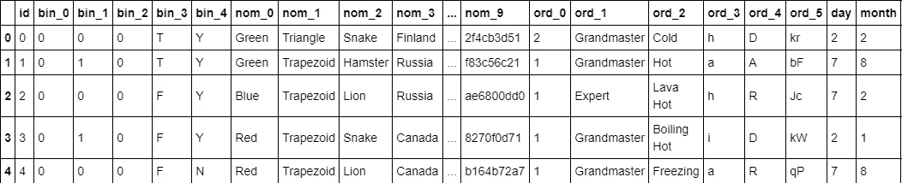
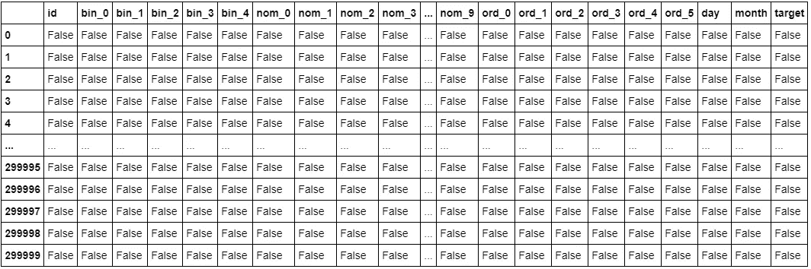
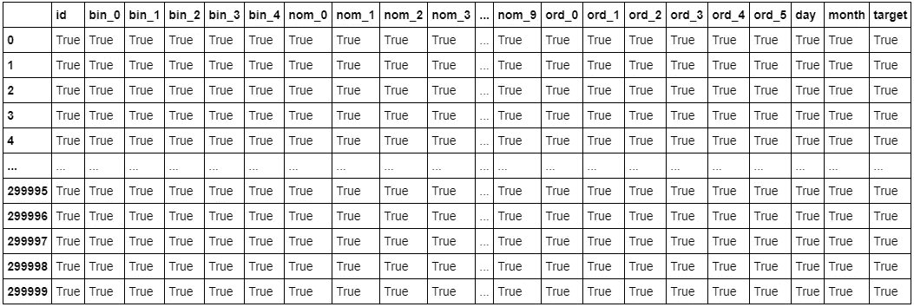

# 一瞥缺失的熊猫数据

> 原文：<https://towardsdatascience.com/a-peek-into-missing-data-with-pandas-2fb9e5df8bd0?source=collection_archive---------42----------------------->

## [PyTrix 系列](https://towardsdatascience.com/tagged/pytrix-series)

## PyTrix #6:检测缺失数据


凯莉·西克玛在 [Unsplash](https://unsplash.com?utm_source=medium&utm_medium=referral) 上的照片

当我们观察到数据中缺少值时，这是因为没有数据值存储在观察的特定变量中。缺失数据在实践中极为常见，并且会对从数据中得出的结论产生很大影响，因此数据科学家的大部分时间都花在了数据清理上。

我们可能会有缺失数据的各种原因，例如，可能有未被调查者，可能只有在已经收集了一定数量的观察值后才开始收集特定特征，数据输入中出现错误，或者在某些情况下，参与者可能会随着时间的推移而退出-一般来说，可能有各种原因。

无论如何，给定一些先决条件(即，我们有一个想要解决的已定义的问题)，我们想要从我们处理的数据中提取有意义的见解，这将意味着在我们开始处理数据集之前要面对缺失数据的问题。这样我们就避免了对一个仅由 45%的观察值代表的变量做出任何具体的结论。此外，在训练我们的机器学习算法时，缺失值可能会被我们的模型视为 0 或无穷大，这可能会对我们的训练结果产生一些严重的影响。

## 熊猫的例子

> 注意:对于此任务，我们将使用来自 Kaggle 的数据集，具体来说就是 [**分类特征编码挑战**](https://www.kaggle.com/c/cat-in-the-dat/data?select=train.csv) **。**代码可在下面的链接中找到。

[](https://github.com/kurtispykes/demo/blob/master/pytrix/pytrix_missing_data.ipynb) [## kurtispykes/演示

### permalink dissolve GitHub 是超过 5000 万开发人员的家园，他们一起工作来托管和审查代码，管理…

github.com](https://github.com/kurtispykes/demo/blob/master/pytrix/pytrix_missing_data.ipynb) 

我们将从使用`pd.read_csv` — [文档](https://pandas.pydata.org/pandas-docs/stable/reference/api/pandas.read_csv.html)读入数据开始。

```
import pandas as pd *# load and peek at data*
df = pd.read_csv("../data/categorical_feature_engineering_raw/train.csv")
df.head()
```



图 1:df . head()；该表太大，无法放入图像中(并且太大，无法显示列，因此出现省略号)。

在用于数据操作的 Python 框架 Pandas 中，缺失值被表示为`Nan`或`None`，并且有多种方法来检查我们的数据中是否存在缺失值:

*   **pd.isnull()**
*   **pd.notnull()**
*   **pd.isna()**
*   **pd.notna()**
*   **df.isna()**
*   **df.notna()**
*   **df.isnull()**
*   **df.notnull()**

是的，我知道你在想什么，*我应该用哪一个？嗯，你会发现它们之间最大的不同是，4 个是顶级函数，另外 4 个是 pandas dataframe 类(`pd.DataFrame.isna()`)的方法。本质上，在数据帧级别上`df.isna()`和`df.isnull()`是相同的，同样`df.notna()`和`df.notnull()`也是相同的(它们实际上有相同的文档)——这种现象也适用于顶级函数。*

为什么名称不同的多个方法做同样的事情？Pandas 建立在 NumPy 之上，NumPy 使用`np.isnan()`来检测丢失的值，因此它既没有`**Na**`也没有`**Null**`值。然而，Pandas 使用基于 R 数据帧的数据帧，并且 R 中的`**Na**`和`**Null**`是不同的东西——在这里阅读更多关于 R `**Na**`和`**Null**`T35 的信息，在这里查看我的答案来源[。](https://datascience.stackexchange.com/questions/37878/difference-between-isna-and-isnull-in-pandas)

> 所以我想在这个意义上，我们可以选择让熊猫成为我们自己的，这是熊猫框架中的一个共同主题。

我通常使用`df.isna()`和相反的`df.notna()`，主要是因为它比`df.isnull()`和`df.notnull()`需要输入的字符少。此外，我更喜欢用点符号直接访问数据帧，这排除了顶级函数(它们要求您将数据帧或系列对象作为参数传递)。

```
*# see what .isna() returns*
df.isna()
```



图 2: df.isna()为 DataFrame 中的每个元素返回一个 bool 值的掩码，指示一个元素是否不是安娜值。

作为理智检查，我将对`pd.isna()`做同样的事情…

```
pd.isna(df)
```


图 3: pd.isna(df)返回一个布尔值，表明是否缺少每个相应的元素。

好吧，这是一样的(你注意到你必须为顶层函数路径键入几个额外的字母吗——是的，我很懒)。现在我们可以检查`df.notna()`是否真的是`df.isna()`的倒数…

```
*# see what .notna() returns* df.notna()
```



图 4: df.notna()

尽管`df.notna()`的文档说明这个方法返回的东西和`df.isna()`完全一样(我个人觉得很困惑)，`df.notna()`确实是相反的。

除此之外，让我们进一步挖掘我们的数据，以检查丢失的值。

```
df.isna().sum()>>>> 
id        0
bin_0     0
bin_1     0
bin_2     0
bin_3     0
bin_4     0
nom_0     0
nom_1     0
nom_2     0
nom_3     0
nom_4     0
nom_5     0
nom_6     0
nom_7     0
nom_8     0
nom_9     0
ord_0     0
ord_1     0
ord_2     0
ord_3     0
ord_4     0
ord_5     0
day       0
month     0
target    0
dtype: int64
```

Oooops，看起来我们有一个没有缺失值的数据集——这在现实世界中不太可能发生，所以我们将利用我们在 [PyTrix 系列](https://towardsdatascience.com/tagged/pytrix-series)第 4 集中学到的一些技能来添加一些缺失值——链接如下。

[](/slicing-and-indexing-with-pandas-2bff05ec361e) [## 用熊猫切片和索引

### PyTrix #4:用熊猫访问数据

towardsdatascience.com](/slicing-and-indexing-with-pandas-2bff05ec361e) 

```
*# inputting NaN's randomly into data*
df.loc[2:1000:100, ["bin_0"]] = **None**
df.loc[:300:20, ["ord_4", "ord_5"]] = **None** 
df.loc[500::50, ["nom_4", "bin_4"]] = **None**df.isna().sum()>>>> 
id           0
bin_0       10
bin_1        0
bin_2        0
bin_3        0
bin_4     5990
nom_0        0
nom_1        0
nom_2        0
nom_3        0
nom_4     5990
nom_5        0
nom_6        0
nom_7        0
nom_8        0
nom_9        0
ord_0        0
ord_1        0
ord_2        0
ord_3        0
ord_4       16
ord_5       16
day          0
month        0
target       0
dtype: int64
```

太棒了。这意味着当我们使用逆方法时，`df.notna()`应该发生的是，缺失值的数量应该从特定列的行数中扣除，对吗？

```
*# how man non-null values?* 
df.notna().sum()>>>>
id        300000
bin_0     299990
bin_1     300000
bin_2     300000
bin_3     300000
bin_4     294010
nom_0     300000
nom_1     300000
nom_2     300000
nom_3     300000
nom_4     294010
nom_5     300000
nom_6     300000
nom_7     300000
nom_8     300000
nom_9     300000
ord_0     300000
ord_1     300000
ord_2     300000
ord_3     300000
ord_4     299984
ord_5     299984
day       300000
month     300000
target    300000
dtype: int64
```

没错。

为了只查看有特定缺失观察值的行，我们可以在调用 dataframe 后将一个条件语句传递到括号(`[]`)中，如下所示…

```
*# viewing only the rows where bin_4 = NaN* 
df[df["bin_4"].isna()]
```


图 bin _ 4 是缺失值的行

在不深入研究我们如何处理缺失值的情况下——这可能会在另一篇文章中讨论——接下来的几行代码将展示处理缺失值的最简单的方法**(尽管不总是最好的方法)**…删除它们！

```
*# priginal df shape*
df.shape
>>>> (300000, 25)*# df shape after dropping rows with any missing values* 
df.dropna(how="any").shape
>>>> (293984, 25)*# df shape  after dropping rows with all missing values*
df.dropna(how="all").shape
>>>> (300000, 25)*# dropping any row if it has NaN in ord_4 or ord_5*
df.dropna(subset=["ord_4", "ord_5"], how="any").shape
>>>> (299984, 25)
```

你们中的一些人可能已经注意到，当我在图 5 的*中返回 bin_4 缺少值的行时，*bin _ 4 列返回了一个`None`值，而不是`NaN`，如果您这样做了，请不要担心！这是另一个例子…

```
df[df["ord_4"].isna()]["ord_4"]>>>>
0      None
20     None
40     None
60     None
80     None
100    None
120    None
140    None
160    None
180    None
200    None
220    None
240    None
260    None
280    None
300    None
Name: ord_4, dtype: objectdf[df["bin_0"].isna()]["bin_0"]>>>>
2     NaN
102   NaN
202   NaN
302   NaN
402   NaN
502   NaN
602   NaN
702   NaN
802   NaN
902   NaN
Name: bin_0, dtype: float64
```

还记得我之前说的`np.nan`吗？很好。原来`NaN`是数据类型 float，因此当它在 object 数据类型列中使用时，它将其转换为`None`，当它在 int 上使用时，它将其转换为 dtype，如上面的示例代码所示。

## 包裹

Pandas 使检测数据帧中的缺失值变得非常容易，这在任何数据科学/机器学习工作流中都很重要。虽然我们没有通过 PyTrix 来处理丢失的值，因为这将是下周的主题，但是您现在知道如何在数据帧中发现丢失的值。

非常感谢你读到这个故事的结尾。如果您认为我遗漏了什么，或者您想向我指出什么，或者如果您仍然不确定什么，您的反馈是有价值的。发个回应！然而，如果你想和我联系，我在 LinkedIn 上是最活跃的，我也很乐意和你联系。

[](https://www.linkedin.com/in/kurtispykes/) [## Kurtis Pykes -人工智能作家-走向数据科学| LinkedIn

### 在世界上最大的职业社区 LinkedIn 上查看 Kurtis Pykes 的个人资料。Kurtis 有一个工作列在他们的…

www.linkedin.com](https://www.linkedin.com/in/kurtispykes/)