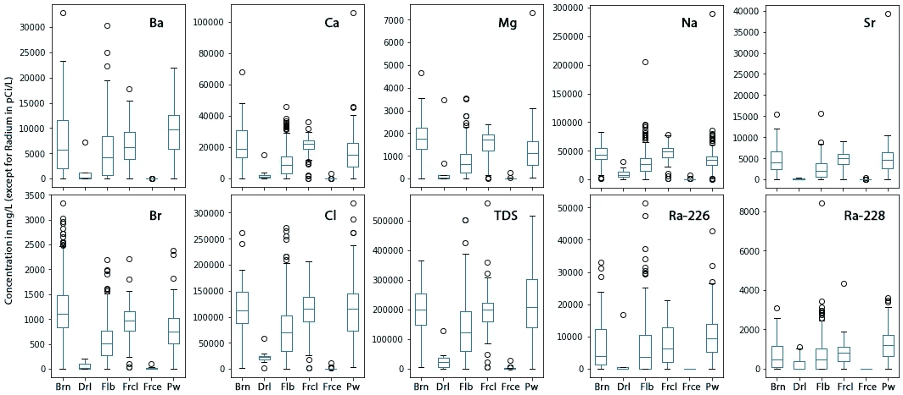

# 与水力压裂有关的镭污染源的一瞥

> 原文：<https://towardsdatascience.com/a-peek-into-sources-of-radium-contamination-related-to-fracking-d2d9749d9f44?source=collection_archive---------84----------------------->

# 介绍

随着非常规油气勘探的发展，一种称为水力压裂的新技术被广泛用于辅助油气生产。水力压裂的使用产生了大量的废水，其中含有高浓度的潜在污染物。

根据其不同的用途，废水有不同的术语，可分为钻井液(用于钻透泥浆和岩石)、注入液(注入以导致源岩破裂)、原始盐水(源岩中预先存在的盐水)和返回液(包括后期压裂液、回流水和采出水——后者的名称通常指流体返回地面的后期阶段)。

这些废水通常含盐量很高，含有大量天然放射性物质和重金属(见图 1)。例子包括钠(Na)、镁(Mg)、氯化物(Cl)、溴化物(Br)、镭(Ra)和钡(Ba)。这些化学物质在很多方面都有问题。例如，一旦与富含硫酸盐地表水混合，高浓度的钡将沉淀并在管道内形成水垢，从而阻碍生产效率。

图 1 显示不同废水类型的主要化学物种的盒须图。Brn、Drl、Flb、Frcl、Frce 和 Pw 是指盐水、钻井液、返排液、后期压裂液、早期压裂液和采出水。

值得注意的一点是:虽然从绝对值来看，Ra 浓度并不高，因此被认为是废水中的微量化学物质，但废水中 Ra 的含量已经比美国环境保护局建议的安全天然水中允许的含量高出 10，000 倍。因此，相对高水平的 Ra 成为严重的环境威胁，本工作旨在调查 Ra226 和 Ra228(废水中发现的最丰富的 Ra 形式)的潜在来源。

在这里，我查阅了从多个来源收集的化学报告数据(环境保护部、美国地质调查局和夸西等)。)并简要介绍了压裂过程中导致 Ra 污染的来源和过程。该化学报告数据总结了超过 100，000 条特征记录。本次调查包括 100 多种记录，例如:

*   *位置:县，纬度，经度*
*   *时间:采集开钻年月日*
*   *化学品:硫酸盐浓度(mg/L)，Ra226 浓度(pCi/L)*

镭污染有四个来源:钻井液、注入液、原始盐水和岩石。下面，我展示了我对如何划分 Ra 污染源的理解，然后比较了用于将 Ra 污染源与其他特征相关联的两种机器学习方法。

# 第一部分:镭污染源的划分

对于一种废水，为了划分化学物质的四个来源(三种流体和一种岩石)，我们需要求解四个方程。但是因为我们已经知道岩石只提供有限数量的化学物质，而许多主要的化学物质只来自三种流体，所以我们可以先用三种流体求解三个方程:

*   A1 *流体 1 + A2 *流体 2 + A3 *流体 3 = A_target
*   B1 *流体 1 + B2 *流体 2 + B3 *流体 3 = B_target
*   流体 1 +流体 2 +流体 3 = 1

其中，fluid1、fluid2 和 fluid3 是待求解的三种流体源的比例；a 和 B 是两种化学物质的测量浓度，这两种化学物质通常存在于流体中，但不来自岩石。研究表明溴和氯可以作为两种常见的化学物质。对于目标废水中的其他化学物质，剩余的未解释部分将由 rock source 提供。以 Ra 为例:% Ra _ from _ rock = 1-% Ra _ from _ all _ fluids。

图 2 来源于盐水、岩石、钻井液和注入液的 Ra226 比例分布图

上图显示了来自不同来源的含 Ra226(压裂废水中发现的最丰富的镭之一)的废水样本数量(图 2)。超过 250 个废水样本的 Ra226 完全由 rock 提供。除了这些样品，其他样品形成了一个偏态分布，平均大于 50%的 Ra226 来自原始盐水，小于 50%的 Ra226 来自岩石。由于钻井液和注入液由作业者直接提供，自然不含大量污染物，因此近 0%的 Ra226 来自这些流体。下面的 Ra228 来源图显示了与 Ra226 相似的分布，在数量上略有不同(图 3)。

图 3 来源于盐水、岩石、钻井液和注入液的 Ra228 比例分布图

现在我们知道 Ra 被认为是废水中的痕量化学物质，与废水中的主要化学物质(如镁)相比，它的来源分布有何不同？如图 4 所示，除了岩石溶解对废水中的 Mg 浓度有贡献的样品之外，大多数其他样品实际上都经历了 Mg 沉淀，这通过源自岩石的 Mg 的负百分比(例如-50%)来证明。

图 4 来源于盐水、岩石、钻井液和注入液的镁比例分布图

很明显，Ra 污染物的表现不同于压裂废水中发现的其他主要化学物质。与其他化学物质(如镁)相比，Ra 的来源更可能来自与岩石的相互作用。

下一个问题是，导致这种 Ra 源的因素是什么？具体来说，我们能否选择被测废水的重要特征，并用它们来预测来自盐水的 Ra 的百分比？什么特征对于确定来源于岩石的镭是重要的？我们尝试用回归模型预测实际值，也尝试用分类模型预测来源是否增加 Ra 浓度。

# 第二部分:使用线性回归模型来预测来源的比例

预测比例的线性回归模型按以下四个步骤开发:

1.  基于我们想要预测的目标值(例如来自盐水的%Ra226 ),生成初始特征和结果(ML 模型中的 X 和 y)数据集；
2.  通过移除原始线性回归模型中的异常值来清理数据；
3.  使用套索法选择最重要的特征和最佳参数用于预测模型；
4.  使用最终模型进行预测，并将预测结果与测量结果进行比较。

结果，上述四个步骤帮助选择了对来自盐水的%Ra226 的线性回归起重要作用的 18 个特征，并且为训练集和测试集分别生成了 0.775 和 0.686 的分数。预测结果与测量结果的 R 平方值为 0.68(图 5 左图)。对于来源于盐水的%Ra228，建模步骤在线性回归模型中选择 22 个重要特征，以 0.671 和 0.576 作为训练和测试分数。R 平方值为 0.475(图 5 右图)。

图 5 来源于盐水的预测与测量的%Ra226(左)和%Ra228(右)散点图

显然，线性回归模型在预测源划分结果方面表现不佳。精心选择的模型表现不佳，表明污染物 Ra226 和 Ra228 的来源百分比不一定与其他化学品的浓度相关。预测不佳也可能有各种原因，包括:样本量仍然太小，由于采样条件的可变性而导致的异常值太多，不一致的测量技术等。

现在，预测百分比似乎不够可靠，让我们试试运气，看看问题“Ra 是否来自盐水或岩石”是否可以用分类方法预测。

# 第三部分:使用分类模型预测污染源是否会造成污染

与构建线性回归模型类似，我们再次遵循四个步骤来预测我们的“是否”问题:

1.  基于我们想要预测的目标值(例如来自岩石的%Ra226)生成初始特征和结果(ML 模型中的 X 和 y)数据集；
2.  使用 feature_importances_ 为预测模型选择重要特征；
3.  调整并选择决策树分类器中使用的最佳参数；
4.  使用调整后的模型执行预测，并检查结果。

图 6 显示了用于确定 Ra226 和 Ra228 是否部分来源于岩石的所选特征和相应的重要性。它们自身的浓度、废水中 Cl 的浓度和取样位置在分类中起着最重要的作用。放射性核素和 Cl 的浓度越高，废水中 Ra226 和 Ra228 来自岩石的机会就越大。预测 Ra226 和 Ra228 是否来自岩石的训练和测试准确率分别为 100%和 83%，以及 93%和 86%。

图 6 确定%Ra226(左)和%Ra228(右)是否部分来源于岩石的重要特征柱状图。特征标签有:0-As(毫克/升)、1-B(毫克/升)、2-Ba(毫克/升)、3-Ca(毫克/升)、4-Cu(毫克/升)、5-Fe(毫克/升)、6-Li(毫克/升)、7-Mg(毫克/升)、8-Mn(毫克/升)、9-Na(毫克/升)、10-Se(毫克/升)、11-Sr(毫克/升)、12-Zn(毫克/升)、13-硬度(毫克/升)、14-碱度(毫克

具有岩石源的 Ra226 和 Ra228 的决策树模型的可视化表明，模型以低杂质或不确定性合理地构建，导致在每个节点处更好的分类或分裂。

图 7 有岩石源的%Ra226(左)和%Ra228(右)的决策树模型的部分图。

决策树模型在预测源分类方面似乎比回归模型在预测源分区值方面表现得更好。预测结果表明，污染物 Ra226 和 Ra228 的源分类与某些离子浓度相关，并且具有高度的位置特异性。

# 结论

本文探讨了水力压裂中 Ra 的来源以及在确定这些来源时可能起重要作用的特征。数据处理和机器学习的发展为 Ra 污染源提供了三种见解:

1.  Ra 污染主要来源于盐水和岩石；与其他化学品相比，它的岩石来源有助于提高废水中总浓度的百分比。
2.  由于各种原因，线性回归模型不是预测源划分结果的好方法。较差的性能还表明，污染物 Ra226 和 Ra228 的来源百分比不一定与化学物质的浓度相关，而是更多地取决于它们在相应来源中的浓度。
3.  决策树模型在预测源分类方面表现良好(或优于线性回归模型)。结果表明，某些化学物质的浓度和废水取样的位置是决定 Ra 是否部分来源于岩石的重要因素。

上述分析仅仅是观察和主观的，人们可能有许多方法来确定和解释压裂废水中的污染物。不同的数据处理方法可能导致不同的源成分和解释。此外，这种分析没有达到很高的准确性，主要是因为缺乏一致的采样和标记，以及样本量小，这为研究人员留下了更多的空间来重新访问和处理数据。要查看有关该分析的更多细节，请点击这里的链接查看我的 Github。