# 理解随机森林算法的图示指南

> 原文：<https://towardsdatascience.com/a-pictorial-guide-to-understanding-random-forest-algorithm-fbf570a0ae0d?source=collection_archive---------47----------------------->

## 了解随机森林算法的内部工作原理


RandomForestClassifier 算法中发生了什么(图片由 pxhere.com 提供)

## **这篇文章是关于什么的**

在本文中，我们将了解随机森林算法的内部工作原理。要真正理解它，了解一点决策树分类器可能会有所帮助。但是这并不是完全必需的。

👉 ***注意*** :我们并不涵盖建模中涉及的预处理或特征创建步骤——而只是看看当我们为 sklearn 的`RandomForestClassifier` 包调用`.fit()`和`.transform()`方法时，算法 中的 ***会发生什么。***

## 一段中的随机森林

随机森林(RF)是一种基于树的算法。它是不同种类的多个随机树的集合。模型的最终值是由每棵树创建的所有预测/估计的平均值。

## 包裹

我们的文章将基于 sklearn 的 RandomForestClassifier 模块

`sklearn.ensemble.RandomForestClassifier`

## 数据

为了便于说明，我们将使用类似于下面的训练数据。

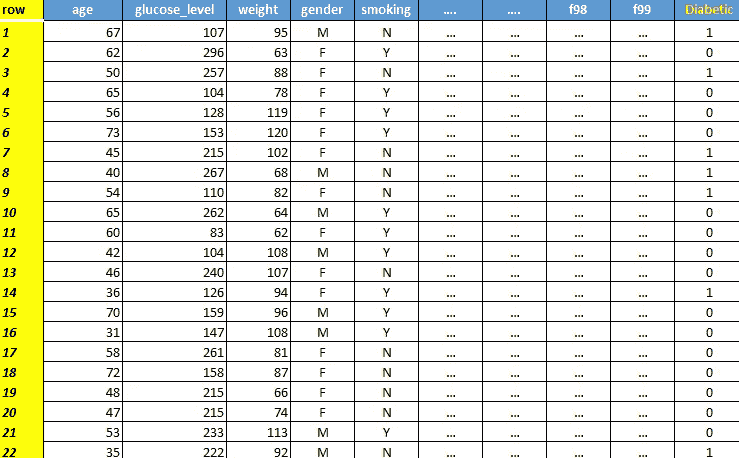

训练数据快照(*图片作者)*

👉 ***注*** : `age ,glucose_level, weight, gender, smoking .. … f98, f99`均为自变量或特征量。

`Diabetic` 是我们要预测的 y 变量/因变量。

## 问题是

预测可能患糖尿病的患者。

## 内部真正发生了什么

有了这些基本信息，让我们开始并理解当我们将这个训练集传递给算法时会发生什么…

## **步骤 1** —引导

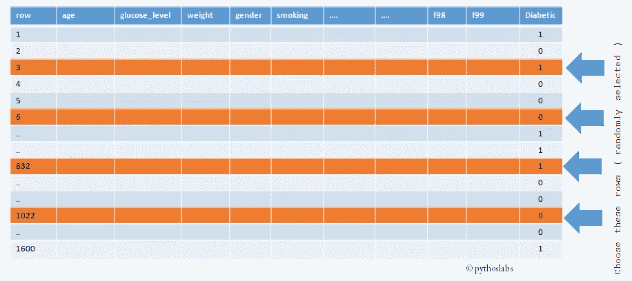

随机选择记录或自举(*图片作者)*

一旦我们向`RandomForestClassifier` 模型提供了训练数据，它(*算法*)就会随机选择一组行。这个过程称为引导(随机替换)。对于我们的例子，假设它选择了 m 个记录。

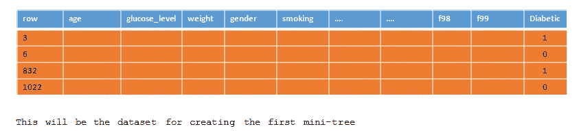

👉**注 1 :** 要选择的行数可以通过使用超参数- `(max_samples)`中的 *r 来提供，就像代码中这样*

```
import sklearn.ensemble.RandomForestClassifiermy_rf = RandomForestClassifier(max_samples***=****100)*
```

👉**注 2 :** 这仅适用于在超参数(`bootstrap = True`)中打开自举的情况。`bootstrap` 默认为真。

👉**注 3:** 一行可能会被选择多次

## 步骤 2 —为子树选择特征

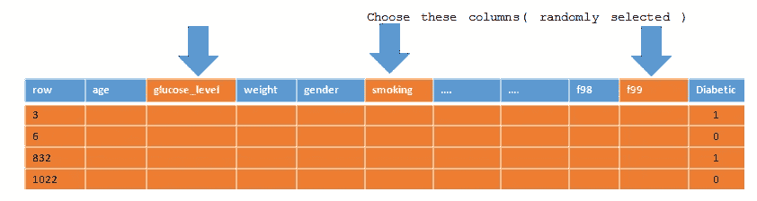

选择小型决策树的功能

现在，RF 随机选择特征/列的子集。这里为了简单起见，我们选择了 3 个随机特征。

**注**👉您可以在超级参数— `max_features` 中控制**这个**数字，类似于下面的代码

```
import sklearn.ensemble.RandomForestClassifiermy_rf = RandomForestClassifier(***max_features=****3)*
```

## 步骤 3 —选择根节点

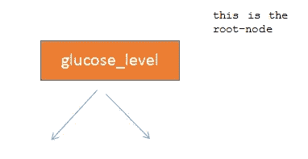

一旦选择了 3 个随机特征(在我们的示例中)，该算法将对 **m** 记录(来自步骤 1)进行拆分，并对指标的值之前和之后的*进行快速计算。*

这个指标可以是基尼系数或者是熵。它基于您在超参数中提供的标准— `gini` 或`entropy` 。

```
import sklearn.ensemble.RandomForestClassifiermy_rf = RandomForestClassifier(max_features=8 , **criteria = 'gini'**)
```

`criterion = 'gini'` (或“`entropy`”)

默认设置为`criteria = 'gini’`

哪个随机特征分裂给出最小的组合基尼不纯度/熵值，该特征被选为根节点。

根据最佳分割点，在此节点分割记录。

## 步骤 4 —选择子节点

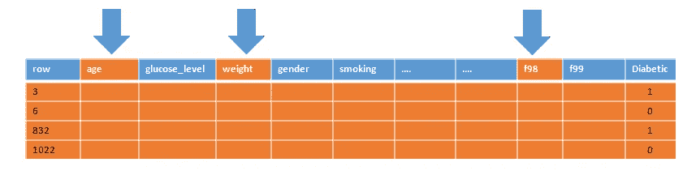

随机选择特征

该算法执行与步骤 2 和步骤 4 相同的过程，并选择另一组 3 个随机特征。(3 是我们指定的数字—您可以选择您喜欢的数字—或者让算法选择最佳数字)

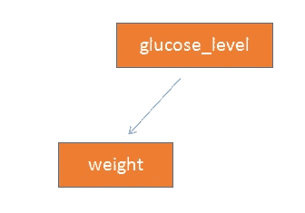

根据标准(`gini` / `entropy` )，它选择哪个特性将进入下一个节点/子节点，并且在这里进一步分割记录。

## 步骤 5—进一步拆分和创建子节点

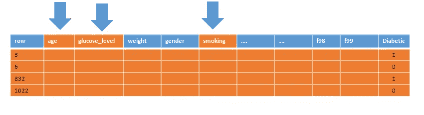

继续选择特征(列)以选择更多的子节点

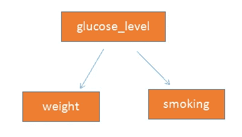

现在我们有了第一级子节点

该过程继续(步骤 2、4)选择随机特征，并且发生节点的分裂，直到以下任一条件发生

*   a)您已经用完了要拆分的行数，或者已经达到了阈值(每个子节点中存在的最小行数)，您可以在 hyper 参数中指定这一点— `min_samples_leaf`
*   b)分割后的基尼系数/熵值不会降低到超过规定的最低限度
*   c)您已达到您指定的分割数(`max_depth`)

你现在有了你的第一个“迷你决策树”。

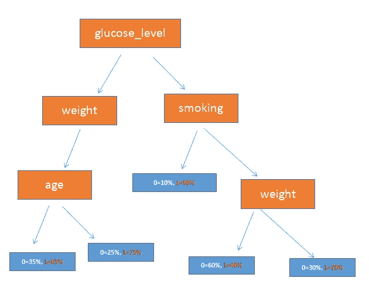

使用随机选择的行(记录)和列(特征)创建的第一个小型决策树(*作者图片)*

## **步骤 6 —** 创建更多小型决策树

算法返回到您的数据并执行步骤 1-5，以创建第二棵“迷你树”

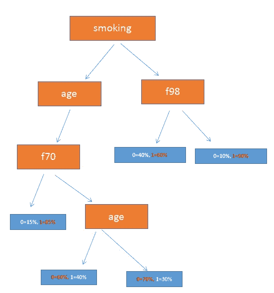

这是我们使用另一组随机选择的行&列创建的**第二个**迷你树。注意:如果您仔细选择了超参数，这个迷你树的结构将与第一个不同。

## 第七步。建造树木的森林

一旦达到 100 棵树的默认值(您现在有 100 棵迷你决策树)，就可以说模型已经完成了它的`fit()`过程。

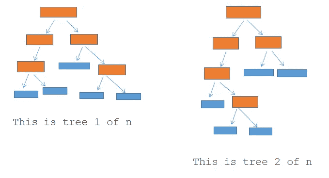

100 棵树中的 2 棵树

👉**注意:**你可以在你的超级参数`( n_estimators)`中指定你想要生成的树的数量

```
import sklearn.ensemble.RandomForestClassifiermy_rf = RandomForestClassifier(***n_estimators=300****)*
```

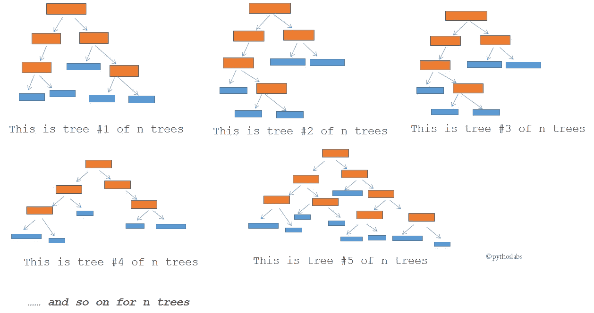

我们继续构建迷你树，直到我们有 n 棵树(n 是由 **n_estimators** 超参数指定的数字，如果我们没有指定任何东西，它的默认值是 100)。这里，蓝框代表结束节点。(*图片作者)*

现在你有了一个随机创建的迷你树森林(*因此得名随机森林*)

## 第七步。推理

现在让我们预测一个看不见的数据集(测试数据集)中的值

为了推断(*通常被称为预测/评分*)测试数据，算法通过每个迷你树传递记录。

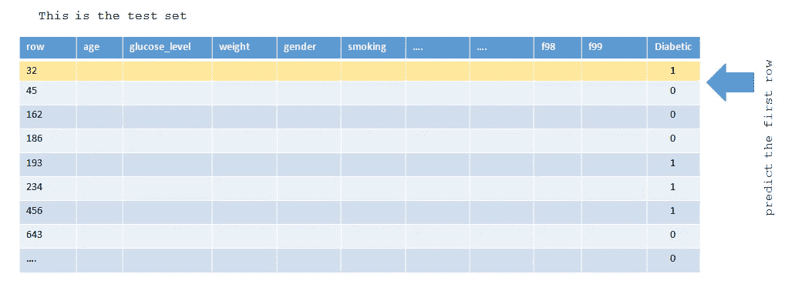

从测试数据集预测第一行(*作者图片)*

记录中的值根据每个节点代表的变量遍历迷你树，最终到达一个叶节点。基于该记录结束的叶节点(在训练期间)的预定值，该迷你树被分配一个预测输出。

以同样的方式，相同的记录通过所有 100 个小型决策树，并且 100 个树中的每一个都有该记录的预测输出。

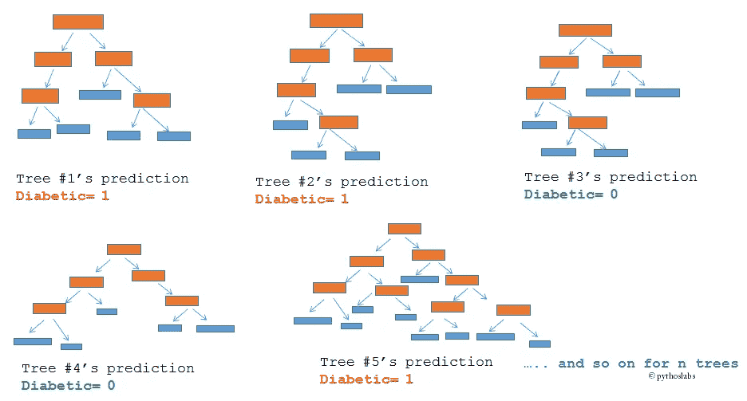

所有的迷你树为那个记录做一个预测。(*图片作者)*

这个记录的最终预测值是通过对这 100 棵小树进行简单的投票计算出来的。

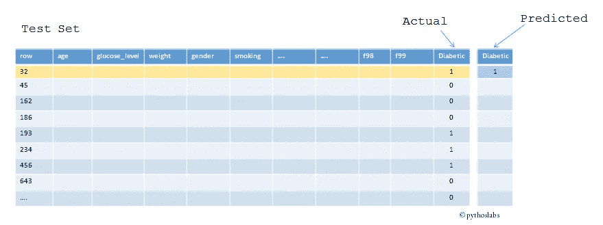

现在我们有了对单个记录的预测。

该算法按照相同的过程遍历测试集的所有记录，并计算出**总体准确度**！

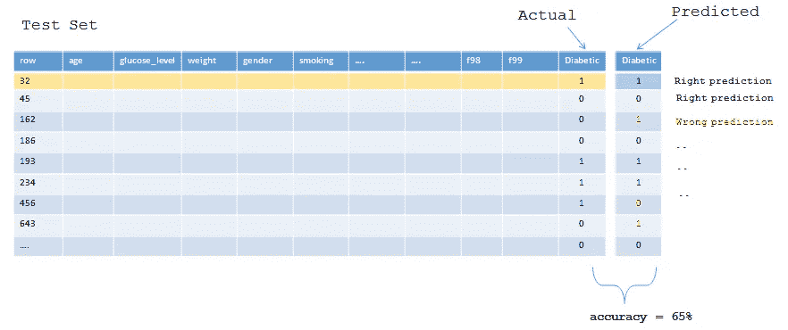

重复获取测试集每一行的预测的过程，以达到最终的准确性。

# 参考

[1] sklearn 的 RandomForestClassifier 文档(版本:3.2.4.3.1)

[https://sci kit-learn . org/stable/modules/generated/sk learn . ensemble . randomforestclassifier . html](https://scikit-learn.org/stable/modules/generated/sklearn.ensemble.RandomForestClassifier.html)