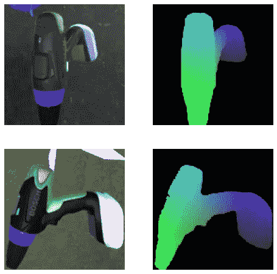
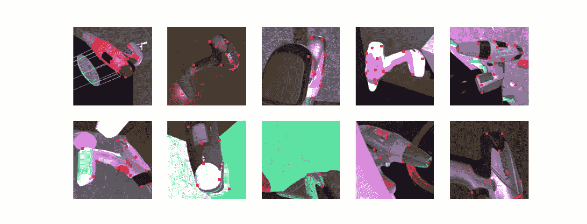
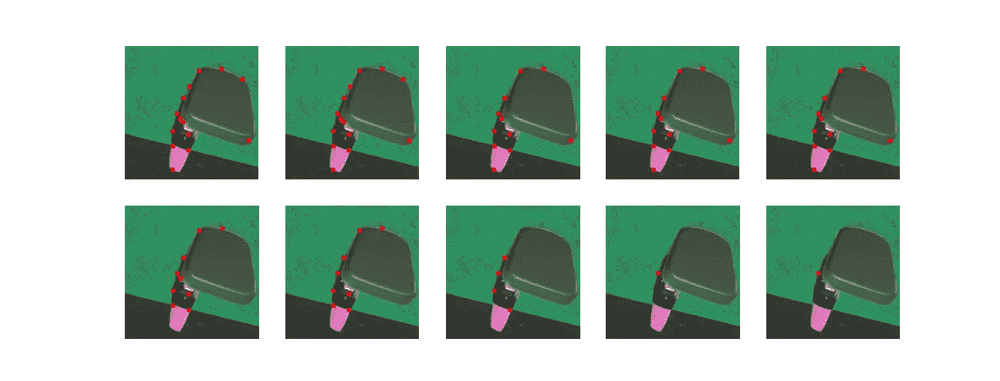
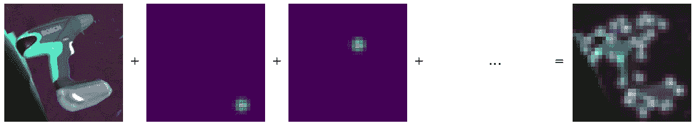
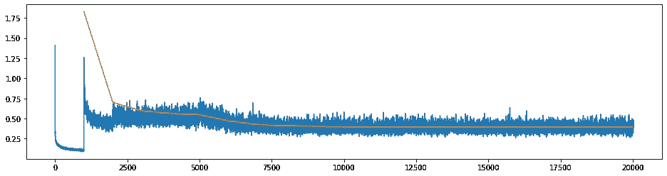
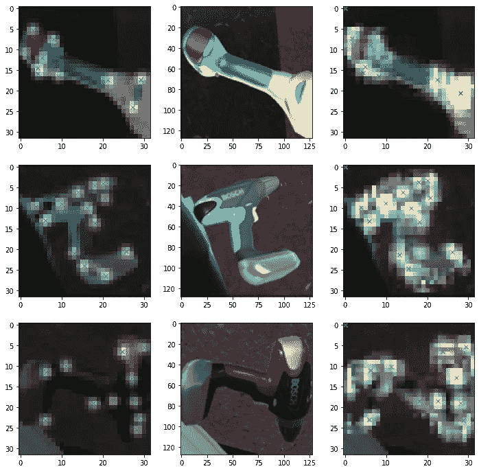
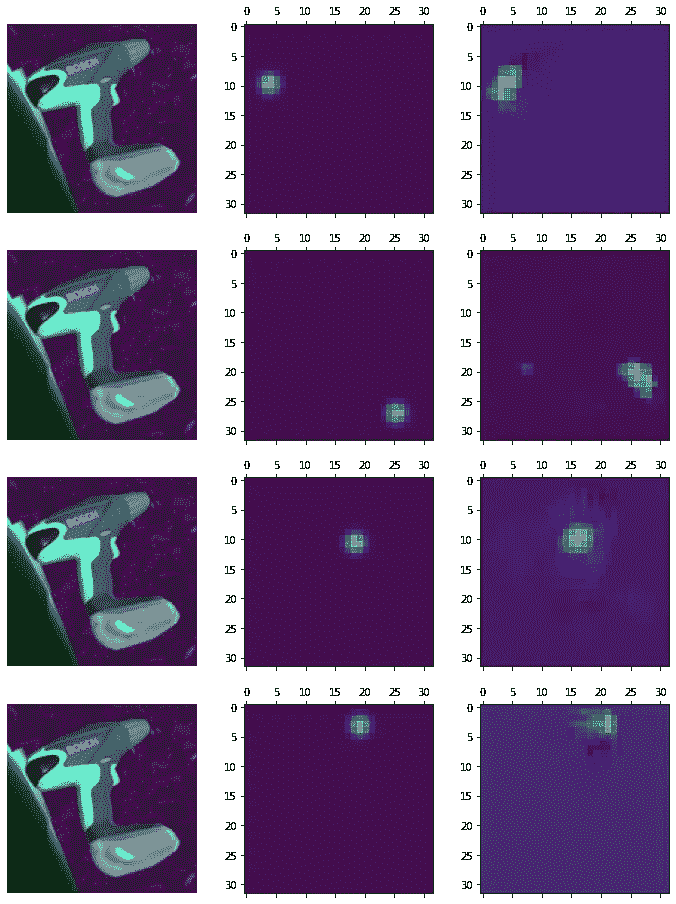
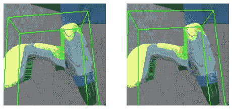
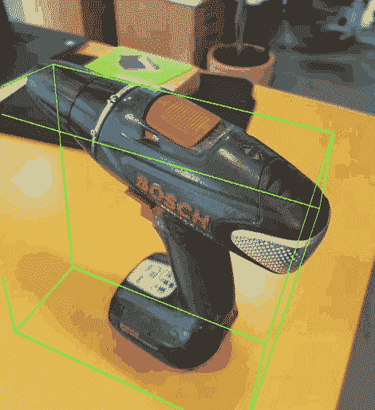

# 没有真实数据的学习姿态估计的流水线

> 原文：<https://towardsdatascience.com/a-pipeline-for-learned-pose-estimation-with-no-real-data-3df0599fd90e?source=collection_archive---------26----------------------->

## [实践教程](https://towardsdatascience.com/tagged/hands-on-tutorials)

## 使用领域随机化和深度学习来估计 3D 模型的姿态

*姿态估计是计算机视觉领域的一个新兴趋势，使研究人员能够利用图像中的深度信息——这是 AR 和其他空间相关应用的必要条件。从传统的计算机视觉开始，现代研究使用深度神经网络直接预测 6D 姿势(即旋转和平移)，例如通过最小化来自已知扰动的误差，或者直接将 3D 模型拟合到输入图像。*

在这篇文章中，我将展示一个完整的基于神经网络的姿态估计管道，使用随机生成的低保真度渲染数据。具体来说，我们将探索仅使用 3D 模型生成图像和地面真实数据，以及为姿势估计估计关键点(以及如何做)。

在我的上一篇帖子中，在这里找到了，我们探索了仅使用简单的 Unity3D 引擎生成的合成数据来训练对象检测器的方法。对象检测器通常不需要使用合成数据，因为有各种各样的注释工具可用，相反，它大大简化了过程并降低了输入成本。然而，姿态估计更难以手动注释，尤其是如果你不想估计包含在 [LineMOD](https://bop.felk.cvut.cz/datasets/) 或类似数据集中的对象的姿态。

领域随机化(DR)是为这样的项目生成数据的完美方法。简而言之，DR 旨在扩大生成数据的方差，以便生成的样本包含现实生活中的数据分布。[这篇](https://lilianweng.github.io/lil-log/2019/05/05/domain-randomization.html)帖子很好地描述了这个概念。这是我们将用于为此项目生成数据的方法；仅使用 3D 模型的任意对象的 6D 姿态估计的端到端解决方案。

# 数据生成

在[对象检测帖子](/training-object-detectors-with-no-real-data-using-domain-randomization-1569cb3b8c6)中，我展示了我们的 Unity3D 数据生成器，一个简单的低保真度图像和边界框生成器。对于这个项目，我们感兴趣的不仅仅是边界框——事实上，我们需要一个完整的相应的对象的 3D 表示。我将遮罩着色器从生成器更改为一个[归一化对象坐标空间(NOCS)](https://openaccess.thecvf.com/content_CVPR_2019/papers/Wang_Normalized_Object_Coordinate_Space_for_Category-Level_6D_Object_Pose_and_CVPR_2019_paper.pdf) 着色器，它将对象的局部 XYZ 空间渲染为 RGB，并用 Alpha 指示对象是否存在于像素中。下面可以看到一个例子:

渲染和裁剪的图像(左)及其相应的 NOC 表示(右)。作者图片

生成 NOC 图像时，禁用任何类型的抗锯齿都很重要。插值会洗掉数据，我们的最终产品会不太精确。根据图像的大小和限制的严格程度，我们可以在一台像样的笔记本电脑上每秒生成数千到数十万张这样的图像。与注释真实图像相比，这可以给我们带来显著的优势。

# 关键点和注释

我们决定利用传统、成熟的计算机视觉技术来估计物体的姿态，即解决物体的 2D 到 3D 投影，也称为透视 n 点问题。这也为项目提供了额外的健壮性，因为关键点表示比试图直接适合图像要抽象得多。这是我们的优势，因为我们的对象从一个图像到另一个图像改变外观，以提高最终产品的通用性。为了做到这一点，我们需要在整个项目中建立一组基线关键点。

跟踪的关键点在许多渲染的顶部可视化。作者图片

好的、可追踪的关键点很难获得。幸运的是，我们有几乎无限数量的感兴趣的对象(在这种情况下，博世钻)的渲染图像及其各自的 3D 表示和遮罩。我们可以将所有超大像素归零，并使用 OpenCV 的“goodFeaturesToTrack”方法来找到钻头的可跟踪角落。该方法为我们提供了以质量水平 q 和最小像素距离 d 为阈值的 N 个可跟踪特征的像素位置。我们可以使用相应的 NOCS 图像将输出特征位置转换到对象的局部空间。我们决定 N=32，q=0.2，d=√(min(image_width，image_height))。

然而，最终这只会返回数千个不连贯的 3D 位置。为了实际确定哪些是最好的，我们使用 K-Means 来寻找这些可跟踪位置的大簇的质心。我们再次决定寻找 32 个关键点。使用这个简单的方法有一些缺点；首先，关键点可能永远不会准确地出现在模型上，而是稍微在模型内部，这取决于群集的大小和位置。其次，该对象是随机生成的，并且是对称的，这意味着平均而言，在一侧找到的关键点看起来与它们(潜在的)镜像伙伴一模一样。

基于关键点与 NOCS 图像中最接近的表示的距离来排除关键点的不同阈值。作者图片

在分析了成千上万的图像并使用上述方法建立了基线关键点之后，我们可以针对每个图像-NOC 对，计算最准确地表示每个关键点的像素。这必然会有一些误差，所以我们对其进行阈值处理，以排除不在图像中特定距离内的关键点。当然，这个边距应该根据对象的大小来设置。上图显示的阈值范围从 1 厘米到 0.1 厘米，假设钻头大约 22.3 厘米高。

# 在合成数据上训练关键点检测器

既然我们有 32 个基线关键点，并且可以估计它们在训练数据中的位置，我们需要能够在图像中准确地检测它们。我们希望利用卷积神经网络(CNN)提供的强大的视觉抽象，所以这就是我们将开始的地方。

很简单，人们可能会认为这是一个回归问题，因为我们只想为每个关键点估计两个数字(一个 X 坐标和一个 Y 坐标)。然而，问题并非如此简单。空间感知是关键，如果不在网络中特别考虑这一点，这些信息将在完全卷积层和池中丢失。为了避免这个问题，我们采用了一个具有 32 个输出层的 [U-Net](https://arxiv.org/abs/1505.04597) 风格的 CNN，每个输出层对应一个关键点。该模型创建于 [PyTorch](https://pytorch.org/) 和 [fast.ai](https://www.fast.ai/) 。具体来说，我们的网络包括:

*   ResNet34 的前 7 个(下采样)模块，预训练并锁定开始
*   2 个上采样模块，利用跳过连接和 [ICNR 像素溢出](https://arxiv.org/abs/1707.02937)进行升级
*   生成输出热图的最终 1 宽 Conv 图层

我们的目标目前只是一系列数字(32 个关键点，它们在帧中的位置，以及从它们的质心到该位置的真实距离)。我们需要我们的网络可以比较和学习的目标。为了实现这一点，我们将关键点栅格化为 2D 高斯曲线，而不是简单的 1 像素步骤。这极大地改进了训练，因为网络不会因为接近但不完全的预测和非常差的预测而受到同等的惩罚。

所有 32 个光栅化关键点覆盖在示例渲染的顶部。作者图片

现在，并不是所有的 32 个关键点都与每张图片相关。有些超过了我们设定的距离阈值，因此必须以某种方式丢弃。我们发现，简单地忽略它(在计算损失时屏蔽掉热图)并让网络决定是否画出它比试图抑制它或强迫它更有效。

## 损失和培训计划

现在我们有了一个数据点(一个钻孔的渲染图像)和一个目标(32 个热图)，我们只需要一个损失函数。我们可以看到，简单地将目标热图与输出热图进行匹配(忽略不可见点)应该可以提供一个不错的起点——均方误差。这在一定程度上是好的，在这种情况下，网络通过减弱或多次猜测学会作弊。我们也可以通过引入回归损失来补偿这一点。2D SoftArgMax 函数允许我们将网络估计的热图减少到亚像素精度的猜测，非常适合我们的项目，该项目输出的热图比输入图像的比例小。

现在我们已经创建了两个损失，我们需要确定它们之间的权重。现在，像素损失(MSE)可以显著地帮助网络学习初始表示，但这最终不是我们感兴趣的。最后，我们需要图像中关键点的位置。我发现从 100%的像素损失开始，并稳步走向回归损失效果很好。

在整个训练中，我建议在每个时期后稳步减少损失。我们不希望网络过度适应合成数据的特征，但是我们也不希望永远等待，所以我们从相当高的值开始(使用 Adam 优化器，在 0.01 的范围内)。几个时期之后，当我们相信网络已经开始学习适当的表示时，我们解锁初始 ResNet 层，允许下采样层也学习。

我测试了批量大小为 32 的 1000 次迭代的 20 个时期的训练方案。在每个时期结束时，我们更新组合损失和学习率的权重。它们由总共 200000 幅渲染图像中的 32000 幅图像组成，这意味着各个时期会有一些重叠。随着以后时代学习率的严重下降，这一点就不那么重要了。最后，我们的损失曲线看起来有点像这样:

损失(像素级 MSE 和回归损失的组合，由以下公式给出:ploss *0.5^ᵉᵖᵒᶜʰ+r loss *(1–0.5^ᵉᵖᵒᶜʰ).作者图片

有两件事需要注意:训练损失在某些地方偏离很大，即下采样层(时期 5)的初始释放以及回归损失的每次增加和像素损失的随后减少。另一个值得注意的观察是验证损失，它相对于没有明显过度拟合迹象的训练损失如何稳定。这可以部分地归因于学习率的稳定下降以及与变化的组合损失权重相结合的分裂训练集。

实际上，避免过度适应 Unity 渲染器的数据分布几乎是不可能的。这可能会在现实生活的实验中引入伪像，例如由对象和 3D 模型不匹配引起的伪像。克服这一障碍的一种方法是注释由现实世界中的图像组成的附加训练集，在现实生活的图像上微调关键点检测器以解决 sim2real transfer 问题。

# 结果

现在网络已经训练了一段时间，让我们看看它是否能检测到一些关键点。

左:实际栅格化热图和确定的可见关键点叠加在图像上。中间:输入图像。右图:由神经网络估计的热图和关键点覆盖在图像上，丢弃的关键点映射到左上角。作者图片

这看起来相当准确，但是当然不能保证关键点是正确的。我们可以这样想象它们目标旁边的热图:

热图。左:图像。中间:目标热图。右图:估计的热图。作者图片

那看起来也很不错。这应该意味着，知道了 3D 模型的物理尺寸，以及随后其中的关键点位置，以及相机参数，我们可以将点投影到对象空间中。

首先，我们估计摄像机的固有参数。其次，我们需要通过阈值化来确定要屏蔽哪些关键点。我们之前决定在 NOCS 图像中使用距离，但是这对于验证图像是不可行的，因为理论上我们没有目标数据。相反，我们决定一个阈值，并包括满足条件 max(heat map)≥threshold * max(all _ heat map)的任何关键点。最后，我们可以利用 OpenCV 的 SolvePnP 和迭代求解器来估计相机的旋转和平移——速度较慢，但结果更稳定。

投影到物体空间的盒子。左:基线，使用阈值化的已知关键点。右图:使用我们模型中的热图进行估算。作者图片

现在，最后一个障碍是:用合成数据训练的模型在现实世界中的表现如何？我使用 Unity 和 ARFoundation 制作了一个快速请求/响应服务器和移动应用程序来测试预测的准确性。在我们上一个项目中，我们取得了一些非常好的成果。让我们看看能否复制它们:

我们管道的真实结果。Unity 应用程序向服务器发送图像和相机内部图像，服务器计算并返回钻头的预测边界框。作者图片

这些结果看起来很不错。有几个明显的错误，但钻头的大致方向及其在相机空间内的大小是清楚的。同样，神经网络从未见过真正的演习，也没有见过图像捕捉和压缩的人工制品，因此它在如此短的时间内就能猜出这口井是一个巨大的成功。

你有它！从 3D 模型到结果的姿态估计的完整管道。我们探索了在 Unity 中使用域随机化的数据生成、关键点估计和训练神经网络来预测它们的位置，以及将它们投影到 3D。结果显示了很大的希望，相当稳健地转换到现实世界的图像数据。这只是表明，合成数据可以成为进入深度学习和计算机视觉世界的巨大敲门砖，几乎没有成本。

我在 Alexandra Institute 工作，这是一家丹麦非营利公司，专门研究最先进的 it 解决方案。在视觉计算实验室，我们专注于利用最新的计算机视觉和计算机图形研究。我们目前正在探索数据收集和注释的选项，以允许较小的公司和个人开始深度学习。我们永远欢迎合作！