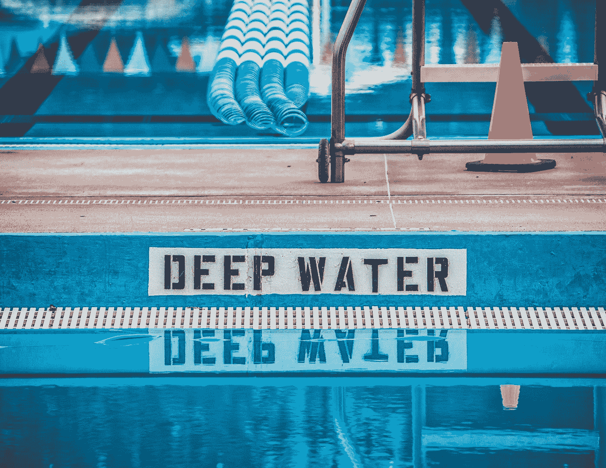

# 数学背景的潜在数据科学基础

> 原文：<https://towardsdatascience.com/a-potential-data-science-foundation-for-math-backgrounds-188b03b9f1ff?source=collection_archive---------33----------------------->

## 帮助您开始学习数据科学的课程指南

米尔科·布利克在 [Unsplash](https://unsplash.com?utm_source=medium&utm_medium=referral) 上拍摄的照片

你决定投身数据科学领域！恭喜你。但是也许你还不确定你想在这个领域做什么，但是你昨天就想进去了。许多人主张你应该投入到自己的项目中去，了解你需要什么。虽然这是一个很好的方法，你会从中学到很多东西，但你可能会因为缺乏编码背景而不适应这种方法。你可能更喜欢先学习几门课程，为解决项目打下基础。

没关系。所以让我来帮你。

照片由[埃里克·麦克莱恩](https://unsplash.com/@introspectivedsgn?utm_source=medium&utm_medium=referral)在 [Unsplash](https://unsplash.com?utm_source=medium&utm_medium=referral) 上拍摄

作为一个有数学背景的人(纯数学硕士)，这是我的问题。我想进入这个领域，但除了多年前参加的一个随机 JavaScript 课程之外，我没有足够的编码技能。我也不知道我喜欢数据科学的哪一个方面，因为这个领域还没有为每个子领域做出区分的标题。

在这里，我会告诉你我对你可以选择哪些基础课程的看法，以及为什么。这一选择是基于我尝试进入该领域的经验以及我现在作为数据科学家的经验。如果您仍然不确定想要深入数据科学领域的哪个部分，这可能是一个有用的选择。在解释的最后，我还会按照这种格式提供我上过的具体课程。如果你只是想看一个没有解释的快速列表，只需看下面:

1.  **一门 Python 或者 R 编程课程。**
2.  **一门 SQL 课程。**
3.  **数据操作/可视化课程。**
4.  **一门机器学习课程。**
5.  **深度学习课程。**

现在解释一下！

# Python 或 R 编程课程

克里斯里德 T21 在 Unsplash 上的照片

Python 或 R 的目的是为您提供一种方法，来执行您在数据科学中需要的所有酷技术。它们是达到目的的手段。您将使用的数据是您无法用笔和纸操作的数据。

你可以两种都尝试，但是不管你选择哪种语言，你都需要掌握一种主要的编程语言技能。原因是您从一种语言中学到的概念(如循环、内置函数和其他编程概念)可以带到其他语言中。如果你擅长一门编程语言，你也可以更轻松地取得成就。

在我的例子中，我选择了 [Python](https://www.python.org/) 。这种语言被认为是一种伟大的通用编程语言，这意味着它可以处理一切，包括数据操作、可视化、机器学习和 web 开发。如果你仍然对选择一种编程语言犹豫不决，我觉得学习 Python 是一项安全的投资。你也可以下载 [Anaconda](https://www.anaconda.com/) 进行快速设置。

# SQL 课程

照片由[卡斯帕·卡米尔·鲁宾](https://unsplash.com/@casparrubin?utm_source=medium&utm_medium=referral)在 [Unsplash](https://unsplash.com?utm_source=medium&utm_medium=referral) 上拍摄

学习数据科学时，您可能不需要 SQL，因为您可能处理的许多数据不会占用太多内存。但是套用一位来自[采访](https://www.youtube.com/watch?v=JbNegqgZKCw)的谷歌数据科学家的话:

> “如果数据适合你机器的内存，你可以使用任何东西。否则使用 SQL "

我在目前的职位上发现了这一点。通常情况下，至少有一百万或更多行的数据集。为了在 Python 中使用它进行进一步的分析，或者为机器学习模型做准备，SQL 已经变得必不可少。SQL 允许你过滤数据以适应内存，并通过 Python 或 r 在你的机器上平稳运行。无论你选择哪种语言，都要把 SQL 作为你的第二语言。

# **数据操作/可视化课程**

照片由 [Deb Kennedy](https://unsplash.com/@__dkennedy?utm_source=medium&utm_medium=referral) 在 [Unsplash](https://unsplash.com?utm_source=medium&utm_medium=referral) 上拍摄

处理数据是任何数据科学任务的关键。它将允许你以一种揭示不为人知的故事的方式来观察数据。它将允许您格式化您的数据，以使您的机器学习模型产生最佳结果。据说该领域 80%的工作是数据清理和操作。你会很快发现，当你经历特定的课程或你自己的项目时。

在数据操作之后是可视化数据的需要。你需要理解你的数据在说什么。同样，数据背后的故事是什么？要为机器学习模型正确准备数据，您需要了解数据的原始形式。[探索性数据分析](/exploratory-data-analysis-8fc1cb20fd15)(又名可视化)是上述所有工作的关键。

# 机器学习课程

由[安迪·凯利](https://unsplash.com/@askkell?utm_source=medium&utm_medium=referral)在 [Unsplash](https://unsplash.com?utm_source=medium&utm_medium=referral) 上拍摄

[机器学习](https://www.coursera.org/lecture/machine-learning/what-is-machine-learning-Ujm7v)是解决与执行动作相关的问题，这些动作由于不明确的变量(以及大量变量)而无法直接编程。这就是以下技术的来源:

1.  预测房价
2.  对植物是否为毒藤进行分类
3.  确定患者是否患有癌症
4.  Youtube 根据您的观看历史向您推荐视频

如果你对解决这类问题感兴趣，那么你绝对应该学习机器学习。如果你有兴趣学习如何构建自动化任务的软件，学习机器学习将帮助你处理这些自动化任务。另一个原因是一些基本的[分类](https://machinelearningmastery.com/types-of-classification-in-machine-learning/#:~:text=In%20machine%20learning%2C%20classification%20refers,one%20of%20the%20known%20characters.)和[回归](/introduction-to-machine-learning-algorithms-linear-regression-14c4e325882a)技术属于你将在统计学中学习的相同技术，例如线性回归。

# 深度学习课程

罗西·克尔在 [Unsplash](https://unsplash.com?utm_source=medium&utm_medium=referral) 上拍摄的照片

[深度学习](https://machinelearningmastery.com/what-is-deep-learning/)是机器学习的一个子领域，其中使用所谓的[神经网络](http://news.mit.edu/2017/explained-neural-networks-deep-learning-0414)来建立模型。这些神经网络允许重型计算产生比你在你选择的机器学习课程中学习的模型更好的结果。

如果你对任何与[图像数据](https://machinelearningmastery.com/what-is-computer-vision/)或[文本数据](https://machinelearningmastery.com/natural-language-processing/)相关的东西感兴趣，我会推荐你深入深度学习(双关语)。当前与图像和文本数据相关的进步要归功于深度学习及其神经网络结构。

# 我遵循这个指南选择的路线

[Lili Popper](https://unsplash.com/@lili_popper?utm_source=medium&utm_medium=referral) 在 [Unsplash](https://unsplash.com?utm_source=medium&utm_medium=referral) 上拍摄的照片

下面是我按照这个指南的链接所选的课程列表(按顺序排列)。

*注意:这些不是附属链接，我也不是这些平台的赞助商。把这个放在这里以防有人担心。*

1.  **Python 课程**——[solo learn Python](https://www.sololearn.com/Course/Python/)。我选了这门 Python 课程，因为它是免费的，课程很快，而且它很好地概述了这门语言。也可以在你的手机上用他们的应用程序完成，并允许实验。
2.  **SQL 和可视化课程** — [数据科学 A-Z:包含真实数据科学练习](https://www.udemy.com/course/datascience/)。这是我上的一门 Udemy 课程，它让我对数据科学有了一个很好的了解。这就是我通过 [Tableau](https://www.tableau.com/) 学习可视化，通过[微软 SQL](https://www.microsoft.com/en-us/sql-server/sql-server-2019) 学习 SQL 的地方。
3.  **数据操作课程**——[Python A-Z:数据科学用 Python，带实操](https://www.udemy.com/course/python-coding/)。这是我学习数据操作和更多 Python 特有的可视化工具的课程。看完本课程后，您现在可能会认为第一个课程是多余的。第一门课没有提到的是[课程](https://www.w3schools.com/python/python_classes.asp)的概念，如果你决定走一条[机器学习工程师](https://medium.com/@tomaszdudek/but-what-is-this-machine-learning-engineer-actually-doing-18464d5c699)的路线，这是必须的。
4.  **机器学习课程**——[机器学习 A-Z:数据科学中的动手 Python&R](https://www.udemy.com/course/machinelearning/)。这是我学习机器学习的课程。最近更新的。本课程是对机器学习技术的一个很好的概述。它还包括一些关于深度学习的部分，以便对它有一些初步的了解。除了深度学习部分，这门课的大部分内容都是 Python 和 R 代码。
5.  **深度学习课程**——[深度学习 A-Z:动手人工神经网络](https://www.udemy.com/course/deeplearning/)。这是我为了对深度学习有个总体了解而选的课程。如果你学习上面的机器学习课程，你可以跳过前两个部分，因为它们完全相同。也给你机会分类图像。

现在，您可能已经注意到，这些课程中的大多数是:

a)来自 Udemy

b)有一个相似的标题，因为…

c)他们都来自同一个导师。

这都是真的。我发现，在这两位先生的前两门课之后，我从他们的教学风格中获益匪浅。所以我坚持和他们在一起，我很高兴我这样做了。我同意支付课程费用，因为当时课程费用大约是 10-11 美元。Udemy 总是随机销售，所以你可以等到那时。现在我看到的最低价格接近 12 美元。其他原因是，Udemy 可以让你永远保留课程，并可以在手机上观看视频。

# 轮到你了

[维多利亚诺·伊斯基耶多](https://unsplash.com/@victoriano?utm_source=medium&utm_medium=referral)在 [Unsplash](https://unsplash.com?utm_source=medium&utm_medium=referral) 上拍摄的照片

有很多课程涵盖了与上述课程相同的内容，只是有些不同。重要的是选择一门对你最有益的课程。我建议，如果你能尝试和坚持一个平台，使课程管理更容易。但是如果你可以在不同的平台间跳跃，那也没关系。如果你想听听关于这个问题的第二种意见，看看这个由 Kenjee 制作的视频，它讨论了你可以开始学习的免费课程。

# 最后的想法

感谢阅读这篇文章！如果你觉得这篇文章很有帮助，并想为你的数据科学之旅获得更多提示，请查看下面的文章。

 [## 我的数据科学之旅给你的 11 个建议。

### 帮助您更成功地进入数据科学的提示。

towardsdatascience.com](/11-tips-for-you-from-my-data-science-journey-df884faa9f3)  [## 为什么专注对您的数据科学之旅至关重要

### 以及它将如何节省您进入该领域的时间

towardsdatascience.com](/why-focus-is-key-for-your-data-science-journey-b62715b2a1c) 

再说一遍，这个指南是基于我的经验，因为我已经有了很好的数学背景。不管你做什么，确保你尽快花时间在你自己的项目中练习你所学的东西。不要陷在教程炼狱里！

如果你有你尝试过的并且对你有帮助的课程，请留下评论给其他人看。你可以通过这个简单的行为在未来帮助别人。

你可以在 [Linkedin](https://www.linkedin.com/in/jdejesus22/) 和 [Twitter](https://twitter.com/johnnydata22?lang=en) 上关注或联系我。对 Twitter 上的 DM 开放。

直到下一次，

约翰·德杰苏斯