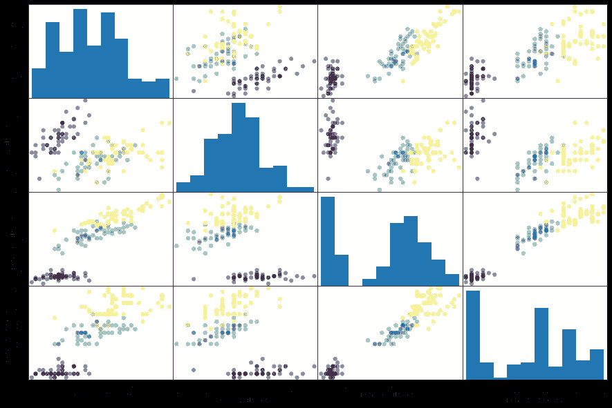
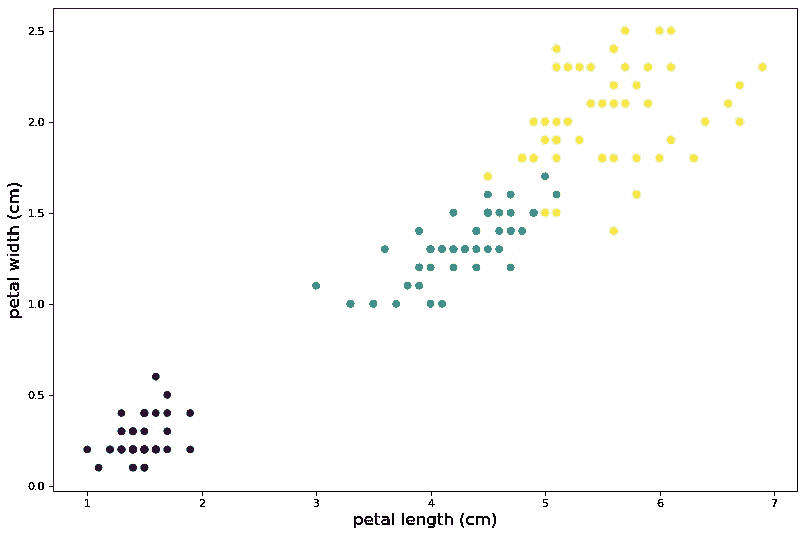

# 监督学习的实用方法

> 原文：<https://towardsdatascience.com/a-practical-approach-to-supervised-learning-63a9e9075b17?source=collection_archive---------26----------------------->


弗兰·基·查马基在 [Unsplash](https://unsplash.com?utm_source=medium&utm_medium=referral) 上的照片

机器学习是教会机器从数据中做出决策的艺术。有多种算法可以帮助计算机分析数据并获得有价值的见解，从而帮助它对以前从未见过的新数据集做出决策。这些算法大多属于以下三类之一:

1.  **监督学习:**从标记数据中学习的算法，并对从未见过的数据进行预测。
2.  **无监督学习:**试图在未标记数据中找到模式和相似性的算法，以便可以相应地对其进行聚类。
3.  **强化学习:**允许与环境进行交互的算法，它们的性能通过奖惩系统进行优化。

在本文中，我们将重点关注**监督学习(SL)** 方法。如前所述，SL 使用有标记的数据，并根据无标记的数据给出其预测。被标记的数据是已经被分类到一个或多个类别中或者已经被赋予特定值的数据。例如，存在参加校际比赛的不同学校的所有学生的数据，那么，在这种情况下，学校名称可以用作对学生进行分类的标签。在另一种情况下，如果有多栋面积不同的房子，它们的成本取决于它们的面积，那么在这种情况下，成本可以用作标签。尽管在这两个实例中，数据都被标记，但它们的标记类型却大不相同。在第一个例子中，标签的数量是离散的，而在第二个例子中，标签是一些十进制值，因此本质上是连续的。SL 在此基础上进一步分类:

1.  **分类:**要预测的值是分类的和离散的。
2.  **回归:**待预测值本质上是连续的。

# 分类

在许多情况下，您会使用分类方法对分类数据进行预测。各种示例包括将电子邮件分类为垃圾邮件或非垃圾邮件、癌症是恶性还是良性、将植物或动物划分为一个王国和物种等。分类问题中使用了许多不同的算法。其中一些是:

1.  逻辑回归
2.  支持向量机(SVM)
3.  k-最近邻
4.  决策图表

在这里，我只会展示 k-NN，但会在即将到来的博客中写其他人。此外，我将使用 scikit-learn Iris 数据集(Fisher，UC Irvine ),它包含三个类，每个类有五十个实例。

## k 近邻分类器

这是一个最简单和超级容易学习的分类算法。k-NN 算法背后的主要思想是，彼此接近的元素将属于同一类别。对于所有的数据点，这可能是真的，也可能不是真的。它通过查看“k”个最接近的标记数据点来预测数据点的标记。未标记的数据点将被分类到在“k”个最接近的数据点中占多数的类别中:


k = 3 和 k = 5 的 k-NN 分类

在上图中，您可以看到 k-NN 分类器对两个不同的“k”值所做的预测。在这两种情况下，分类器做出了不同的预测。这可能会引起你对 k 值的思考，但是不要担心，我稍后会谈到它。既然你对这个算法有了清晰的直觉，让我们在 Iris 数据集上实现它，看看它是如何工作的。

首先，让我给你一些虹膜数据集的见解。这是一个包含花卉数据的非常简单的数据集。它包含四个特征，即**花瓣长度**、**花瓣宽度**、**萼片长度**和**萼片宽度**。它还包含目标变量，即花卉种类，即**杂色**、**海滨锦葵**和 **Setosa** 。这三个标签各有五十个实例。

首先，导入您以后可能需要的所有库是一个好习惯。

```
from sklearn import datasets     #importing datasets from sklearn
import pandas as pd              #importing pandas with an alias pd
import numpy as np               #importing numpy with an alias np 
import matplotlib                #impoting matplotlib
import matplotlib.pyplot as plt  #importing pyplot with an alias plt
```

注意，我从`sklearn`导入了`datasets`模块。这将有助于加载虹膜数据集。现在，对给定数据进行探索性数据分析是一个好主意。为了做到这一点，你必须首先加载虹膜数据集，并将其分配给某个变量，在本例中为`iris`:

```
iris = datasets.load_iris()
```

这个数据是以`Bunch`的形式出现的，您可以使用`type(iris)`来检查它。`Bunch`类似于字典，因为它也包含键值对。让我们检查这个数据集的键，可以使用`print(iris.keys())`来完成，它输出`dict_keys([‘data’, ‘target’, ‘target_names’, ‘DESCR’, ‘feature_names’, ‘filename’])`。`data`包含所有特征的数据，即花瓣长度、花瓣宽度、萼片长度和萼片宽度，`target`包含数字形式的目标值(即，0 代表 Setosa，1 代表 Versicolor，2 代表 Virginica)，`target_names`包含目标变量的名称(即，Setosa，Versicolor，Virginica)，`DESCR`包含关于其贡献者的数据集描述、统计数据和更多内容，`feature_names`包含特征的名称(即，萼片长度(cm)，萼片 花瓣长度(cm)，花瓣宽度(cm))，最后，`filename`包含文件的加载位置。

让我们从 iris 中提取出`data`和`target`,将它们分别赋给某个变量`X`和`Y`。

```
X = iris['data']
Y = iris['target']
```

要对数据执行进一步的操作，您应该将数据转换成 pandas 数据帧，并将其分配给某个变量，比如使用:

`df = pd.DataFrame(X, columns = iris.feature_names)`。

使用`pd.plotting.scatter_matrix(df, c = Y, figsize = [15, 10],s=150)`对 Iris 数据集进行可视化探索性数据分析，将得到一个输出:



如您所见，对角线由对应于行和列的特征直方图组成，非对角线图是列特征和行特征的散点图，由它们的目标变量着色。很明显可以看到特性值和目标变量之间的相关性。让我们分别绘制花瓣长度和花瓣宽度的散点图，并清楚地看到这种相关性。它可以用以下公式绘制

`plt.scatter(df[‘petal length (cm)’], df[‘petal width (cm)’], c = Y)`:



在这里，相关性变得更加明显。紫色图对应于 Setosa，蓝色图对应于 Versicolor，黄色图对应于 Virginica。

在我们的数据集上训练模型之前，将它分成训练集、验证集和测试集是非常重要的。这里，我将把我的数据分为训练集(70%的数据)和测试集(30%的数据)。Scikit-learn 使用其`train_test_split`模块帮助我们非常容易地做到这一点。为此，您必须首先使用`from sklean.model_selection import train_test_split`从`sklearn.model_selection`导入它。它返回四个数组:定型数据、测试数据、定型标签和测试标签。我们将这些分解为四个变量，本例中为 X_train、X_test、y_train、y_test:

```
from sklean.model_selection import train_test_split
X_train, X_test, Y_train, Y_test = train_test_split(X, Y, 
                    test_size = 0.3, random_state = 21,stratify = Y)
```

`test_size`参数决定分配给测试集的数据百分比，`random_state`为在训练和测试中分割数据的随机数生成器设置种子(每次设置相同的种子将产生相同的分割)，`startify`被设置为包含标签的数组，以便标签像在原始数据集中一样分布在训练和测试集中。

最后，是时候实现分类器了，但是首先，我们需要使用`from sklearn.neighbors import KNeighborsClassifier`导入它，然后通过使用`knn = kNeighborsClassifier(n_neighbors = 6)`设置邻居的数量来实例化分类器。这里，我从邻居数等于 6 开始，并将其赋给一个变量`knn`。为了训练模型，scikit-learn 提供了`fit()`方法，因为我们试图将数据拟合到我们的分类器，然后对新的未标记数据进行预测，它提供了`predict()`方法。我们在使用`train_test_split`生成的训练集上训练模型，稍后将在测试集上进行预测。

```
from sklearn.neighbors import KNeighborsClassifier
knn = kNeighborsClassifier(n_neighbors = 6)
knn.fit(X_train, Y_train)   #training on the X_train, Y_train
knn.predict(X_test)         #testing on the X_test
```

这将输出测试集的预测标签数组:

```
array([2, 1, 2, 2, 1, 0, 1, 0, 0, 1, 0, 2, 0, 2, 2, 0, 0, 0, 1, 0, 2, 2,2, 0, 1, 1, 1, 0, 0, 1, 2, 2, 0, 0, 1, 2, 2, 1, 1, 2, 1, 1, 0, 2,1])
```

为了检查我们的模型的准确性，我们对我们的测试数据和标签使用 k-NN 的`score()`方法，`knn.score(X_test, Y_test)`给出`0.955555555556`。对于这样一个简单的模型来说，这是一个不错的结果。

“k”的值在这个分类器中很重要。较小的“k”值意味着模型非常复杂，可能导致过度拟合(模型试图拟合正确类别中的所有点)，而较大的“k”值意味着模型不太复杂，决策边界更平滑，这可能导致拟合不足(模型不拟合大多数明显的点)。有一个更好的“k”值，它既不太大也不太小，不会导致过拟合或欠拟合。

# 回归

当目标变量是连续值时，使用回归。连续值可以是整数、浮点等。回归问题有很多例子，包括预测房价、预测股票价值等。由于该值在回归问题中是连续的，因此无法评估其准确性。因此，通过成本函数的值对其进行评估，该成本函数可以是均方根误差(RMSE)或交叉熵函数或任何其他函数。

为了演示回归，我将对 Kaggle 的波士顿住房数据集进行分析，该数据集可从[这里](https://www.kaggle.com/puxama/bostoncsv)下载。Scikit-learn 也提供这个数据集，并且可以以与我们使用 Iris 数据集相似的方式使用。我会通过从 Kaggle 下载来使用它。如果您想使用内置的 scikit-learn 数据集查看它是如何加载的，您可以在这里[完成。](https://github.com/shubhanker004/ML-Blogs/blob/master/loading_boston_from_scikitlearn.ipynb)

现在，下载完数据集后，需要在 jupyter 文件中导入 Pandas 和 Numpy。要加载数据，您可以使用`pd.read_csv()`并将文件(以字符串的形式)作为参数传入:

```
import pandas as pd              #importing pandas with an alias pd
import numpy as np               #importing numpy with an alias npdf = pd.read_csv('Boston.csv') 
```

您可以使用`head()`方法进一步检查数据。默认情况下，它会显示前五行，但是您可以将行数作为参数传入，并且可以查看尽可能多的记录。它有 15 列，其中第一列用于索引，接下来的 13 列是数据集的特征，最后一列(即 *medv* )是目标变量，它是房主自住房屋的中值，以千美元计。如果你想知道我是怎么知道的，我只是简单地检查了数据集的文档，你也可以这样做。正如您所看到的，使用 pandas 加载的数据是特性和目标变量的组合，但是 scikit-learn 需要它们在单独的数组中。我们可以通过删除 *medv* 列并将其用作目标来拆分数据集:

```
X = df.drop('medv', axis = 1).values       #dropping the medv column
Y = df['medv'].values                      #using medv as target
```

我们使用了`values`属性，因为它返回 NumPy 数组供我们使用。

## 线性回归

现在是时候选择我们的回归模型来帮助预测未标记数据的值了。我会选择一个非常简单的模型，叫做线性回归(LR)。LR 定义了一条适合所有给定数据的最佳线，并且它假设它以后要考虑的所有数据也将遵循相同的模式。在一个维度中(即只有一个特征的数据集)，它是一条简单的线，带有参数 *a* 和 *b* :

*y = ax + b*

这里， *y* 是目标变量，x 是数据集的特征， *a，b* 是要学习的参数。学习 *a、b* 的最佳方式是定义一个损失函数，然后将其最小化，以获得参数的最佳值。那么，如何在这里建立一个损失函数呢？如您所知，线性回归试图将数据拟合在一条线上，但在实际情况下，所有数据可能都不适合这条线。最好的办法是尽量减小直线和数据点之间的垂直距离。答对了。这是我们成本函数的公式。不要被术语“成本”混淆，因为损失函数也被称为成本函数或误差函数。现在，这个垂直距离也被称为“剩余”。我们可以尝试最小化残差的总和，但这可能会导致许多正残差与负残差相抵消，如下所示:


为了避免这种情况，我们最小化残差的平方和。这将是一个完美的损失函数，它通常被称为普通最小二乘法(OLS)。Scikit-learn 在我们应用其线性回归模型并尝试将我们的数据拟合到该模型时执行该操作。

当我们的数据只有一个特征，即一维数据时，就是这种情况。对于具有更高维度的数据，scikit-learn 尝试将数据拟合到这个线性方程中:


线性回归必须了解 *n+1* 个参数。

现在您已经知道了 LR 模型背后的逻辑，让我们尝试在波士顿数据集上实现它。首先，我们将使用 Scikit-learn 的`train_test_split`模块将数据分成训练集和测试集，就像我们在前面的分类示例中所做的那样:

```
from sklearn.model_selection import train_test_split
X_train, X_test, Y_train, Y_test = train_test_split(X, Y, 
                                 test_size = 0.3, random_state = 21)
```

然后，我们需要使用`from sklearn.linear_model import LinearRegression`从 Scikit-learn 导入线性回归模型，然后实例化它。现在，您可以对训练集应用`fit()`方法，并使用`predict()`方法对测试集进行预测:

```
from sklearn.linear_model import LinearRegression
reg = LinearRegression()
reg.fit(X_train, Y_train)
pred = reg.predict(X_test)
```

与分类不同，我们不能用精确度来评估回归模型。在线性回归模型的情况下，使用 R 来评估性能，R 是根据特征变量预测的目标变量的方差的评估。为了计算 R，我们应用 score 方法并传递参数 X_test 和 Y_test，`reg.score(X_test, Y_test)`。

到目前为止，我一直在拆分训练集和测试集中的数据。但是，为了让模型对新数据集进行增强评估，我们可以使用称为交叉验证(CV)的技术。假设我们想做 n 重交叉验证，我们会把数据分成 *n* 等份。然后，我们将举行第一次折叠，在剩余的 *n-1* 上拟合我们的模型，在测试集上预测并计算感兴趣的度量。接下来，我们保留第二个集合，拟合剩余的数据，并计算感兴趣的度量。我们对所有的 n 倍继续这样做。


来源:[交叉验证维基](https://en.wikipedia.org/wiki/Cross-validation_(statistics))

我们得到了我们感兴趣的度量的 n 个值(在我们的例子中是 R)。我们可以取所有数据的平均值，也可以计算其他统计数据，如平均值、中间值等。然而，需要注意的一点是，折叠的次数越多，我们的模型的计算开销就越大，因为我们要训练和测试那么多次。要使用 CV 实现 LR:

```
from sklearn.model_selection import cross_val_score
from sklearn.linear_model import LinearRegression
reg = LinearRegression()
cv = cross_val_score(reg, X, Y, cv = 5)  #5-fold cross validation
print(cv)
```

它将以数组的形式输出为所有五次折叠计算的 R 值:

```
[ 0.57280576  0.72459569  0.59122862  0.08126754 -0.20963498]
```

请注意，我使用这个线性回归只是为了演示的目的，它从来没有这样使用。我们通常使用的是正则化的线性回归模型。

你可以在这里查看分类模型的代码，在这里查看回归模型的代码。

希望这篇教程能帮助你入门机器学习。你应该对分类和回归监督学习方法有更好的了解。我将继续这个系列，并在我即将到来的博客中写下关于无监督学习的内容。