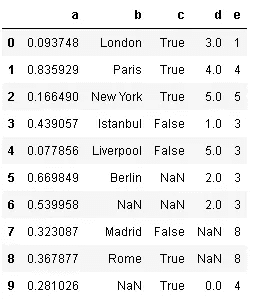
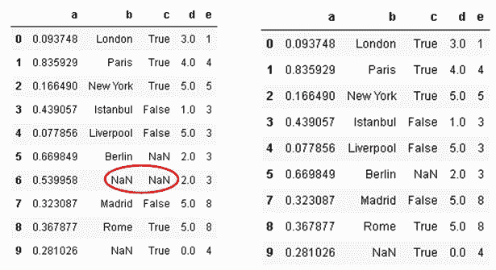
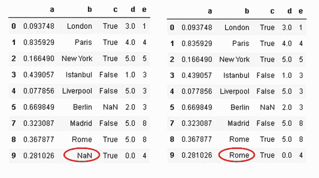
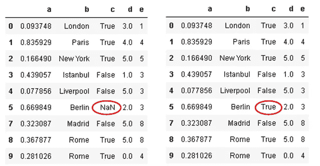
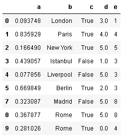
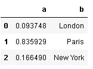

# 熊猫数据分析实用指南

> 原文：<https://towardsdatascience.com/a-practical-guide-for-data-analysis-with-pandas-e24e467195a9?source=collection_archive---------9----------------------->

## 加快您的数据分析过程

数据科学项目中最耗时的部分是数据清理和准备。然而，有许多强有力的工具可以加速这个过程。其中之一是 Pandas，它是一个广泛使用的 Python 数据分析库。


[图像来源](https://favpng.com/png_view/report-data-analysis-big-data-management-data-processing-png/SDbMSLFj)

在这篇文章中，我将介绍一个典型的熊猫数据清理过程。我将举一个例子，因为一如既往，熟能生巧。

主要议题是:

*   创建数据框架
*   数据概述
*   缺少值
*   选择数据

我们总是从导入所需的库开始:

```
import pandas as pd
import numpy as np
```

# **创建数据帧**

在现实生活中，我们通常从文件中读取数据，而不是创建数据帧。Pandas 提供了[函数](https://pandas.pydata.org/pandas-docs/stable/user_guide/io.html)，通过从各种文件类型中读取数据来创建数据帧。在这篇文章中，我将使用字典来创建一个示例数据帧。

```
df = pd.DataFrame({'a':np.random.rand(10),
                 'b':np.random.randint(10, size=10),
                 'c':[True,True,True,False,False,np.nan,np.nan,
                      False,True,True],
                 'b':['London','Paris','New York','Istanbul',
                      'Liverpool','Berlin',np.nan,'Madrid',
                      'Rome',np.nan],
                 'd':[3,4,5,1,5,2,2,np.nan,np.nan,0],
                 'e':[1,4,5,3,3,3,3,8,8,4]})
df
```


# **数据概述**

Pandas describe 函数为数值(int 或 float)列提供汇总统计信息。它计算值的数量，并显示平均值、标准差、最小值和最大值以及 25%、50%和 75%的分位数。

```
df.describe()
```


虽然所有的列都有相同的行数，但是 d 列的计数不同，因为 describe 函数不计算 NaN(缺失)值。

**value_counts()** 以出现次数显示列中的值:

```
df.c.value_counts()
True     5
False    3
Name: c, dtype: int64
```

value_counts()不计算 NaN(缺失)值。

我们还应该检查数据类型，并在我们的分析中考虑它们。有些功能只能在某些数据类型上执行。我们可以使用 **dtypes** 轻松检查数据类型:

```
df.dtypes
a    float64
b     object
c     object
d    float64
e      int64
dtype: object
```

“d”和“e”列都有整数，但“d”列的数据类型是 float。原因是列 d 中的 NaN 值。NaN 值被认为是浮点型的，因此该列中的整数值被向上转换为浮点数据类型。

Pandas 1.0.1 允许使用 NaN 作为整数数据类型。我们只需要显式地将 dtype 表示为 **pd。Int64Dtype():**

```
pd.Series([1, 2, 3, np.nan], dtype=pd.Int64Dtype())
0      1
1      2
2      3
3    NaN
dtype: Int64
```

如果 pd。不使用 Int64Dtype()，整数值被强制转换为浮点数:

```
pd.Series([1, 2, 3, np.nan])
0    1.0
1    2.0
2    3.0
3    NaN
dtype: float64
```

# **缺失值**

处理缺失值是数据清理和准备过程的重要部分，因为现实生活中几乎所有的数据都有一些缺失值。



在处理缺失值之前，我们需要检查数据帧中缺失值的数量。这一步很重要，因为行或列中缺失值的比率在如何处理它们方面起着关键作用。 **isna()** 检查条目是否为 NaN(缺失)。当与 sum 方法结合使用时，它会给出每列中缺失值的总数:

```
df.isna().sum()
a    0
b    2
c    2
d    2
e    0
dtype: int64
```

当与 any()结合使用时，它返回一个布尔值，指示该列中是否有任何缺少的值:

```
df.isna().any()
a    False
b     True
c     True
d     True
e    False
dtype: bool
```

有许多方法可以处理丢失的值，没有一个“最佳”的选择可以用于每项任务。它高度依赖于数据的任务和特征。我将在这里列出几种处理缺失值的不同方法。

我们可以用一列中的最大值替换该列中缺少的值:

```
df.d.fillna(df.d.max(), inplace=True)
```


> 将**原位**参数设置为真很重要。否则不会保存更改。

根据具体情况，如果缺少的值太多，我们可能会决定删除一行或一列。在没有先验知识的情况下填充许多缺失值可能会对我们的分析产生负面影响。我们的数据框架中有 5 列，我只想保留至少有 4 个值的样本(行)。换句话说，至少有两个缺失值的行将被删除。我们可以使用带有 **thresh** 参数的 **dropna** 函数。轴参数用于指示行(0)或列(1)。

```
df.dropna(thresh=4, axis=0, inplace=True)
```



> thresh 参数的变元是一行或一列需要不被删除的非缺失值的数量。

我们也可以用它之前或之后的值来填充丢失的值。这种方法多用于时间序列数据。**方法**参数与' **ffill** '(向前传播)或' **bfill** '(向后传播)参数一起使用:

```
df.b.fillna(method='ffill', inplace=True)
```



我们还可以用该列中最常见的**值来填充缺失值。Value_counts()根据值在列中出现的次数对它们进行排序。所以我们可以使用 value_counts()的索引来获取最常见的值:**

```
df.c.fillna(df.c.value_counts().index[0], inplace=True)
```



# **选择数据**

**iloc** 和 **loc** 允许选择数据帧的一部分。

*   iloc:按职位选择
*   位置:按标签选择

让我们来看一些例子，因为一如既往，熟能生巧。

国际劳工组织理事会



选择第二行:

```
df.iloc[1] 
a    0.835929
b       Paris
c        True
d           4
e           4
Name: 1, dtype: object
```

选择第一行，第二列(即第一行中的第二个值):

```
df.iloc[0,1] 
'London'
```

所有行，第三列(与选择第二列相同，但我只想展示':'的用法):

```
df.iloc[:,2]
0     True
1     True
2     True
3    False
4    False
5     True
7    False
8     True
9     True
Name: c, dtype: bool
```

前两行，第二列:

```
df.iloc[:2,1]
0    London
1     Paris
Name: b, dtype: object
```

**loc**

最多 2 行，列“b”:

```
df.loc[:2,'b']
0      London
1       Paris
2    New York
Name: b, dtype: object
```

最多 2 行和最多“b”列:

```
df.loc[:2, :'b']
```



第“2”行和第“b”列:

```
df.loc[2, :'b']
a     0.16649
b    New York
Name: 2, dtype: object
```

> 您可能想知道为什么我们在 loc 和 iloc 中对行使用相同的值。原因是数字指数。Loc 按位置选择，但行的位置与索引相同。

让我们创建一个带有非数字索引的新数据帧，这样我们就可以看到不同之处:

```
index = ['aa','bb','cc','dd','ee']
df2 = pd.DataFrame({'a':np.random.rand(5),
                 'b':np.random.randint(10, size=5)},
                   index = index)
df2
```


```
df2.loc['bb','b']
1df2.loc[:'cc','a']
aa    0.892290
bb    0.174937
cc    0.600939
Name: a, dtype: float64
```

完成数据清理或预处理后，最好将其保存到文件中，这样下次处理项目时就不必再经历相同的步骤。Pandas 提供了许多 IO 工具来读写不同的文件格式。最常见的是 **to_csv** :

```
df.to_csv("df_cleaned.csv")
```

# 结论

我在这里介绍的只是熊猫在数据分析过程中的一小部分能力，但肯定会在你的项目中有用。试图一下子全部学会是不合理的。相反，学习小块和通过实践吸收信息将帮助你建立全面的数据分析技能。

# 我关于数据操作和分析的其他帖子

*   [与熊猫的时间序列分析](/time-series-analysis-with-pandas-e6281a5fcda0)
*   [时间序列分析—处理时区](/time-series-analysis-handling-time-zones-b6fcb324c7b)
*   [数据科学中最被低估的工具:NumPy](/the-most-underrated-tool-in-data-science-numpy-68d8fcbde524)
*   [数据科学中最被低估的工具:NumPy(第二部分)](https://medium.com/swlh/the-most-underrated-tool-in-data-science-numpy-part-2-d9bfb4b2313a)
*   [使用熊猫组合数据帧](/combining-dataframes-using-pandas-b9e2e83b9869)
*   [用熊猫处理缺失值](/handling-missing-values-with-pandas-b876bf6f008f)
*   [熊猫的 3 个有用功能](https://medium.com/@soneryildirim1988/3-useful-functionalities-of-pandas-f4cb342a77ab)