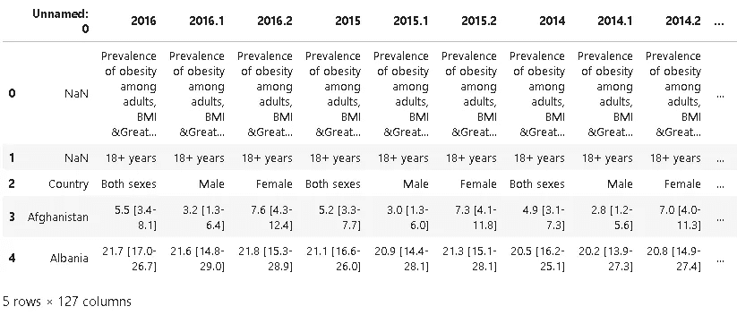
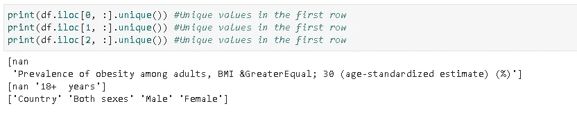
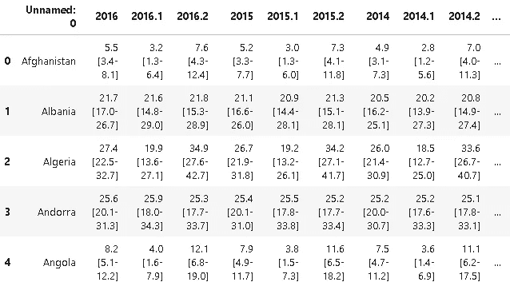
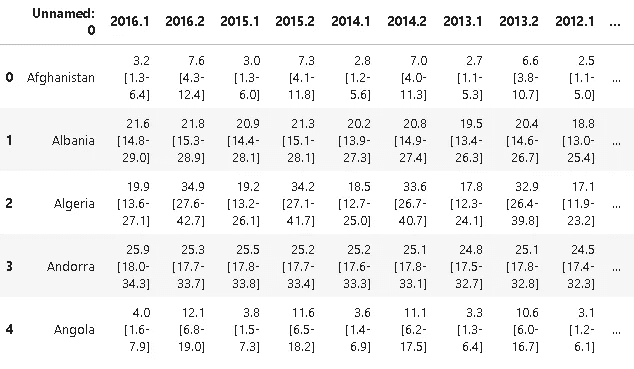
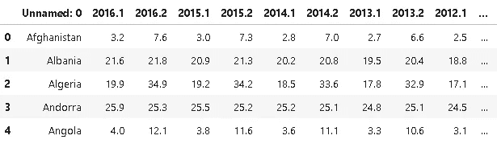
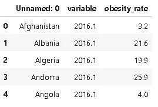
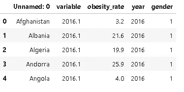
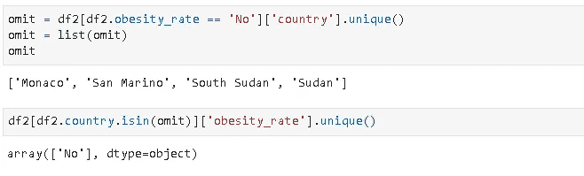
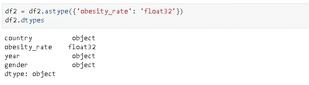
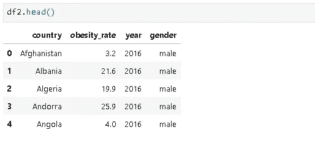

# 数据清理实用指南:肥胖率数据集

> 原文：<https://towardsdatascience.com/a-practical-guide-for-data-cleaning-obesity-rate-dataset-aff9d12390c8?source=collection_archive---------44----------------------->

## 如何清理和重新格式化原始数据集。


艾玛·弗朗西斯·洛根在 [Unsplash](https://unsplash.com/s/photos/explore?utm_source=unsplash&utm_medium=referral&utm_content=creditCopyText) 上的照片

每一个机器学习或深度学习模型的燃料都是数据。没有数据，模型是没有用的。在建立模型和训练模型之前，我们应该尝试探索和理解手头的数据。我所说的理解是指数据中的相关性、结构、分布、特征和趋势。对数据的全面理解将非常有助于构建一个稳健且设计良好的模型。我们可以通过研究数据得出有价值的结论。在我们开始研究数据之前，我们需要清理和重新格式化数据集，以便可以轻松地对其进行分析。

在本帖中，我们将介绍 Kaggle 上提供的“[成人肥胖国家](https://www.kaggle.com/amanarora/obesity-among-adults-by-country-19752016)数据集”的数据清理过程。我将在另一篇文章中讨论探索性数据分析部分。如果我们把它们放在一篇文章里，读者会觉得篇幅太长，难以集中注意力。

该数据集包含 1975 年至 2016 年间 195 个国家的成人肥胖率。让我们从将数据集读入熊猫数据帧开始，并查看它:

```
import numpy as np
import pandas as pddf = pd.read_csv("obesity_data.csv")df.shape
(198, 127)df.head()
```



肯定不是什么好看的格式。前三行似乎在重复同样的信息。我们可以确认在行上使用 **nunique** 函数:

```
print(df.iloc[0, :].unique())
[nan, 'Prevalence of obesity among adults, BMI &GreaterEqual; 30 (age-standardized estimate) (%)']
```



前两行在除第一列之外的所有列中包含相同的值，该值为 NaN。第三列表示性别，但是我们可以从列名中得到相同的信息。2016.1 是男性，2016.2 是女性，2016 是平均值，这适用于所有年份。前三行是多余的，所以我们删除它们。

```
df.drop([0,1,2], axis=0, inplace=True)
df.reset_index(drop=True, inplace=True)
```

现在数据帧看起来像这样:



平年(如 2016 年)的数值是同一年其他两列的平均值(如 2016.1 和 2016.2)。保留一个通过简单的数学运算就能实现的列是没有意义的。所以我们放弃了平淡的岁月。

列名中有一种模式。从第二列开始，每隔三列就是一个平年。我们可以使用这个模式来过滤列名，并将其传递给 **drop** 函数:

```
df.drop(df.columns[1::3], axis=1, inplace=True)
df.head()
```



年份列包含一个值和一个范围。该值是范围上限和下限的平均值。因此，我们只能将该值视为平均肥胖率。我们可以通过拆分值和范围来实现这一点，然后在拆分后获取第一个元素。

```
for i in range(1,85):
    df.iloc[:,i] = df.iloc[:,i].str.split(expand=True)[0]df.head()
```



这种格式对于分析来说不是很理想。如果我们有以下几列就更好了:

*   国家、年份、性别、肥胖率

所以我们需要将宽数据帧转换成窄数据帧。熊猫的**转置**功能可以用于这个任务，但是有一个更好的选择，那就是熊猫的**融化**功能。我认为融化功能是“智能转置”。

```
df2 = df.melt(id_vars=['Unnamed: 0'], value_name='obesity_rate')
df2.head()
```



我们越来越接近理想的形式。附在年份上的数字表示性别。1 代表男性，2 代表女性。我们可以将可变列拆分为“年份”和“性别”列:

```
df2[['year','gender']] = df2.iloc[:,1].str.split('.', expand=True)
df2.head()
```



我们需要做一些调整:

*   删除“变量”列，因为它由“年份”和“性别”列表示。
*   更改“性别”列中的值，使 1 为男性，2 为女性。
*   将第一列的名称更改为“country”

```
df2.drop('variable', axis=1, inplace=True)gender = {'1':'male', '2':'female'}
df2.gender.replace(gender, inplace=True)df2.rename(columns={'Unnamed: 0':'country'}, inplace=True)df2.head()
```


现在我们有了一个漂亮干净的数据框架。最后，让我们检查新数据帧的形状和数据类型，并寻找丢失的值。

```
df2.shape
(16380, 4)df2.isna().sum()
country         0
obesity_rate    0
year            0
gender          0
dtype: int64df2.dtypes
country         object
obesity_rate    object
year            object
gender          object
dtype: object
```

我们需要将“obesity_rate”列的数据类型改为浮点型。当我试图转换这些值时，我发现在 obesity_rate 列中有“No”值，这些值不能转换为数值。在检查了“否”值后，我看到只有少数国家在肥胖率列中包含“否”值:

```
df2[df2.obesity_rate == 'No']['country'].unique()array(['Monaco', 'San Marino', 'South Sudan', 'Sudan'], dtype=object)
```

实际上，这些国家的所有价值观都是“不”:

```
omit = df2[df2.obesity_rate == 'No']['country'].unique()df2[df2.country.isin(omit)]['obesity_rate'].unique()df2 = df2[~df2.country.isin(omit)]
```



所以我们放弃他们:

```
df2 = df2[~df2.country.isin(omit)]
```

波浪号(~)操作符表示不是，所以我们采用国家不在省略列表中的行。我们现在可以将数据类型更改为数值:

```
df2 = df2.astype({'obesity_rate': 'float32'})
df2.dtypes
```



我们现在有了一个适合探索性数据分析(EDA)的清晰的数据框架。我将在下一篇文章中详细介绍 EDA 过程，并提供丰富的可视化信息。

感谢您的阅读。如果您有任何反馈，请告诉我。