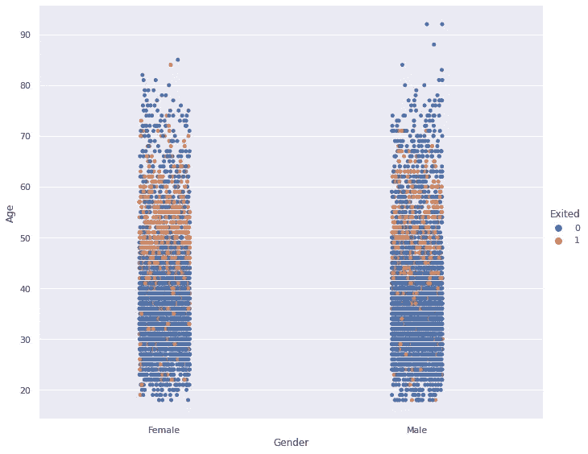
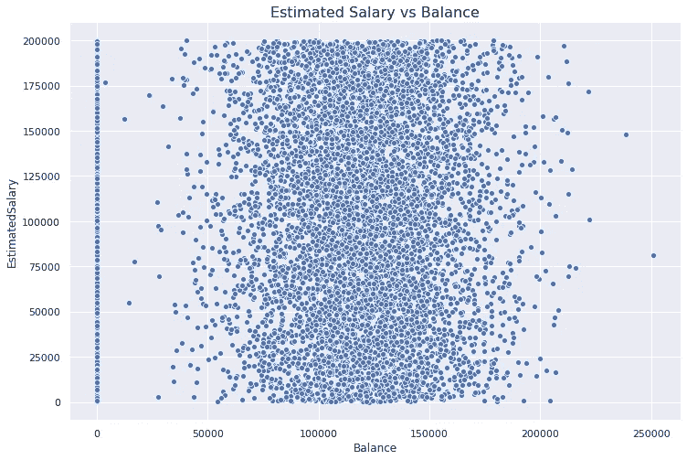
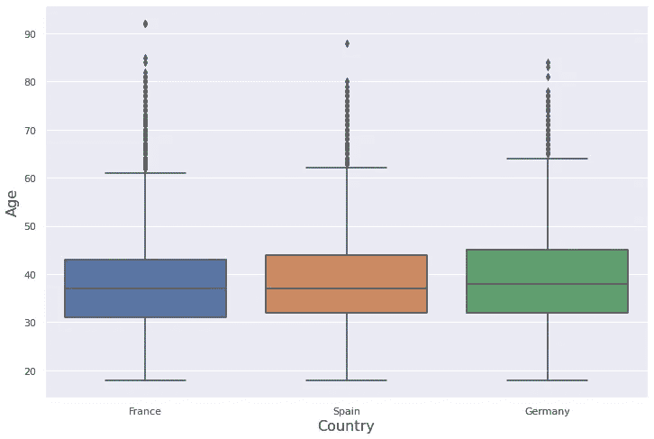
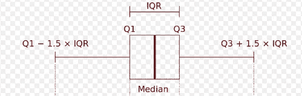
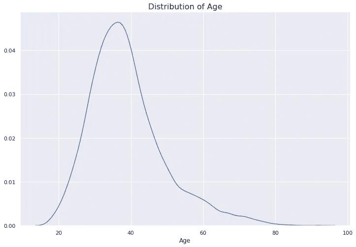
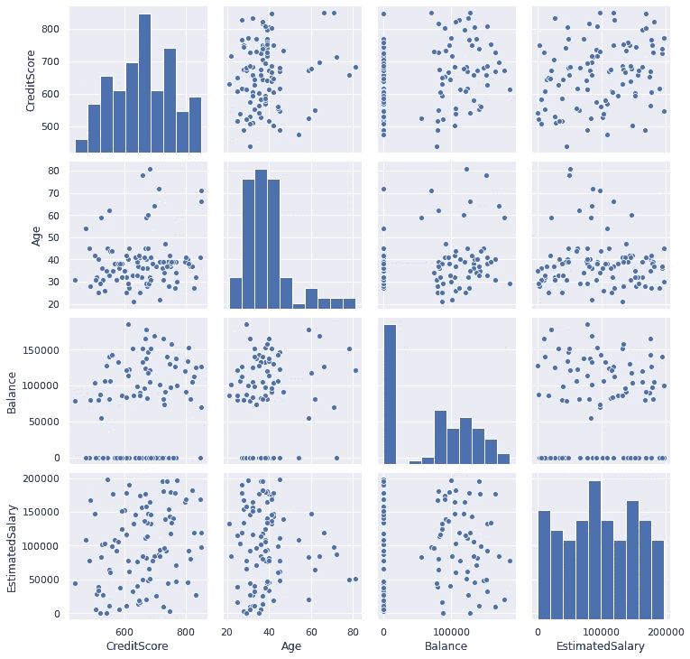
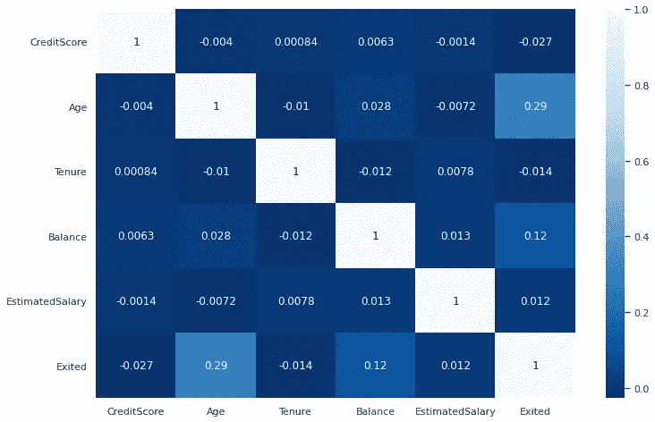

# 数据可视化实用指南

> 原文：<https://towardsdatascience.com/a-practical-guide-for-data-visualization-9f1a87c0a4c2?source=collection_archive---------26----------------------->

## Matplotlib 和 Seaborn 的关系图、分类图和分布图。


JOSHUA COLEMAN 在 [Unsplash](https://unsplash.com/s/photos/visual?utm_source=unsplash&utm_medium=referral&utm_content=creditCopyText) 上拍摄的照片

探索性数据分析(EDA)是数据科学或机器学习管道的重要组成部分。为了使用数据创建健壮且有价值的产品，您需要探索数据，理解变量之间的关系以及数据的底层结构。EDA 中最有效的工具之一是数据可视化。

数据可视化告诉我们的远不止简单的数字。它们也更容易粘在你的头上。在本帖中，我们将尝试利用可视化的力量探索一个[客户流失数据集](https://www.kaggle.com/sonalidasgupta95/churn-prediction-of-bank-customers)。

我们将创建许多不同的可视化，并在每一个上尝试引入 Matplotlib 或 Seaborn 库的特性。

我们从导入相关的库和将数据集读入 pandas 数据框架开始。

```
import pandas as pd
import numpy as npimport matplotlib.pyplot as plt
import seaborn as sns
sns.set(style='darkgrid')
%matplotlib inlinedf = pd.read_csv("/content/Churn_Modelling.csv")df.head()
```


数据集包含 10000 个客户(即行)和关于银行客户及其产品的 14 个特征。这里的目标是预测客户是否会使用提供的功能流失(即退出= 1)。

让我们从一个 **catplot** 开始，它是 Seaborn 库的分类图。

```
sns.catplot(x='Gender', y='Age', data=df, hue='Exited', height=8, aspect=1.2)
```



**发现**:45 岁到 60 岁的人比其他年龄段的人更容易流失(即离开公司)。就搅拌而言，女性和男性之间没有太大的差异。

**色调**参数用于根据分类变量区分数据点。

下一个可视化是**散点图**，它显示了两个数值变量之间的关系。我们来看看一个客户的预估工资和余额是否有关联。

```
plt.figure(figsize=(12,8))plt.title("Estimated Salary vs Balance", fontsize=16)sns.scatterplot(x='Balance', y='EstimatedSalary', data=df)
```



我们首先使用 **matplotlib.pyplot** 接口创建一个 Figure 对象并设置标题。然后，我们用 Seaborn 在这个图形对象上绘制了实际的绘图。

**发现**:预计工资和余额之间没有有意义的关系或关联。余额似乎呈正态分布(不包括余额为零的客户)。

下一个可视化是**箱线图**，它显示了变量在中位数和四分位数方面的分布。

```
plt.figure(figsize=(12,8))ax = sns.boxplot(x='Geography', y='Age', data=df)ax.set_xlabel("Country", fontsize=16)
ax.set_ylabel("Age", fontsize=16)
```



我们还使用 **set_xlabel** 和 **set_ylabel 调整了 x 和 y 轴的字体大小。**

箱线图的结构如下:



箱线图的结构([图像源](https://en.wikipedia.org/wiki/Box_plot))

Median 是对所有点进行排序时位于中间的点。Q1(第一个或下四分位数)是数据集下半部分的中位数。Q3(第三或上四分位数)是数据集上半部分的中位数。

因此，箱线图给我们一个关于分布和异常值的概念。在我们创建的箱线图中，顶部有许多异常值(用点表示)。

**发现**:年龄变量的分布是右偏的。由于上侧的异常值，平均值大于中值。国与国之间没有太大的差别。

在变量的单变量分布中也可以观察到右偏。让我们创建一个 **distplot** 来观察分布。

```
plt.figure(figsize=(12,8))plt.title("Distribution of Age", fontsize=16)sns.distplot(df['Age'], hist=False)
```



右边的尾巴比左边的重。原因是异常值，正如我们在箱线图上观察到的那样。

默认情况下，distplot 也提供直方图，但我们使用 **hist** 参数对其进行了更改。

Seaborn library 还提供了不同类型的配对图，概述了变量之间的配对关系。让我们首先从我们的数据集中随机抽取一个样本，使这些图更有吸引力。原始数据集有 10000 个观测值，我们将选取一个有 100 个观测值和 4 个特征的样本。

```
subset=df[['CreditScore','Age','Balance','EstimatedSalary']].sample(n=100)g = sns.pairplot(subset, height=2.5)
```



在对角线上，我们可以看到变量的直方图。网格的另一部分代表成对的关系。

观察两两关系的另一个工具是**热图**，它采用矩阵并生成彩色编码图。热图主要用于检查特征和目标变量之间的相关性。

让我们首先使用 pandas 的 **corr** 函数创建一些特征的关联矩阵。

```
corr_matrix = df[['CreditScore','Age','Tenure','Balance',
'EstimatedSalary','Exited']].corr()
```

我们现在可以画出这个矩阵。

```
plt.figure(figsize=(12,8))sns.heatmap(corr_matrix, cmap='Blues_r', annot=True)
```



**发现**:“年龄”和“余额”栏与客户流失(“退出”)正相关。

随着数据量的增加，分析和探索数据变得更加困难。当有效和恰当地使用时，可视化是探索性数据分析的伟大工具。可视化也有助于向你的观众传递信息，或者告诉他们你的发现。

没有一种通用的可视化方法，因此某些任务需要不同类型的可视化。根据任务的不同，不同的选项可能更合适。所有可视化的共同点是，它们都是探索性数据分析和数据科学讲述部分的伟大工具。

感谢您的阅读。如果您有任何反馈，请告诉我。