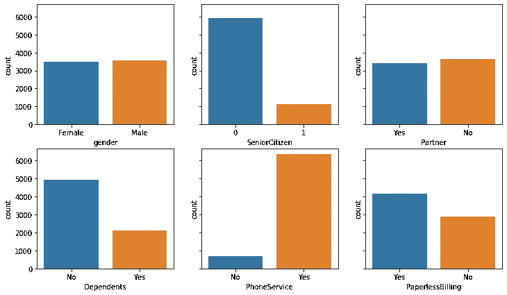
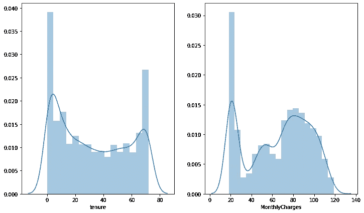

# 探索性数据分析实用指南

> 原文：<https://towardsdatascience.com/a-practical-guide-for-exploratory-data-analysis-5ab14d9a5f24?source=collection_archive---------38----------------------->

## 听数据，好奇又认真！


艾玛·弗朗西斯·洛根在 [Unsplash](https://unsplash.com/s/photos/explore?utm_source=unsplash&utm_medium=referral&utm_content=creditCopyText) 上的照片

每一个机器学习或深度学习模型的燃料都是数据。没有数据，模型是没有用的。在建立模型和训练模型之前，我们应该尝试探索和理解手头的数据。我所说的理解是指数据中的相关性、结构、分布、特征和趋势。对数据的全面理解将非常有助于构建一个稳健且设计良好的模型。我们可以通过研究数据得出有价值的结论。

在这篇文章中，我将对 Kaggle 上的电信客户流失数据集进行探索性的数据分析。

让我们从将数据读入熊猫数据帧开始:

```
import numpy as np
import pandas as pddf = pd.read_csv("Telco-Customer-Churn.csv")
```

首先要做的是检查我们有什么。

```
df.shape
(7043, 21)df.columns
Index(['customerID', 'gender', 'SeniorCitizen', 'Partner', 'Dependents','tenure', 'PhoneService', 'MultipleLines', 'InternetService','OnlineSecurity', 'OnlineBackup', 'DeviceProtection', 'TechSupport','StreamingTV', 'StreamingMovies', 'Contract', 'PaperlessBilling',
'PaymentMethod', 'MonthlyCharges', 'TotalCharges', 'Churn'],
dtype='object')
```

数据集包括 7043 个观测值(行)和每个观测值的 21 个特征(列)。一个特征“客户流失”是目标变量，这是我们使用其他 20 个特征预测的目标变量。目标变量是因变量，其他 20 个特征是自变量。

让我们用**头**方法来看看数据帧的前 5 行:


虽然 dataframe 有 21 列，但只有 10 列适合屏幕显示。使用以下代码可以很容易地更改该选项:

```
pd.set_option("display.max_columns", 21)
```

该数据集经过预先清理，因此没有任何缺失值，但检查和处理缺失值是一个良好的做法:

```
df.isna().sum().sum()
0
```

我们没有像预期的那样丢失任何值。df.isna()。sum()返回每列中缺失值的数量。通过再加一个总和，我们可以看到整个数据帧中缺失值的总数。以下是关于如何查找和处理缺失值的详细帖子:

[](/handling-missing-values-with-pandas-b876bf6f008f) [## 用熊猫处理缺失值

### 关于如何检测和处理缺失值的完整教程

towardsdatascience.com](/handling-missing-values-with-pandas-b876bf6f008f) 

我认为最好开始探索目标变量，因为最终，我们将建立一个模型来预测目标变量。我们可以使用 **value_counts()** 来检查目标变量的分布，或者将其可视化:

```
df.Churn.value_counts()
No     5174
Yes    1869
Name: Churn, dtype: int64plt.figure(figsize=(10,6))
sns.countplot('Churn', data=df).set_title('Distribution of Target Variable')
```


目标变量具有不平衡的类分布。正类(流失=是)远小于正类(流失=否)。不平衡的类别分布会对机器学习模型的性能产生负面影响。上采样或下采样可以用来克服这个问题。向上采样是通过随机选择样本中的行来增加样本较少的类的样本数。下采样是应用于主导类以减少观察数量的类似过程。

我们也来看看自变量的分布。我们可以从二元分类特征开始:

```
fig, axes = plt.subplots(2, 3, figsize=(12, 7), sharey=True)sns.countplot("gender", data=df, ax=axes[0,0])
sns.countplot("SeniorCitizen", data=df, ax=axes[0,1])
sns.countplot("Partner", data=df, ax=axes[0,2])
sns.countplot("Dependents", data=df, ax=axes[1,0])
sns.countplot("PhoneService", data=df, ax=axes[1,1])
sns.countplot("PaperlessBilling", data=df, ax=axes[1,2])
```



老年人和电话服务变量之间存在严重的不平衡。大多数顾客都不是老年人，而且大多数顾客都有电话服务。

我们还应该检查其他分类变量的分布。

```
sns.countplot("InternetService", data=df)
```


光纤比 DSL 更常用，也有没有互联网服务的客户。

```
fig, axes = plt.subplots(2, 3, figsize=(12, 7), sharey=True)sns.countplot("StreamingTV", data=df, ax=axes[0,0])
sns.countplot("StreamingMovies", data=df, ax=axes[0,1])
sns.countplot("OnlineSecurity", data=df, ax=axes[0,2])
sns.countplot("OnlineBackup", data=df, ax=axes[1,0])
sns.countplot("DeviceProtection", data=df, ax=axes[1,1])
sns.countplot("TechSupport", data=df, ax=axes[1,2])
```


这些变量的共同点是“无互联网服务”类别，因此只有当客户有互联网服务时，这些变量才会发挥作用。在选择特征和构建模型时，我们应该记住这一点。

“合同”和“支付方法”也是分类变量，因此我们可以类似地检查它们。

让我们看看连续变量的分布。

```
fig, axes = plt.subplots(1,2, figsize=(12, 7))sns.distplot(df["tenure"], ax=axes[0])
sns.distplot(df["MonthlyCharges"], ax=axes[1])
```



保有权变量显示客户已经成为客户多少个月了。大多数顾客都是新会员或老会员。从月费分布一栏可以看出，大多数客户支付的是最低月费。情况可能是，该公司为新员工提供了相当不错的待遇。

自变量与目标(因变量)的关系也很重要。我们需要揭示相关性，看看每个特征如何影响目标变量。

我们可以使用**相关矩阵**来表示连续变量，或者使用 **groupby** 函数来探索分类变量。在开始这一步之前，我们需要在目标变量中做一个小的操作。“流失”列中的类别表示为“是”和“否”。对于数值分析，我们需要将“是”改为 1，将“否”改为 0:

```
new = {'Yes':1, 'No':0}
df.Churn = df.Churn.replace(new)
```

我们从“老年人”和“伴侣”特征开始。只要您详细研究每个变量，顺序并不重要:


这些数字告诉我们什么？我们根据每个类别对客户进行分组，并计算平均流失率。记住 1 表示客户流失，因此平均值越高，该群体流失的可能性越大。看来老年人比非老年人更容易流失。有一个合作伙伴可以降低流失率。

让我们再检查几个:


正如“家属”一栏所暗示的，单身人士更有可能变动，这是有道理的，因为当我们安定下来后，一般来说，我们不容易改变。拥有电话服务对客户流失率的影响很小。

我真的很想知道性别对流失率有没有影响。让我们检查一下:


男性和女性的流失率几乎相同。

我怀疑任期和合同变量高度相关，因为如果客户有长期合同，他们会呆得更久。让我们检查一下:


结果证实了我的怀疑。在这种情况下，没有必要在预测模型中使用这两个变量。包括其中之一就足够了。

我们可以进一步分析并研究一些组合特征。例如，对于有受抚养人的人，流失率如何根据互联网服务类型而不同？我们可以简单地用 **pivot_table** 函数来回答这个问题:


我们可以使用相关矩阵来寻找连续特征之间的相关性。 **corr()** 方法可应用于数据帧，结果也可使用**热图**可视化:


```
plt.figure(figsize=(10,6))sns.heatmap(corr, square=True, center=0.5, yticklabels=False).set_title('Correlation Matrix')
```


y 轴上的变量顺序与 x 轴上的顺序相同(从上到下:流失、任期、月度费用)。任期和流失率之间存在负相关关系。客户在公司呆的时间越长，他/她流失的可能性就越小。

以这种方式探索变量有助于我们更好地理解数据。我们将大致了解在实现模型时有用的变量。我们可以根据探索过程的结果决定消除或修改某些变量。如果结果相同，最好使用更简单的模型。

我们也可以不经过任何计算就做出推论。例如，我们的数据集包括“任期”、“每月费用”和“总费用”列。总费用的价值与任期乘以每月费用成正比。因此，没有必要在模型中包含“TotalCharges”列。

# **结论**

探索性数据分析过程中使用的技术取决于任务和数据集的特征。但是，目标是一样的。我们试图探索和理解这些数据。在没有全面了解手头数据的情况下，永远不要急于构建模型。数据能告诉我们很多东西，所以我们应该仔细而好奇地倾听。

感谢您的阅读。如果您有任何反馈，请告诉我。