# 探索性数据分析实用指南——流失数据集

> 原文：<https://towardsdatascience.com/a-practical-guide-for-exploratory-data-analysis-churn-dataset-508b6da2d594?source=collection_archive---------13----------------------->

## 使用熊猫、Matplotlib 和 Seaborn。


尼尔斯·内德尔在 [Unsplash](https://unsplash.com/s/photos/flight?utm_source=unsplash&utm_medium=referral&utm_content=creditCopyText) 上的照片

探索性数据分析(EDA)是数据科学或机器学习管道的重要组成部分。为了使用数据创建健壮且有价值的产品，您需要探索数据，理解变量之间的关系以及数据的底层结构。

在本帖中，我们将使用 Pandas、Matplotlib 和 Seaborn 库探索客户流失数据集。数据集可在 Kaggle 上的[这里](https://www.kaggle.com/sonalidasgupta95/churn-prediction-of-bank-customers)获得。

第一步是将数据集读入熊猫数据帧。

```
import pandas as pd
import numpy as npdf = pd.read_csv("/content/Churn_Modelling.csv")df.shape
(10000, 14)df.head()
```

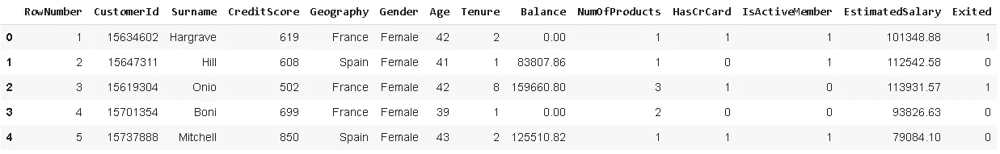

数据集包含 10000 个客户(即行)和关于银行客户及其产品的 14 个特征。这里的目标是预测客户是否会使用提供的功能流失(即退出= 1)。因此，在机器学习方面，我们的目标是建立一个监督学习算法来执行分类任务。

我们永远不应该只是将原始数据转储到机器学习模型中。垃圾进，垃圾出！这就是为什么彻底的 EDA 过程非常重要的原因。

# **清理数据**

让我们首先检查是否有任何丢失的值。

```
df.isna().sum()
```

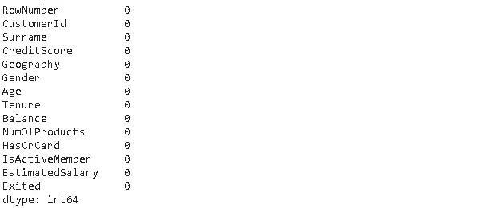

该数据集没有任何缺少的值，这在现实生活的数据集中是不常见的。[处理缺失值](/handling-missing-values-with-pandas-b876bf6f008f)是 EDA 过程的重要组成部分。如果与数据集的大小相比，缺少的值非常少，我们可以选择删除缺少值的行。否则，最好用合适的值替换它们。Pandas **fillna** 函数可以用来处理这个任务。

**重要说明:**如果您选择基于列中的非缺失值估算缺失值(例如，用列的平均值填充缺失值)，您应该在将数据集拆分为训练和测试子集后执行此操作。否则，您会将测试集中的数据泄露给机器学习模型，这些数据应该是新的、以前未见过的数据。

像客户流失预测和垃圾邮件检测这样的任务很可能具有不平衡的类别分布。流失(即离开)的客户数量通常比没有流失的客户数量少得多。我们可以用 **value_counts** 函数检查值的分布。

```
df.Exited.value_counts()
0    7963 
1    2037 
Name: Exited, dtype: int64
```

目标变量不平衡(“已退出”)。重要的是消除不平衡。否则，机器学习模型很可能会偏向于占优势的阶层。有不同的技术来处理类不平衡，如欠采样和过采样。

我们还应该确保数据以适当的数据类型存储。例如，数值不应该存储为“对象”。 **Dtypes** 函数返回每一列的数据类型。

```
df.dtypes
```

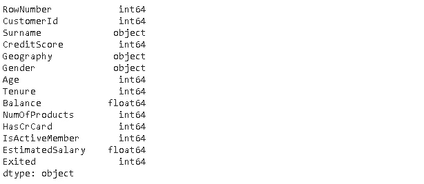

数据类型是适当的。下一步是去掉多余的特性。“RowNumber”列只是一个索引。“客户 Id”和“姓氏”列对于机器学习模型来说显然是无用的。因此，我们应该放弃它们。

```
df.drop(['RowNumber','CustomerId','Surname'], axis=1, inplace=True)
```

我们只是传递要删除的标签列表。**轴**参数告诉 drop 函数我们是删除行(0)还是列(1)。将**原位**参数设置为真以保存更改。

# **更精彩的部分！**

现在是时候深入研究数据集了。

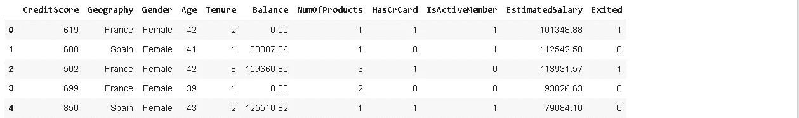

让我们看看“性别”和“地理位置”与客户流失有什么关系。一种方法是使用熊猫的 **groupby** 功能。

```
df[['Geography','Gender','Exited']].groupby(['Geography','Gender']).agg(['mean','count'])
```

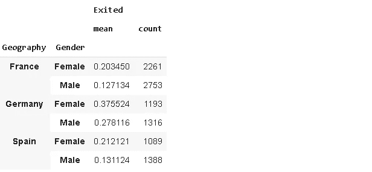

**发现**:一般来说，女性比男性更容易“退出”。德国的离职率高于法国和西班牙。

EDA 过程中的另一个常见做法是检查变量的分布。分布图、直方图和箱线图让我们了解变量(即特征)的分布。

```
fig , axs = plt.subplots(ncols=2, figsize=(12,6))fig.suptitle("Distribution of Balance and Estimated Salary", fontsize=15)sns.distplot(df.Balance, hist=False, ax=axs[0])sns.distplot(df.EstimatedSalary, hist=False, ax=axs[1])
```

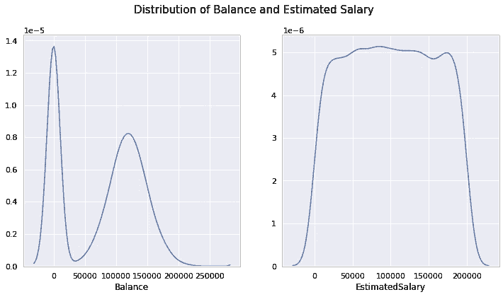

大多数客户的余额为零。对于剩余的客户，“余额”具有正态分布。“估计销售额”似乎是均匀分布的。

由于有许多客户的余额为零，我们可以创建一个新的二元特征来指示客户的余额是否为零。熊猫的**功能将在哪里完成这项工作。**

```
df['Balance_binary'] = df['Balance'].where(df['Balance'] == 0, 1)df['Balance_binary'].value_counts()
1.0    6383 
0.0    3617 
Name: Balance_binary, dtype: int64
```

大约三分之一的客户余额为零。让我们看看零平衡对搅动的影响。

```
df[['Balance_binary','Exited']].groupby('Balance_binary').mean()
```

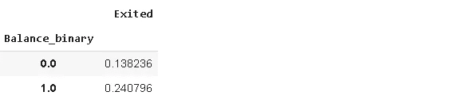

**发现**:余额为零的客户不太可能流失。

另一个需要检查的重要统计数据是变量之间的相关性。

**相关性**是每个变量的标准差对协方差的归一化。协方差是一个定量的度量，表示两个变量的变化彼此匹配的程度。更具体地说，协方差比较两个变量与它们的均值(或期望值)的偏差。

通过检查相关性，我们试图找出两个随机变量如何相似地偏离它们的均值。

pandas 的 **corr** 函数返回一个相关矩阵，表示数值变量之间的相关性。然后我们可以将这个矩阵绘制成热图。

如果我们将“性别”栏中的值转换成数字就更好了，这可以通过熊猫的**替换**功能来实现。

```
df['Gender'].replace({'Male':0, 'Female':1}, inplace=True)corr = df.corr()plt.figure(figsize=(12,8))sns.heatmap(corr, cmap='Blues_r', annot=True)
```

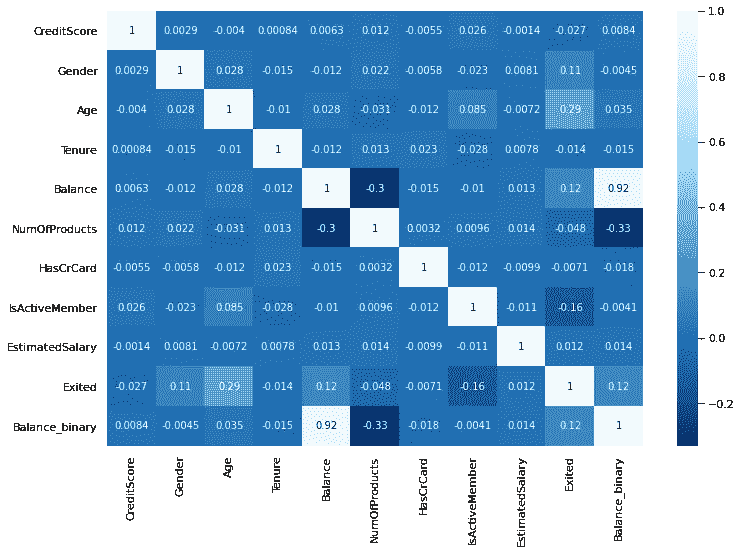

相关矩阵

**发现**:“年龄”、“余额”和“性别”栏与客户流失(“退出”)正相关。成为活跃会员(“IsActiveMember”)与客户流失之间存在负相关关系。

如果你比较“Balance”和“Balance_binary”，你会注意到一个非常强的正相关性，因为我们是基于另一个创建的。

因为“年龄”被证明具有最高的相关值，所以让我们更深入地研究一下。

```
df[['Exited','Age']].groupby('Exited').mean()
```

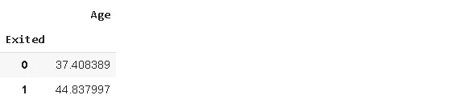

顾客的平均年龄更高。我们还应该检查“年龄”一栏的分布情况。

```
plt.figure(figsize=(6,6))plt.title("Boxplot of the Age Column", fontsize=15)sns.boxplot(y=df['Age'])
```

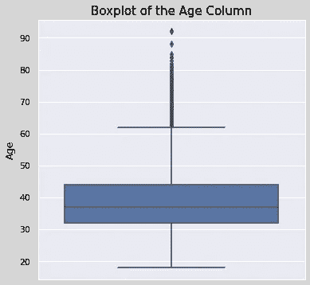

上线以上的点表示异常值。因此，在上端有许多异常值。另一种检查异常值的方法是比较平均值和中值。

```
print(df['Age'].mean())
38.9218print(df['Age'].median())
37.0
```

平均值高于符合箱线图的中值。有许多不同的方法来处理异常值。它可以是一整篇文章的主题。

这里做一个简单的。我们将删除前 5%的数据点。

```
Q1 = np.quantile(df['Age'],0.95)df = df[df['Age'] < Q1]df.shape
(9474, 14)
```

第一行查找区分前 5%的值。在第二行中，我们使用这个值来过滤数据帧。原始数据帧有 10000 行，因此我们删除了 526 行。

请注意，这在许多情况下是不可接受的。我们不能仅仅摆脱行，因为数据是一种有价值的资产，我们拥有的数据越多，我们就能建立更好的模型。我们只是想看看异常值是否对年龄和客户流失之间的相关性有影响。

让我们比较一下新的平均值和中值。

```
print(df['Age'].mean())
37.383681655055945print(df['Age'].median())
37.0
```

他们很亲密。是时候检查一下流失客户和未流失客户的平均年龄差异了。

```
df[['Exited','Age']].groupby('Exited').mean()
```

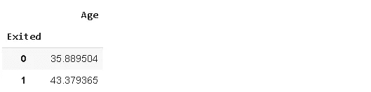

我们的发现仍然适用。顾客的平均年龄更高。

探索性数据分析没有限制。根据我们的任务或目标，我们可以从不同的角度处理数据，并深入挖掘。然而，过程中使用的工具通常是相似的。为了在这个过程中做好，大量练习是非常重要的。

感谢您的阅读。如果您有任何反馈，请告诉我。