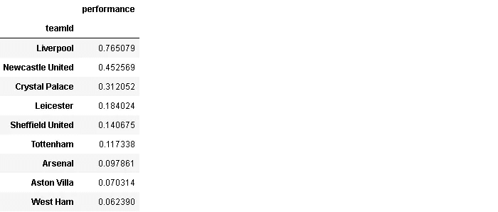

# 探索性数据分析实用指南:英格兰超级联赛

> 原文：<https://towardsdatascience.com/a-practical-guide-for-exploratory-data-analysis-english-premier-league-cac1e2695d30?source=collection_archive---------51----------------------->

## 探索英超 2019-2020 赛季


在 [Unsplash](https://unsplash.com/s/photos/football?utm_source=unsplash&utm_medium=referral&utm_content=creditCopyText) 上由 [Tevarak Phanduang](https://unsplash.com/@namakuki?utm_source=unsplash&utm_medium=referral&utm_content=creditCopyText) 拍摄的照片

每一个机器学习或深度学习模型的燃料都是数据。没有数据，模型是没有用的。在建立模型和训练模型之前，我们应该尝试探索和理解手头的数据。我所说的理解是指数据中的相关性、结构、分布、特征和趋势。对数据的全面理解将非常有助于构建一个稳健且设计良好的模型。我们可以通过研究数据得出有价值的结论。

在本帖中，我将对 Kaggle 上的[英超联赛 2019-2020 赛季数据集](https://www.kaggle.com/idoyo92/epl-stats-20192020)进行探索性的数据分析。

让我们从将数据读入熊猫数据帧开始:

```
import numpy as np
import pandas as pddf_epl = pd.read_csv("../input/epl-stats-20192020/epl2020.csv")print(df_epl.shape)
(576, 45)
```

数据集有 576 行和 45 列。为了能够显示所有的列，我们需要调整 **display.max_columns** 设置。

```
pd.set_option("display.max_columns",45)df_epl.head()
```


它不适合屏幕，但我们可以通过滑动滚动条看到所有的列。该数据集包括 288 场比赛的统计数据。有 576 行，因为每场比赛用两行表示，一行来自主队，一行来自客队。例如，前两行代表“利物浦-诺维奇”比赛。

第一列(“未命名:0”)是多余的，所以我们可以删除它:

```
df_epl.drop(['Unnamed: 0'], axis=1, inplace=True)
df_epl = df_epl.reset_index(drop=True)
```

该数据集包括许多关于游戏的不同统计数据。

*   xG、xGA:团队和对手的预期目标
*   进球，失球:进球和失球
*   xpts，pts:预期和收到的点数
*   赢、平、输:显示游戏结果的二元变量
*   tot_goal，tot_con:从赛季开始的总进球数和失球数

还有一些基本的统计数据，比如射门，命中目标，角球，黄牌，红牌。我们也有关于比赛日期和时间的信息。

先说天:

```
df_epl.matchDay.value_counts()
```


大多数比赛都在周六进行。

我们可以根据到目前为止获得的总分数快速建立排名。tot_points 列中的最大值显示了最新的点:

```
df_epl[['teamId','tot_points']].groupby('teamId').max().sort_values(by='tot_points', ascending=False)[:10]
```


我只展示了前 10 支队伍。如果你是一个足球迷，你可能听说过本赛季利物浦成功称霸英超联赛。利物浦领先 25 分。

技术和数据科学的进步带来了新的足球统计数据。一种相对较新的统计是“预期”统计，如预期目标和预期积分。让我们检查一下期望值和实际值有多接近。有不同的方法来做比较。一种方法是检查差异的分布:

```
#Data visualization libraries
import matplotlib.pyplot as plt
import seaborn as sns
sns.set(style='darkgrid')
%matplotlib inlineplt.figure(figsize=(10,6))
plt.title("Expected vs Actual Goals - Distribution of Difference", fontsize=18)diff_goal = df_epl.xG - df_epl.scoredsns.distplot(diff_goal, hist=False, color='blue')
```


这很像均值接近于零的正态分布。因此，一般来说，期望值非常接近实际值，当然也有一些例外。这些例外正是足球令人兴奋的地方。

我们得到一个类似的期望点和实际点的分布:


预期点数和实际点数之间的差异可能在-3 和+3 之间。分布曲线的尾部再往前一点，就完成了分布曲线。

我不知道预期的进球统计是如何计算的，但它应该多少与射门和射门准确度有关。我们可以使用 pandas 的 **corr** 函数来检查预期目标(xG)和其他一些统计数据之间的相关性。

```
df_epl[df_epl.h_a == 'h'][['xG','HS.x','HST.x','HtrgPerc','tot_goal']].corr()
```


射门和命中目标绝对与预期目标相关。预期进球和球队本赛季迄今为止的进球数之间也存在微弱的正相关关系。

我们也可以通过预期进球和实际进球来了解守门员的表现。如果一支球队的失球比对方球队的预期目标少，这表明守门员表现良好。另一方面，如果一支球队的失球比预期的多，那么守门员的表现就不太好。

```
df_epl['keep_performance'] = df_epl['missed'] / df_epl['xGA']df_epl[['teamId','keep_performance']].groupby('teamId').mean().sort_values(by='keep_performance', ascending=False)[:5]
```


曼城的失球是预期的 2.22 倍，这表明门将表现不佳。这不仅仅是守门员的责任。防守球员在这种情况下也有责任。


另一方面，纽卡斯尔联队和莱斯特队的门将表现出色。

我们还可以检查“比赛日”对球队表现是否有影响。利物浦本赛季只丢了 5 分，所以让我们看看第二支球队曼城。

```
df_epl[df_epl.teamId == 'Man City'][['pts','matchDay']].groupby('matchDay').agg(['mean','count'])
```


看起来曼城不喜欢星期天。周五他们的平均分数是 0 分，但是只有一场比赛，所以我们实际上不能做出真正的判断。

我们来看看平均每场比赛进了多少球。一种方法是将进球和失球相加，然后取平均值:

```
df_epl['goals']= df_epl['scored'] + df_epl['missed']
df_epl['goals'].mean()
2.7222222222222223
```

场均进球数为 2.72。主场球队通常比客场球队得分更多，因此由于体育场内球迷的支持而获得更多积分。

```
df_epl[['h_a','scored','pts']].groupby('h_a').mean()
```


总的来说，主队主宰了比赛。我们也可以从每场比赛的投篮次数上看出这一点。我们来对比一下主队和客场队的射门情况:

```
print("Home team stats \n {} \n".format(df_epl[df_epl.h_a == 'h'][['HS.x','HST.x','HtrgPerc']].mean()))print("Away team stats \n {} \n".format(df_epl[df_epl.h_a == 'a'][['AS.x','AST.x','AtrgPerc']].mean()))
```


主队在投篮次数和投篮命中率上超过了客场队。不过，对于客场球队来说，准确率略好于主场球队。

衡量一个团队表现的一个方法是他们相对于预期的分数获得了多少分。当然，在某些情况下有“运气”的因素，但这是一个有趣的统计。所以，我们来检查一下。我们可以检查实际点数和预期点数之间的差值的平均值。这将显示每个团队在满足期望方面有多成功。

```
df_epl['performance'] = df_epl['pts'] - df_epl['xpts']df_epl[['teamId','performance']].groupby('teamId').mean().sort_values(by='performance', ascending=False)
```



出乎意料


低于预期

利物浦远远超过其他球队，这是有道理的，因为在 29 场比赛中，他们在可能的 87 分中只丢了 5 分。曼城、曼联和切尔西得到一些令人惊讶的结果，因为他们的平均表现低于预期。

一些裁判倾向于比其他人更容易使用黄牌和红牌。我认为球员们会记住这一点。让我们看看每场比赛每位裁判平均有多少张牌:

```
df_epl['cards'] = df_epl['HY.x'] + df_epl['HR.x'] + df_epl['AY.x'] + df_epl['AR.x']df_epl[['Referee.x','cards']].groupby('Referee.x').mean().sort_values(by='cards', ascending=False)[:10]
```


当裁判是米迪恩的时候，球员应该更加小心。

关于球队、球员和裁判的表现，我们可以想出更多的表现指标。我已经试着涵盖了足球中一些有趣的标准。Pandas 为探索性数据分析提供了许多有用且易于使用的功能和方法。可视化也是探索数据的好工具。它们也比数字更有信息量，更容易记忆。

# **关于探索性数据分析的更多信息**

*   [探索性数据分析实用指南](/a-practical-guide-for-exploratory-data-analysis-5ab14d9a5f24)
*   [数据可视化实用指南](/a-practical-guide-on-data-visualization-5c31a0e0fcd5)
*   [数据清理实用指南:肥胖率数据集](/a-practical-guide-for-data-cleaning-obesity-rate-dataset-aff9d12390c8)
*   [熊猫数据分析实用指南](/a-practical-guide-for-data-analysis-with-pandas-e24e467195a9)

感谢您的阅读。如果您有任何反馈，请告诉我。