# 探索性数据分析的实用指南:航班延误

> 原文：<https://towardsdatascience.com/a-practical-guide-for-exploratory-data-analysis-flight-delays-f8a713ef7121?source=collection_archive---------25----------------------->

## 对航班延误的详细分析。


尼尔斯·内德尔在 [Unsplash](https://unsplash.com/s/photos/flight?utm_source=unsplash&utm_medium=referral&utm_content=creditCopyText) 上的照片

我们生活在大数据时代。我们收集了大量数据，这些数据可以推断出有意义的结果，并做出明智的商业决策。然而，原始数据并不能提供太多信息，除非对其进行处理和探索。为了充分利用原始数据，我们需要一个彻底的探索性数据分析过程。即使我们建立了复杂的、结构良好的机器学习模型，我们也不能只是将原始数据转储给它们。模型和我们提供给它们的数据一样好。随着数据量的增加，分析和探索数据变得更加困难。这里有数据分析和可视化工具的力量。

我们将探索一个关于航班延误的数据集，这个数据集可以在 Kaggle 上[这里](https://www.kaggle.com/divyansh22/flight-delay-prediction)找到。有两个数据集，一个包括 2019 年 1 月的航班细节，另一个包括 2020 年 1 月的航班细节。在本帖中，我们将使用 2019 年 1 月的那个。我们从将数据集导入熊猫数据框架开始。

```
import numpy as np
import pandas as pddf = pd.read_csv("/content/Jan_2019_ontime.csv")print(df.shape)df.columns
```

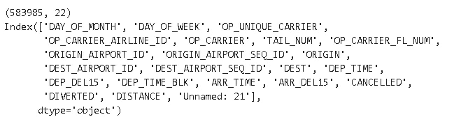

该数据集包含超过 50 万个航班(行)的信息和每个航班的 22 个特征(列)。有些列似乎是多余的或者是重复出现的，所以我们将在分析中包括一些列。

```
df = df[['DAY_OF_MONTH', 'DAY_OF_WEEK', 'OP_CARRIER_AIRLINE_ID', 'ORIGIN', 'DEST','DEP_TIME', 'DEP_DEL15', 'ARR_TIME', 'ARR_DEL15', 'CANCELLED', 'DIVERTED', 'DISTANCE']]df.head()
```

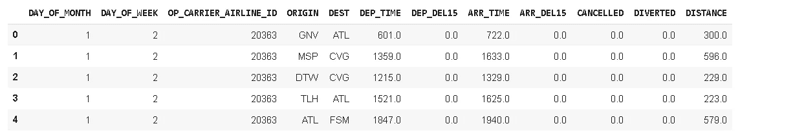

对于每个航班，以下功能可用:

*   一月中的某一天
*   星期几
*   承运航空公司(
*   出发城市和出发时间(出发地，DEP 时间)
*   抵达城市和抵达时间(DEST，ARR_TIME)
*   出发和到达时延迟(DEP_DEL15，ARR_DEL15)
*   取消，转移
*   距离

# **缺失值**

我们首先处理缺失值。首先，让我们检查每一列中缺失值的数量。

```
df.isna().sum()
```

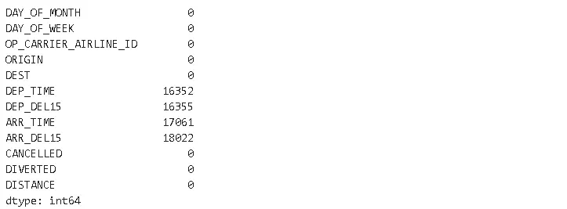

我们在 4 列中缺少值。缺失值的数量接近，因此它们可能在同一行中。为了确认，我们可以使用 **missingno** 模块可视化缺失值。

```
%matplotlib inlineimport missingno as msno
msno.matrix(df)
```

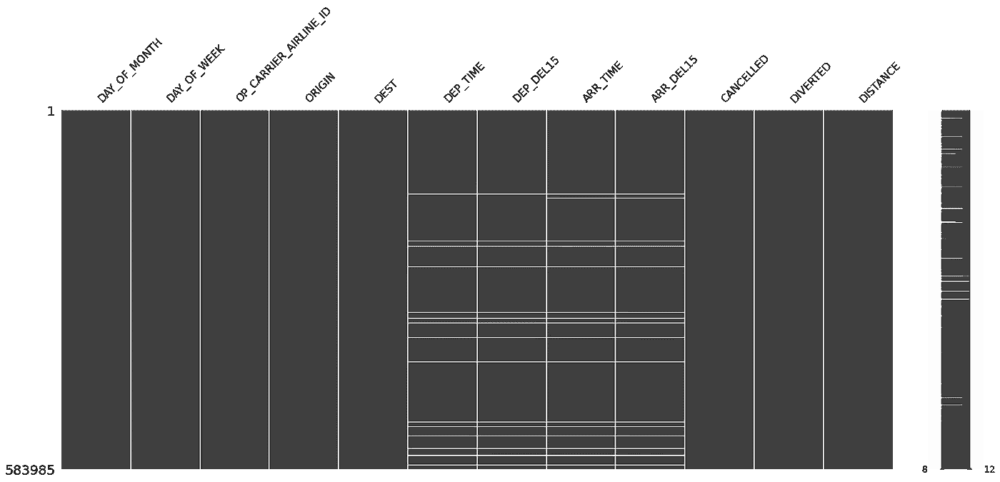

白线表示缺少值。这 4 列中的大多数缺失值都在同一行中。缺少值的行可能属于取消或改道的航班。在处理缺失值之前，让我们检查一下“取消”和“转移”列。

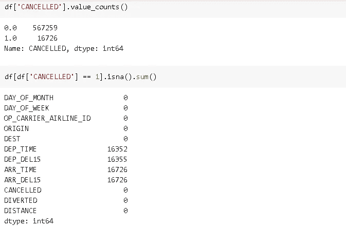

取消航班的数量与航班信息列中缺失值的数量大致相同。

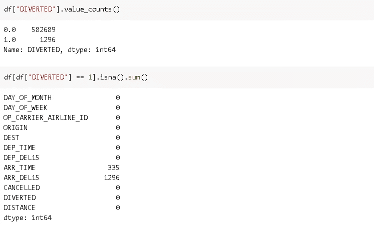

改道的航班也会导致价值缺失。缺失的值是由于航班取消或改道造成的。因此，我们可以放弃它们。

```
df.dropna(axis=0, how='any', inplace=True)
df.isna().sum().sum()
0
```

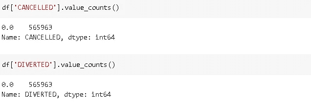

取消和转移列现在充满了零，所以我们也可以删除它们。

```
df.drop(['CANCELLED','DIVERTED'], axis=1, inplace=True)
```

# **延期概述**

表示延迟的列是二进制的，因此航班要么延迟(1)，要么不延迟(0)。

```
df['ARR_DEL15'].value_counts()
```

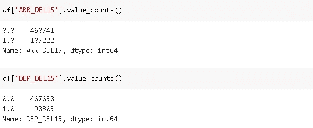

抵达时的延误不仅仅是离开时的延误，这是有道理的，因为离开时的延误很可能导致抵达时的延误。我们可以使用 pandas 的分组功能来比较出发和到达的延误。

```
df[['ARR_DEL15','DEP_DEL15','DEST']].groupby(['DEP_DEL15',
'ARR_DEL15']).count()
```

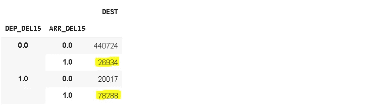

不出所料，如果出发时间延迟，到达时间更有可能延迟。请注意，我们可以使用任何列作为上述语句中的第三列(我选择了“DEST”)。该列的目的只是为了查看计数。

# **出发地和目的地**

始发地列包含出发地点，DEST 列包含目的地地点。让我们看看数据集中有多少个起点和终点。

```
print("There are {} unique origin city".format(df['ORIGIN'].nunique()))print("There are {} unique destination city".format(df['DEST'].nunique()))
```

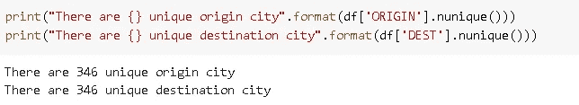

我们可以根据延误率对始发地和目的地进行分类。

```
df[['ORIGIN','DEP_DEL15']].groupby('ORIGIN').agg(['mean','count']).sort_values(by=('DEP_DEL15','mean'), ascending=False)[:10]
```

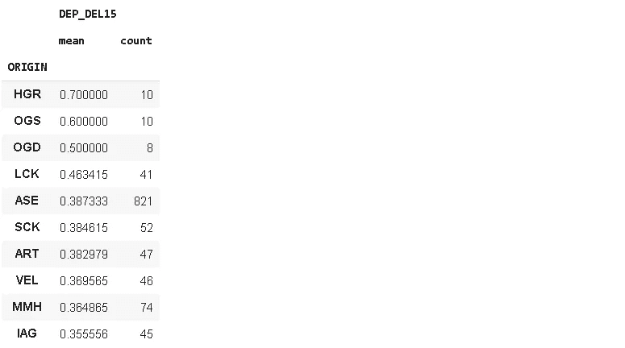

```
df[['DEST','ARR_DEL15']].groupby('DEST').agg(['mean','count']).sort_values(by=('ARR_DEL15','mean'), ascending=False)[:10]
```

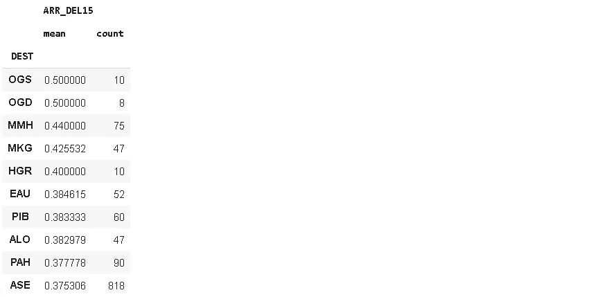

我们根据出发延误率对出发地进行了分类，根据到达延误率对目的地进行了分类。延误率高的地点航班很少。

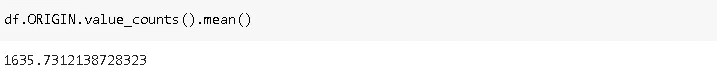

每个地点的平均航班数为 1635 次。那些少于 100 次飞行的可能是异常值，不能给我们一个准确的估计。让我们对超过 500 个航班的始发地进行排序。

```
origin_delays = df[['ORIGIN','DEP_DEL15']].groupby('ORIGIN').agg(['mean','count'])origin_delays[origin_delays[('DEP_DEL15','count')] > 500].sort_values(by=('DEP_DEL15','mean'), ascending=False)[:10]
```

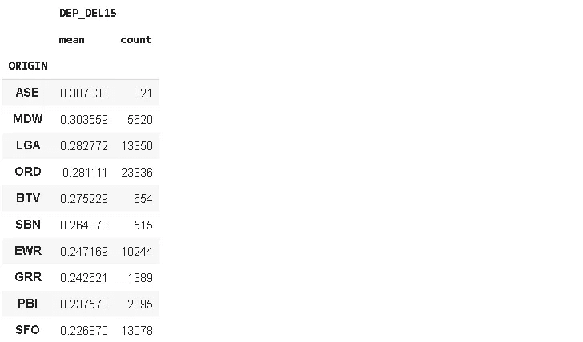

除了迄今为止延迟率最高的“ASE”之外，整个列表都发生了变化。请注意，当我们使用多级索引过滤数据帧时，我们需要使用所有级别。例如，为了根据“计数”过滤上述数据帧，我们使用`origin_delays[(‘DEP_DEL15’,’count’)],` 而不是`origin_delays[‘count’]`。

# **星期几和月份**

该数据集涵盖 2019 年 1 月。我们可以根据一周中的某一天和一月中的某一天来检查延迟率。因为我们不是基于位置检查延误，所以我们可以通过合计出发和到达时的延误来创建一个新列。

```
df['DEL15'] = df['ARR_DEL15'] + df['DEP_DEL15']
```

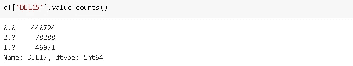

如果出发和到达都有延误,“DEL15”列的值为 2。

让我们从平均延迟的角度来比较一下一周中的每一天。

```
df[['DAY_OF_WEEK','DEL15']].groupby('DAY_OF_WEEK').agg(['mean','count'])
```

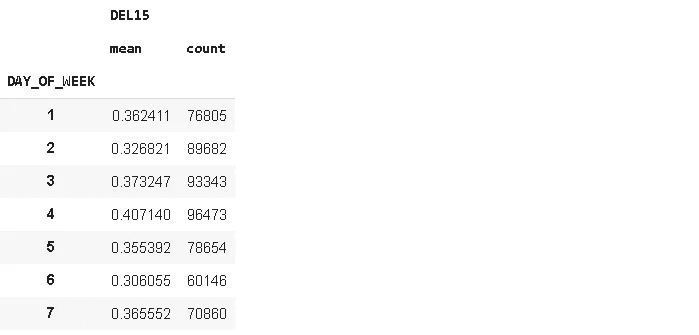

大多数航班在周三和周四，这两天的平均延误率也比其他几天略高。这表明，随着航班频率的增加，延误也会增加。

让我们也检查基于一个月中的某一天列的平均延迟。这次我们将使用 plotly 库的 **plotly express** API 创建一个信息可视化，但是我们首先需要计算每天的平均延迟。

```
day_of_month = df[['DAY_OF_MONTH','DEL15']].groupby('DAY_OF_MONTH').agg(['mean','count'])day_of_month.columns = ['mean','count']
```

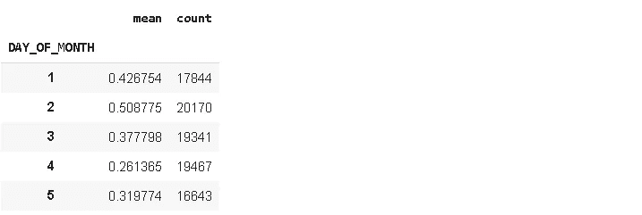

我们现在可以绘制它。

```
import plotly.express as pxfig = px.bar(day_of_month, x=day_of_month.index, y='mean',   color='count', height=400, title="Delays in Jan 2019")fig.show()
```

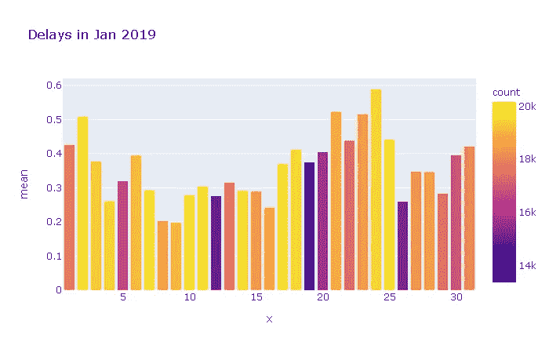

条形的颜色根据右侧的计数刻度指示每天的航班数量。条形的高度显示了延迟比。就天数而言，没有很强的模式，但航班较多的日子往往有较高的延误率。

# **承运航空公司**

航空公司的运营问题也可能导致航班延误。

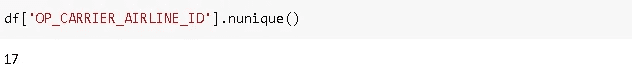

数据集中有 17 种不同的载体。我们首先根据平均延迟对载波进行排序。

```
carrier = df[['OP_CARRIER_AIRLINE_ID','DEL15']].groupby('OP_CARRIER_AIRLINE_ID').agg(['mean','count']).sort_values(by=('DEL15','mean'), ascending=False).reset_index()carrier.columns = ['carrier_ID','mean','count']carrier['carrier_ID'] = carrier['carrier_ID'].astype('object')carrier.head()
```


让我们创建一个类似于我们几天前创建的柱状图。

```
fig = px.bar(carrier, x=carrier.index, y='mean', color='count', height=500, title="Delays of Different Airlines")fig.show()
```

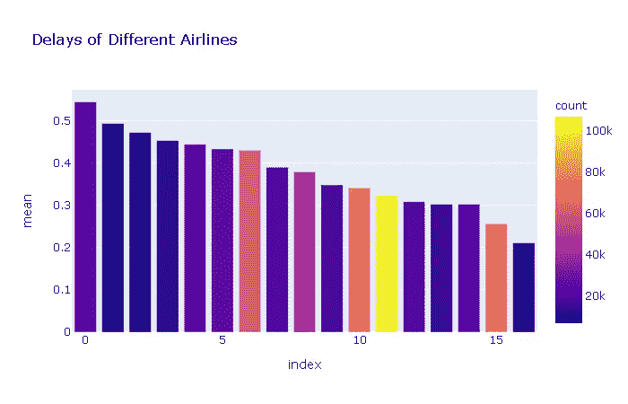

颜色越浅表示航班越多。我们看不到更多航班导致更多延误的趋势。例如，用第二、第三和第四条表示的航空公司在航班数量方面处于最低区域。然而，它们比大多数其他载波具有更高的延迟比。因此，就像航班数量一样，承运人也是延误的决定因素。

我们分析了基于位置、日期和承运人的航班延误。我们的发现是:

*   随着航班频率的增加，我们更有可能看到更多的延误。
*   一些航空公司有更高的延误率，尽管没有比其他航空公司更多的航班。
*   虽然不是非常确定，但是位置也可能对延迟有影响。

该数据集还包括航班的时间和距离信息，这也可能对延误产生影响。可以用类似的方法分析这些柱。探索性数据分析没有限制。根据我们的任务或目标，我们可以从不同的角度处理数据，并深入挖掘。然而，过程中使用的工具通常是相似的。为了更好地掌握这个过程，大量练习是非常重要的。

感谢您的阅读。如果您有任何反馈，请告诉我。