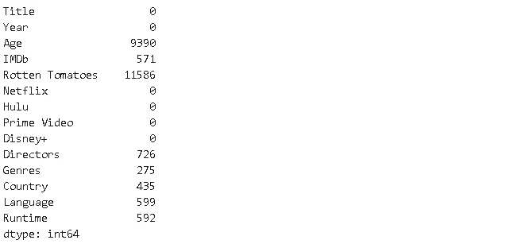

# 探索性数据分析实用指南:流媒体平台上的电影

> 原文：<https://towardsdatascience.com/a-practical-guide-for-exploratory-data-analysis-movies-on-streaming-platforms-5ea494fee9d2?source=collection_archive---------26----------------------->

探索网飞、Hulu、Prime Video 和 Disney+上的电影。


在 [Unsplash](https://unsplash.com/s/photos/netflix?utm_source=unsplash&utm_medium=referral&utm_content=creditCopyText) 上由 [Thibault Penin](https://unsplash.com/@thibaultpenin?utm_source=unsplash&utm_medium=referral&utm_content=creditCopyText) 拍摄的照片

我们生活在大数据时代。我们可以收集大量数据，从而推断出有意义的结果，做出明智的商业决策。为了充分利用数据，需要一个强大而全面的数据分析流程。在本帖中，我们将尝试探索一个关于流媒体平台上电影的数据集。数据可从 Kaggle 上的[这里](https://www.kaggle.com/ruchi798/tv-shows-on-netflix-prime-video-hulu-and-disney)获得。

我们可以直接将 Kaggle 数据集下载到 Google Colab 环境中。以下是如何操作的分步说明:

[](/how-to-use-kaggle-datasets-in-google-colab-bca5e452a676) [## 如何在 Google Colab 中使用 Kaggle 数据集

### 使用 kaggle API 将数据集直接下载到 colab。

towardsdatascience.com](/how-to-use-kaggle-datasets-in-google-colab-bca5e452a676) 

让我们从下载数据集开始，并将其读入熊猫数据帧。

```
import pandas as pd
import numpy as np!kaggle datasets download -d ruchi798/movies-on-netflix-prime-video-hulu-and-disneydf = pd.read_csv("/content/movies-on-netflix-prime-video-hulu-and-disney.zip")df.drop(["Unnamed: 0", "ID", "Type"], axis=1, inplace=True)df.head()
```

“未命名:0”和“ID”列是多余的，因为它们不提供关于电影的任何信息，所以我们删除它们。“类型”栏指示标题是电影还是电视节目。我们删除它们是因为所有的行都包含电影数据。


我们有关于电影的数据和关于它们在流媒体平台上的可用性的信息。还提供了 IMDb 和烂番茄的电影评级。

# **缺失值**

首先处理缺失值是一个好的做法。

```
df.shape
(16744, 14)
```

数据集包括超过 16k 行和 14 列。让我们看看每一列包含多少个缺失值。

```
df.isna().sum()
```



“年龄”和“烂番茄”列中的大部分值丢失。其他一些列也有缺失值。有一个很棒的 python 库来探索数据集中缺少的值，即**没有**缺少的值。我们可以通过绘制缺失值矩阵来了解缺失值在数据集中的分布情况。

```
import missingno as msno%matplotlib inlinemsno.matrix(df)
```


白线表示缺少值。不出所料,“年龄”和“烂番茄”列中缺少值。有趣的模式是，其他列中缺少的值大多是匹配的。行或者没有缺失值，或者在多列中有缺失值。此外，有缺失值的行数比没有缺失值的行数少得多。因此，我们可以删除包含任何缺失值的行。请注意，我们不能总是删除丢失的值。在某些情况下，我们不能放弃它们。相反，我们需要找到一种方法来填充缺失的值。这在很大程度上取决于我们正在进行的任务。

```
df.drop(['Age', 'Rotten Tomatoes'], axis=1, inplace=True)df.dropna(axis=0, how='any', inplace=True)df.isna().sum().sum()
0df.shape
(15233, 12)
```

我们已经丢失了大约 9%的行。数据集现在没有任何缺失值。

# **概述**

我们先来看电影内部的语言分布。我们将使用最近发布的名为 **sidetable** 的 pandas 实用程序库。Sidetable 基于选定的列创建频率表。这是一种改进版本的**值计数**功能。如果你想了解更多关于 sidetable 的信息，你可以访问下面的帖子:

[](/pandas-sidetable-just-announced-708e5f65938f) [## 熊猫侧桌刚刚宣布

### 对数据框架的信息丰富、见解深刻的概述。

towardsdatascience.com](/pandas-sidetable-just-announced-708e5f65938f) 

```
!pip install sidetable
import sidetabledf.stb.freq(['Language'], thresh=.8)
```


英语电影遥遥领先。有 10300 部英语电影，占整个数据集的 67%。9 种语言主导了几乎 80%的电影。

IMDb 评级是一部电影非常重要的标准，因为许多人根据 IMDb 评级来选择电影观看。让我们看看 IMDb 收视率的分布。

```
df['IMDb'].describe()
```


另一种方法是绘制分布图。

```
plt.figure(figsize=(10,6))
plt.title("Distribution of IMDb Ratings", fontsize=15)
sns.distplot(df['IMDb'])
```


大多数电影的平均评分在 5.89 左右，在 5 到 8 之间。我们还在高值和低值上都看到了较少数量的极值。

如果你喜欢看电影，你可能有一个最喜欢的导演。我们可以查看董事的平均 IMDb 评级。

```
df[['IMDb','Directors']].groupby('Directors').agg(['mean','count']).sort_values(by=('IMDb','mean'), ascending=False)[:10]
```


这是 IMDb 收视率最高的 10 位导演。然而，他们都只有一部电影，我认为这不足以做出真实的评价。我们改成对至少有 5 部电影的导演进行排名吧。

```
directors = df[['IMDb','Directors']].groupby('Directors').agg(['mean','count'])directors[directors[('IMDb', 'count')] > 5].sort_values(by=('IMDb','mean'), ascending=False)[:10]
```


# **流媒体平台**

数据集中包含的平台有网飞、Hulu、Prime Video 和 Disney+。有些电影只能在其中一个平台上观看，而有些电影可以在多个平台上观看。让我们看看每个平台有多少部电影，以及平台的平均 IMDb 评分。

```
df[['IMDb','Netflix']].groupby(['Netflix']).agg(['mean','count'])
```


网飞有 3152 部电影，平均 IMDb 评分为 5.8 分。我们可以创建一个 for 循环并将结果保存到一个字典中，然后从该字典创建一个 dataframe，而不是逐个检查。

```
streams = ['Netflix', 'Hulu', 'Prime Video', 'Disney+']
dict_a = {}for stream in streams:
    a = df[['IMDb', stream]].groupby([stream]).agg(['mean',
        'count']).iloc[1,:].values dict_a[stream] = a df_stream = pd.DataFrame(dict_a, 
                index=['Avg_IMDb','Number of Moviews'])df_stream
```

我们取 groupby 函数返回的第二行，因为第二行包含该平台上可用电影的数据(1)。然后，该行被保存在一个字典中，其中有一个键是平台的名称。字典完成后，它被转换成数据帧。


Prime Video 拥有迄今为止最多的电影和最低的平均 IMDb 评分。我认为这表明 Prime Video 对内容不是很挑剔。迪士尼+在 IMDb 的平均评分最高，紧随其后的是网飞。

# **国家**

技术和流媒体平台的进步使我们有可能观看来自世界各地的电影。由于不同国家的口味和偏好不同，流媒体平台通常会根据国家的不同而改变其内容。看看哪些国家的内容最丰富。

```
df.stb.freq(['Country'], thresh=.75)
```


美国遥遥领先，超过 50%。

# **运行时**

虽然有一些例外，但电影的长度通常在 1.5 到 2 小时之间。我们来看看运行时的分布。

```
plt.figure(figsize=(10,6))
plt.title("Movie Length Distribution", fontsize=15)
sns.distplot(df.Runtime)
```


我们看到一个平均值约为 90 分钟的正态分布。

```
df.Runtime.describe()
```


平均是 94 分钟。我们还看了一部 1 分钟长的电影，这一定是个错误。让我们看看这些电影是什么。

```
df.query('Runtime > 300 or Runtime < 2')
```


卡斯特的最后一站实际上是 328 分钟长，但另一个当然不是 1 分钟。


我想知道这部电影的长度和 IMDb 的收视率之间是否有关联。我们可以用熊猫的`corr`功能来查。

```
df[['IMDb','Runtime']].corr()
```


IMDb 等级和运行时间之间没有显著的相关性。

我们已经尝试从几个不同的角度处理数据集，但是探索性数据分析过程没有限制。根据我们的需要，我们可以从特定的角度来处理数据框架。然而，技术和操作通常是相同的。因此，最好使用不同种类的数据集进行练习。

感谢您的阅读。如果您有任何反馈，请告诉我。