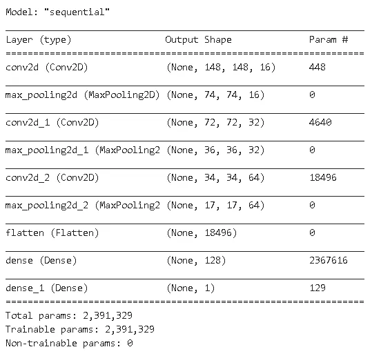

# 带有 Keras 的卷积神经网络实用指南

> 原文：<https://towardsdatascience.com/a-practical-guide-on-convolutional-neural-networks-cnns-with-keras-21421172005e?source=collection_archive---------47----------------------->

## 理论解释和实际例子


马库斯·斯皮斯克在 [Unsplash](https://unsplash.com/s/photos/guide?utm_source=unsplash&utm_medium=referral&utm_content=creditCopyText) 上的照片

卷积神经网络通常用于数据科学领域，尤其是计算机视觉和图像分类任务。考虑一个图像分类任务。图像由用数字表示的像素组成。在 CNN 的卷积层中，滤波器(或特征检测器)被应用于图像，以通过保持像素之间的空间关系来提取图像的独特特征。

卷积运算如下进行:


我们有一个 10x10 的图像和一个 3x3 的过滤器。过滤器从黄色标记的位置开始，扫描图像并创建特征图。在每一步，计算图像像素和滤波器的点积，并将结果标量放入特征图的相应位置。

> **步幅**参数控制滤镜的移动。当跨距为 1 时，过滤器每次移动 1 个像素。

过滤器的目标是保持像素的空间关系，因此它需要看到左侧、右侧、上方和底部的像素。因此，对于 3×3 滤波器，我们从第二行第二列的像素开始。第一行和最后一行上的像素以及第一列和最后一列上的像素不能是特征地图的一部分，因为它们没有上下左右相邻像素。


这就是生成的特征图是 8×8 的原因。如果我们应用一个 5x5 的过滤器，特征图就变成了 6x6。

> 如果我们想保留边界上的像素，我们可以使用**填充**并在图像周围添加零。


用零填充的 10x10 图像。生成的图像为 12x12。

在卷积层中，不仅仅使用一个过滤器。许多不同的过滤器被应用于图像。每个过滤器旨在捕捉不同的特征，如边缘、水平线等。

图像是高度非线性的，所以我们需要增加卷积层的非线性。在卷积层中，应用**整流器函数**来增加图像中的非线性。整流器功能充当额外的滤波器来分解线性。


卷积层

然后，我们有**池**层，它减少了特征地图的大小，同时保持图像的保留特征。


2x2 盒子的最大池

在池层中，捕获一个具有指定大小的框，并获取该框中的最大值。这是最大池。我们也可以取盒子里数值的和或平均值。该框扫描整个特征地图。上图显示的是带有 2x2 方框的 max pooling 图层，因此要素地图的大小缩小为 4x4。

联营的优势:

*   在保留特征的同时减小尺寸
*   删除不重要的部分
*   引入空间方差
*   减少特征的数量，从而降低过度拟合的风险

> 在卷积神经网络中，根据任务的复杂程度，有多个卷积层和池层。

现在，我们需要展平合并的要素地图，以便将其提供给完全连接的图层。在展平步骤之后，卷积神经网络的剩余部分的结构就像前馈神经网络一样。展平步骤非常简单。


展平后得到的阵列被用作一个**密集**层的输入。汇集的要素地图被展平，并通过密集图层传送。卷积神经网络的典型结构是:


[图来源](https://en.wikipedia.org/wiki/Convolutional_neural_network#/media/File:Typical_cnn.png)

请注意，子采样用于池化。这个卷积神经网络有两个卷积层和两个池层。

我们来看一个真实的例子。

# **建立 CNN 对图像进行分类**

我们将使用来自 Caltech101 数据集的摩托车和飞机图像。这是训练和测试 CNN 的一个很好的数据集。非常感谢社区准备并让我们使用这个数据集。

我们将使用 Keras，这是一个基于 TensorFlow 构建的高级深度学习库。让我们从基本的导入开始:

```
import numpy as np
import tensorflow as tftf.__version__
'2.2.0-rc3'
```

我们将使用谷歌 colab 环境来完成这项任务。我把照片保存到了我的谷歌硬盘里。为了从 colab 直接访问驱动器中的文件，我们只需要导入驱动器:

```
from google.colab import drive
drive.mount('/content/gdrive')
```

这将提示我们通过复制粘贴链接来批准。然后我们就可以轻松访问 google drive 里的文件了。

让我们使用 matplotlib 检查几张图像:

```
import matplotlib.pyplot as plt
import matplotlib.image as mpimg%matplotlib inline
```

图像只是 2D(黑白)和 3D(彩色)中的数字阵列。除了看图像的样子，我们还应该检查图像的结构。

```
img = mpimg.imread('/content/gdrive/My Drive/airplane_motorbike/train/airplanes/image_0001.jpg')type(img)
numpy.ndarrayimg.shape
(164, 398, 3)
```

前两个维度显示像素网格的大小，第三个维度指示它是彩色的还是灰度的。所以这个图像是一个 164x398 像素的彩色图像。如果最后一个维度为 1，则图像为灰度。让我们看看它是什么样子的:

```
imgplot = plt.imshow(img)
```


让我们再来看一张摩托车的图片:

```
img2 = mpimg.imread('/content/gdrive/My Drive/airplane_motorbike/train/motorbikes/image_0001.jpg')print(img2.shape)
(161, 262, 3)imgplot = plt.imshow(img2)
```


你可能已经注意到像素的数量是不同的。摩托车图像的形状是(161，262，3)，而飞机图像的形状是(164，398，3)。这些图像必须与 CNN 中使用的形状相同。我们可以手动调整尺寸，但这是一项繁琐的任务。

我们可以使用 Keras 的图像预处理类 **ImageDataGenerator** 。我们只需要在一个文件夹结构中组织图像，ImageDataGenerator 将处理其余的工作:


文件夹结构

ImageDataGenerator 通过实时数据扩充生成批量张量图像数据。ImageDataGenerator 通过成批应用随机选择和变换(如旋转和移动)来创建许多批图像。所以它增加了数据集的多样性。数据扩充增加了数据的多样性，这是非常有用的，尤其是当图像的数量有限时。增加数据集的多样性有助于获得更准确的结果，还可以防止模型过度拟合。

图像在“飞机”和“摩托车”文件夹中。我把每个类别的 640 张图片放在 train 文件夹中，160 张图片放在 validation 文件夹中。让我们为训练和验证实现 ImageDataGenerator 对象:

```
from tensorflow.keras.preprocessing.image import ImageDataGeneratorimport os
```

我们首先为训练集和验证集创建 ImageDataGenerator 对象:


我们传入 rescale 参数来归一化[0，1]范围内的像素值。数据规范化是神经网络中的一项基本实践。

然后，我们指出包含图像的文件的路径:


然后，我们创建训练和验证生成器:


我们使用了 **flow_from_directory** 方法。另一种选择是使用**流量**方法。在 [keras 文档](https://keras.io/preprocessing/image/)中详细解释了每种方法的细节。

让我们检查一下参数。第一个是我们在上一步中已经创建的文件路径。**目标尺寸**表示结果图像的尺寸。训练和验证生成器会将所有图像的大小调整为 150x150 像素。 **Batch_size** 是一批图像的数量。 **class_mode** 是二进制的，因为我们有两个类。正如我们在输出中看到的，train 文件夹中有 1280 个图像，validation 文件夹中有 320 个图像，属于两个类。

是时候建立我们的模型了:


我们有 3 个卷积层和一个池层紧接着每个卷积层。在第一个卷积层，我们定义了过滤器的数量和过滤器的大小。我选择使用 16 个大小为 3x3 的滤镜。然后我们定义**激活函数**为 relu。对于第一个卷积层，我们还需要定义**输入形状**，因为模型不知道我们图像的大小。对于池层，我们只需要指定用于池的盒子的大小。

对于其他卷积层，我们遵循相同的过程。唯一的区别是，我们不必指定输入形状，因为模型将从上一层的输出中知道输入。

> 仅第一个卷积图层需要 Input_shape。

然后我们有**展平**层来展平合并的特征地图。展平的特征地图被输入到一个**密集**层。然后我们有一个输出层。

> 重要的是要注意，没有严格的规则来确定滤波器的数量、滤波器的大小、层中神经元的数量等等。这些参数的值根据经验或反复试验来调整。您可以调整并尝试不同的值。

我们刚刚建立了一个 CNN 模型。使用**总结**方法查看模型概述:

```
model.summary()
```



输入图像的尺寸为 150x150。我们使用 3×3 的过滤器，所以特征图的大小是 148×148。在第一个池层中，大小减少了一半。在每个卷积池图层对中，尺寸会减小，但图像中的特征会保留。在这个模型中，我们有超过 200 万个参数要训练，这是一个很大的数目。这是一个简单的图像分类任务。想象一下在非常复杂的任务中训练模型所使用的参数的数量。

现在是编译模型的时候了:


我们需要指定**损失函数**、**优化器**和**度量**来评估性能。对于损失函数，可以使用二元交叉熵，因为这是二元分类任务。Keras 中有很多[优化器，常用的有](https://keras.io/optimizers/)、 **RMSprop** 和**亚当**优化器。我们使用的衡量标准是准确性。

我们完成了图像的预处理，模型的建立和编译。现在，我们可以将数据拟合到模型中并对其进行训练:


我们使用之前创建的 ImageDataGenerator 对象作为训练集和验证集。 **Steps_per_epoch** 参数是图像数量除以批量大小。 **Validation_steps** 使用验证集中的图像数量和批量大小进行类似计算。当模型通过整个训练集时，一个**时期**完成。我使用 5 个历元，但是你可以改变它，看看它如何影响精度。让我们看看结果:


该模型在训练集上有 99.69%的准确率，在测试集上有 99.37%的准确率，这是一个很好的结果。请记住，这是一个简单的图像分类任务。我们将处理更复杂的任务。但是，后面构建网络和逻辑的方式是一样的。因此，如果我们很好地学习基础知识，我们可以很容易地适应更复杂的任务。

感谢您的阅读。如果您有任何反馈，请告诉我。

# **参考文献**

*   By Aphex34 —自己的作品，CC BY-SA 4.0，[https://commons.wikimedia.org/w/index.php?curid=45679374](https://commons.wikimedia.org/w/index.php?curid=45679374)
*   长度飞飞、r .弗格斯和 p .佩罗娜。*从少量训练示例中学习生成视觉模型
    :在
    101 个对象类别*上测试的增量贝叶斯方法。IEEE。CVPR 2004，基于视觉的生成模型研讨会。2004