# 数据可视化实用指南

> 原文：<https://towardsdatascience.com/a-practical-guide-on-data-visualization-5c31a0e0fcd5?source=collection_archive---------46----------------------->

## 一张图胜过千言万语

我们生活在大数据时代。我们可以收集大量数据，从而推断出有意义的结果，做出明智的商业决策。然而，随着数据量的增加，分析和探索数据变得更加困难。当有效和恰当地使用时，可视化是探索性数据分析的伟大工具。可视化也有助于向你的观众传递信息，或者告诉他们你的发现。没有一种通用的可视化方法，因此某些任务需要不同类型的可视化。在本帖中，我们将介绍如何创建基本情节并有效地使用它们。

我们需要一个样本数据框架来工作。在本帖中，我们将使用两个不同的数据集，它们都可以在 Kaggle 上找到。第一个是[电信客户流失](https://www.kaggle.com/blastchar/telco-customer-churn)数据集，另一个是[美国汽车数据集。](https://www.kaggle.com/doaaalsenani/usa-cers-dataset)

```
import pandas as pd
import numpy as npdf = pd.read_csv("Projects/churn_prediction/Telco-Customer-Churn.csv")df.shape
(7043, 21)
```

数据集包括 21 列。“流失”列指示客户是否流失(即离开公司)，其余列包括关于客户或客户拥有的产品的信息。

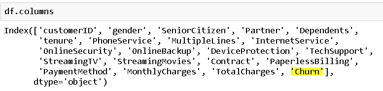

**注意**:有很多工具和软件包可以创建很棒的可视化效果。在这篇文章中，我将使用两个最常见的 matplotlib 和 seaborn。只要你得到你想要的，随便使用任何包装。

```
import matplotlib.pyplot as plt
import seaborn as snssns.set(style="darkgrid")%matplotlib inline
```

%matplotlib inline 命令允许渲染笔记本中的图形，以便我们可以立即看到它们。

在开始创建可视化之前，我想强调一点。可视化数据的主要目标是探索和分析数据或解释结果和发现。当然，我们需要注意人物看起来如何，并努力创造有吸引力的人物。然而，没有任何信息力量的非常漂亮的可视化在数据分析中是无用的。让我们从记住这一点开始。

这个数据集的主要对象是客户流失。因此，最好检查一下这个变量的样子:

```
plt.figure(figsize=(8,5))sns.countplot('Churn', data=df)
```

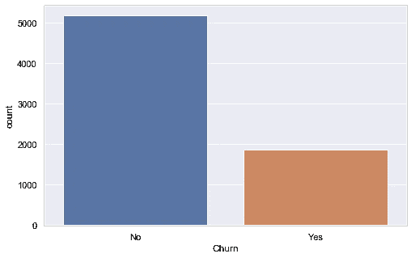

我们用 matplotlib 后端创建了一个指定大小的图形对象。然后，使用 seaborn 添加了一个 countplot。这个数字显然告诉我们，该公司善于留住客户，因为流失率实际上很低。

这个数字简单明了。让我们给它增加一些信息的力量。我们可以根据“老年人”和“性别”栏看到客户流失的变化:

```
sns.catplot('Churn', hue='SeniorCitizen', 
            col='gender', kind='count', 
            height=4, aspect=1, data=df)
```

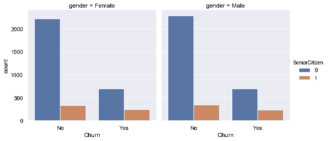

性别似乎没有改变流失率，但老年人和非老年人之间存在差异。老年人更有可能流失。我们可以通过以这种方式尝试其他列来扩展我们的分析。

另一种探索数据的方法是检查变量的分布，这给我们一个关于分布和密度的概念。让我们检查一下“任期”和“每月收费”功能。

```
fig, axs = plt.subplots(ncols=2, figsize=(10,6))sns.distplot(df.tenure, ax=axs[0]).set_title("Distribution of Tenure")sns.distplot(df.MonthlyCharges, ax=axs[1]).set_title("Distribution of MonthlyCharges")
```

我们用两个支线剧情创建了人物对象。然后，使用 seaborn 创建分布图。我们还使用 **set_title** 添加了标题:

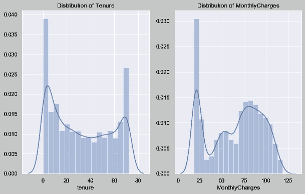

任期变量表示客户成为客户的时间(以月为单位)。大多数顾客都是新顾客，或者是老顾客了。月度电荷变量呈现出奇怪的分布，但在最低量上可以看到高密度。

另一种了解数据分散性的方法是**箱线图**。

```
plt.figure(figsize=(10,6))sns.boxplot(x="Contract", y="MonthlyCharges", data=df)
```

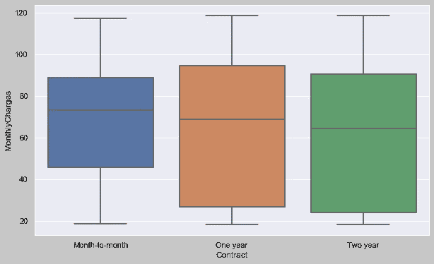

方框中的线代表中间值。方框的下边缘和上边缘分别显示第一和第三分位数。所以，高的方框表示数值更加分散。从这个情节中我们可以理解:

*   短期合同的价格范围较小
*   随着合同期的延长，月费趋于减少

第二数据集相对于目标变量是不同的。流失是一个分类变量，它使任务成为一个分类，而价格是连续的，我们需要解决一个回归问题来预测价格。

删除冗余列后，cars 数据集如下所示:

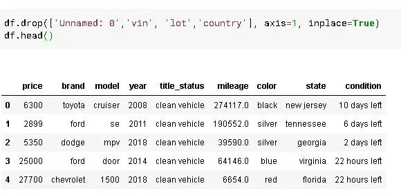

让我们看看里程和价格是如何关联的:

```
sns.relplot(x="price", y="mileage", hue="brand", data=df,
           height=6, aspect=1.2)
```

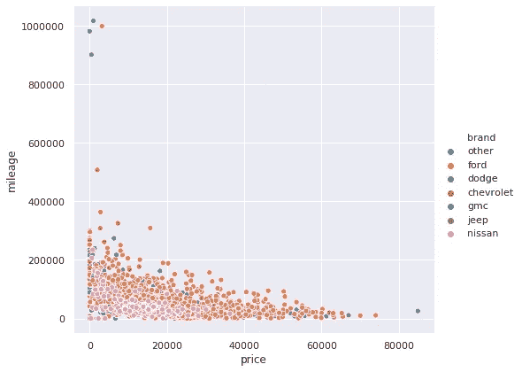

不出所料，价格和里程是负相关的。另一个值得注意的是“尼桑”汽车。与其他品牌相比，它们位于低价位——低里程区域。

让我们来看看价格的分布:

```
plt.figure(figsize=(10,6))sns.distplot(df['price']).set_title('Distribution of Car Prices')
```

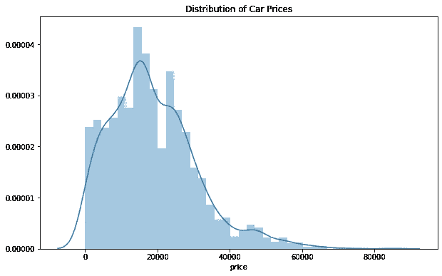

价格变量不是正态分布的。它是右偏的，意味着分布的尾部右侧比左侧长。另一种证明偏度的方法是比较平均值和中位数。如果平均值高于中值，则分布是右偏的。Mean 是平均值，median 是中间的值。因此，如果平均值高于中位数，我们有更多的样本在中位数的上边。

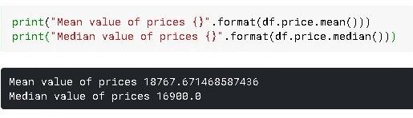

如预期的那样，平均值高于中值。所以，昂贵的汽车比便宜的汽车多。

现在我想展示两种相关的可视化类型:散点图和点状图。**散点图**通过分散数据点显示两组数据之间的关系。**点阵图**显示点估计值和置信区间。所以，这是一种基于散点图的估计。如 seaborn 文档中所述，“点阵图通过散点图点的位置来表示对数值变量的集中趋势的估计，并使用误差线来提供该估计周围的不确定性的一些指示”。让我们来看一个例子，让这个概念更清楚:

```
#Scatter plot
plt.figure(figsize=(12,8))
sns.scatterplot(x="age", y="mileage", data=df).set_title("Scatter plot")#Point plot
plt.figure(figsize=(12,8))
sns.pointplot(x="age", y="mileage", data=df).set_title("Point plot")
```

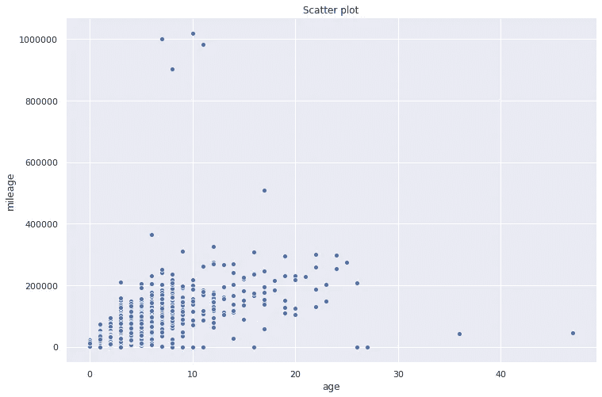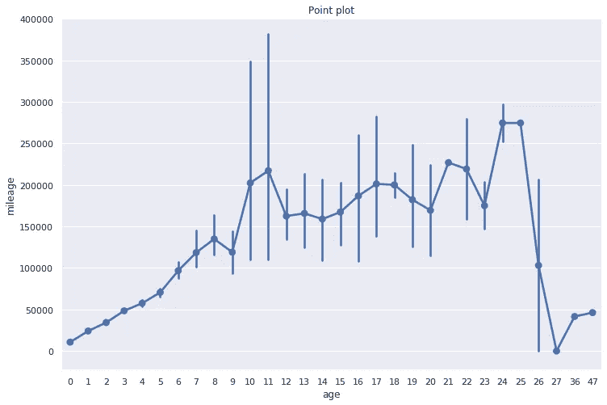

点图上条形的长度与不确定性成正比。如果我们比较两个图，我们会发现散点图点密集的区域中的条形较短。

还有许多不同的可视化类型。根据任务的不同，不同的选项可能更合适。还有动态图，通常是时间序列分析的更好选择。所有可视化的共同点是，它们都是探索性数据分析和数据科学讲述部分的伟大工具。

# **关于探索性数据分析的更多信息**

*   [探索性数据分析实用指南](/a-practical-guide-for-exploratory-data-analysis-5ab14d9a5f24)
*   [一个完整的熊猫指南](/a-complete-pandas-guide-2dc53c77a002)
*   [机器学习指南—边做边学](/machine-learning-guide-learning-by-doing-afe732afde39)

感谢您的阅读。如果你有任何问题，请让我知道。