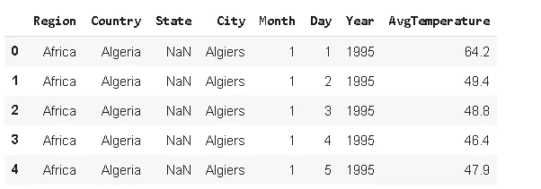
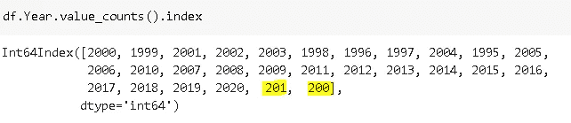
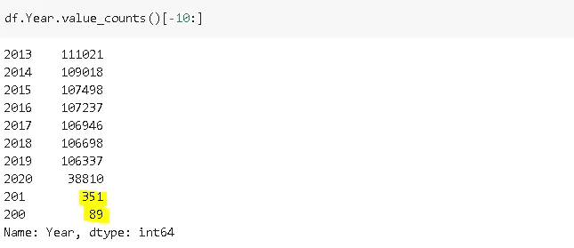
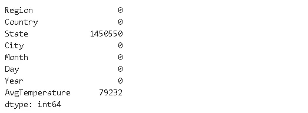
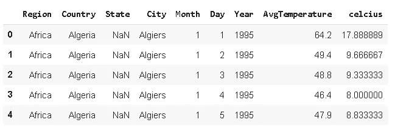
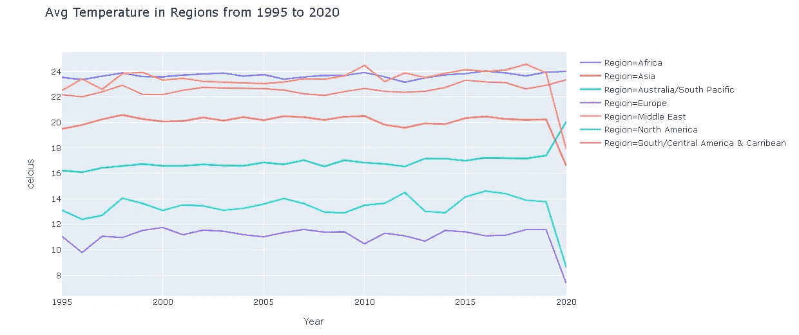
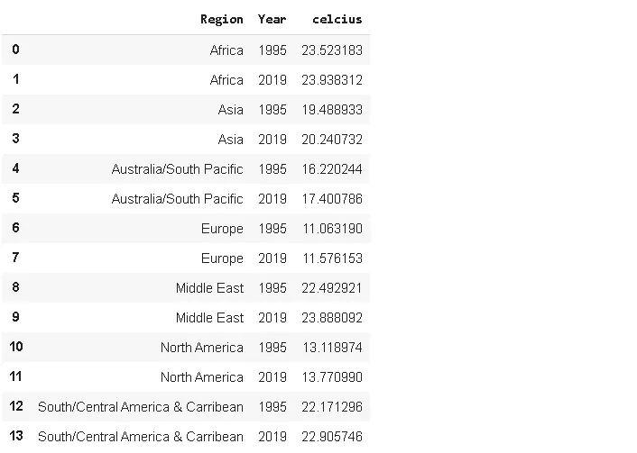
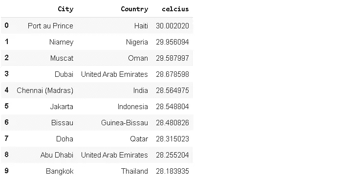
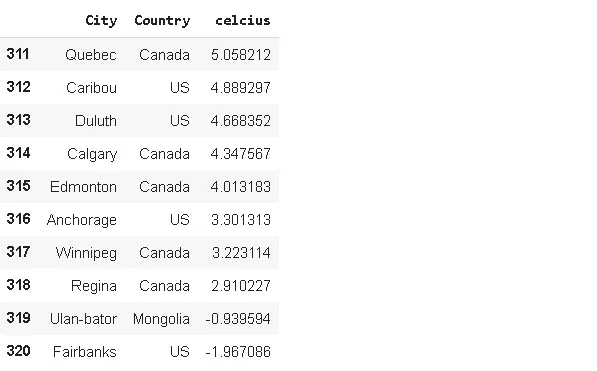

# 探索性数据分析实用指南:城市的历史温度

> 原文：<https://towardsdatascience.com/a-practical-guide-on-exploratory-data-analysis-historical-temperatures-of-cities-e4cb0ca03e07?source=collection_archive---------54----------------------->

## 全球变暖是真的吗？


玛格达莱娜·库拉·曼切在 [Unsplash](/s/photos/global-warming?utm_source=unsplash&utm_medium=referral&utm_content=creditCopyText) 上的照片

我最近在 Kaggle 上发现了一个有趣的[数据集](https://www.kaggle.com/sudalairajkumar/daily-temperature-of-major-cities)，它包含了 321 个城市从 1995 年到 2020 年的历史气温。我认为在关于全球变暖的讨论中探索这个数据集将是一个很好的实践。你可以在 Kaggle 上的这里访问数据集[。](https://www.kaggle.com/sudalairajkumar/daily-temperature-of-major-cities)

我将使用 python 数据分析库 **pandas** 和基于 plotly javascript (plotly.js)构建的开源绘图库**plotly python**(plotly . py)。

让我们从导入库和将数据集读入 pandas 数据帧开始。当我阅读数据集的描述时，我发现值“-99”被用作温度的缺失值标记。我们可以使用 **read_csv** 函数的 **na_values** 参数将“-99”替换为熊猫的标准缺失值表示，即 NaN。我们也可以在创建数据帧后进行替换，但我认为在读取数据时更容易处理。

```
#Data analysis
import numpy as np
import pandas as pd#Data visualization
import plotly.express as pxdf = pd.read_csv("/content/city_temperature.csv", na_values=[-99])
print(df.shape)
(2906327, 8)df.head()
```



年份范围应该是 1995-2020 年。我们可以使用 **value_counts** 来确认。



我们对“201 年”和“200 年”有些误解。我认为这些只是错别字，代表了很小一部分数据。



这些年的总行数是 440，与 2906327 行相比是非常小的。再者，我们无法知道这些年的真实值是多少。因此，我们可以删除年份为 201 或 200 的行。

```
df = df[df.Year > 1900]
```

让我们也寻找丢失的值。

```
df.isna().sum()
```



“州”列中有许多缺失值是正常的，因为大多数国家没有州的概念。因此，我们将忽略缺失状态。另一个缺少值的列是“AvgTemperature”。数据集的结构是连续的行每天都在变化，因此缺失的温度值可以向前填充。对于缺失的温度，我们将假设日平均温度与前一天相同。如果城市的第一条记录丢失，这种方法的一个缺点就会出现。我们将使用 **fillna** 并将“ffill”传递给**方法**参数。

```
df['AvgTemperature'].fillna(method='ffill', inplace=True)
```

数据集包含“华氏”温度，但我更熟悉“摄氏”值。让我们通过将华氏温度转换为摄氏温度来增加一列。

```
df['celcius'] = (df['AvgTemperature'] - 32) * 5/9
df.head()
```



我们知道，非洲国家总体上气温最高。但是，世界上不同地区之间有很大的差异吗？我们可以使用 **groupby** 函数来查看 1995 年到 2020 年间各地区的平均温度。

```
df[['Region','celcius']].groupby('Region').mean().sort_values(by='celcius', ascending=False)
```


非洲的平均温度大约是欧洲平均温度的两倍。平均值与我们的地理知识相符。随着我们远离赤道，温度会降低。

年度价值如何？全球变暖是真的吗？让我们先看一下各地区的年平均值。

```
df_region = df[['Region','Year','celcius']].groupby(['Region','Year']).mean().reset_index()df_region.head()
```


我们现在可以用线图来显示趋势。

```
fig = px.line(
df_region, x="Year", y="celcius", color='Region',
title='Avg Temperature in Regions from 1995 to 2020')fig.show()
```



所有地区都略有增加。我们忽略 2020 年，因为它还没有完成。看来全球变暖是真的。我们还可以对比 1995 年和 2019 年的平均值。

```
df[df.Year.isin([1995,2019])][['Region','Year','celcius']].groupby(['Region','Year']).mean().reset_index()
```



所有地区的平均气温都上升了。看来全球变暖是真的。

地球形状和运动的一个好处是，不同半球的国家在同一时间有不同的季节。虽然欧洲是冬天，澳大利亚却享受夏天。让我们看看我们是否能在月平均气温中看到这种趋势。

```
df_region2 = df[['Region','Month','celcius']].groupby(['Region','Month']).mean().reset_index()df_region2.head()
```


我们现在有各地区的月平均气温。让我们画出它们。

```
fig = px.line(
df_region2, x="Month", y="celcius", color='Region',
title='Avg Monthly Temperatures in Regions',
width=900, height=400)fig.show()
```


我们确实观察到南北半球不同季节的影响。在一些地区，不同季节的气温变化很大，而非洲和南/中美洲的气温波动不大。这与这些地区的地理位置和面积有关。

一件有趣的事情是检查世界上最热和最冷的城市。以下是最热门的 10:

```
df[['City','celcius','Country']].groupby(['City','Country']).mean().sort_values(by='celcius',ascending=False).reset_index()[:10]
```



你可能会惊讶，最热城市的温度竟然是 30 摄氏度。我们可以通过使用[-10:]选择最后 10 行来查看最冷的 10 行。



大多数最冷的城市在加拿大或美国。

在过去的 25 年里，全世界的平均气温都在上升。全球变暖是科学家一再强调的一个严重问题。正如我们所看到的，真实的测量结果与科学家和研究人员所关心的一致。我们需要认真对待这件事。

感谢您的阅读。如果您有任何反馈，请告诉我。