# 熊猫缺失价值观实用指南

> 原文：<https://towardsdatascience.com/a-practical-guide-on-missing-values-with-pandas-8fb3e0b46c24?source=collection_archive---------32----------------------->

## 处理缺失值的综合指南。


照片由 Zach Lucero 在 Unsplash 上拍摄

缺失值表示我们没有关于特定观察(行)的特征(列)的信息。为什么不直接从数据集中删除那个观察值，然后继续呢？我们可以，但不应该。原因是:

*   我们通常有许多观察特征，所以我们不想仅仅因为一个缺失的特征而失去观察。数据是有价值的。
*   我们通常会有多个观测值缺失。在某些情况下，我们不能从数据集中删除许多观察值。还是那句话，数据是有价值的。

在本帖中，我们将介绍如何检测和处理丢失的值，以及一些需要记住的要点。

帖子的概要:

*   缺少值标记
*   检测缺失值
*   缺少值的计算
*   处理缺失值

一如既往，我们从进口熊猫开始。

```
import numpy as np
import pandas as pd
```

# **缺少值标记**

Pandas 中默认的缺失值表示是 **NaN** ，但是 Python 的 **None** 也被检测为缺失值。

```
s = pd.Series([1, 3, 4, np.nan, None, 8])
s
```

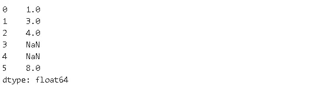

虽然我们用整数创建了一个序列，但是值被向上转换为 float，因为 np.nan 是 float。熊猫 1.0 引入了缺失值的新表示法，即 **< NA >** 。它可以与整数一起使用，而不会导致向上转换。我们需要显式地请求 dtype 为 pd。Int64Dtype()。

```
s = pd.Series([1, 3, 4, np.nan, None, 8], dtype=pd.Int64Dtype())
s
```

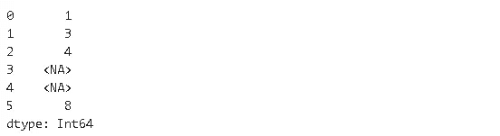

整数值不会被强制转换为浮点型。

另一个缺失的值表示是用于表示 datetime64[ns]数据类型的 **NaT** 。

> **注**:名词性的不相等，而没有一个是相等的。

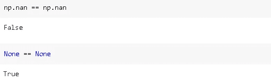

> **注意**:并非所有丢失的值都是简洁明了的 np.nan 或 None 格式。例如，我们处理的数据集可能包含“？”和“- -”值。当将数据集读入熊猫数据帧时，我们可以将它们转换成 np.nan 表示。我们只需要将这些值传递给`na_values`参数。

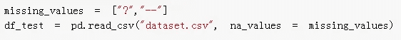

# **检测缺失值**

让我们首先创建一个示例数据框架，并向其中添加一些缺失的值。

```
df = pd.DataFrame({
'col_a':np.random.randint(10, size=8),
'col_b':np.random.random(8),
'col_c':[True, False, True, False, False, True, True, False],
'col_d':pd.date_range('2020-01-01', periods=8),
'col_e':['A','A','A','B','B','B','C','C']
})df.iloc[2:4, 1:2] = np.nan
df.iloc[3:5, 3] = np.nan
df.iloc[[1,4,6], 0] = np.nan
df
```


正如我们前面提到的，NaT 用于表示 datetime 缺失值。

`isna()`返回用布尔值表示缺失值的数据帧。

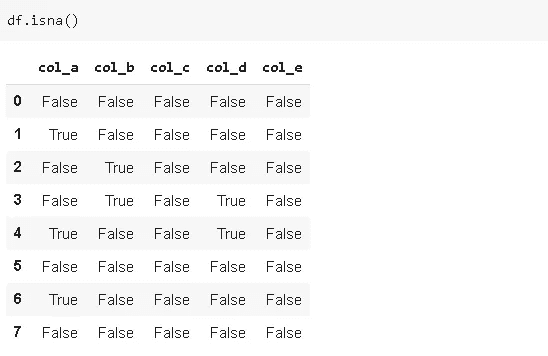

`isna().sum()`返回每列中缺失值的数量。

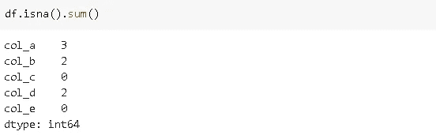

`notna` 与`isna` 相反，因此`notna().sum()`返回非缺失值的个数。

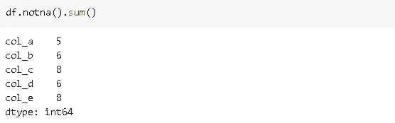

`isna().any()`返回每列的布尔值。如果该列中至少有一个值缺失，则结果为真。

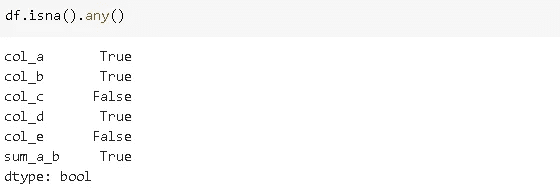

# **有缺失值的计算**

np.nan 和数字之间的算术运算返回 np.nan。

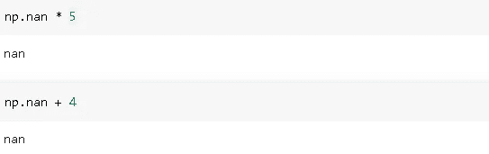

```
df['sum_a_b'] = df['col_a'] + df['col_b']
df
```

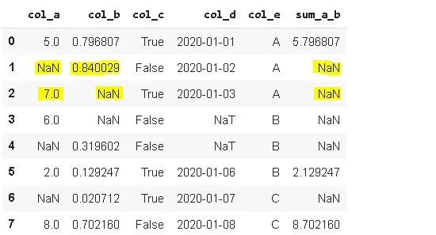

像`cumsum` 和`cumprod` 这样的累积方法默认情况下会忽略缺失值，但是它们会保留缺失值的位置。

```
df[['col_a','col_b']].cumsum()
```

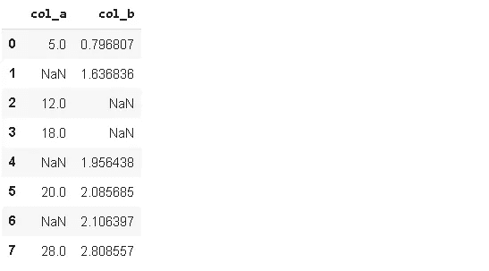

我们可以通过设置`skipna` 参数为假来改变这种行为。

```
df[['col_a','col_b']].cumsum(skipna=False)
```


缺失值现在包括在求和中。因此，第一个 nan 之后的所有值也是 nan。

`Groupby` 函数默认排除缺失值。

```
df[['col_e','col_a']].groupby('col_e').sum()
```

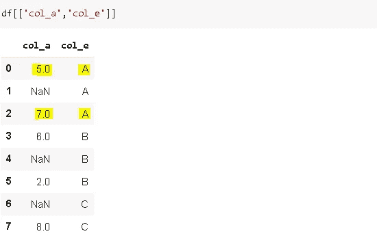

# **处理缺失值**

主要有两种方法来处理缺失值。我们可以丢弃丢失的值，或者用合适的值替换它们。更好的选择是替换丢失的值，但是在某些情况下，我们可能需要删除它们。

**删除缺失值**

我们可以使用`dropna()`函数删除缺少值的行或列。`how` 参数用于设置下降条件。

*   how='any ':如果有任何缺少的值，则删除
*   how='all ':如果所有值都丢失，则删除

让我们首先稍微修改一下我们的数据框架:

```
df.iloc[7,:] = np.nan
df
```

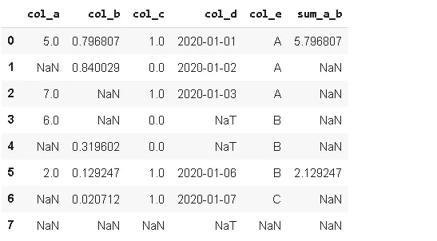

`how=’any’`将删除除第一行和第六行之外的所有行:

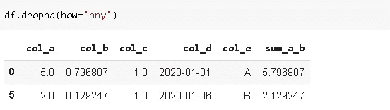

`how=’all’`只会删除最后一行:


> **注意**:为了将这些更改保存在原始数据帧中，我们需要将`inplace` 参数设置为真。

使用`thresh` 参数，我们可以设置缺失值的阈值，以便删除某行/列。如果`axis` 参数设置为 1，Dropna 也进行列操作。

**替换缺失值**

`fillna()`熊猫功能方便处理缺失值。使用`fillna()`，缺失值可由特殊值或聚合值替代，如平均值、中值。此外，缺失的值可以用它之前或之后的值替换，这对时间序列数据集非常有用。

我们可以选择一个值来替换数据帧中所有缺失的值，但这没有任何意义。相反，我们可以创建一个字典，指示在不同的列中使用不同的值。

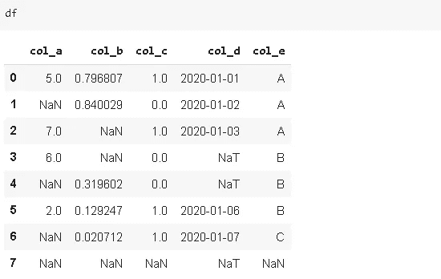

```
replacements = {'col_a':0, 'col_b':0.5, 'col_e':'Other'}
df.fillna(replacements)
```

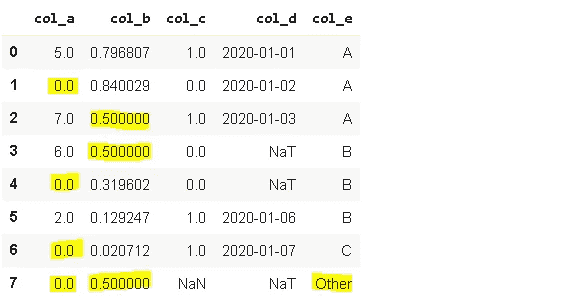

我们可以使用聚合函数作为值来替换缺失的值:

```
df['col_b'].fillna(df['col_b'].mean())
```

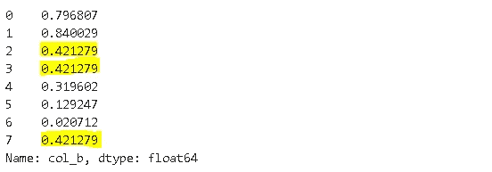

我们也可以使用`method` 参数用它们之前或之后的值来填充缺失的值。 **ffill** 代表“向前填充”，用前一行的值替换缺失的值。顾名思义， **bfill** (反向填充)做的正好相反。如果一列或一行中有许多连续的缺失值，我们可以使用 **limit** 参数来限制向前或向后填充的缺失值的数量。

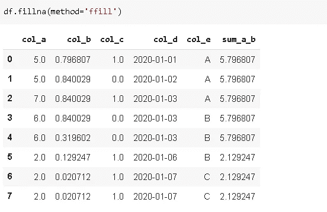

所有缺少的值都用前一个单元格中的值填充。让我们将需要填充的缺失值的数量限制为 1:

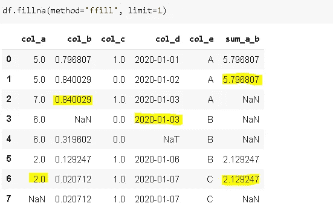

让我们尝试使用 bfill 方法来填充缺失的值:

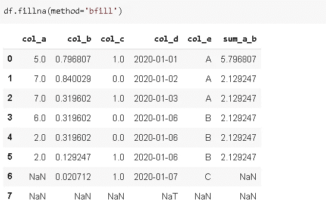

末尾的值仍然是缺失的，因为它们后面没有值。

# **加成:插值**

`interpolate` 通过插值填充缺失值，这对于序列或时间序列数据特别有用。默认方法是线性的，但可以使用方法参数进行更改。一些可用的选项是多项式，二次，三次。我们来做一个线性插值的例子。

```
s = pd.Series(np.random.random(50))
s[4, 5, 9, 11, 18, 19, 33, 34, 46, 47, 48] = np.nan
s.plot()
```

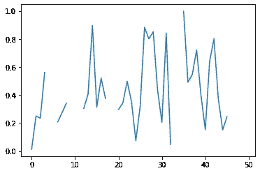

```
ts.interpolate().plot()
```


感谢您的阅读。如果您有任何反馈，请告诉我。