# 熊猫侧桌实用指南

> 原文：<https://towardsdatascience.com/a-practical-guide-on-pandas-sidetable-581dda0864ec?source=collection_archive---------53----------------------->

## 如何有效利用侧桌？


马库斯·斯皮斯克在 [Unsplash](https://unsplash.com/s/photos/different-colors?utm_source=unsplash&utm_medium=referral&utm_content=creditCopyText) 上拍摄的照片

Pandas 是一个非常强大和通用的 Python 数据分析库，它加速了数据科学项目的预处理步骤。它提供了许多在数据分析中非常有用的函数和方法。

虽然熊猫的内置功能能够执行有效的数据分析，但定制的功能或库为熊猫增加了价值。在本帖中，我们将探索这些附加组件中的一个，它是 [**侧表**](https://github.com/chris1610/sidetable) 。

由 [Chris Moffitt](https://twitter.com/chris1610) 创建的 Sidetable 提供了一个基于所选列的频率表。这也可以使用 pandas 的`**value_counts**`功能来实现，但是 sidetable 更加灵活和全面，正如我们将在示例中看到的。

如果你使用 jupyter 笔记本，我们首先需要用`pip`或`!pip`安装它:

```
!pip install sidetable
```

我们现在可以和熊猫一起进口 sidetable。

```
import pandas as pd
import sidetable
```

我将使用一个视频游戏数据集，它可以在 kaggle 上[这里](https://www.kaggle.com/gregorut/videogamesales)获得。让我们将 csv 文件读入 pandas 数据帧，并开始处理示例。

```
df = pd.read_csv("/content/vgsales.csv")df.shape
(16598, 11)df.head()
```

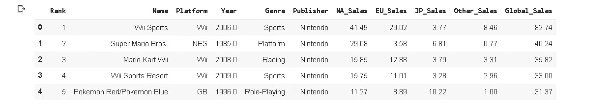

该数据集包含 16598 个视频游戏，销售额(以百万计)和一些特征，如流派、出版商和年份。让我们看看数据集中有多少不同的流派。

```
df.Genre.nunique()
12
```

我们可以使用`value_counts`查看每个流派有多少游戏。

```
df.Genre.value_counts()
```

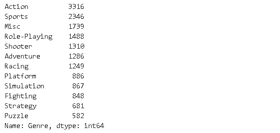

动作和体育类游戏最多。我们可能希望看到每种类型的比例，而不是数量。**归一化`value_counts`的**参数可以如下使用。

```
df.Genre.value_counts(normalize=True)
```


几乎 20%的游戏属于动作类。我认为同时看到计数和百分比要好得多。Sidetable 提供了这种便利以及一些其他信息统计。

Sidetable 用作带有 **stb** 关键字的数据帧上的访问器。

```
df.stb.freq(['Genre'])
```

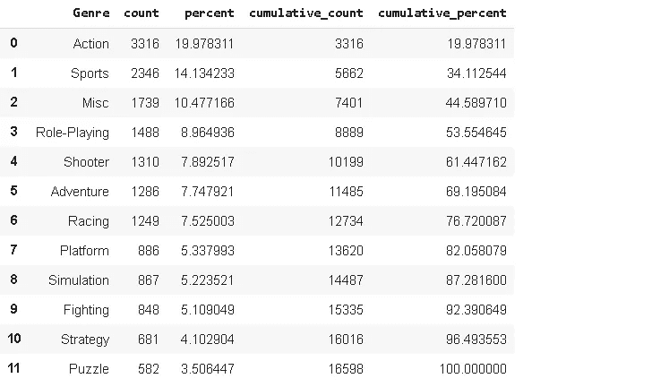

如您所见，显示了计数和百分比值。除此之外，还提供了累积值。例如，前 4 个流派构成了整个数据集的 53%。

在某些情况下，可能有许多不同的类别，这使得很难看到所有的类别。sidetable 的 **Thresh** 参数允许根据累计百分比的阈值限制显示值。例如，我们可以显示包含 70%视频游戏的平台。

```
df.stb.freq(['Platform'], thresh=70)
```

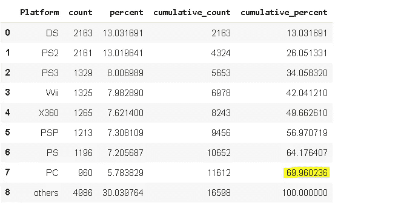

视频游戏数量最多的前 8 个平台占整个数据集的 69.96%。其余的合并在“其他”标签下。侧表允许使用**其他标签**参数更改该标签。

```
df.stb.freq(['Platform'], thresh=70, other_label="Other Platforms")
```

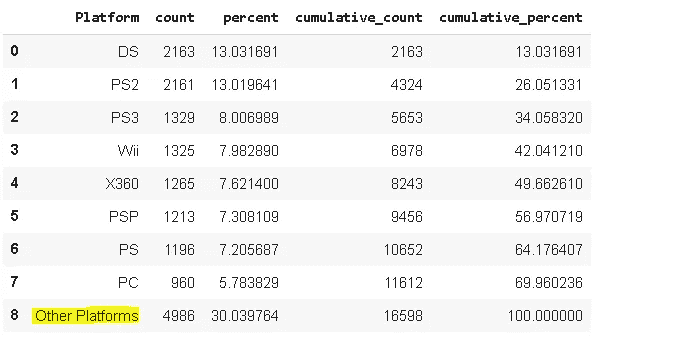

到目前为止，我们已经根据一列中的类别研究了数据的分布。Sidetable 允许组合多个列，并检查更具体的类别。例如，最常见的平台类型组合可以用 sidetable 来检查。

```
df.stb.freq(['Platform', 'Genre'], thresh=15)
```

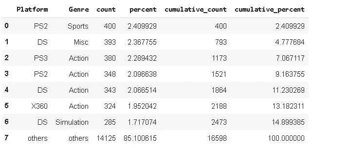

最常见的平台类型类别是 PS2 体育，占整个数据集的 2.4%。前 8 个平台类型对构成了数据集中所有视频游戏的近 15%。

默认情况下，如“计数”列所示，sidetable 返回每个类别的观察次数。考虑上面的例子。数据集中有 400 个视频游戏属于 PS2-体育类别(即平台是 PS2，类型是体育)。然而，我们可能对其他一些措施感兴趣。例如，在我们的例子中，我们可能需要根据全球销售额对平台进行排序。使用**值**参数可轻松实现侧钻。我们只需要将列名传递给值参数。

```
df.stb.freq(['Platform'], value='Global_Sales', thresh=50)
```

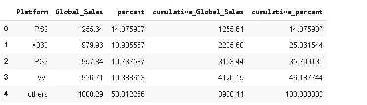

PS2 游戏的全球销售额约为 12.6 亿美元。有趣的是，平台“DS”在全球销售额方面并不在前 4 名，尽管它在数据集中拥有最高数量的游戏。

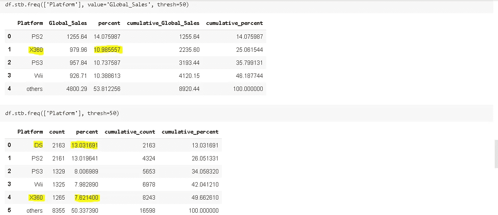

全球销售额和数量方面的平台比较

虽然 DS 平台在游戏数量上排名第一，但它并没有产生最高的销售额。可能的原因:

*   DS 游戏不是很受欢迎，所以不如其他平台的游戏卖得多
*   DS 游戏比其他流行平台的游戏便宜

与 DS 相反，X360 平台的游戏数量少于 DS、PS3 和 Wii，但销售额却更高。同样可能的原因适用，但以相反的方式。X360 游戏可能比其他平台更便宜或销量更高。

Sidetable 还可用于生成缺失值的概览。

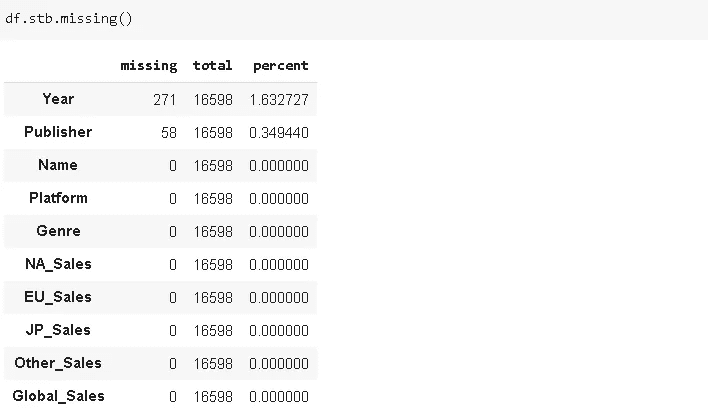

它返回每列中缺失值的数量以及缺失值的比率。

sidetable 的另一个非常有用的函数是`subtotal` ，它可以应用于`groupby` 函数来轻松计算分类汇总。用例子会更清楚。我们先来看看北美、欧洲、日本各流派的总销量。

```
df[['NA_Sales','EU_Sales','JP_Sales', 'Genre']].groupby('Genre').sum()
```

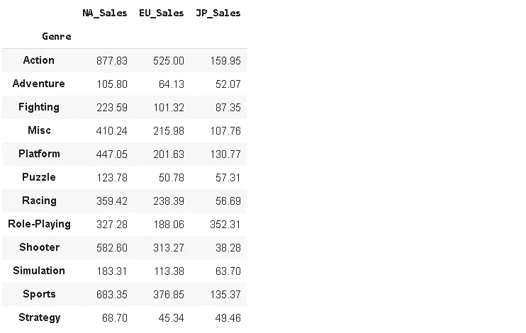

它返回每个流派在指定地区的总销售额，但不计算小计。我们只需要添加 stb.subtotal()来计算小计。

```
df[['NA_Sales','EU_Sales','JP_Sales', 'Genre']].groupby('Genre').**sum().stb.subtotal()**
```

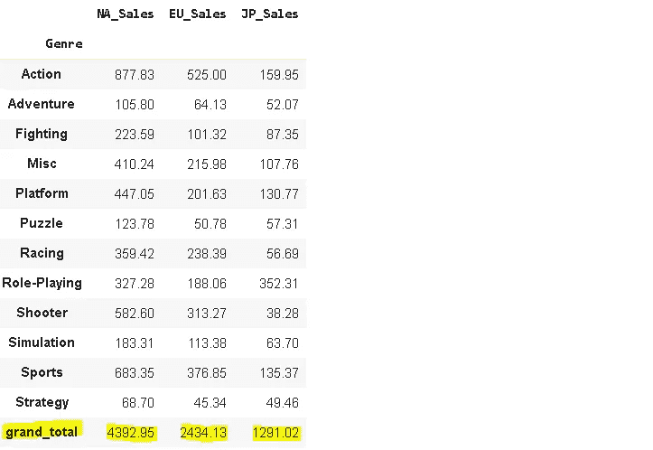

还有其他方法来计算小计，但 stb.subtotal 使它更简单。当有嵌套的类别时，您可以更多地感受到方便。

我认为熊猫的成功和流行来自于其多功能、强大且易于使用的操作和分析数据的功能。和熊猫一起完成一项任务几乎总是有多种方式。熊猫上添加的定制实用程序库优化了某些操作，并为熊猫带来了更多价值。再次感谢[克里斯·莫菲特](https://twitter.com/chris1610)提供了这个宝贵的工具。

感谢您的阅读。如果您有任何反馈，请告诉我。