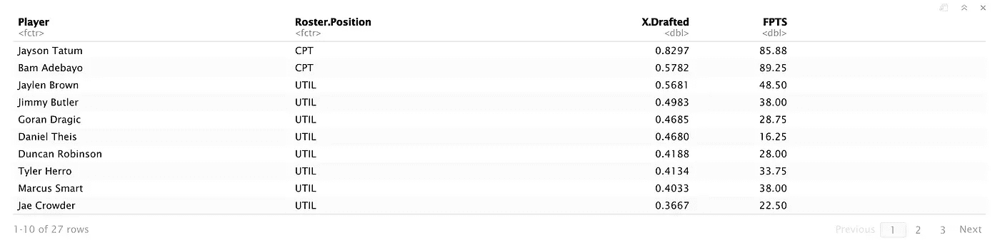
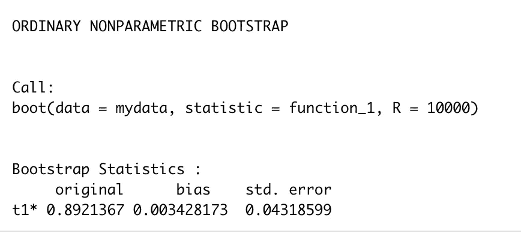
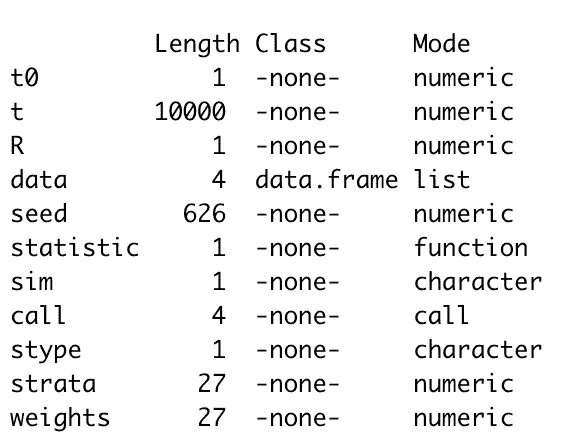
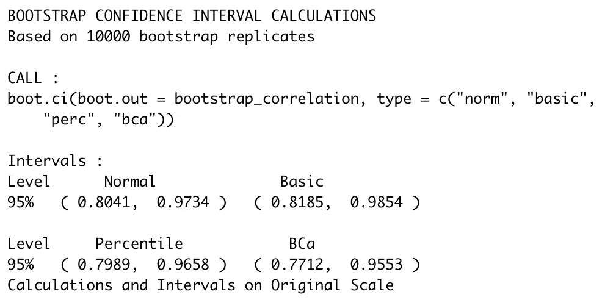

# R 中的 Bootstrap 实用指南

> 原文：<https://towardsdatascience.com/a-practical-guide-to-bootstrap-with-r-examples-bd975ec6dcea?source=collection_archive---------0----------------------->

## 统计数字

## 什么，为什么，什么时候，怎么做


梅格·坎南在 [Unsplash](https://unsplash.com/s/photos/boot?utm_source=unsplash&utm_medium=referral&utm_content=creditCopyText) 上的照片

*2020 年 8 月 11 日更新*

# TL；速度三角形定位法(dead reckoning)

*   Bootstrap 是一种带替换的重采样方法。
*   它允许我们估计人口的分布，甚至从一个单一的样本。
*   在机器学习中，bootstrap 在应用于未观察到的数据时估计预测性能。
*   数据集和 R 代码请查看我的 Github ( [链接](https://github.com/LeihuaYe/Bootstrap_in_R))。

# 什么是自举？

Bootstrap 是一种重采样方法，从单个原始样本中重复抽取相同大小的大量样本 ***并替换*** 。

这是英文翻译。通常，不可能从一个或有限数量的样本中推断出总体参数。总体的不确定性来源于抽样的可变性:一个样本有一个值，而如果我们收集另一个样本，就会得到另一个值。

下一个问题是:

> 如何消除变异性，尽可能逼近总体参数？

通过重复替换采样，bootstrap 创建了高斯分布的结果样本分布，这使得统计推断(例如，构建置信区间)成为可能。

引导分为以下步骤:

1.  *决定执行多少引导样本*
2.  *样本量是多少？*
3.  *对于每个引导样本:*

*   *用所选尺寸的替换物绘制样品*
*   *计算该样本的兴趣统计量*

*4。计算样本统计的平均值*

这些过程可能看起来有点令人生畏，但幸运的是，我们不必手动运行计算。现代编程语言(如 R 或 Python)为我们处理了这些脏活。


照片由[米切尔罗](https://unsplash.com/@mitchel3uo?utm_source=unsplash&utm_medium=referral&utm_content=creditCopyText)在 [Unsplash](https://unsplash.com/s/photos/google?utm_source=unsplash&utm_medium=referral&utm_content=creditCopyText) 上拍摄

# 为什么自举？

在回答为什么之前，让我们看看作为数据科学家我们面临的一些常见的推理挑战。

> 在 A/B 测试之后，我们能在多大程度上相信一个小样本量(比如 100)能代表真实的总体？
> 
> 如果重复取样，对利息的估计会有变化吗？如果它们确实不同，分布是什么样的？
> 
> 当人口的分布太复杂或未知时，有可能作出有效的推论吗？

做出有效的统计推断是数据科学家日常工作的主要部分。然而，有效的推断有严格的假设和前提，这些假设和前提可能不成立或仍然未知。

理想情况下，我们希望收集整个人口的数据，这样可以省去一些统计推断的麻烦。显然，考虑到时间和金钱上的花费，这是一种昂贵的并且不推荐的方法。

例如，调查所有美国人的政治观点是不可行的，但是调查一小部分美国人，比如 1 万名美国人，并询问他们的政治偏好是可行的。

这种方法的挑战在于，每次收集样本时，我们得到的结果可能会略有不同。从理论上讲，对于来自总体的重复抽样，点估计的标准差可能相当大，这可能会使估计有偏差。

**妙语如下:**

> 作为一种非参数估计方法，bootstrap 派上了用场，它量化了估计值与标准差之间的不确定性。


[维多利亚摄她](https://unsplash.com/@victoriakosmo?utm_source=unsplash&utm_medium=referral&utm_content=creditCopyText)在 [Unsplash](https://unsplash.com/s/photos/espresso-machine?utm_source=unsplash&utm_medium=referral&utm_content=creditCopyText)

# 什么时候？

对于以下情况，引导是一种理想的方法:

1.  当统计数据的分布未知或复杂时。

*   **原因** : bootstrap 是非参数方法，不要求特定的分布)。

2.当样本量太小而无法得出有效的推论时。

*   **原因** : bootstrap 是一种带有替换的重采样方法，如果需要，可以重新创建任意数量的重采样。

3.你需要一个试点研究，在把你所有的资源倒向错误的方向之前，先感受一下水的味道。

*   **原因**:与#2 点相关，bootstrap 可以创建总体的分布，我们可以检查方差)。

# r 代码

既然 Sport 回来了， [DraftKings](https://www.draftkings.com/r/bull_ye) 也是最近的趋势，我就用凯尔特人和热火的 NBA 季后赛第六场( [Github](https://github.com/LeihuaYe/Bootstrap_in_R) )。

```
mydata <- read.csv("Celtics_Heat_Game_6_Actual.csv")
mydata
```



我们感兴趣的是两个变量之间的相关性:球员被选中的百分比( **X .被选中**)和梦幻得分( **FPTS** )。

计算一个游戏的相关性很简单，但实用价值不大。我们有一个普遍的印象，顶级球员(如杰森·塔图姆、吉米·巴特勒)会成为选秀最多的球员，也会在一场比赛中获得最多的分数。

可能有助于挑选下一场比赛的球员的是:

> 如果我们抽取重复的样本 10，000 次，这两个变量之间的相关范围是多少？

在 R 中，自举有两个步骤。

*如果你还没有安装软件包启动。*

**第 0 步:包装准备**

```
install.packages('boot',dep=TRUE)library(boot)
```

**步骤 1:定义一个计算感兴趣的指标的函数**

```
function_1 <- function(data, i){
 d2 <- data[i,] 
 return(cor(d2$X.Drafted, d2$FPTS))
}
```

上面的函数有两个参数:*数据*和 *i* 。第一个参数 *data* 是要使用的数据集，而 *i* 是将从数据集中选取哪些行来创建引导样本的向量索引。

**第二步:应用 *boot()* 功能**

```
set.seed(1)
bootstrap_correlation <- boot(mydata,function_1,R=10000)
```

记住设置种子以获得可重复的结果。boot()函数有三个参数:数据集、哪个函数和引导样本的数量。

```
bootstrap_correlation
```



两个变量之间的原始相关性为 0.892，标准误差为 0.043。

```
summary(bootstrap_correlation)
```



返回值是一个名为“boot”的类的对象，它包含以下部分:

t0:原始数据集中我们的统计值

t:有 sum(R)行的矩阵，每一行都是调用统计结果的 bootstrap 副本

…

*(更多信息请参考*[*R 文档*](https://www.rdocumentation.org/packages/boot/versions/1.3-25/topics/boot) *)。)*

```
class(bootstrap_correlation)
[1] "boot"range(bootstrap_correlation$t)
[1] 0.6839681 0.9929641mean(bootstrap_correlation$t)
[1] 0.8955649sd(bootstrap_correlation$t)
[1] 0.04318599
```

bootstrap 样本的一些其他常见统计数据:范围、平均值和标准差，如上所示。

```
boot.ci(boot.out=bootstrap_correlation,type=c(‘norm’,’basic’,’perc’,’bca’))
```



这就是我们如何计算自举样本的 4 种置信区间。


照片由[埃琳娜·科劳彭伯格](https://unsplash.com/@elli19?utm_source=unsplash&utm_medium=referral&utm_content=creditCopyText)在 [Unsplash](https://unsplash.com/s/photos/espresso-machine?utm_source=unsplash&utm_medium=referral&utm_content=creditCopyText) 上拍摄

# 结论

在上面的例子中，我们感兴趣的是两个变量之间的相关性: **X.Drafted** 和 **FPTS** 。然而，这只是一个样本，有限的样本量使得很难在群体水平上概括这一发现。换句话说，我们能把发现从一个样本扩展到所有其他情况吗？

在第六场比赛中，被选中的球员百分比和在 [DraftKings](https://www.draftkings.com/r/bull_ye) 获得的幻想分数之间的相关系数为 0.89。我们将样本引导 10000 次，得到以下样本分布:

1.  相关系数的范围:[0.6839681，0.9929641]。
2.  平均值:0.8955649
3.  标准偏差:0.04318599
4.  95%置信区间:[0.8041，0.9734]

我们可以看到，系数的范围相当宽，从 0.68 到 0.99，95% CI 从 0.8 到 0.97。下次我们可能会得到 0.8 的相关系数。

两个统计数据都表明，这两个变量从中度到强相关，我们可能会在这两个参与者之间得到一个不太强相关的关系(例如，因为对顶级参与者均值的回归)。实际上，我们在挑选表现最好的球员时应该特别小心。

*Medium 最近进化出了自己的* [*作家伙伴计划*](https://blog.medium.com/evolving-the-partner-program-2613708f9f3c) *，支持像我这样的普通作家。如果你还不是订户，通过下面的链接注册，我会收到一部分会员费。*

[](https://leihua-ye.medium.com/membership) [## 阅读叶雷华博士研究员(以及其他成千上万的媒体作家)的每一个故事

### 作为一个媒体会员，你的会员费的一部分会给你阅读的作家，你可以完全接触到每一个故事…

leihua-ye.medium.com](https://leihua-ye.medium.com/membership) 

*关于数据集和 R 代码，请查看我的 Github (* [*链接*](https://github.com/LeihuaYe/Bootstrap_in_R) *)。*

[](/classifying-rare-events-using-five-machine-learning-techniques-fab464573233) [## 使用 5 种机器学习算法对罕见事件进行分类

### 哪一种最适合不平衡数据？有什么权衡吗？

towardsdatascience.com](/classifying-rare-events-using-five-machine-learning-techniques-fab464573233) 

# 喜欢读这本书吗？

> 请在 LinkedIn[和 Youtube](https://www.linkedin.com/in/leihuaye/) 上找到我。
> 
> 还有，看看我其他关于人工智能和机器学习的帖子。