# 探索性数据分析实用指南:Spotify 数据集

> 原文：<https://towardsdatascience.com/a-practical-guide-to-exploratory-data-analysis-spotify-dataset-d8f703da663e?source=collection_archive---------20----------------------->

## 一张图胜过千言万语


普瑞亚·贝伦吉在 [Unsplash](https://unsplash.com/s/photos/spotify?utm_source=unsplash&utm_medium=referral&utm_content=creditCopyText) 上的照片

我们生活在大数据时代。我们可以收集大量数据，从而推断出有意义的结果，做出明智的商业决策。然而，随着数据量的增加，分析和探索数据变得更加困难。当有效和恰当地使用时，可视化是探索性数据分析的伟大工具。可视化也有助于向你的观众传递信息，或者告诉他们你的发现。没有一种通用的可视化方法，因此某些任务需要不同类型的可视化。在本帖中，我们将尝试探索 Kaggle 上[这里](https://www.kaggle.com/yamaerenay/spotify-dataset-19212020-160k-tracks)提供的 Spotify 数据集。

Kaggle 是数据科学领域非常受欢迎的平台。它的名气来自比赛，但也有许多数据集，我们可以在实践中工作。Kaggle 很酷的一点是，你可以创建笔记本，直接在 Kaggle 上导入数据集，并在网站上分享你的工作，而不必下载任何东西。


只需点击“新笔记本”并选择您喜欢的语言。笔记本启动后，点击“添加数据”并选择您想要处理的数据集。


添加数据集后，我们可以从将数据集读入 pandas 数据帧开始。

```
import pandas as pd
import numpy as npdf = pd.read_csv("../input/spotify-dataset-19212020-160k-tracks/data.csv")print(df.shape)
df.columns
```

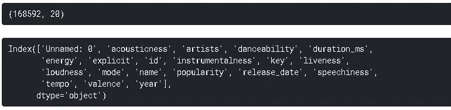

数据集包含从 Spotify Web API 收集的超过 160，000 首歌曲。这些特征包括歌曲、艺术家、发行日期以及歌曲的一些特征，如声音、舞蹈性、响度、速度等等。日期范围从 1921 年到 2020 年。

让我们首先检查是否有任何丢失的值:

```
df.isna().sum().sum()
0
```

没有缺失值。 **df.isna()。sum()** 返回每列中缺失值的数量。通过添加另一个 **sum()** ，我们得到数据集中缺失值的总数。

我不会在我的分析中使用一些特性，所以我会放弃它们。

```
df.drop([
'Unnamed: 0', 'id','explicit','key','release_date','mode'], axis=1, inplace=True
)df.head()
```

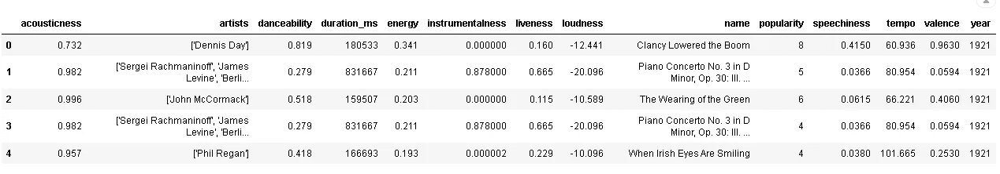

# **宋动向**

该数据集包括对歌曲的许多不同的度量。一些名称给出了他们的意思，如速度，响度，能量。如果你对音乐不是很感兴趣的话，还有一些非常具体的措施很难理解。例如，声音、活力和语言是我们不常听到的专业术语。

这些措施中的一些可能是相关的。乍一看，可跳性和效价似乎是相关的。我们可以使用熊猫的 **corr** 方法来计算相关性，并使用**热图**来可视化它们。

```
corr = df[['acousticness','danceability','energy',
'instrumentalness','liveness','tempo','valence']].corr()import matplotlib.pyplot as plt
import seaborn as sns
sns.set(style='darkgrid')%matplotlib inlineplt.figure(figsize=(12,8))
sns.heatmap(corr, annot=True)
```

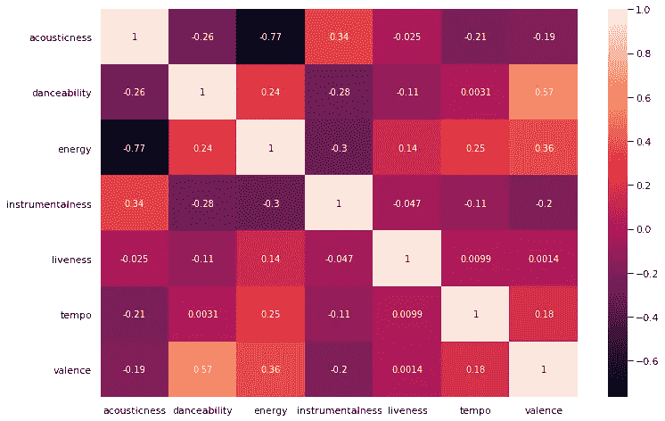

正如我们所猜测的，配价和可舞性之间存在正相关。能量和声音之间似乎有很强的负相关性。

让我们也根据每首歌的平均能量来检查前 10 名艺术家，并将结果与他们的平均声音值进行比较。

```
df[['artists','energy','acousticness']].groupby('artists').mean().sort_values(by='energy', ascending=False)[:10]
```


除了少数例外，演唱高能歌曲的艺术家声音很低。整个数据集中的平均声音度是 0.50。

```
df.acousticness.mean()
0.5013601471548411
```

数据集包含了早在 1921 年的歌曲。我们可以大致了解宋的特征在百年间是如何变化的。

```
year_avg = df[['danceability','energy','liveness','acousticness', 'valence','year']].groupby('year').mean().sort_values(by='year').reset_index()year_avg.head()
```

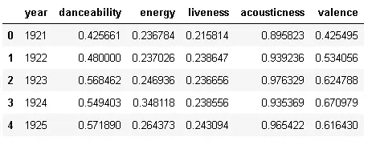

对于五种不同的测量方法，我们得到了年平均值。各种不同的软件包和有用的功能，在数据科学领域，几乎总是有多种方法来完成一项任务。我将向您展示两种不同的方法来创建一个线形图，显示这些变量随时间变化的趋势。

第一个是创建一个图形，并为每个趋势添加一条线。

```
plt.figure(figsize=(14,8))
plt.title("Song Trends Over Time", fontsize=15)lines = ['danceability','energy','liveness','acousticness','valence']for line in lines:
    ax = sns.lineplot(x='year', y=line, data=year_avg)plt.legend(lines)
```

另一种方法是使用熊猫**融化**函数将 year_avg 数据帧转换为 long 数据帧。

```
melted = year_avg.melt(id_vars='year')
melted.head()
```

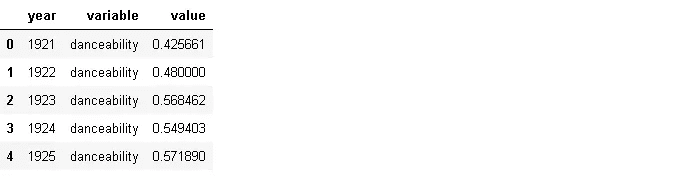

不同的测量值组合在一个名为“变量”的列下。5 个要素合并为一个要素，因此融合数据帧的长度必须是 year_avg 数据帧长度的 5 倍:

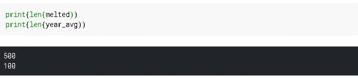

我们确认了形状。现在让我们看看如何使用熔化的数据帧创建相同的绘图。

```
plt.figure(figsize=(14,6))
plt.title("Song Trends Over Time", fontsize=15)
sns.lineplot(x='year', y='value', hue='variable', data=melted)
```

我们没有添加多个轴，而是使用了**色调**参数，这使得语法更加简单。这两种方式都产生了这个情节:

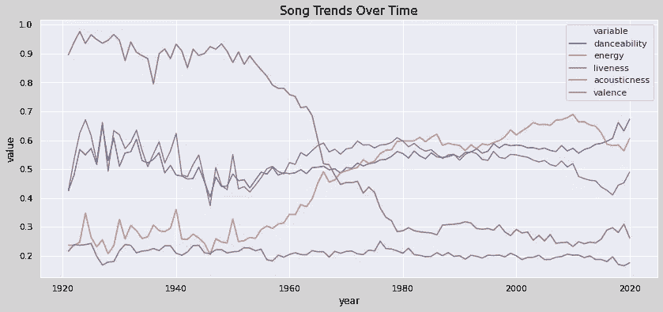

# **歌曲最多的艺人**

我想知道数据集中有多少独特的艺术家。

```
df.artists.nunique()
33268
```

整个数据集中有 33268 位艺术家。他们中的一些人创作了很多歌曲，而有些艺术家却很少创作歌曲。让我们看看数据集中歌曲最多的前 7 位艺术家。

```
df.artists.value_counts()[:7]
```

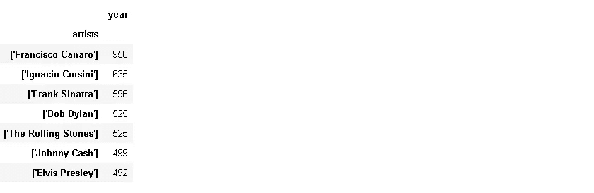

弗朗西斯科·卡纳罗有 956 首歌，亚军伊格纳西奥·科西尼有 635 首歌。我们可以创建一个新的数据框架，显示这 7 位艺术家每年的歌曲产量。

我们首先使用由 **value_counts** 函数返回的索引创建一个列表:

```
artist_list = df.artists.value_counts().index[:7]
```

然后使用此列表过滤数据框，并按年份分组:

```
df_artists = df[df.artists.isin(artist_list)][['artists','year',
                                                        'energy']].groupby(['artists','year']).count().reset_index()df_artists.rename(columns={'energy':'song_count'}, inplace=True)df_artists.head()
```

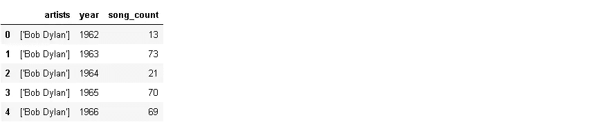

该数据帧包含艺术家姓名、年份以及艺术家当年创作的歌曲数量。

```
plt.figure(figsize=(16,8))sns.lineplot(x='year', y='song_count', hue='artists', data=df_artists)
```

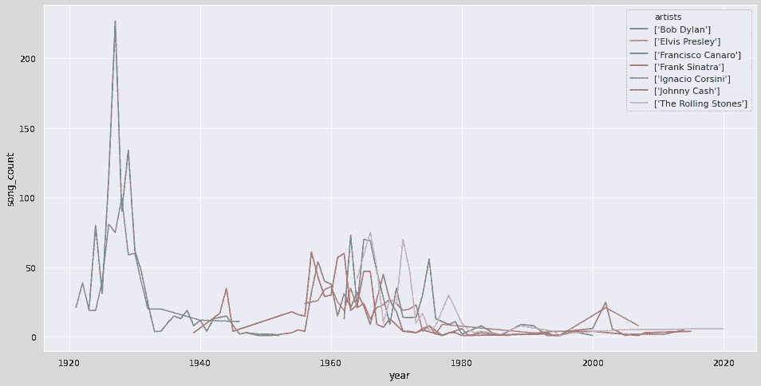

我们无法真正区分界限。因为这是一个很长的时期(100 年)，艺术家只出现在整个时间线的一部分。例如，“弗朗西斯科·卡纳罗”似乎主宰了 20 世纪 30 年代。

我现在将尝试一种不同的方式来看看哪些艺术家主宰了哪个时代。首先，我将创建一个包含整个时间线(1921-2020)和前 7 名艺术家姓名的空数据框。

```
df1 = pd.DataFrame(np.zeros((100,7)), columns=artist_list)
df1['year'] = np.arange(1921,2021)
print(df1.shape)
df1.head()
```

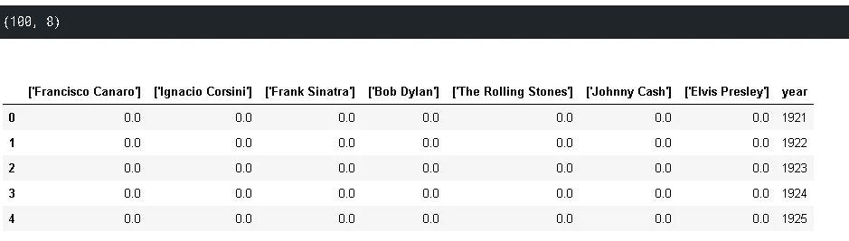

数据帧包括 100 年的 100 行和 8 列(7 位艺术家和一年列)。然后我会用 **melt** 函数把它转换成一个长数据帧。

```
df1 = df1.melt(id_vars='year',var_name='artists', value_name='song_count')
print(df1.shape)
df1.head()
```

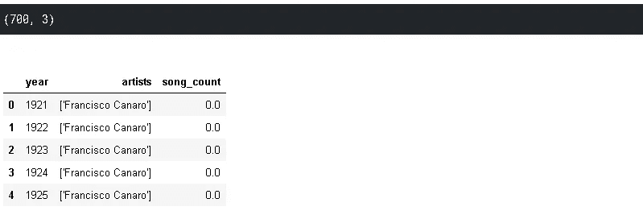

历年歌曲计数为零。我将使用熊猫**合并**功能合并 df_artists 数据帧中的歌曲数。

```
df_merge = pd.merge(df1, df_artists, on=['year','artists'], how='outer').sort_values(by='year').reset_index(drop=True)df_merge.head()
```

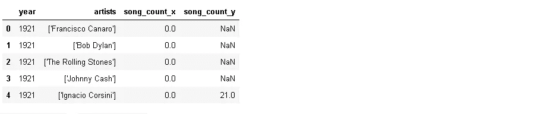

如果某个艺术家在某一年没有任何歌曲，则该值用 NaN 填充。请注意，重要的是将合并功能的 **how** 参数设置为“外部”。否则，合并的数据帧只包括年份-艺术家组合，其中至少有一首该艺术家的歌曲。

我将用 0 替换 NaN 值，并删除 song_count_x 列。

```
df_merge.fillna(0, inplace=True)
df_merge.drop('song_count_x', axis=1, inplace=True)
df_merge.rename(columns={'song_count_y':'song_count'}, inplace=True)df_merge.head()
```

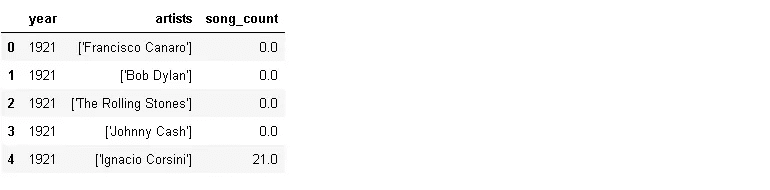

我还想添加一个列，显示每个艺术家多年来创作的歌曲的累积总和。一种方法是使用 **groupby** 和 **cumsum** 函数。

```
df_merge['cumsum'] = df_merge[['song_count','artists']].groupby('artists').cumsum()df_merge.head(10)
```

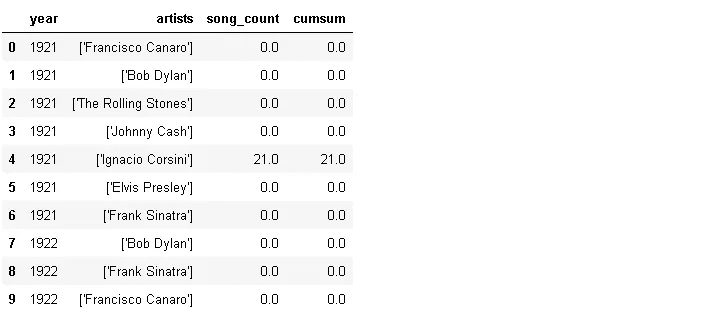

如果我们只对艺术家使用累计和而不使用 groupby，则累计和列只包括基于年份的累计和。它不考虑艺术家列。

我已经成功地重新格式化了数据帧，以适应我想要绘制的内容。我将创建一个跨越整个时间线的动画条形图。每位艺术家都有一个酒吧。随着艺术家歌曲累积数量的增加，条形将会上升。我们将能够看到每个艺术家如何在不同的年代占据主导地位。

我将使用 plotly python (plotly.py ),这是一个很棒的库来创建交互式可视化。Plotly express 是 Plotly 的高级 API，它也使得语法非常简单和易于理解。

```
import plotly.express as pxfig = px.bar(df_merge,
             x='artists', y='cumsum',
             color='artists',
             animation_frame='year', animation_group='year',
             range_y=[0,1000],
             title='Artists with Most Number of Songs')
fig.show()
```

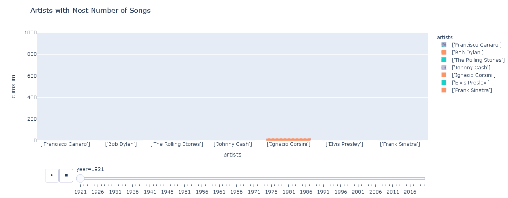

我在 1986 年暂停录音，并在结尾重新开始。动态图根据传递给 animation_frame 和 animation_group 参数的内容而变化。定义一个范围以防止数据点从图中掉出是很重要的。

我们已经介绍了一些操作或改变数据帧格式的技术。我们也创造了一些基本的情节以及一个动画情节。我们可以在这个数据集上做更多的事情。例如，我们可以分析歌曲或艺术家的受欢迎程度。也可以研究流行度如何基于音乐风格随时间变化。因此，探索性数据分析过程没有限制。根据我们的需要，我们可以从特定的角度来处理数据框架。然而，技术和操作通常是相同的。因此，最好使用不同种类的数据集进行练习。

感谢您的阅读。如果您有任何反馈，请告诉我。