# 喀拉斯 RNN 和 LSTM 实用指南

> 原文：<https://towardsdatascience.com/a-practical-guide-to-rnn-and-lstm-in-keras-980f176271bc?source=collection_archive---------2----------------------->

照片由[丹尼尔·利维斯·佩鲁西](https://unsplash.com/@yogidan2012?utm_source=medium&utm_medium=referral)在 [Unsplash](https://unsplash.com?utm_source=medium&utm_medium=referral) 上拍摄

# 介绍

在阅读了大量关于循环层的理论文章后，我只想建立我的第一个 LSTM 模型，并在一些文本上对其进行训练！但是对于我来说，图层暴露参数的庞大列表和图层结构的精致对我来说太复杂了。这意味着我不得不花费大量的时间来研究 StackOverflow 和 API 定义，以获得更清晰的图像。这篇文章试图巩固所有的笔记，它可以加速从理论到实践的转变过程。本指南的目标是培养对使用 RNN 和 LSTM 等重现图层的实际理解，而不是提供理论理解。为了更深入的理解，我建议[这个](https://colah.github.io/posts/2015-08-Understanding-LSTMs/)和[这个](http://karpathy.github.io/2015/05/21/rnn-effectiveness/)，我建议在阅读本文之前先过一遍。如果你准备好了，让我们开始吧！

# 递归神经网络

完整的 RNN 图层在 Keras 中显示为`SimpleRNN`类。与许多文章中建议的体系结构相反，Keras 实现非常不同，但是很简单。每个 RNN 单元接受一个数据输入和一个隐藏状态，从一个时间步骤传递到下一个步骤。RNN 细胞看起来像这样，

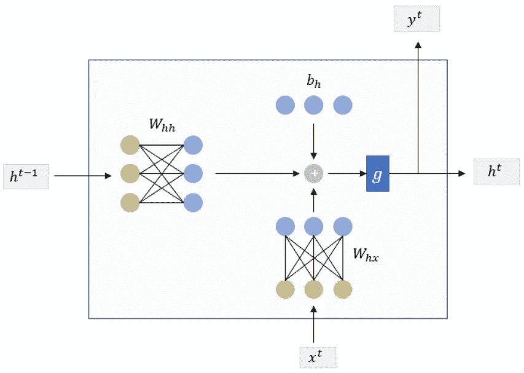

Keras 中 RNN 单元实现内部的数据流和隐藏状态。图片作者。

RNN 单元的完整公式是，

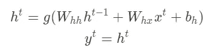

这里，h{t}和 h{t-1}是从时间 t 和 t-1 开始的隐藏状态。x{t}是 t 时刻的输入，y{t}是 t 时刻的输出，需要注意的是，有两个权重矩阵 W{hh}和 W{hx}以及一个偏置项 b{h}。这些矩阵中的每一个都可以被认为是一个内部 1 层神经网络，其输出大小在参数`units`中定义，偏差也具有相同的大小。y{t}是原始的 h{t}，我们不像许多文章建议的那样在这里应用另一个权重矩阵。这表示 RNN 的一个单个像元，像元的顺序组合(计数等于数据中的时间步长)创建了完整的 RNN 层。请记住，RNN 单元共享相同的权重矩阵和偏差。最后，我们可以如下计算训练 RNN 层所需的参数数量，

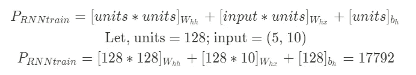

请注意，输入在格式上是一个元组(时间步长、要素),参数仅取决于要素，因为我们在每个时间步长上共享相同的权重。这可以通过在 Keras 中显示 RNN 的样本模型的概要来检查。

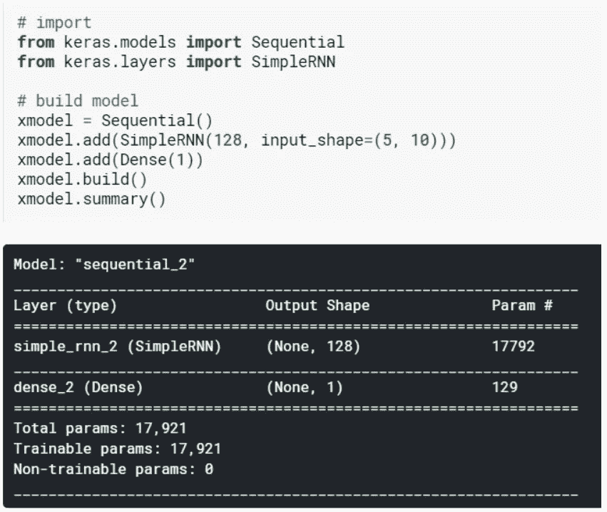

检查 simple_rnn_2 中的参数，它等于我们上面计算的。使总参数计数达到 17921 的额外的 129 是由于在 RNN 之后添加的密集层。

我们还可以获取精确的矩阵并打印出它的名称和形状，

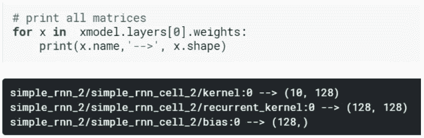

要点注意，Keras 调用输入权重为*内核*，隐藏矩阵为*递归 _ 内核*，偏差为*偏差*。现在我们来过一遍 Keras 曝光的参数。虽然完整的清单是由提供的，但我们将简要地看一些相关的清单。

*   第一个也是最重要的是`units`，它等于*内核*和 *recurrent_kernel 的输出大小。*也就是*偏向项的大小*项和隐藏项的大小。
*   接下来，我们有`activation`在我们的公式中定义了 g()函数。默认为“tanh”。
*   然后我们为*内核、*递归 _ 内核和*偏差*分别设置了`{*}_initializer`、`{*}_regularizer`和`{*}_constraint`参数。如果您不确定，可以忽略这些，因为默认值已经足够好了。
*   `use_bias`是打开或关闭偏置项的布尔参数。
*   `dropout`和`recurrent_dropout`分别用于将丢弃概率应用于*内核*和*递归 _ 内核*。
*   `return_sequence`是一个布尔参数。当其为“真”时，RNN 图层的输出形状为(时间戳，要素)，当其为“假”时，输出仅为(要素)。这意味着，如果它打开，在输出中我们返回所有时间步的 y{t}，如果它关闭，我们只返回 1 y{t}(这里是从最后一个时间步)。一个额外的警告，不要忘记在添加`Dense`层之前，在打开`return_sequence`的 RNN 之后添加一个`TimeDistributed`层或`Flatten`层。
*   `go_backwards`为布尔类型，当其为“真”时，RNN 以相反的顺序处理数据。默认值为“假”
*   `return_state`为布尔型，当“真”时，除输出外，还返回最后一个状态。默认值为“False”。
*   `stateful`是一个重要的参数。当设置为“真”时，Keras 对相同的样本索引使用相同的批次隐藏状态。这样理解，我们为多个时期训练我们的模型，这就像对完整数据的迭代。1 个历元是完整数据的 1 次传递。现在，每个时期包含多个批次，这些批次又包含多个样本，即单独的数据。通常，在批量运行每个样品后，RNN 池的状态会被重置。但是，如果我们以这样的格式准备数据，使得在多个批次中，特定索引处的样本只是同一个句子的扩展，那么我们可以将 stateful 转换为“True ”,这相当于一次训练所有句子(作为一个样本)。由于内存限制，如果我们不能一次加载完整数据，我们可能会这样做。默认值为“False”。

在对 RNN 有了基本了解之后，让我们来看看 RNN 经常创作的一个建筑。

# 深垂直 RNNs

已经有人建议将多个循环层堆叠在彼此之上，以便[更好地为多个应用](https://stats.stackexchange.com/questions/163304/what-are-the-advantages-of-stacking-multiple-lstms)工作。这导致了网状结构，其中水平深度(想象展开的 RNN)是由于时间步长，而垂直副本(堆叠)是由于新的 RNNs 层。这被称为 Seq2Seq 建模，主要用于语言翻译、实体标记、语音识别等需要输入和输出序列的应用。也就是说，我们也可以在最终应用完全连接的密集层之前堆叠多个 rnn，这是输入序列但输出变平的一个示例。一个示例代码是，

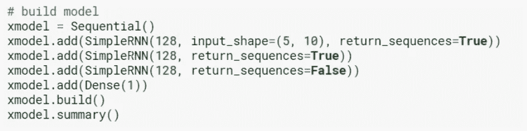

这非常简单，因为我们刚刚在前面的代码中添加了两个新的 RNN 层。但是请注意，如果我们想在 RNN 图层上叠加另一个 RNN，我们会将`return_sequence`设为“真”。这是因为下一个 RNN 期望时间分布的输入，并且前一个 RNN 的每个时间步长的输出成为相同时间步长的上 RNN 的输入。这里，虽然第一 RNN 的可训练参数保持与之前建议的相同，但是第二和第三 RNN 具有不同的参数，因为这些 RNN 的输入大小是 128。这使得接下来的两个 RNN 中的每一个的训练参数等于，

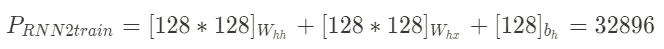

# LSTM

继续看 LSTMs，上面有一堆非常好的文章，比如[这个](https://colah.github.io/posts/2015-08-Understanding-LSTMs/)和[这个](/illustrated-guide-to-lstms-and-gru-s-a-step-by-step-explanation-44e9eb85bf21)。我建议在继续前进之前先看一看它们。与 RNN 的问题类似，LSTM 的实现与大多数文章中提出的没有什么不同。主要的区别在于，不是连接输入和先前的隐藏状态，而是在将它们传递到 LSTM 单元中的 4 个内部神经网络之前，我们具有应用于两者的不同权重矩阵。这意味着我们将所需的矩阵数量增加了一倍(实际上，它将维度增加了一倍，但稍后会有更多的介绍)。与输入相乘的 4 个矩阵称为*核*，与前一隐藏状态相乘的 4 个称为*递归 _ 核*。为了更好地理解这一点，让我们看看公式，

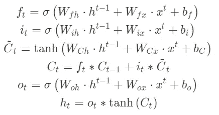

在这里，如果您观察，我们总共有 8 个权重矩阵，假设每个矩阵的大小相同，我们可以说，在某种程度上，我们正在进行与 RNN 相同的操作，但现在增加了 4 倍。因此，可训练参数的数量现在可以通过下式计算，

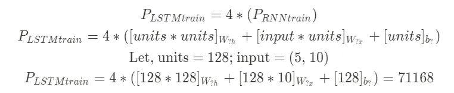

而从 RNN 切换到 LSTM 就像替换各自的函数调用一样简单，这可以从下面的代码中看出，

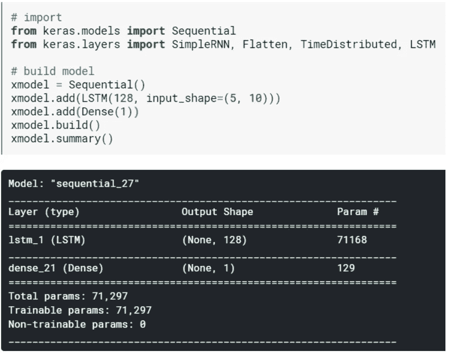

将 lstm_1 中提到的参数与我们计算的参数进行匹配。

我们可以再次从模型中提取所有的权重，

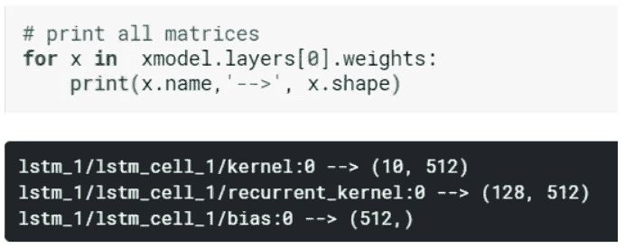

这里注意，所有 4 个*内核*矩阵和 4 个*递归 _ 内核*矩阵都存储在 1 个单块矩阵中(串联在列轴上)，因此维数为 128*4=512。偏差项也是如此。此外，几乎所有在 RNN 使用的参数在这里都适用。一个[附加参数警告](https://stackoverflow.com/questions/44947842/can-someone-explain-to-me-the-difference-between-activation-and-recurrent-activa)是`recurrent_activation`，其默认值为“sigmoid ”,应用于输入、遗忘和输出门，如公式中所示。这留下了实际的`activation`，它应用于单元格状态和隐藏状态(默认值为“tanh”)，如上面公式中所建议的。

# 结论

在 Keras 中，我们试图涵盖一些将理论和实践联系起来所需的基本主题。作为一个包含所有内在细节的完整指南，对于一篇文章来说太多了，我认为有很多资料可以很好地解释这个主题。我真正错过的是一些注释，这些注释将我在文章中看到的公式与 Keras 中真正实现的内容联系起来，并提供了一些额外的实用细节。希望这有所帮助！

干杯。

*文章中的所有代码已经被* [*上传到这里。*](https://www.kaggle.com/evilmage93/intro-to-recurrent-layers-in-keras)

*更多类似的文章请访问我的* [*网站*](http://mohitmayank.com) *并联系我@*[*LinkedIn*](https://www.linkedin.com/in/imohitmayank/)*。*