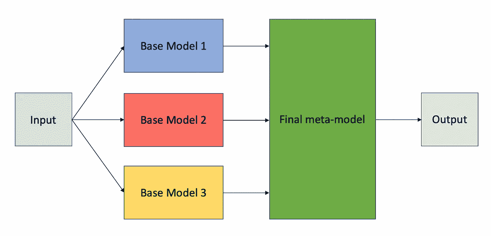

# 使用 Scikit-Learn 进行堆叠的实用指南

> 原文：<https://towardsdatascience.com/a-practical-guide-to-stacking-using-scikit-learn-91e8d021863d?source=collection_archive---------10----------------------->

## 如何使用堆叠构建更健壮的模型？


格雷格·罗森克在 [Unsplash](https://unsplash.com/s/photos/stacked?utm_source=unsplash&utm_medium=referral&utm_content=creditCopyText) 上的照片

# 介绍

在过去的 20 年中，集成方法，如随机森林和梯度推进，这些**使用投票或加权平均结合相同类型模型的几个实例来产生强模型**，已经变得非常流行。然而，还有另一种方法可以让我们**通过使用更高层次的模型**将它们各自的预测结合起来，从而获得不同模型的好处。

堆叠概括，也称为堆叠，是一种训练元模型以智能地组合不同基础模型的预测的方法。

**本文的目标不仅是解释这种赢得竞争的技术是如何工作的，而且还展示了如何用 Scikit-learn 中的几行代码来实现它。**

# 堆叠的工作原理

由于模型背后的假设所产生的偏见，每个机器学习模型都有优点和缺点。这是我在上一篇关于有监督机器学习的“没有免费的午餐”定理的帖子中提到的一个概念。

[](/what-no-free-lunch-really-means-in-machine-learning-85493215625d) [## “没有免费的午餐”在机器学习中真正意味着什么

### 揭开这个经常被误解的定理。

towardsdatascience.com](/what-no-free-lunch-really-means-in-machine-learning-85493215625d) 

不同的机器学习算法可能擅长以不同的方式解决问题。如果我们有多个算法一起工作来解决一个问题，一个算法的优点可能会掩盖另一个算法的缺点，反之亦然。这就是堆叠背后的想法。

堆叠包括训练多个**基础模型**来预测机器学习问题中的目标变量，同时**元模型**学习来使用每个基础模型的预测来预测目标变量的值。下图展示了这一想法。



堆叠模型的蓝图。图片由作者提供。

正确训练堆叠模型的算法遵循以下步骤:

1.  **将数据拆分成*k*-折叠就像在*k*-折叠** [**交叉验证**](https://en.wikipedia.org/wiki/Cross-validation_(statistics)) **。**
2.  **选择一个折叠进行验证，剩余的 *k-1* 折叠进行训练。**
3.  **在训练集上训练基础模型，在验证集上生成预测。**
4.  **对剩余的 *k-1* 褶皱重复步骤 2-3，并创建一个扩充数据集，将每个基础模型的预测作为附加特征包括在内。**
5.  **在扩充数据集上训练最终元模型。**

请注意，模型的每个部分都是单独训练的，元模型学习使用基础模型的预测和原始数据来预测最终输出。

对于那些不熟悉 *k* 折叠交叉验证的人来说，这是一种将机器学习问题的数据分成 *k* 折叠或不同子集，并在所有 *k* 折叠中迭代评估模型的技术。在每一次迭代中，一个折叠用于评估，剩余的 *k-1* 折叠用于训练模型。

使用一个 *k* 倍交叉验证分割确保了基础模型在看不见的数据上生成预测，因为基础模型将在每次迭代中在不同的训练集上被重新训练。

堆叠的力量在于最后一步，在这一步中**元模型实际上可以学习每个基础模型的优缺点，并智能地组合它们的预测，以产生最终的输出**。

# 使用 Scikit-Learn 的实际示例

Scikit-learn 0.22 中引入了 [StackingClassifier](https://scikit-learn.org/stable/modules/generated/sklearn.ensemble.StackingClassifier.html) 和 [StackingRegressor](https://scikit-learn.org/stable/modules/generated/sklearn.ensemble.StackingRegressor.html#sklearn.ensemble.StackingRegressor) 模块。因此，请务必升级到 Scikit 的最新版本——学习使用下面的 pip 命令来完成这个示例:

`pip install --upgrade scikit-learn`

## 导入基本库

我在下面导入的大多数基本库都是数据科学项目中常用的，应该不会感到意外。然而，我也使用了 Scikit-learn 中的 **make_classification** 函数来生成一些合成数据，并且我还使用了 **Plotly** 来构建交互图。为了嵌入互动的情节，我还使用了**数据面板**。

```
import numpy as np 
import pandas as pd
import matplotlib.pyplot as plt
import seaborn as sns
from sklearn.datasets import make_classification
import plotly.graph_objects as go
import datapane as dp
%matplotlib inline
```

## 生成数据集

Scikit-learn 的 **make_classification** 函数对于生成可用于测试不同算法的合成数据集非常有用。我在此场景中生成的数据集旨在基于以下参数，以实际难度表示二元分类问题:

*   **n_features —** 数据集中的要素数量，我将其设置为 20。
*   **n _ 信息和 n _ 冗余—** 数据集中信息和冗余要素的数量。我加入了五个多余的特性来增加问题的难度。
*   **n_clusters_per_class** —每个类中包含的聚类数。较高的值会使问题更加困难，所以我将这个值设置为五个集群。
*   **class_sep** —控制簇/类之间的分离。较大的值使任务更容易，所以我选择了一个低于默认值 1.0 的值 0.7。
*   **flip_y** —指定将被随机分配的分类标签的百分比。我将该值设置为 0.03，以便向数据集添加一些噪声。

```
X, y = make_classification(n_samples=50000, 
                           n_features=20, 
                           n_informative=15, 
                           n_redundant=5,
                           n_clusters_per_class=5,
                           class_sep=0.7,
                           flip_y=0.03,
                           n_classes=2)
```

## 培训和评估单个模型

为了获得与堆叠模型进行比较的基准性能水平，我对以下基本模型进行了培训和评估:

*   **有 50 棵决策树的随机森林**
*   **支持向量机(SVM)**
*   **K-最近邻(KNN)分类器**

为了代码的可重用性，模型都存储在一个字典中。

```
from sklearn.ensemble import RandomForestClassifier
from sklearn.svm import SVC
from sklearn.neighbors import KNeighborsClassifierfrom sklearn.model_selection import cross_val_score, RepeatedStratifiedKFold
from collections import defaultdictmodels_dict = {'random_forest':     RandomForestClassifier(n_estimators=50),
               'svm': SVC(),
               'knn': KNeighborsClassifier(n_neighbors=11)}
```

每个模型都使用重复的五重交叉验证策略进行验证，其中每个折叠都使用不同的随机样本集进行重复。在每一次折叠中，每个模型用 80%的数据进行训练，用剩下的 20%进行验证。

该方法为每个模型产生 10 个不同的准确度分数，这些分数存储在字典中，如下所示。

```
def evaluate_model(model, X, y):
    cv = RepeatedStratifiedKFold(n_splits=5, n_repeats=2, random_state=1)
    scores = cross_val_score(model, X, y, scoring='accuracy', cv=cv, verbose=1, n_jobs=3, error_score='raise')
    return scoresmodel_scores = defaultdict()for name, model in models_dict.items():
    print('Evaluating {}'.format(name))
    scores = evaluate_model(model, X, y)
    model_scores[name] = scores
```

## 可视化单个模型的结果

下面定义的函数获取所有评估模型的交叉验证分数字典，并使用 Plotly 创建一个交互式箱线图，以比较每个模型的性能。正如我在本文中所做的，这个函数还创建了一个数据面板报告来嵌入这些图。

```
def plot_results(model_scores, name):

    model_names = list(model_scores.keys())
    results = [model_scores[model] for model in model_names]
    fig = go.Figure()
    for model, result in zip(model_names, results):
        fig.add_trace(go.Box(
            y=result,
            name=model,
            boxpoints='all',
            jitter=0.5,
            whiskerwidth=0.2,
            marker_size=2,
            line_width=1)
        )

    fig.update_layout(
    title='Performance of Different Models Using 5-Fold Cross-Validation',
    paper_bgcolor='rgb(243, 243, 243)',
    plot_bgcolor='rgb(243, 243, 243)',
    xaxis_title='Model',
    yaxis_title='Accuracy',
    showlegend=False)
    fig.show()

    report = dp.Report(dp.Plot(fig) ) #Create a report
    report.publish(name=name, open=True, visibility='PUBLIC') plot_results(model_scores, name='base_models_cv')
```

三种基本型号的性能比较。

根据上面的箱线图，我们可以看到所有基本模型的平均准确率都超过了 87%，但支持向量机的平均表现最好。令人惊讶的是，一个简单的 KNN 分类器，通常被描述为“懒惰学习算法”，因为它只记住训练数据，明显优于有 50 个决策树的随机森林。

## 定义堆叠模型

现在让我们看看如果我们训练一个堆叠模型会发生什么。Scikit-learn 的 StackingClassifier 有一个构造函数，它需要一个基本模型列表，以及产生最终输出的最终元模型。请注意，在下面的代码中，这个基本模型的列表被格式化为带有模型名称和模型实例的元组列表。

堆叠模型使用随机森林、SVM 和 KNN 分类器作为基础模型，使用逻辑回归模型作为元模型，使用基础模型的数据和预测来预测输出。下面的代码演示了如何用 Scikit-learn 创建这个模型。

```
from sklearn.ensemble import StackingClassifier
from sklearn.neural_network import MLPClassifier
from sklearn.linear_model import LogisticRegressionCVbase_models = [('random_forest', RandomForestClassifier(n_estimators=50)),
               ('svm', SVC()),
               ('knn', KNeighborsClassifier(n_neighbors=11))]
meta_model = LogisticRegressionCV()
stacking_model = StackingClassifier(estimators=base_models, 
                                    final_estimator=meta_model, 
                                    passthrough=True, 
                                    cv=5,
                                    verbose=2)
```

## 评估堆叠模型

在下面的代码中，我简单地重用了我之前定义的函数来获取模型的交叉验证分数，并使用它来评估堆叠模型。

```
stacking_scores = evaluate_model(stacking_model, X, y)
model_scores['stacking'] = stacking_scores
```

## 可视化和比较结果

我重用了前面定义的绘图函数，使用并排箱线图来比较基本模型和堆叠模型的性能。

```
plot_results(model_scores, name='stacking_model_cv')
```

根据上面的图，我们可以清楚地看到堆叠带来了性能的提高，其中**堆叠模型优于所有基本模型，并且实现了接近 91%的中值精度**。使用 Scikit-learn 的 **StackingRegressor** 模块，可以对回归问题重复同样的过程，其行为方式类似。

# 堆叠的优点和缺点

像机器学习中的所有其他方法一样，堆叠有优点也有缺点。以下是堆叠的一些优势:

*   **叠加可以提高模型的性能。**
*   **叠加通过组合多个模型的预测来减少方差并创建更稳健的模型。**

请记住，堆叠也有以下缺点:

*   **与简单模型相比，堆叠模型的训练时间要长得多，并且需要更多内存。**
*   **使用堆叠模型生成预测通常会更慢，计算成本也更高。如果您计划将堆叠模型部署到产品中，那么考虑这个缺点是很重要的。**

# 摘要

叠加是一种很好的方式，通过结合不同模型的预测来利用它们的优势。这种方法已经被用来赢得机器学习比赛，由于 Scikit-learn，它非常容易实现。然而，堆栈带来的性能提高是以更长的训练和推理时间为代价的。

您可以在 [GitHub](https://github.com/AmolMavuduru/GuideToStacking) 上找到用于实际示例的完整代码。如果你喜欢这篇文章，请随意看看我最近写的一些关于机器学习的文章。

[](/what-no-free-lunch-really-means-in-machine-learning-85493215625d) [## “没有免费的午餐”在机器学习中真正意味着什么

### 揭开这个经常被误解的定理。

towardsdatascience.com](/what-no-free-lunch-really-means-in-machine-learning-85493215625d) [](/why-xgboost-cant-solve-all-your-problems-b5003a62d12a) [## 为什么 XGBoost 不能解决你所有的问题。

### XGBoost 和其他基于树的算法的一个关键限制。

towardsdatascience.com](/why-xgboost-cant-solve-all-your-problems-b5003a62d12a) [](/fake-news-classification-with-recurrent-convolutional-neural-networks-4a081ff69f1a) [## 基于递归卷积神经网络的假新闻分类

### 介绍

towardsdatascience.com](/fake-news-classification-with-recurrent-convolutional-neural-networks-4a081ff69f1a) 

# 来源

1.  D.H. Wolpert，，(1992)，神经网络*。*
2.  F.佩德雷戈萨*等，*[sci kit-learn:Python 中的机器学习](http://jmlr.csail.mit.edu/papers/v12/pedregosa11a.html)，(2011)，机器学习研究杂志。