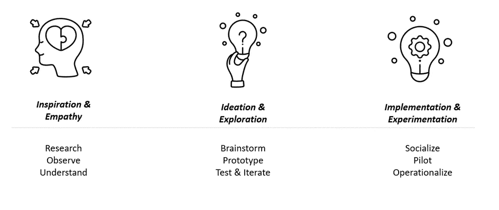
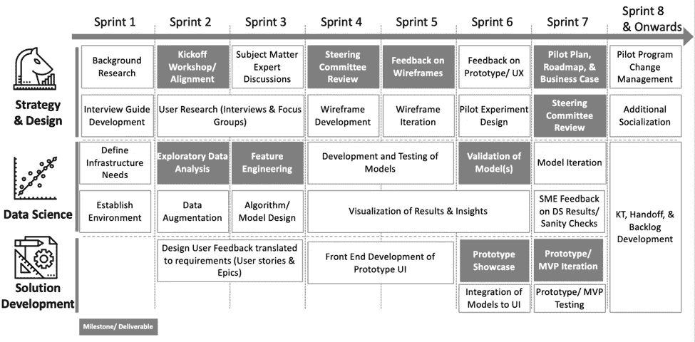

# 使用以人为中心的设计交付高级分析项目的实用指南

> 原文：<https://towardsdatascience.com/a-practical-guide-to-using-human-centered-design-to-deliver-advanced-analytics-projects-3c7795cf8cfc?source=collection_archive---------20----------------------->

使用以人为中心的设计可以降低高级分析项目的失败风险，并有助于推动员工和客户的创新

图片来自 [Sharon McCutcheon](https://www.pexels.com/@mccutcheon) 通过 Pexel

## **未来 3 年，企业面临在失败的分析和数据科学项目上浪费数十亿美元的风险:**

在过去的十年中，分析项目，尤其是高级分析项目的失败率非常低。数据和分析的业务采用仍然是一个问题，公司严重低估了这些项目的失败率

**绝大多数(77%)企业报告称，采用大数据和人工智能计划是一项挑战**[【1】](#_ftn1)通常是因为它们是在孤岛中设计的，处理的是错误的用例，而且企业领导人不认为它们会带来价值

不出所料， **85%的数据项目以失败告终**[【2】](#_ftn2)并且没有通过初步阶段，更不用说转变业务流程、功能或最终体验了

**尽管失败率很高，但企业正在寻求增加对数据和分析的投资**，92%的企业表示他们将在未来一年增加支出

如果这些举措的支出水平很低且增长迅速，那么加速的速度可能并不惊人。然而，2019 年，企业在人工智能系统上花费了近 375 亿美元。IDC 预计，到 2023 年，这一数字将超过 979 亿美元。如果这些项目的成功率没有提高，那么可能会有多达 900 亿美元花费在失败的计划上。

## **以人为中心的设计可以帮助我们更好地设计项目，克服这些障碍:**

三年前，我们推动我们的分析和数据科学团队使用设计思维来处理他们的所有项目，并将以人为中心的设计作为我们处理所有项目的基石——端到端。这使得通过 POC 阶段**的项目有 90%的成功率，并且**将这些项目整合到我们的日常业务中。

**我们将所有项目分为三个阶段:**

## **第一阶段-灵感和共鸣:**

在我们开始任何重要的分析或接触任何一个数据之前，我们会先进行用户/利益相关者研究和背景研究。我们的目标是真正了解我们所关注领域的需求和痛点。

如果我们为我们的财务团队处理预测，我们的目标是了解要建模的 KPI，并了解团队目前如何完成该流程，什么是容易的，什么是困难的，以及他们将来可能如何使用我们的解决方案。这完全是为了理解今天的流程，并思考我们如何设计解决方案来改善未来客户和员工的体验

我们不仅想了解使用什么模型，还想了解解决方案本身是什么样子的。团队是否需要进行模拟建模或假设分析，他们将如何使用模型中的解释，以及我们如何展示模型结果，从而为我们的员工或客户带来最积极的体验？

## **第二阶段——构思和探索:**

这个阶段从基于第一阶段所做工作的假设开始。然后，我们继续进行探索性数据分析，以帮助回答一些最初的假设，帮助我们更好地理解领域，并指导我们对特征工程的最初思考。

然后，我们集体讨论解决方案看起来像什么，关键要求是什么，以及如何将它融入我们员工的工作流程或我们客户的旅程，既作为原型/MVP，也作为我们解决方案的未来愿景。

根据这些会议的反馈创建原型，并将这些原型交到利益相关者、业务领域的主题专家以及最终用户/客户手中，这一点非常重要。在构建推荐引擎时，我们从高保真线框和体验模型开始，对于预测模型，它通常是仪表板以及我们应该包括的任何假设分析的参数，对于营销组合模型，我们的原型显示了模型如何支持所有渠道的投资决策。

这些是如何建立的各不相同。通常，我们从白板草图开始，转向 Figma 或 Sketch 等工具，然后使用 python libraries/ R shiny 或 in React 构建更高逼真度的版本。这些不需要完善到可以产业化。重点应该是可以快速构建的东西，以显示解决方案将如何工作，然后获得与我们的模型集成和与我们的业务部门试点所需的最低版本。

最后，还有我们模型本身的发展。我们从广泛的模型和特性选择开始，目标是向下选择 2-5 个模型进行广泛的调整和特性工程。我们的目标是平衡更透明和可解释的模型与整体模型性能(准确性、实现成本等)..).根据我们模型之间的性能差异，我们可能无法利用透明模型。这就导致我们花时间解释我们的模型，使用诸如 LIME 或 Shapley 值等技术来解释我们的最佳表现模型。

没有放之四海而皆准的方法，但是通常我们会发现，与实际开发和选择模型相比，我们会花费更多的时间来确保我们的模型和特性是可解释的。

## **第三阶段—实施和实验:**

通常是我们最长的阶段。这一阶段的目标是与我们的业务和利益相关者合作，将我们的原型引入现实世界并进行评估。这需要与业务合作来开发我们的实验设计的参数，了解有限的发布会是什么样子(在哪里，在哪些组中)，然后评估原型解决方案与现有的基准或控制组。

根据结果，我们为我们的解决方案构建或改进我们的业务案例，而不是工业化和扩展解决方案所需的路线图和工作。然后，我们要么经历第 1 阶段和第 2 阶段的加速版本以进行更广泛的发布，要么在构建下一版本的解决方案时扩展 MVP 以进行进一步的评估。

这个阶段也几乎总是需要重新思考业务流程和激励机制。适当设计的评估还将提供反馈，说明我们可能需要如何改变团队需要如何工作，或者他们当前的激励框架如何与我们希望我们的解决方案如何工作不一致。

## **这实际上是什么样子:**

上面的过程描述了我们一个大型高级分析 MVP 的实际项目计划(考虑构建一个推荐系统)。这个过程看起来非常像一个“敏捷”的方法，但是应该适合任何解决方案开发过程。我们的主要目标是确保:

我们每两周交付某种形式的可交付见解，或反馈原型

没有一个项目在进入第三阶段之前超过 16 周，理想的目标是在 8-12 周内进入第三阶段，如果不是更早的话

我们至少要与“指导委员会”联系两次，以获得反馈和任何需要做出的关键决策的帮助

这确保了我们不会在没有得到关于我们的解决方案的更广泛反馈的情况下花费太多时间，并让我们诚实地了解我们如何确定范围和开发我们的解决方案。我们的目标是在一个季度内与我们的业务合作伙伴一起推出足够好的产品。

虽然没有完美的流程，但我们发现上述方法在引导我们的高级分析解决方案被我们的业务合作伙伴采用并实际推动变革方面取得了巨大成功。我们希望更多的组织能够成功地使用设计主导的方法来开发分析项目，因为持续的高失败率对所有分析专业人员都是一种伤害。

[[1]](#_ftnref1)2019 年新华帝合作伙伴、大数据和人工智能高管调查

[【2】](#_ftnref2)[https://www . techrepublic . com/article/85-of-big-data-projects-fail-but-your-developers-can-help-yours-success/](https://www.techrepublic.com/article/85-of-big-data-projects-fail-but-your-developers-can-help-yours-succeed/)

[【3】](#_ftnref3)[https://new vantage . com/WP-content/uploads/2018/12/Big-Data-Executive-Survey-2019-findings . pdf](https://newvantage.com/wp-content/uploads/2018/12/Big-Data-Executive-Survey-2019-Findings.pdf)

[【4】](#_ftnref4)[https://www.idc.com/getdoc.jsp?containerId=prUS45481219](https://www.idc.com/getdoc.jsp?containerId=prUS45481219)