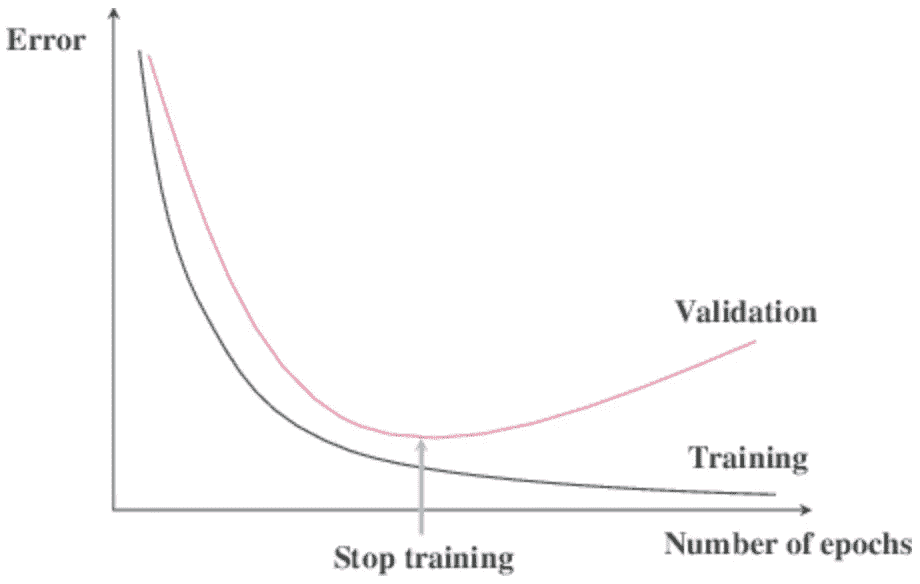
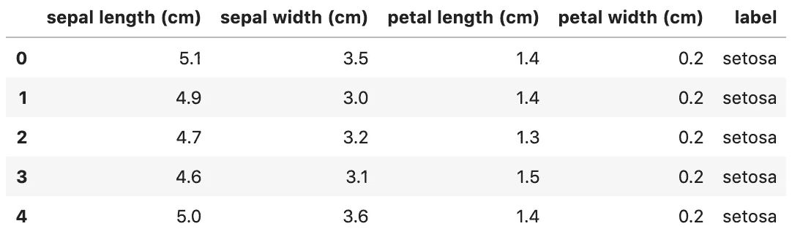
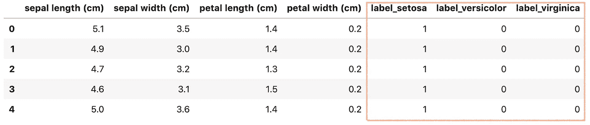
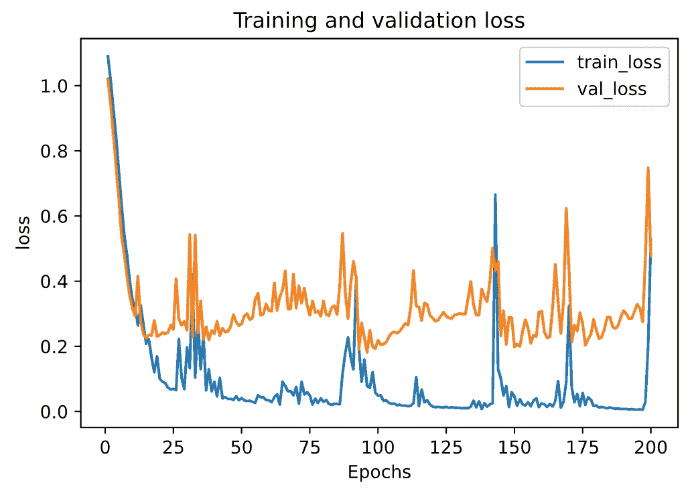
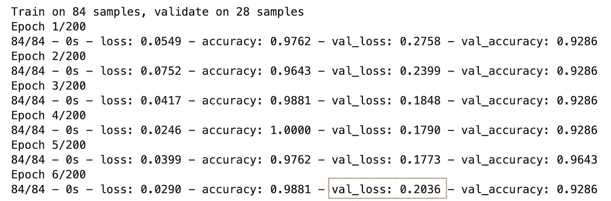
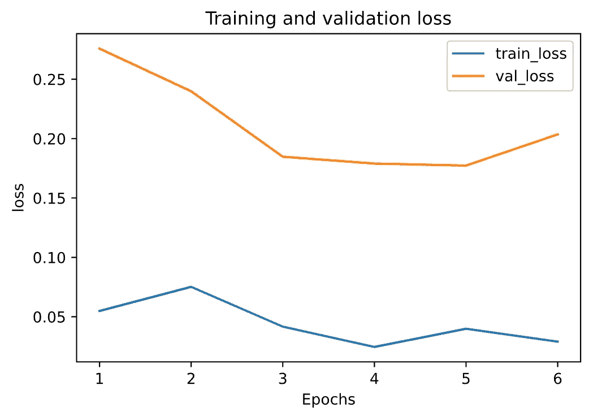
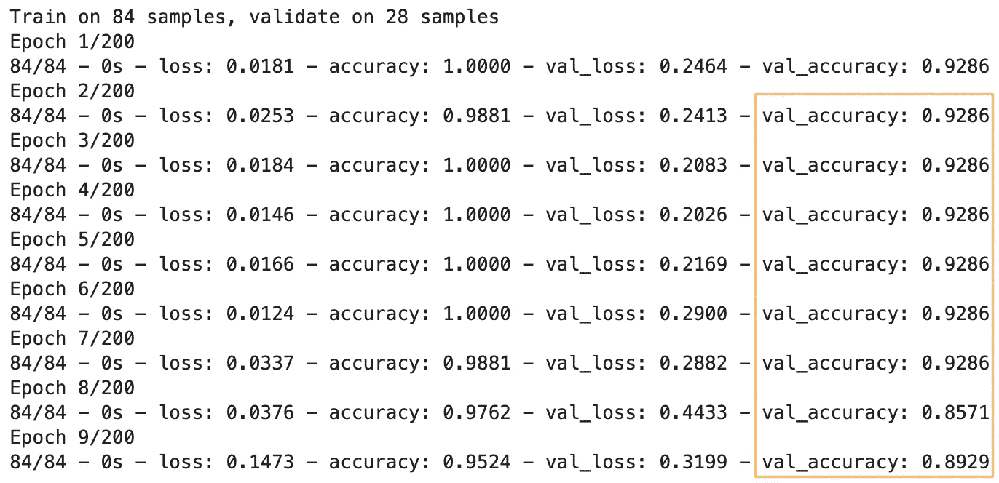
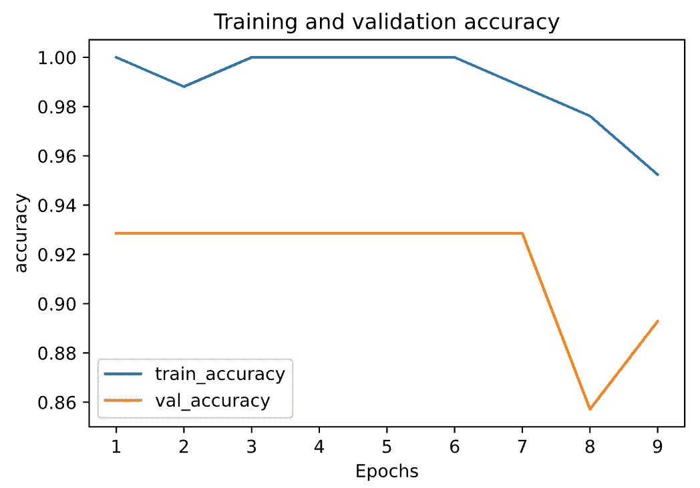

# 实践中的早期停止:以 Keras 和 TensorFlow 2.0 为例

> 原文：<https://towardsdatascience.com/a-practical-introduction-to-early-stopping-in-machine-learning-550ac88bc8fd?source=collection_archive---------3----------------------->

## 添加和自定义提前停止的分步教程


塞缪尔·伯克在 [Unsplash](https://unsplash.com/s/photos/machine-learning?utm_source=unsplash&utm_medium=referral&utm_content=creditCopyText) 上的照片

在本文中，我们将重点关注在我们的机器学习模型中添加和定制早期停止，并查看我们如何在 Keras 和 TensorFlow 2.0 的实践中做到这一点的示例。

# 提前停止简介

在机器学习中，早期停止是最广泛使用的[正则化技术](/machine-learning-model-regularization-in-practice-an-example-with-keras-and-tensorflow-2-0-52a96746123e)之一，用于对抗 ***过拟合*** 问题。

> 早期停止在训练期间监视保持的验证集上每个时期的模型性能，并根据验证性能终止训练。
> 
> 来自动手 ML [1]

早期停止是一种非常不同的正则化机器学习模型的方法。其方法是，一旦验证误差达到最小值，就停止训练。下图显示了一个正在训练的模型。



随着时代的推移，算法倾斜，它在训练集上的误差自然下降，在验证集上的误差也下降。然而，过了一段时间后，验证误差停止下降，实际上开始回升。这表明模型已经开始过度拟合训练数据。通过提前停止，只要验证误差达到最小值，您就可以停止训练。

这是一种简单而有效的规则化技术，杰弗里·辛顿称之为“美丽的免费午餐”[1].

## 随机和小批量梯度下降

随着随机和小批量梯度下降，曲线不是那么平滑，可能很难知道你是否达到了最小值。一种解决方案是，仅在验证误差超过最小值一段时间后停止(当您确信模型不会做得更好时)，然后将模型参数回滚到验证误差最小的点。

在下面的文章中，我们将在我们的机器学习模型中添加和定制早期停止。

# 环境设置和数据集准备

我们将使用我们在[模型正则化](/machine-learning-model-regularization-in-practice-an-example-with-keras-and-tensorflow-2-0-52a96746123e)和[批量归一化](/batch-normalization-in-practice-an-example-with-keras-and-tensorflow-2-0-b1ec28bde96f)中使用的相同数据集。如果你已经熟悉这一章，你可以跳过它。

为了运行本教程，您需要安装

> *TensorFlow 2，numpy，pandas，sklean，matplotlib*

它们都可以直接安装在 vis PyPI 上，我强烈建议创建一个新的虚拟环境。关于创建 Python 虚拟环境的教程

*   [使用“virtualenv”创建虚拟环境，并将其添加到 Jupyter 笔记本中](/create-virtual-environment-using-virtualenv-and-add-it-to-jupyter-notebook-6e1bf4e03415)
*   [使用“conda”创建虚拟环境，并将其添加到 Jupyter 笔记本中](https://medium.com/analytics-vidhya/create-virtual-environment-using-conda-and-add-it-to-jupyter-notebook-d319a81dfd1)

# 源代码

这是一个循序渐进的教程，所有的说明都在这篇文章中。源代码请查看我的 Github [机器学习报告](https://github.com/BindiChen/machine-learning/blob/master/tensorflow2/005-early-stopping/early-stopping.ipynb)。

# 数据集准备

本教程使用[安德森鸢尾花(iris)](https://en.wikipedia.org/wiki/Iris_flower_data_set) 数据集进行演示。数据集包含五个属性下的一组 150 条记录:*萼片长度*、*萼片宽度*、*花瓣长度*、*花瓣宽度、*和*类*(从 sklearn 数据集称为*目标*)。

首先，让我们导入库并从 ***scikit-learn*** 库中获取虹膜数据集。你也可以从 [UCI 虹膜数据集](https://archive.ics.uci.edu/ml/datasets/iris)下载。

```
import tensorflow as tf
import pandas as pd
import numpy as np
import matplotlib.pyplot as plt
from sklearn.datasets import load_iris
from sklearn.model_selection import train_test_split**iris = load_iris()**
```

为了研究数据，让我们将数据加载到一个数据帧中

```
# Load data into a DataFrame
**df = pd.DataFrame(iris.data, columns=iris.feature_names)** # Convert datatype to float
**df = df.astype(float)** # append "target" and name it "label"
**df['label'] = iris.target** # Use string label instead
**df['label'] = df.label.replace(dict(enumerate(iris.target_names)))**
```

并且`df`应该如下所示:



我们注意到 ***标签*** 列是一个分类特征，需要将其转换为[一键编码](/what-is-one-hot-encoding-and-how-to-use-pandas-get-dummies-function-922eb9bd4970)。否则，我们的机器学习算法将无法直接将其作为输入。

```
# label -> one-hot encoding
**label = pd.get_dummies(df['label'], prefix='label')**
**df = pd.concat([df, label], axis=1)**
# drop old label
df.drop(['label'], axis=1, inplace=True)
```

现在，`df`应该是这样的:



接下来，让我们创建`X`和`y`。Keras 和 TensorFlow 2.0 只接受 Numpy 数组作为输入，所以我们必须将 DataFrame 转换回 Numpy 数组。

```
# Creating X and y**X = df[['sepal length (cm)', 'sepal width (cm)', 'petal length (cm)', 'petal width (cm)']]**
# Convert DataFrame into np array
**X = np.asarray(X)y = df[['label_setosa', 'label_versicolor', 'label_virginica']]** # Convert DataFrame into np array
**y = np.asarray(y)**
```

最后，让我们使用来自 **sklearn** 库中的`**train_test_split()**` 将数据集拆分成训练集(80%)和测试集(20%)。

```
X_train, X_test, y_train, y_test = **train_test_split**(
  **X,
  y,
  test_size=0.20**
)
```

太好了！我们的数据已经准备好建立一个机器学习模型。

# 建立一个神经网络

用 Keras 和 TensorFlow 2.0 创建机器学习模型有 [3 种方法。由于我们正在构建一个简单的全连接神经网络，为了简单起见，让我们使用最简单的方法:带有`Sequential()`的顺序模型。](/3-ways-to-create-a-machine-learning-model-with-keras-and-tensorflow-2-0-de09323af4d3)

让我们继续创建一个名为`create_model()`的函数来返回一个序列模型。

```
from tensorflow.keras.models import Sequential
from tensorflow.keras.layers import Densedef **create_model()**: 
    model = Sequential([
        Dense(64, activation='relu', **input_shape=(4,)**),
        Dense(128, activation='relu'),
        Dense(128, activation='relu'),
        Dense(128, activation='relu'),
        Dense(64, activation='relu'),
        Dense(64, activation='relu'),
        Dense(64, activation='relu'),
        **Dense(3, activation='softmax')**
    ])
    return model
```

我们的型号有以下规格:

*   第一层(也称为输入层)有`input_shape`来设置输入大小`(4,)`
*   输入层有 64 个单元，接着是 3 个密集层，每个层有 128 个单元。然后还有 3 个密集层，每个层有 64 个单元。所有这些层都使用 ReLU 激活功能。
*   输出密集层有 3 个单元和 softmax 激活功能。

## 编译和训练模型

为了训练一个模型，我们首先必须使用`compile()`配置我们的模型，并传递以下参数:

*   使用 Adam ( `adam`)优化算法作为优化器
*   对于我们的 ***多类分类*** 问题，使用分类交叉熵损失函数(`categorical_crossentropy`
*   为简单起见，使用`accuracy`作为我们在训练和测试期间评估模型的评估指标。

```
model.compile(
    **optimizer='adam', 
    loss='categorical_crossentropy', 
    metrics=['accuracy']**
)
```

之后，我们可以调用`model.fit()`来使我们的模型适合训练数据。

```
history = model.fit(
    X_train, 
    y_train, 
    **epochs=200, 
    validation_split=0.25, 
    batch_size=40,** 
    verbose=2
)
```

如果一切顺利，我们应该得到如下输出

```
Train on 84 samples, validate on 28 samples
Epoch 1/200
84/84 - 1s - loss: 1.0901 - accuracy: 0.3214 - val_loss: 1.0210 - val_accuracy: 0.7143
Epoch 2/200
84/84 - 0s - loss: 1.0163 - accuracy: 0.6905 - val_loss: 0.9427 - val_accuracy: 0.7143
......
Epoch 200/200
84/84 - 0s - loss: 0.5269 - accuracy: 0.8690 - val_loss: 0.4781 - val_accuracy: 0.8929
```

## 绘制学习曲线

最后，让我们在训练集和验证集上绘制损失对时期图。

最好创建一个小函数来绘制指标。我们继续创建一个函数`plot_metric()`。

```
%matplotlib inline
%config InlineBackend.figure_format = 'svg'def **plot_metric(history, metric)**:
    train_metrics = history.history[metric]
    val_metrics = history.history['val_'+metric]
    epochs = range(1, len(train_metrics) + 1)
    plt.plot(epochs, train_metrics)
    plt.plot(epochs, val_metrics)
    plt.title('Training and validation '+ metric)
    plt.xlabel("Epochs")
    plt.ylabel(metric)
    plt.legend(["train_"+metric, 'val_'+metric])
    plt.show()
```

通过运行`plot_metric(history, 'loss')`获得损失进度图。



从上面的图表中，**我们可以看到，该模型对训练数据进行了过度拟合，因此其性能优于验证集**。

## 添加提前停止

Keras 模块包含一个内置的回调函数，用于提前停止[2]。

首先，让我们导入`EarlyStopping`回调并创建一个提前停止对象`early_stopping`。

```
from tensorflow.keras.callbacks import **EarlyStopping****early_stopping = EarlyStopping()**
```

`EarlyStopping()`有几个选项和默认:

*   `monitor='val_loss'`:使用验证损失作为绩效衡量标准，终止培训。
*   `patience=0`:没有改善的时代数。值`0`意味着一旦性能测量从一个时期到下一个时期变得更差，就终止训练。

接下来，我们只需要将回调对象传递给`model.fit()`方法。

```
history = model.fit(
    X_train, 
    y_train, 
    epochs=200, 
    validation_split=0.25, 
    batch_size=40, 
    verbose=2,
    **callbacks=[early_stopping]**
)
```

您可以看到`early_stopping`在一个列表中被传递给了`callbacks`参数。这是一个列表，因为在实践中，我们可能会为执行不同的任务传递许多回调，例如调试和学习率调度。

通过执行该语句，您应该得到如下所示的输出:



**注意:**由于权重初始化不同，您的输出可能会有所不同。

由于`val_loss`值的增加，训练在时期 6 终止，这正是条件`monitor='val_loss'`和`patience=0`。

看一个剧情往往更方便，我们来运行`plot_metric(history, 'loss')`来一个清晰的画面。在下图中，验证损失显示为橙色，很明显，验证误差在第 6 时段增加。



## 定制提前停止

除了我们之前提到的选项`monitor`和`patience`之外，另外两个选项`min_delta`和`mode`可能会经常使用。

*   `monitor='val_loss'`:使用验证损失作为绩效衡量标准，终止培训。
*   `patience=0`:无改善的时期数。值`0`意味着一旦性能测量从一个时期到下一个时期变得更差，就终止训练。
*   `**min_delta**`:符合改善条件的监测量的最小变化，即小于`min_delta`的绝对变化，将被视为无改善。
*   `**mode='auto'**`:应为`auto`、`min`或`max`中的一种。在`'min'`模式下，当监控的数量停止减少时，训练将停止；在`'max'`模式下，当监控的数量停止增加时，它将停止；在`'auto'`模式下，方向由监控量的名称自动推断。

这是一个定制的提前停止的例子:

```
custom_early_stopping = EarlyStopping(
    **monitor='val_accuracy',** 
    **patience=8,** 
    **min_delta=0.001,** 
    **mode='max'**
)
```

`monitor='val_accuracy'`使用**验证准确度**作为绩效衡量标准来终止培训。`patience=8`表示训练在 8 个周期后终止，没有改善。`min_delta=0.001`表示验证准确度必须至少提高 0.001 才能算作改进。`mode='max'`表示当监控的数量停止增加时，它将停止。

让我们继续用定制的提前停止来运行它。

```
history = model.fit(
    X_train, 
    y_train, 
    epochs=200, 
    validation_split=0.25, 
    batch_size=40, 
    verbose=2,
    **callbacks=[custom_early_stopping]**
)
```



这一次，训练在时期 9 终止，因为有 8 个时期在验证准确性上没有改进(它必须≥ 0.001 才能算作改进)。为了清晰起见，让我们通过运行`plot_metric(history, 'accuracy')`来看看精确度的图形表示。在下图中，验证准确性显示为橙色，很明显验证准确性没有任何提高。



# 好了

感谢阅读。

请在我的 Github 笔记本上查看源代码。

如果你对机器学习的实用方面感兴趣，请继续关注。

# 参考

*   [1]使用 scikit-learn、keras 和 tensorflow 进行机器实践学习:构建智能系统的概念、工具和技术
*   [2] [提前停止的 Keras 官方文件](https://keras.io/api/callbacks/early_stopping/)