# TensorFlow 2 中 Keras 回调的实用介绍

> 原文：<https://towardsdatascience.com/a-practical-introduction-to-keras-callbacks-in-tensorflow-2-705d0c584966?source=collection_archive---------14----------------------->

## 最常用的 Keras 回调 API 教程

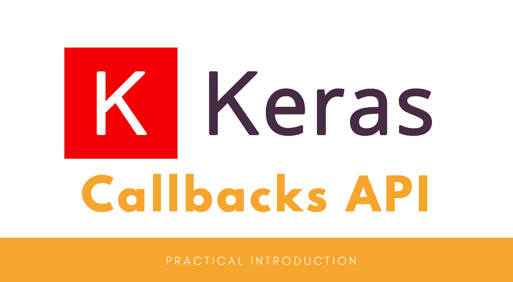

作者使用[www.canva.com](http://www.canva.com)制作的图像

当训练机器学习模型时，我们希望能够监控模型性能，并根据这些性能指标执行某些操作。这就是 Keras 回调的原因。

回调是对象 TensorFlow 和 Keras 的一种重要类型，它们被设计成能够在训练运行中的某些点上监视度量中的性能，并执行一些可能依赖于那些度量值中的性能的动作。

在本文中，我们将借助一些例子来探索以下流行的 Keras 回调 API。

1.  `EarlyStopping`:为提前停止而设计的回调。
2.  `CSVLogger`:回调将 epoch 结果流至 CSV 文件。
3.  `ModelCheckpoint`:训练时保存 Keras 模型或模型权重的回调
4.  `ReduceLROnPlateau`:当指标停止改善时，回调以降低学习率。
5.  `LearningRateScheduler`:对 [**学习率计划表**](/learning-rate-schedule-in-practice-an-example-with-keras-and-tensorflow-2-0-2f48b2888a0c) 的回调。
6.  `LambdaCallback`:动态创建定制回调的回调。

请查看[我的 Github repo](https://github.com/BindiChen/machine-learning/blob/master/tensorflow2/007-keras-callback/keras-callbacks.ipynb) 获取源代码。

# 1.提前停止

`EarlyStopping`是为[提前停止](/a-practical-introduction-to-early-stopping-in-machine-learning-550ac88bc8fd)设计的内置回调。首先，让我们导入它并创建一个提前停止对象:

```
from tensorflow.keras.callbacks import **EarlyStopping****early_stopping = EarlyStopping()**
```

`EarlyStopping()`有一些选项，默认情况下:

*   `monitor='val_loss'`:使用验证损失作为绩效衡量标准，终止培训。
*   `patience=0`:是没有改善的时期数。值`0`意味着一旦性能测量从一个时期到下一个时期变得更差，就终止训练。

接下来，我们只需要将回调对象传递给`model.fit()`方法。

```
history = model.fit(
    X_train, 
    y_train, 
    epochs=50, 
    validation_split=0.20, 
    batch_size=64, 
    verbose=2,
    **callbacks=[early_stopping]**
)
```

您可以看到,`early_stopping`在一个列表中被传递给了`callbacks`参数。这是一个列表，因为在实践中，我们可能会为执行不同的任务传递许多回调，例如，调试和[学习速率时间表](/learning-rate-schedule-in-practice-an-example-with-keras-and-tensorflow-2-0-2f48b2888a0c)。

通过执行该语句，您应该得到如下所示的输出:

```
Train on 8000 samples, validate on 2000 samples
Epoch 1/50
8000/8000 - 6s - loss: 1.5632 - accuracy: 0.5504 - val_loss: 1.1315 - val_accuracy: 0.6605
......
......
Epoch 10/50
8000/8000 - 2s - loss: 0.5283 - accuracy: 0.8213 - val_loss: 0.5539 - val_accuracy: 0.8170
Epoch 11/50
8000/8000 - 2s - loss: 0.5141 - accuracy: 0.8281 - **val_loss: 0.5644** - val_accuracy: 0.7990
```

由于`val_loss`值的增加，训练在时期 11 终止，这正是条件`monitor='val_loss'`和`patience=0`。

看一个剧情往往更方便，我们来运行`plot_metric(history, 'loss')`来一个清晰的画面。在下图中，验证损失显示为橙色，很明显，验证误差在第 11 时段增加。

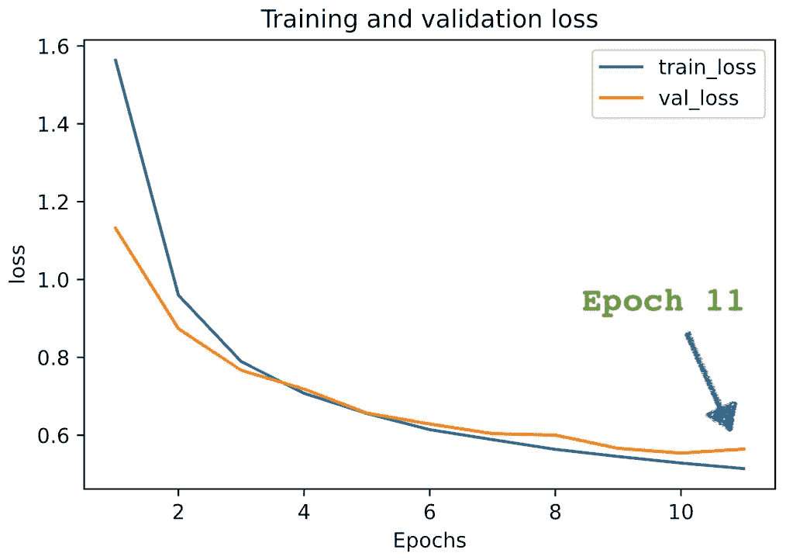

图片由作者制作(请查看[笔记本](https://github.com/BindiChen/machine-learning/blob/master/tensorflow2/007-keras-callback/keras-callbacks.ipynb))

## 争论

除了我们之前提到的选项`monitor`和`patience`之外，另外两个选项`min_delta`和`mode`可能会经常使用。

```
EarlyStopping(
    monitor='val_loss', 
    patience=0, 
    min_delta=0, 
    mode='auto'
)
```

*   `monitor='val_loss'`:使用验证损失作为绩效衡量标准，终止培训。
*   `patience=0`:无改善的时期数。值`0`意味着一旦性能测量从一个时期到下一个时期变得更差，就终止训练。
*   `**min_delta**`:符合改善条件的监控量的最小变化，即小于`min_delta`的绝对变化，将被视为无改善。
*   `**mode='auto'**`:应为`auto`、`min`或`max`中的一种。在`'min'`模式下，当监控量停止下降时，训练将停止；在`'max'`模式下，当监控的数量停止增加时，它将停止；在`'auto'`模式下，方向自动从监控量的名称推断出来。

这是一个定制的提前停止的例子:

```
custom_early_stopping = EarlyStopping(
    **monitor='val_accuracy',** 
    **patience=3,** 
    **min_delta=0.001,** 
    **mode='max'**
)
```

`monitor='val_accuracy'`使用**验证准确度**作为绩效衡量标准来终止培训。`patience=3`表示训练在 3 个周期后终止，没有改善。`min_delta=0.001`表示验证准确度必须至少提高 0.001 才能算作改进。`mode='max'`表示当监控的数量停止增加时，它将停止。

让我们继续，使用定制的提前停止运行它，并绘制精度图。

```
Train on 8000 samples, validate on 2000 samples
Epoch 1/50
......
Epoch 12/50
8000/8000 - 2s - loss: 0.5043 - accuracy: 0.8290 - val_loss: 0.5311 - val_accuracy: 0.8250
Epoch 13/50
8000/8000 - 3s - loss: 0.4936 - accuracy: 0.8332 - val_loss: 0.5310 - **val_accuracy: 0.8155**
Epoch 14/50
8000/8000 - 2s - loss: 0.4835 - accuracy: 0.8353 - val_loss: 0.5157 - **val_accuracy: 0.8245**
Epoch 15/50
8000/8000 - 2s - loss: 0.4757 - accuracy: 0.8397 - val_loss: 0.5299 - **val_accuracy: 0.8060**
```

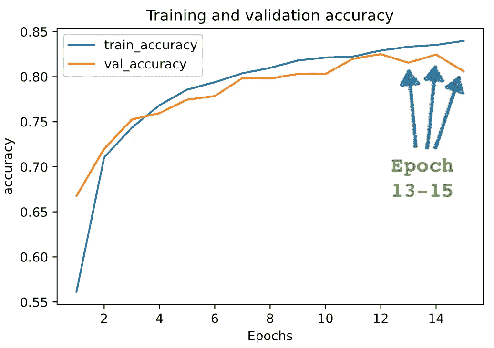

图片由作者制作(请查看[笔记本](https://github.com/BindiChen/machine-learning/blob/master/tensorflow2/007-keras-callback/keras-callbacks.ipynb))

这一次，训练在时期 15 终止，因为有 3 个时期在验证准确性上没有改进(它必须≥ 0.001 才能算作改进)。

有关提前停止的更多信息，请查看这篇文章:

[](/a-practical-introduction-to-early-stopping-in-machine-learning-550ac88bc8fd) [## 机器学习中早期停止的实用介绍

### 使用 Keras 和 TensorFlow 2.0 添加和自定义提前停止的分步教程

towardsdatascience.com](/a-practical-introduction-to-early-stopping-in-machine-learning-550ac88bc8fd) 

# 2.CSVLogger

`CSVLogger`是一个回调函数，将 epoch 结果转换成一个 CSV 文件。首先，让我们导入它并创建一个`CSVLogger`对象:

```
from tensorflow.keras.callbacks import **CSVLogger****csv_log = CSVLogger("results.csv")**
```

接下来，我们只需要将`**csv_log**`对象传递给`model.fit()`方法。

```
history_csv_logger = model.fit(
    X_train, 
    y_train, 
    epochs=10, 
    validation_split=0.20, 
    batch_size=64, 
    verbose=2,
    **callbacks=[csv_log]**
)
```

培训完成后，我们可以查看 CSV 文件中的信息

```
import pandas as pd**pd.read_csv("results.csv", index_col='epoch')**
```

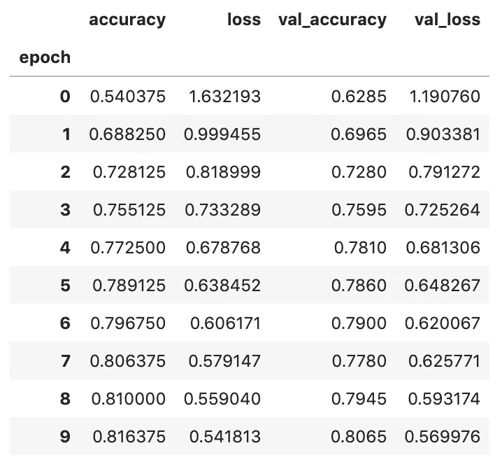

图片由作者制作(请查看[笔记本](https://github.com/BindiChen/machine-learning/blob/master/tensorflow2/007-keras-callback/keras-callbacks.ipynb))

## 争论

除了强制参数`filename`之外，其他两个选项`separator`和`append`可能会经常使用。

```
CSVLogger(filename, separator=',', append=False)
```

*   `filename`:CSV 文件的文件名。
*   `**separator**`:用于分隔 CSV 文件中元素的字符串。
*   `**append**`:布尔型，默认为`False`，`True`如果文件存在则追加(对继续培训有用)。`False`:覆盖现有文件。

# 3.模型检查点

`ModelCheckpoint`是一个回调，用于在训练期间保存 Keras 模型或模型权重，以便稍后可以加载模型或权重，以从保存的状态继续训练。

首先，让我们导入它并创建一个`ModelCheckpoint`对象:

```
from tensorflow.keras.callbacks import **ModelCheckpoint**checkpoint_path = 'model_checkpoints/'checkpoint = ModelCheckpoint(
    **filepath=checkpoint_path,**
    **save_freq='epoch',**
    **save_weights_only=True,**
    verbose=1
)
```

接下来，让我们将`checkpoint`对象传递给`model.fit()`方法进行训练。

```
history_checkpoint = model.fit(
    X_train, 
    y_train, 
    epochs=10, 
    validation_split=0.20, 
    batch_size=64, 
    verbose=2,
    **callbacks=[checkpoint]**
)
```

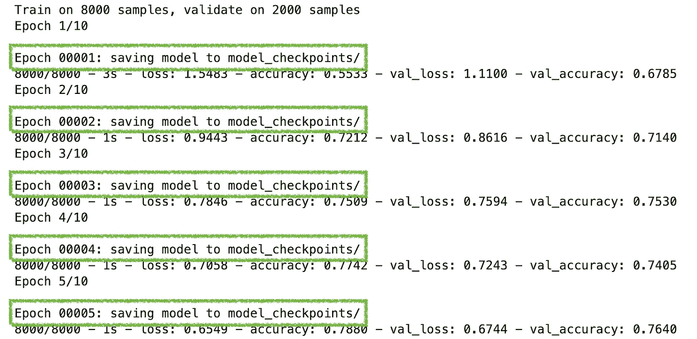

图片由作者制作(请查看[笔记本](https://github.com/BindiChen/machine-learning/blob/master/tensorflow2/007-keras-callback/keras-callbacks.ipynb))

在培训过程中，我们应该能够看到上面的打印输出。

训练完成后，我们可以通过运行以下命令来获得测试准确性:

```
>>> get_test_accuracy(model, X_test, y_test)
**accuracy: 0.779**
```

## 装载重量

让我们创建一个新模型`new_model`来演示负重是如何工作的。通过运行`get_test_accuracy(new_model, X_test, y_test)`，我们得到了一个没有加载任何训练过的砝码的模型的测试精度 **0.086** 。

```
# Create a new model
>>> new_model = create_model()# Without loading weight
>>> get_test_accuracy(new_model, X_test, y_test)
**accuracy: 0.086**
```

接下来，我们用`load_weights('model_checkpoints/')`加载砝码，再次得到它的测试精度。这一次，我们应该能够看到与我们训练模型`model`相同的准确性。

```
# Load weights
>>> new_model.load_weights('model_checkpoints/')
>>> get_test_accuracy(new_model, X_test, y_test)
**accuracy: 0.779**
```

## 争论

下面是使用`ModelCheckpoint`回调时你应该知道的常用参数

*   `filepath` : string 或`PathLike`，保存模型文件的路径。`filepath`可以包含命名的格式化选项，例如，如果`filepath`是`weights.{epoch:02d}-{val_loss:.2f}`，那么模型检查点将与纪元编号和验证损失一起保存在文件名中。
*   `save_freq` : `'epoch'`或整数。使用`'epoch'`时，回调在每个时期后保存模型。当使用 integer 时，回调在这许多批的末尾保存模型。
*   `save_weights_only`:如果`True`，则只保存模型的权重(`model.save_weights(filepath)`)，否则保存整个模型(`model.save(filepath)`)。

# 4.ReduceLROnPlateau

`ReduceLROnPlateau`是一种回调，用于在指标停止改善时降低学习率。该回调监控一个量，如果在一个`patience`数量的周期内没有看到改善，则学习率减少`factor`值(`new_lr = lr * factor`)。让我们借助一个例子来看看这是如何工作的。

首先，让我们导入它并创建一个`ReduceLROnPlateau`对象:

```
from tensorflow.keras.callbacks import ReduceLROnPlateaureduce_lr = ReduceLROnPlateau(
    **monitor='val_loss', 
    factor=0.2,   
    patience=2, 
    min_lr=0.001,**
    verbose=2
)
```

`monitor='val_loss'`使用**验证损失**作为降低学习率的绩效衡量标准。`patience=2`表示学习率在 2 个周期后降低，但没有改善。`min_delta=0.001`表示验证损失必须至少改善 0.001 才能算作改善。`factor=0.2`表示新的学习率将随着`new_lr = lr * factor`减少。

让我们用`reduce_lr`回调来训练模型

```
history_reduce_lr = model.fit(
    X_train, 
    y_train, 
    epochs=50, 
    validation_split=0.20, 
    batch_size=64, 
    verbose=2,
    **callbacks=[reduce_lr]**
)
```

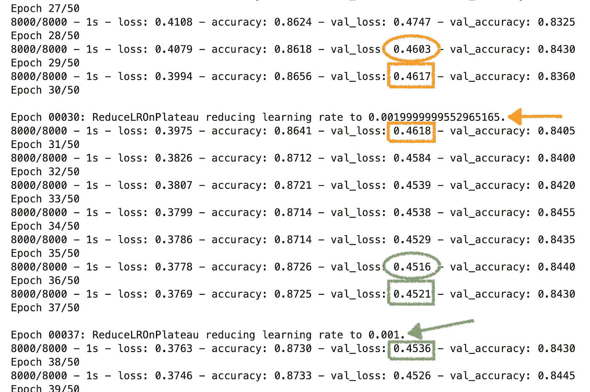

图片由作者制作(请查看[笔记本](https://github.com/BindiChen/machine-learning/blob/master/tensorflow2/007-keras-callback/keras-callbacks.ipynb)

您应该得到如上所示的输出。在上面的输出中，`ReduceLROnPlateau`回调已经在时间点 30 和 37 被触发。

让我们画出学习率和损失的图表，以便清楚地了解情况。

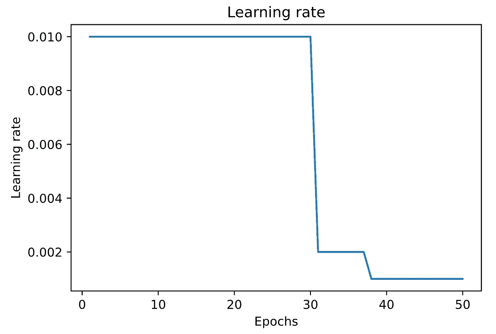

图片由作者制作(请查看[笔记本](https://github.com/BindiChen/machine-learning/blob/master/tensorflow2/007-keras-callback/keras-callbacks.ipynb))

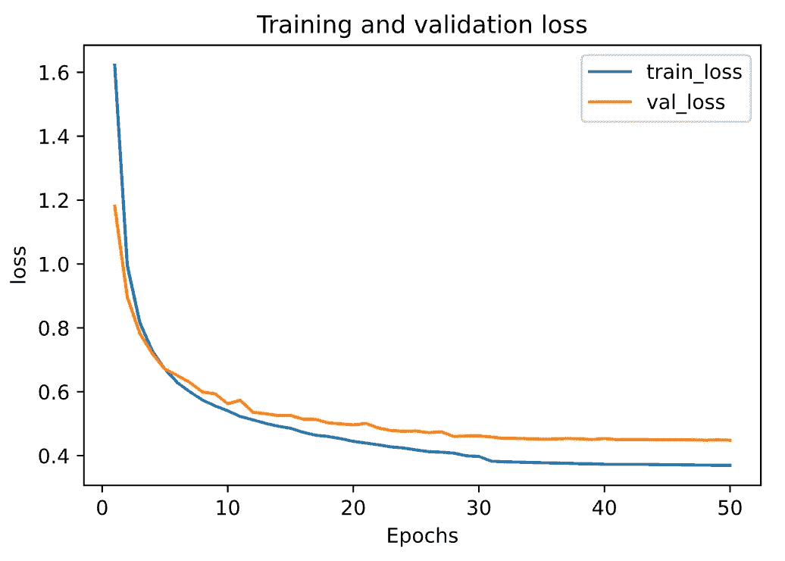

图片由作者制作(请查看[笔记本](https://github.com/BindiChen/machine-learning/blob/master/tensorflow2/007-keras-callback/keras-callbacks.ipynb))

## 争论

下面是使用`ReduceLROnPlateau`回调时你应该知道的常用参数

*   `monitor='val_loss'`:使用验证损失作为性能指标，降低学习率。
*   `factor`:学习率降低的系数。`new_lr = lr * factor`。
*   `patience`:无改善的时期数。
*   `min_delta`:符合改善条件的监控量的最小变化，即小于`min_delta`的绝对变化，将被视为无改善。
*   `mode='auto'`:应为`auto`、`min`或`max`中的一种。在`'min'`模式下，当监控量停止下降时，学习率将会降低；在`'max'`模式中，当监控的数量停止增加时，学习率将降低；在`'auto'`模式下，方向由监控量的名称自动推断。
*   `min_lr`:学习率的下限。

# 5.学习率计划程序

在训练神经网络时，随着训练的进行降低学习速率通常是有用的。这可以通过使用**学习速率表**或**自适应学习速率**来完成。`LearningRateScheduler`是**学习率计划**的内置回调。

有关学习费率表的更多详细信息，请查看以下文章:

[](/learning-rate-schedule-in-practice-an-example-with-keras-and-tensorflow-2-0-2f48b2888a0c) [## 实践中的学习率计划:以 Keras 和 TensorFlow 2.0 为例

### 训练一个神经网络的一个痛苦的事情是我们必须处理的超参数的绝对数量…

towardsdatascience.com](/learning-rate-schedule-in-practice-an-example-with-keras-and-tensorflow-2-0-2f48b2888a0c) 

让我们借助一个例子来看看`LearningRateScheduler`是如何工作的。

首先，让我们导入它并创建一个调度函数:

```
from tensorflow.keras.callbacks import LearningRateSchedulerdef **lr_decay**(epoch, lr):
    if epoch != 0 and epoch % 5 == 0:
        return lr * 0.2
    return lr
```

`lr_decay()`取 2 个参数`epoch`(当前纪元)& `lr`(当前学习率)，返回一个新的学习率。我们的`lr_decay()`函数将每 5 个历元将学习率降低 0.2 倍。

让我们用`reduce_lr`回调来训练模型

```
history_lr_schedule = model.fit(
    X_train, 
    y_train, 
    epochs=20, 
    validation_split=0.20, 
    batch_size=64, 
    verbose=2,
    callbacks=[**LearningRateScheduler(lr_decay, verbose=1)**]
)
```

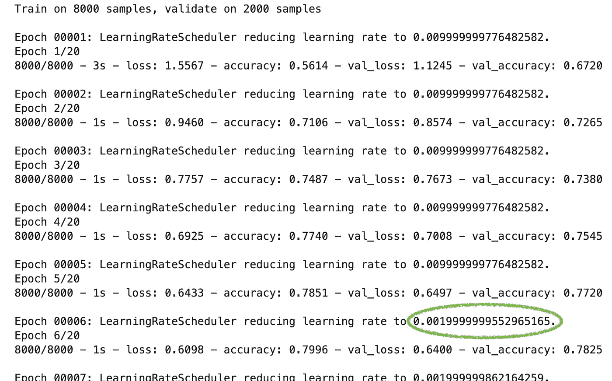

您应该得到如上所示的输出。下面是学习率的曲线图。

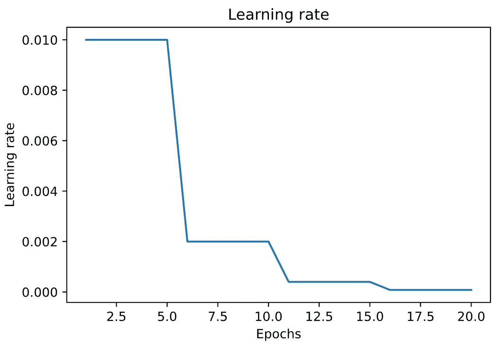

图片由作者制作(请查看[笔记本](https://github.com/BindiChen/machine-learning/blob/master/tensorflow2/007-keras-callback/keras-callbacks.ipynb))

# 6.LambdaCallback

另一个有用的回调是`LambdaCallback`。它类似于`Callback`，允许我们动态构建定制回调。

`LambdaCallback`由下面的匿名函数构成，这些函数将在适当的时候被调用。

*   `on_epoch_begin`:在每个纪元开始时调用。
*   `on_epoch_end`:在每个历元结束时调用。
*   `on_batch_begin`:在每批开始时调用。
*   `on_batch_end`:每批结束时调用。
*   `on_train_begin`:模型训练开始时调用。
*   `on_train_end`:模型训练结束时调用。

注意，回调需要位置参数，如下所示:

*   `on_epoch_begin`和`on_epoch_end`需要两个位置参数:`epoch`、`logs`
*   `on_batch_begin`和`on_batch_end`期待两个位置论元:`batch`、`logs`
*   `on_train_begin`和`on_train_end`期待一个位置自变量:`logs`

让我们借助一个例子来看看`LambdaCallback`是如何工作的。

首先，让我们导入它并创建 3 个不同的`LambdaCallback`:

```
from tensorflow.keras.callbacks import LambdaCallback**epoch_callback** = LambdaCallback(
    on_epoch_begin=lambda epoch,logs: print('Starting Epoch {}!'.format(epoch+1))
)**batch_loss_callback** = LambdaCallback(
    on_batch_end=lambda batch,logs: print('\n After batch {}, the loss is {:7.2f}.'.format(batch, logs['loss']))
)**train_finish_callback** = LambdaCallback(
    on_train_end=lambda logs: print('Training finished!')
)
```

让我们用上面的回调来训练模型

```
history_lambda_callback = model.fit(
    X_train, 
    y_train,
    epochs=2,                  # change epoch to 2 for demo purpose 
    validation_split=0.20, 
    batch_size=2000,           # change to 2000 for demo purpose
    verbose=False,
    callbacks=[**epoch_callback, batch_loss_callback, train_finish_callback**]
)
```

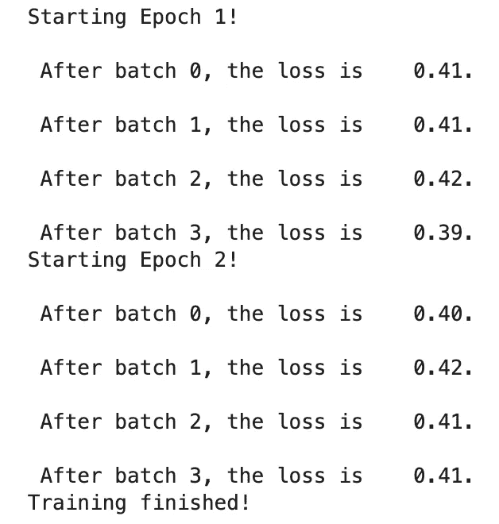

图片由作者制作(请查看[笔记本](https://github.com/BindiChen/machine-learning/blob/master/tensorflow2/007-keras-callback/keras-callbacks.ipynb)

您应该得到如上所示的输出。这非常有用

# 其他回调函数

除了上述函数，在深度学习项目中，您可能会遇到或希望使用其他回调函数:

*   `Callback`:这是用于构建自定义回调的基类。它与`LambdaCallback`相似，但功能更强大。我们将为此再进行一次讨论。
*   `TensorBoard`:一个回调为 TensorBoard 写日志，tensor board 是 TensorFlow 优秀的可视化工具。
*   `RemoteMonitor`:用于将事件流式传输到服务器的回调。

# 好了

感谢阅读。本文涵盖了最受欢迎的 Keras 回调。

请查看[笔记本](https://github.com/BindiChen/machine-learning/blob/master/tensorflow2/007-keras-callback/keras-callbacks.ipynb)获取源代码。

如果你对机器学习的实用方面感兴趣，请继续关注。

## 您可能对我的其他 TensorFlow 文章感兴趣:

*   [实践中的学习率计划](/learning-rate-schedule-in-practice-an-example-with-keras-and-tensorflow-2-0-2f48b2888a0c)
*   [谷歌机器学习实践的 7 个步骤:结构化数据的 TensorFlow 示例](/the-googles-7-steps-of-machine-learning-in-practice-a-tensorflow-example-for-structured-data-96ccbb707d77)
*   [用 Keras 和 TensorFlow 2.0 创建机器学习模型的 3 种方法](/3-ways-to-create-a-machine-learning-model-with-keras-and-tensorflow-2-0-de09323af4d3)
*   [批量规范化实践:以 Keras 和 TensorFlow 2.0 为例](/batch-normalization-in-practice-an-example-with-keras-and-tensorflow-2-0-b1ec28bde96f)
*   [实践中的提前停止:以 Keras 和 TensorFlow 为例](/a-practical-introduction-to-early-stopping-in-machine-learning-550ac88bc8fd)

更多可以从我的 [Github](https://github.com/BindiChen/machine-learning) 中找到