# 熊猫 pivot_table()函数实用介绍

> 原文：<https://towardsdatascience.com/a-practical-introduction-to-pandas-pivot-table-function-3e1002dcd4eb?source=collection_archive---------14----------------------->

## 有效使用 Pandas pivot_table()函数汇总数据的 7 个实用技巧


照片由[威廉·艾文](https://unsplash.com/@firmbee?utm_source=unsplash&utm_medium=referral&utm_content=creditCopyText)在 [Unsplash](https://unsplash.com/s/photos/data-analysis?utm_source=unsplash&utm_medium=referral&utm_content=creditCopyText) 上拍摄

数据透视表是 Excel 最强大的功能之一。数据透视表允许我们从数据中获得洞察力。Pandas 提供了一个类似的功能叫做`pivot_table()`。Pandas `pivot_table()`是一个简单的函数，但是可以非常快速地产生非常强大的分析。

在这篇文章中，我们将借助例子来探索如何使用熊猫`pivot_table()`。示例涵盖以下任务:

1.  最简单的数据透视表
2.  指定`values`并执行聚合
3.  使用`columns`查看分解
4.  替换丢失的值
5.  显示多个`values`并调整视图
6.  显示总计
7.  生成月度报告

> 请查看[笔记本](https://github.com/BindiChen/machine-learning/blob/master/data-analysis/003-pandas-pivot-table/003-pandas-pivot-table.ipynb)获取源代码。更多教程可从 [Github Repo](https://github.com/BindiChen/machine-learning) 获得。

# 数据

在本教程中，我们将处理咖啡销售数据。你可以从我的 Github repo 下载。

让我们导入一些库并加载数据来开始。

```
import pandas as pd**def load_data():
    return pd.read_csv('coffee_sales.csv', parse_dates=['order_date'])**df = load_data()
df.head()
```

我们创建了一个函数`load_data()`来加载 **coffee_sales.csv** 文件，其中列`'order_date'`的数据类型为 date。

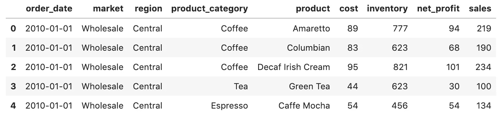

所有的专栏都是不言自明的。

# 1.最简单的数据透视表

最简单的透视表必须有一个`index`。在我们的例子中，让我们使用 ***区域*** 作为我们的索引。默认情况下，它对所有可用的数字列执行`'mean'`聚合函数。

```
df.pivot_table(**index='region'**)
```

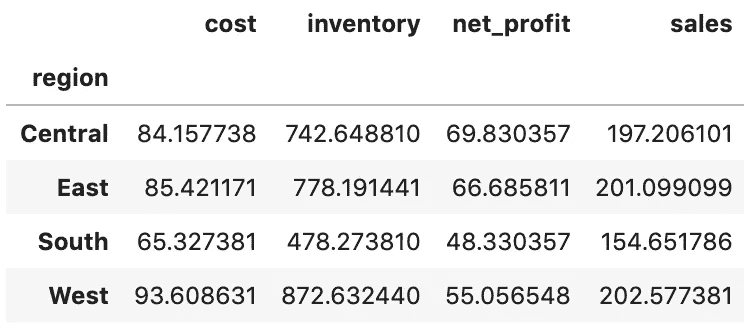

为了显示多个索引，我们可以将一个列表传递给`index`:

```
df.pivot_table(**index=['region', 'product_category']**)
```

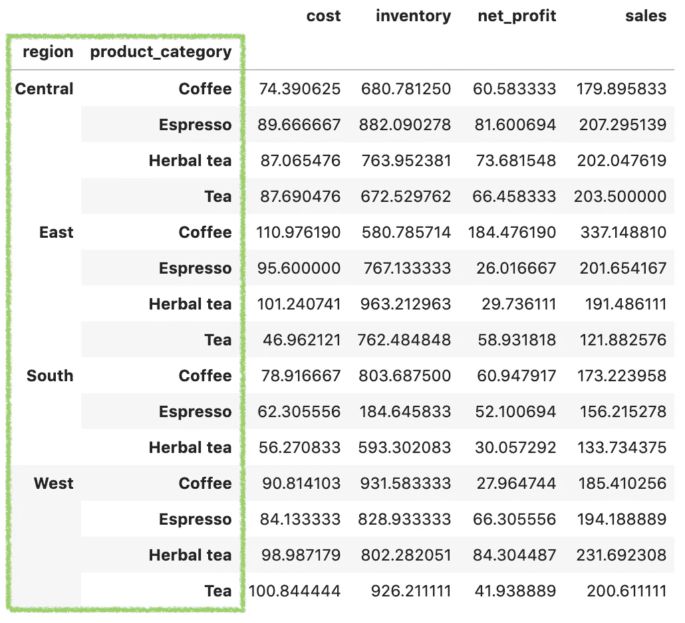

`index`的值是数据透视表中分组依据的关键字。您可以更改值的顺序以获得不同的视觉表示，例如，我们想通过将*区域与 ***产品 _ 类别*** 分组来查看平均值。*

```
*df.pivot_table(index=[**'product_category', 'region'**])*
```

*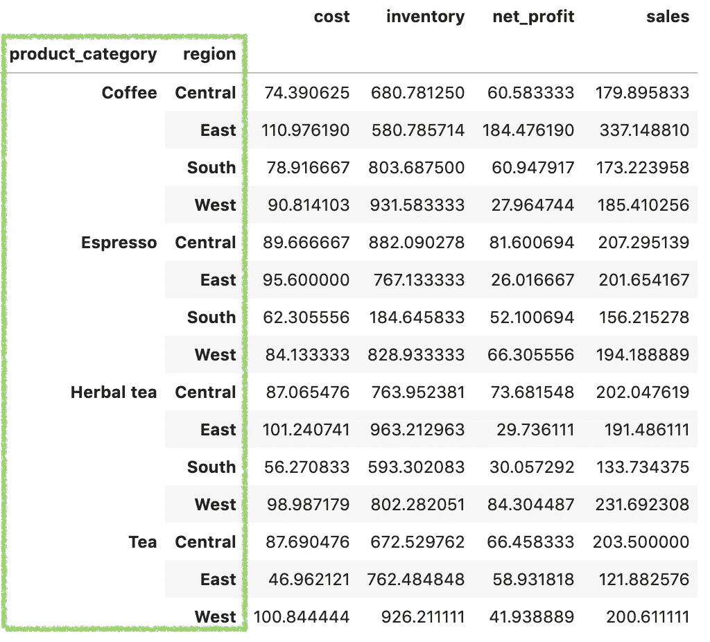*

# *2.指定值并执行聚合*

*默认情况下，`pivot_table`对所有数值列执行`mean`聚合函数，并返回结果。要明确指定我们关心的列，可以使用`values`参数。*

```
*df.pivot_table(index=['region'], **values=['sales']**)*
```

*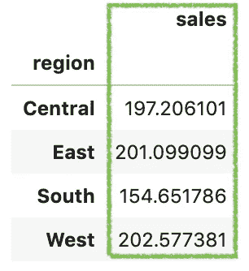*

*为了执行除了`mean`之外的聚合，我们可以将一个有效的字符串函数传递给`aggfunc`，例如，让我们做一个 sum:*

```
*df.pivot_table(index=['region'], values=['sales'], **aggfunc='sum'**)*
```

*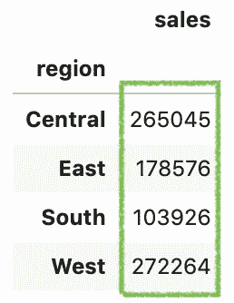*

*`aggfunc`可以是 dict，下面是 dict 等价。*

```
*df.pivot_table(
    index=['region'], 
    values=['sales'], 
    **aggfunc={ 'sales': 'sum' }**
)*
```

*`aggfunc`可以是一个函数列表，下面是一个显示总和与计数的例子*

```
*df.pivot_table(
    index=['region'], 
    values=['sales'], 
    **aggfunc=['sum', 'count']**
)# The dict equivalent
# **aggfunc={ 'sales': ['sum', 'count']}***
```

*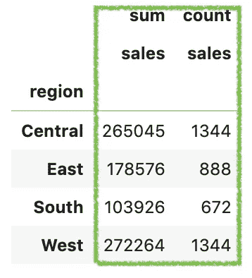*

# *3.使用列查看分解*

*如果我们希望看到 ***销售额*** 按 ***产品 _ 类别*** 细分，那么`columns`参数允许我们这样做*

```
*df.pivot_table(
    index=['region'], 
    values=['sales'], 
    aggfunc='sum', 
    **columns=['product_category']**
)*
```

*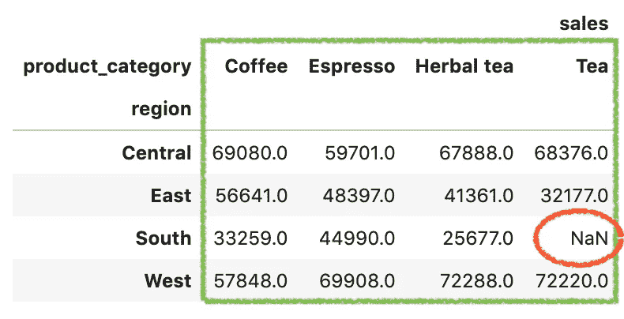*

# *4.替换丢失的值*

*您可能会注意到前面输出中的一个`NaN`值。我们之所以有这种茶叶，是因为在南方没有茶叶销售。如果我们想替换它，我们可以使用`fill_value`参数，例如，将`NaN`设置为`0`。*

```
*df.pivot_table(
    index=['region'], 
    values=['sales'], 
    aggfunc='sum', 
    columns=['product_category'], **fill_value=0** )*
```

*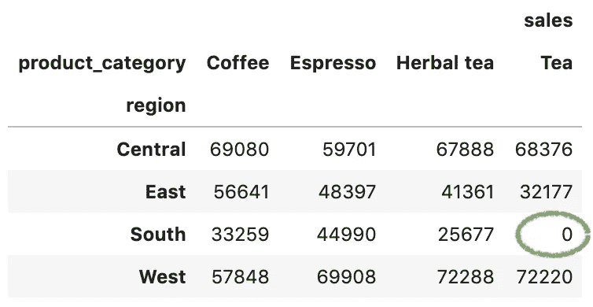*

# *5.显示多个值并调整视图*

*如果我们还想查看 ***成本*** 的总和，我们可以将 ***成本*** 列添加到`values`列表中。*

```
*df.pivot_table(
    index=['region'], 
    values=['sales', **'cost'**], 
    aggfunc='sum', 
    columns=['product_category'], 
    fill_value=0
)*
```

*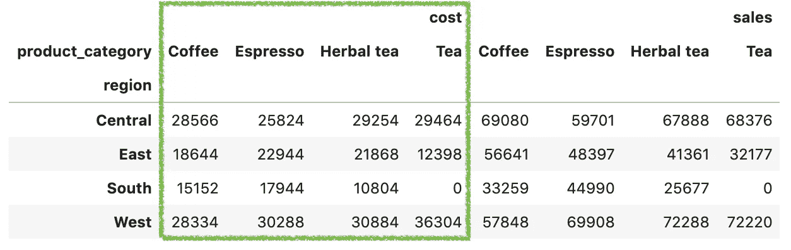*

*这确实有用，但是当我们想要并排比较 ***成本*** 和 ***销售*** 时，这种可视化表示似乎没有用。为了获得更好的视觉表现，我们可以将 ***产品 _ 类别*** 从`columns`中移出并添加到`index`。*

```
*df.pivot_table(
    index=['region', **'product_category'**], 
    values=['sales', 'cost'], 
    aggfunc='sum', 
    fill_value=0
)*
```

*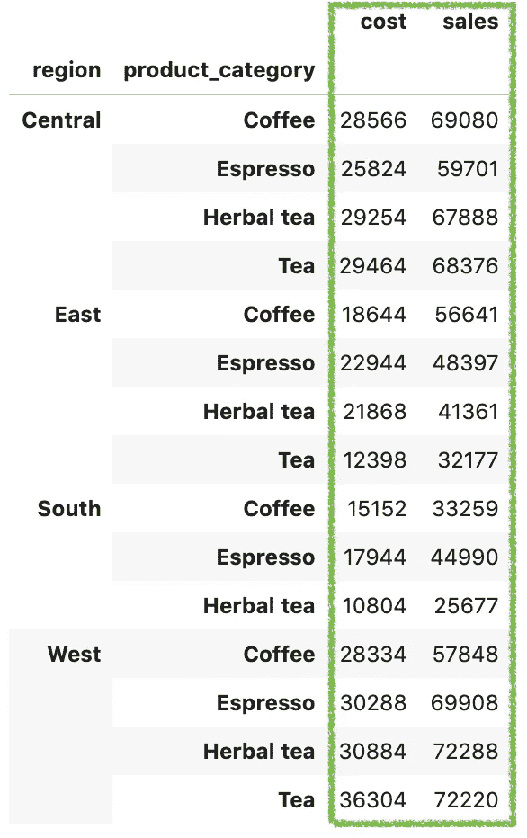*

*现在，数据透视表可以很方便地并排看到 ***销售*** 和 ***成本*** 之间的差异。*

# *6.显示总计*

*数据透视表中的另一个常见显示是显示总计。在熊猫`pivot_table()`中，我们可以简单的通过`margins=True`:*

```
*df.pivot_table(
    index=['region', 'product_category'], 
    values=['sales', 'cost'], 
    aggfunc='sum', 
    fill_value=0, 
    **margins=True**
)*
```

*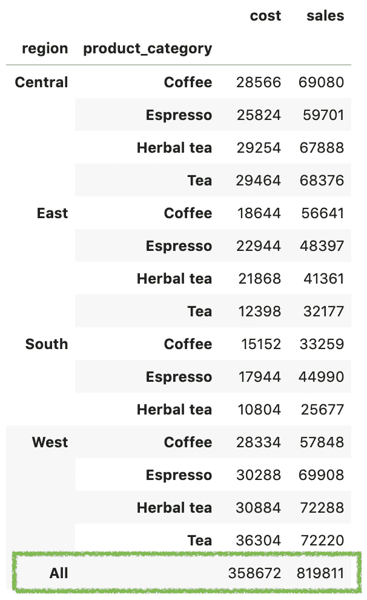*

# *7.生成月度报告*

*对我们来说，原始销售数据很少按月汇总。这种类型的数据通常是按天捕获的。然而，经理们通常想要按月的报告，而不是按天的细节。要使用 Panda `pivot_table()`生成月度销售报告，步骤如下:*

*(1)使用带有`key='order_date'`和`freq='M'`的`Grouper()`定义 groupby 指令*

*(2)定义按年份过滤数据的条件，例如 2010 年*

*(3)使用 Pandas 方法链接过滤和`pivot_table()`。*

```
*month_gp = pd.Grouper(key='order_date',freq='M')
cond = df["order_date"].dt.year == 2010(
    **df[cond]**
    .pivot_table(index=['region','product_category'],
        **columns=[month_gp]**,
        values=['sales'],
        aggfunc=['sum'])
)*
```

*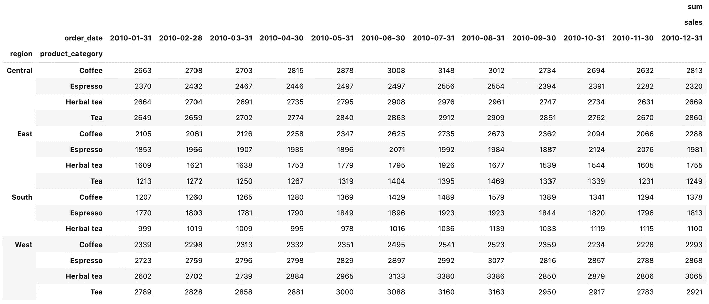*

# *好了*

*感谢阅读。*

*请在我的 Github 上查看[笔记本的源代码。](https://github.com/BindiChen/machine-learning/blob/master/data-analysis/003-pandas-pivot-table/003-pandas-pivot-table.ipynb)*

*如果你对机器学习的实用方面感兴趣，请继续关注。*

# *你可能会对我的其他一些熊猫文章感兴趣:*

*   *[何时使用 Pandas transform()函数](/when-to-use-pandas-transform-function-df8861aa0dcf)*
*   *[使用熊猫方法链接提高代码可读性](https://medium.com/@bindiatwork/using-pandas-method-chaining-to-improve-code-readability-d8517c5626ac)*
*   *[在 Pandas 数据帧中使用日期时间](/working-with-datetime-in-pandas-dataframe-663f7af6c587)*
*   *[处理熊猫中缺失的值](/working-with-missing-values-in-pandas-5da45d16e74)*
*   *[熊猫阅读 _csv()你应该知道的招数](https://medium.com/@bindiatwork/all-the-pandas-read-csv-you-should-know-to-speed-up-your-data-analysis-1e16fe1039f3)*
*   *[用 Pandas read_csv()解析日期列应该知道的 4 个技巧](/4-tricks-you-should-know-to-parse-date-columns-with-pandas-read-csv-27355bb2ad0e)*

*更多可以从我的 [Github](https://github.com/BindiChen/machine-learning) 中找到*