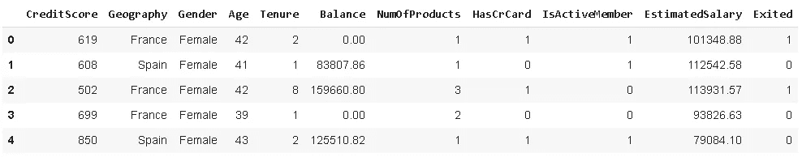

# 实用机器学习指南

> 原文：<https://towardsdatascience.com/a-practical-machine-learning-guide-fa2111c65f42?source=collection_archive---------42----------------------->

## 从 EDA 到模型评估的银行客户流失预测。

流失预测是机器学习领域的一个常见用例。如果你不熟悉这个术语，churn 的意思是“离开公司”。对于一个企业来说，了解客户可能流失的原因和时间是非常重要的。拥有一个强大而准确的客户流失预测模型有助于企业采取措施防止客户离开公司。


克里斯·利维拉尼在 [Unsplash](https://unsplash.com/s/photos/customer?utm_source=unsplash&utm_medium=referral&utm_content=creditCopyText) 上的照片

在这篇文章中，我们的目标是建立一个监督学习算法来执行分类任务。目标是使用提供的功能预测客户是否会流失(即退出= 1)。数据集可在 Kaggle 上的[这里](https://www.kaggle.com/sonalidasgupta95/churn-prediction-of-bank-customers)获得。

第一步是将数据集读入熊猫数据帧。

```
import pandas as pd
import numpy as npdf_churn = pd.read_csv("/content/Churn_Modelling.csv")df_churn.shape
(10000, 14)df_churn.columns
Index(
['RowNumber', 'CustomerId', 'Surname', 'CreditScore', 'Geography','Gender', 'Age', 'Tenure', 'Balance', 'NumOfProducts', 'HasCrCard','IsActiveMember', 'EstimatedSalary', 'Exited'],       dtype='object')
```

数据集包含 10000 个客户(即行)和关于银行客户及其产品的 14 个特征。

# **探索数据**

有一些多余的功能。“RowNumber”列只是一个索引。“客户 Id”和“姓氏”列对于机器学习模型来说显然是无用的。客户的姓氏或 ID 不会告诉我们任何关于客户流失的信息。因此，我们应该删除它们，以免给模型带来不必要的计算负担。

```
df_churn.drop(['RowNumber', 'CustomerId', 'Surname'], axis=1, inplace=True)df_churn.head()
```



我们还要检查数据集中是否有任何缺失值。

```
df_churn.isna().sum()
```


该数据集没有任何缺少的值，这在现实生活的数据集中是不常见的。[处理缺失值](/handling-missing-values-with-pandas-b876bf6f008f)是机器学习流水线的重要组成部分。如果与数据集的大小相比，缺少的值非常少，我们可以选择删除缺少值的行。否则，最好用合适的值替换它们。Pandas **fillna** 函数可以用来处理这个任务。

**重要说明:**如果您选择基于列中的非缺失值估算缺失值(例如，用列的平均值填充缺失值)，您应该在将数据集拆分为训练和测试子集后执行此操作。否则，您会将测试集中的数据泄露给机器学习模型，这些数据应该是新的、以前未见过的数据。

我们还应该确保数据以适当的数据类型存储。例如，数值不应该存储为“对象”。 **Dtypes** 函数返回每一列的数据类型。

```
df_churn.dtypes
```


数据类型似乎是合适的。

我们永远不应该只是将原始数据转储到机器学习模型中。垃圾进，垃圾出！这就是为什么我们需要探索数据集并理解特征和目标之间的关系。

地理和性别特征可能会对客户流失产生影响。一种方法是使用熊猫的 **groupby** 功能。

```
df_churn[['Geography','Gender','Exited']].groupby(['Geography','Gender']).agg(['mean','count'])
```


**发现**:在这三个国家，女性比男性更容易跳槽。

**发现**:德国的流失率高于其他两个国家的流失率。法国的顾客最多。

让我们看看客户的年龄与流失率之间的关系。

```
plt.figure(figsize=(10,6))sns.catplot(x='Exited', y='Age', hue='Gender', data=df_churn)
```


就客户流失而言，年龄不会造成非常显著的差异。然而，在不流失(退出=0)的一方有更多的老年人。我们还应该检查年龄栏的分布。

```
plt.figure(figsize=(10,6))sns.distplot(df_churn['Age'], hist=False)
```


分布是右偏的，这表明异常值在右侧。这在规范化特征时很重要。我们会谈到这一点。

任期，即客户成为客户的时间，也可能是客户流失的一个指示性因素。

```
df_churn[['Tenure','Exited']].groupby('Tenure').agg(['mean','count']).sort_values(by=[('Exited','mean')])
```


在任期和流失之间没有一个容易识别的模式。

相关矩阵通过提供成对的相关值，为我们提供了变量之间关系的概述。它只接受数值。因此，最好将“地理”和“性别”列中的类别转换为数字类别。

```
gender = {'Female':0, 'Male':1}country = {'France':0, 'Germany':1, 'Spain':2}df_churn['Gender'].replace(gender, inplace=True)df_churn['Geography'].replace(country, inplace=True)df_churn.head()
```


pandas 的 **corr** 功能创建了一个关联矩阵，然后可以用**热图**可视化。

```
corr_matrix = df_churn.corr()plt.figure(figsize=(12,8))sns.heatmap(corr_matrix, cmap='Blues_r', annot=True)
```


“HasCrCard”特征与目标变量的相关性最小。此外，由于信用卡是一种产品，该特性的信息能力部分存在于“NumOfProducts”列中。

```
df_churn[['HasCrCard','Exited']].groupby('HasCrCard').agg(['mean','count'])
```


“HasCrCard”特性的两个值(0 和 1)的平均流失率几乎相同。

# **编码分类变量**

我们将类别转换成数值。然而，我们还需要一个步骤来使它们适用于机器学习模型。

法国变成了 0，德国变成了 1，西班牙变成了 2。如果我们像这样离开他们，模型可能会认为西班牙比法国更重要。

一个解决方案是 **one-hot encoding** ，这意味着为每个类别创建一个新列。根据原始列中的值，新列的值为 1 或 0。

你可以使用 scikit-learn 的 onehotencoder，但我更喜欢手动操作，因为类别的数量只有 3 个。

```
df_churn['Germany'] = df_churn['Geography'].where(df_churn['Geography'] == 1, 0)df_churn['Spain'] = df_churn['Geography'].where(df_churn['Geography'] == 2, 0)
df_churn['Spain'] = df_churn['Spain'].replace(2,1)df_churn.drop(['Geography'], axis=1, inplace=True)df_churn.head()
```


如果有 n 个类别，我们需要 n-1 列。如果其他 n-1 列中的值为零，我们已经有了关于最后一列的信息。例如，原始数据帧中的第一行是“法国”。我们已经有了这些信息，因为“德国”和“西班牙”列为零。

由于“性别”列有两个不同的值，我们不需要一次性编码它。

# **阶层失衡**

数据不平衡通常是分类问题中的一个问题，它表示类别分布不均匀。像客户流失、垃圾邮件检测这样的任务很可能具有不均匀的类别分布。


存在大约 4 比 1 的不平衡。如果分类模型是在不平衡的数据集上训练的，它将高度偏向主导类。因此，该模型将反映潜在的类别分布。为了有一个准确的模型，我们需要解决不平衡问题。

有不同的方法来使用它作为解决方案。我们可以进行过采样(增加少数类的观测值)或欠采样(减少多数类的观测值)。

有不同的过采样技术。其中最常见的是 **SMOTE** (合成少数过采样技术)。SMOTE 算法根据已有的样本创建新的样本。它采用两个或更多相似的观察值，并通过一次改变一个属性来创建一个综合观察值。变化量是随机的，但会将新观测值保持在所用现有观测值的相邻距离内。

```
from imblearn.over_sampling import SMOTEsm = SMOTE(random_state=42)X = df_churn.drop('Exited', axis=1)y = df_churn['Exited']X_res, y_res = sm.fit_resample(X, y)print(pd.Series(y_res).value_counts())
1    7963 
0    7963
```

目标变量中的数字 0 和 1 现在相等。

# **列车试裂**

我们现在需要将数据集分成训练和测试子集。该模型将在训练集上进行训练，并在测试集上进行测试。

在应用特征工程技术之前分割数据集是很重要的。模型不应该得到任何关于测试集的信息，测试集应该是由新的、以前看不到的特性组成的。

```
from sklearn.model_selection import train_test_splitX_train, X_test, y_train, y_test = train_test_split(X_res, y_res, test_size=0.2)
```

# **正常化**

特性的取值范围差别很大。例如，“任期”的最大值是 10，而“估计工资”的值高达 20 万。

如果我们将具有不同值范围的特征输入到模型中，则具有较高值的特征可能被赋予更大的重要性。我们不希望这样，所以我们将把功能纳入类似的范围。

归一化有不同的技术，如最小最大缩放器、标准缩放器和鲁棒缩放器。

**当数据集中存在异常值时，RobustScaler** 是一个不错的选择。

```
from sklearn.preprocessing import RobustScalertransformer = RobustScaler().fit(X_train)X_train_transformed = transformer.transform(X_train)X_test_transformed = transformer.transform(X_test)
```

请记住，我们仅将训练集中的特征适配到缩放器。然后，训练集和测试集都用训练好的尺度进行变换。

# **功能选择**

我们已经在一定程度上探索了特征的重要性，并深入了解了它们与目标变量之间的关系。

特性选择仅仅意味着使用更有价值的特性。这里的价值是信息。就目标变量而言，我们希望使用信息更丰富的特性。

我们将使用递归特征消除(RFE ),它通过递归消除特征来工作。该消除是基于来自估计器的输出来完成的，该估计器将某种权重分配给特征。例如，权重可以是线性回归的系数或决策树的特征重要性。

```
from sklearn.linear_model import LogisticRegressionfrom sklearn.feature_selection import RFElog_reg = LogisticRegression()rfe = RFE(estimator=log_reg, n_features_to_select=7, step=1)rfe.fit(X_train_transformed, y_train)rfe.ranking_
array([1, 1, 1, 3, 1, 1, 2, 1, 4, 1, 5])
```

我们使用逻辑回归作为估计量。所需的特征数量由 **n_features_to_select** 参数决定。RFE 给每个特征分配一个等级。分配有 1 的功能是选定的功能。

在我们的例子中，被删除的特征是“任期”、“HasCrCard”、“EstimatedSalary”和“西班牙”。

回想一下，在我们的 EDA 过程中，我们发现“HasCrCard”特性与“Exited”列的相关性最低。

让我们过滤所选的特征。

```
X_train_selected = X_train_transformed[:,[0,1,2,4,5,7,9]]X_test_selected = X_test_transformed[:,[0,1,2,4,5,7,9]]
```

# **模型**

我将使用随机森林分类器。

```
from sklearn.ensemble import RandomForestClassifierrf = RandomForestClassifier(max_depth=10, n_estimators=200)rf.fit(X_train_selected, y_train)
```

我们已经训练了这个模型。让我们对训练集和测试集进行预测。然后，我们将检查模型的准确性。

```
from sklearn.metrics import confusion_matrixy_pred = rf.predict(X_train_selected)
cm_train = confusion_matrix(y_train, y_pred)
print(cm_train)y_test_pred = rf.predict(X_test_selected)
cm_test = confusion_matrix(y_test, y_test_pred)
print(cm_test)train_acc = (cm_train[0][0] + cm_train[1][1]) / cm_train.sum()
test_acc = (cm_test[0][0] + cm_test[1][1]) / cm_test.sum()print(f'Train accuracy is {train_acc}. Test accuracy is {test_acc}')
```


在训练集上的准确度是%91.7，在测试集上的准确度是%90.7。好消息是我们的模型没有过度拟合。但是，精确度可以提高。

我们还打印了混淆矩阵，显示了有多少正(1)类和负(0)类被正确预测。根据任务的不同，特定类的预测更重要。在我们的例子中，正确预测正类(Exited=1)应该是重点，因为我们想知道哪些客户会离开我们。

在分类问题上，准确性并不能提供对模型的全面评估。根据任务的不同，精度、召回率和 AUC 等其他指标可能更合适。

在[的下一篇](/improving-the-performance-of-a-machine-learning-model-5637c12fc41c)文章中，我们将致力于:

*   如何提高准确率(正负类都有)
*   如何将模型的焦点更多地向正面类倾斜

感谢您的阅读。如果您有任何反馈，请告诉我。