# 使用 Python 对随机森林和决策树进行务实的探索

> 原文：<https://towardsdatascience.com/a-pragmatic-dive-into-random-forests-and-decision-trees-with-python-a850f6ed4ed?source=collection_archive---------20----------------------->

## **从头开始的两种算法的完整代码实现**

# *简介*

不可否认，随机森林是获得大多数结构化数据问题的快速合理解决方案的最佳模型之一。它们能够适应回归和分类问题，能够抵抗过度拟合(有足够的估计量)，并且它们能够在没有任何数据标准化或虚拟变量创建的情况下工作。使用这种集成技术你不会得到最好的性能，但是，它们的简单性和在解释我们的数据时的价值使它们非常有用。

基于树的模型在捕捉数据之间的复杂关系方面也很有效，而线性模型则很难捕捉到这种关系，如下例所示:

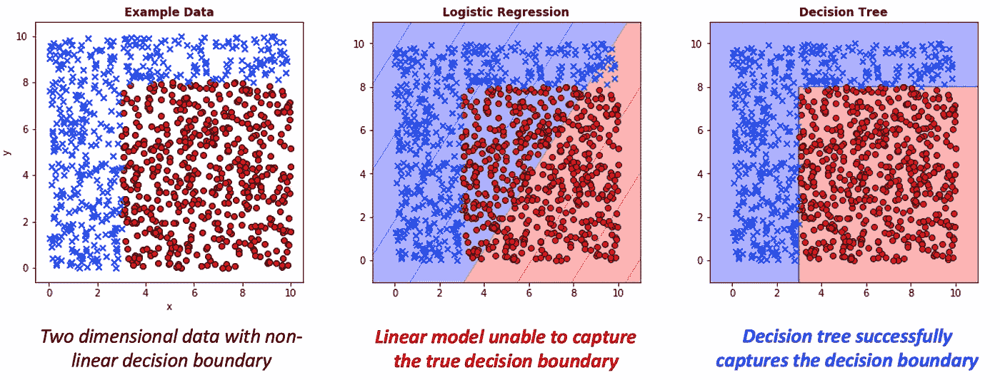

**图一。**使用 matplotlib 的判定边界示例。

此外，基于树的方法提供了出色的可解释性和分析功能，有助于解释我们的模型如何得出特定的结果。例如，我们可以将上面使用的单个决策树形象化:

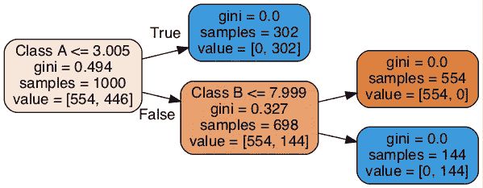

**图二。**决策树图*(sk learn . tree . export _ graphviz)*对于图 1 中的例子。

在整篇文章中，我们将详细探索随机森林和决策树——事实上，为了充分理解它们的内部工作方式，我们将完全用 Python 从头开始编码。这篇文章补充了这里提供的 Jupyter 笔记本，我建议你在阅读时打开它。这提供了本文中使用的所有代码和示例。

形成随机森林模型的关键是决策树——我们将它们中的许多组合在一起以获得更好的整体性能。单个树的方差很大，但我们通过对许多树进行平均，显著降低了方差，同时提高了预测性能。

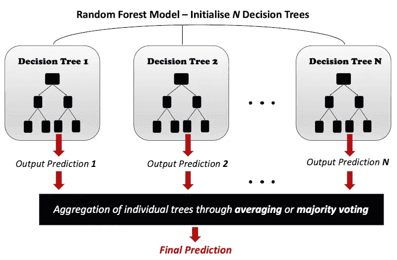

**图 3。**随机森林算法概述。作者图解。

让我们举一个例子——一个有 6 个独立评估者(决策树)的随机森林将形成总共 6 个独立的决策树模型。如果我们使用[鱼市场 Kaggle 数据集](https://www.kaggle.com/aungpyaeap/fish-market)作为例子，每个单独的决策树产生以下回归线:

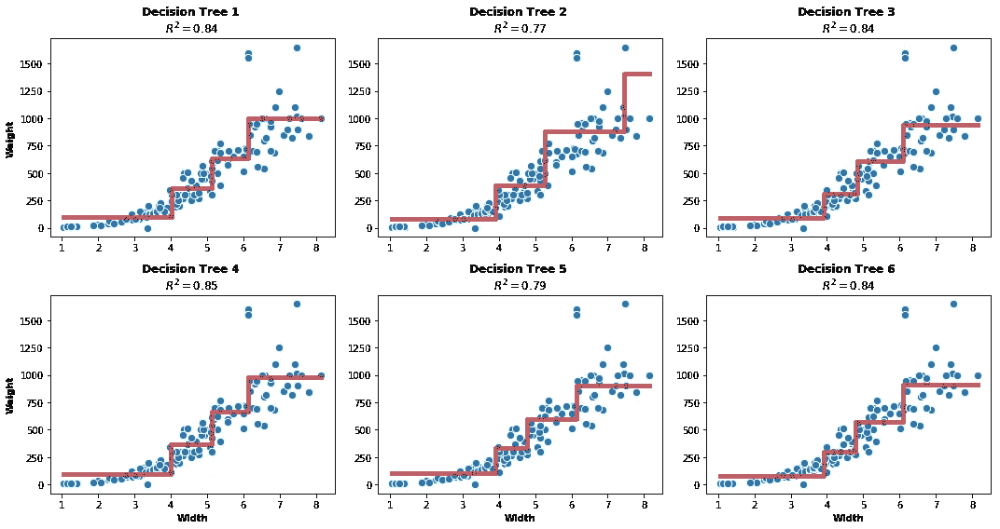

**图 4。**随机森林模型中的个体决策树回归器。

我们的随机森林采用这些单独的预测，并对它们进行平均，从而生成总体上更好的拟合回归线:

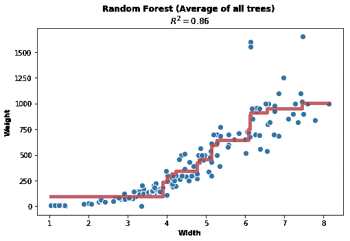

**图 5。**组合之前显示的决策树后的整体随机森林预测。

您会注意到，与任何单个决策树相比，随机森林模型的预测更好。这可以从更优的回归线和更高的 R 值看出来。这就是合奏的好处；*模型的组合通常会比任何一个单独的模型产生更好的性能*。

如果我们只是将许多决策树结合在一起，我们就有了一个 bagging 模型。对于随机森林，有一个关键的区别； ***去相关*** 。随机森林不是每次在树中进行分割时都使用我们所有的特征(数据列)，而是只考虑这些特征的随机比例。这防止了一个或两个主要特征使所有的单个树相似地相关。与 bagging 模型相比，这减少了模型差异。

总的来说，随机森林算法执行以下操作:

1.  从训练数据中创建 *n 个*引导样本，用于训练 *n 个*决策树。自举样本是原始训练数据的随机样本，带有替换，这意味着我们有一些副本(也有完全缺失的样本，称为 out-of-bag)。
2.  使用 *n* 个引导样本生长 *n* 个决策树。
3.  对于单个树中的每个分割，随机选择一个要素样本，并仅使用这些列选择最佳分割。进行这种分割的选择基于所使用的目标函数(例如熵、基尼指数、分类误差、均方误差)。
4.  将我们的结果汇总在一起，形成一个总体预测。对于回归，这通常是平均值。对于分类，这通常是通过多数表决。

在这个博客中，我们将创建两个类。一个将是决策树模型，而另一个将是随机森林。随机森林模型将通过形成大量单个决策树模型并聚合它们的单个预测来形成整体预测输出。如前所述，与本文相关的所有代码都可以在[本笔记本](https://github.com/BenjaminFraser/data-analysis/blob/master/Random_forests_and_decision_trees.ipynb)中找到，所以如果您还没有找到，请查看一下！

# 1.Python 决策树模型

我们将从创建一个单独的决策树开始。在此之前，快速了解一下决策树的基础知识。

## **1.1。决策树理论**

决策树进行一系列贪婪递归二分分裂，每一次分裂都是基于信息增益的目标函数来计算的。对于**分类树**，常用的目标函数包括基尼指数、熵和分类误差:

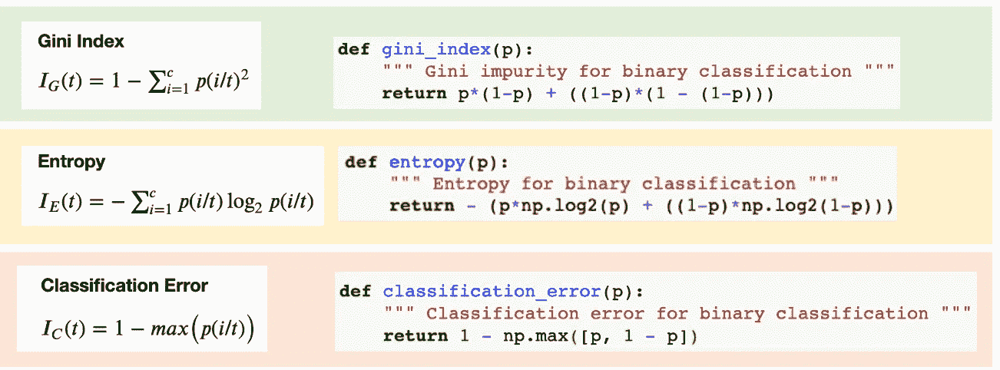

**图 6。**分类树的信息增益目标。作者图解。

对于**回归树**，常见的目标函数包括均方误差(MSE)、平均绝对误差(MAE)或标准差。

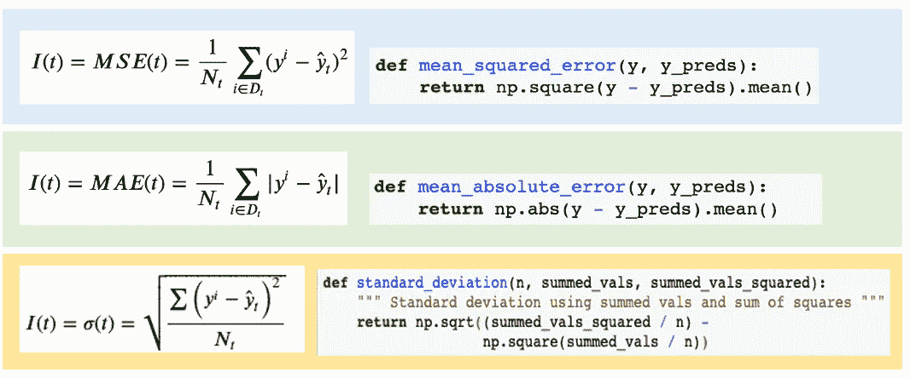

**图七。**回归树的信息增益目标。作者图解。

对于这个博客，我们将使用 ***标准差缩减*** 来构建一个回归模型。该函数给出的结果相当于 MSE:


**方程式 1。**标准差。

方便的是，这个公式可以重新排列成更好的形式，用于 Python 和 Numpy 矢量化计算:

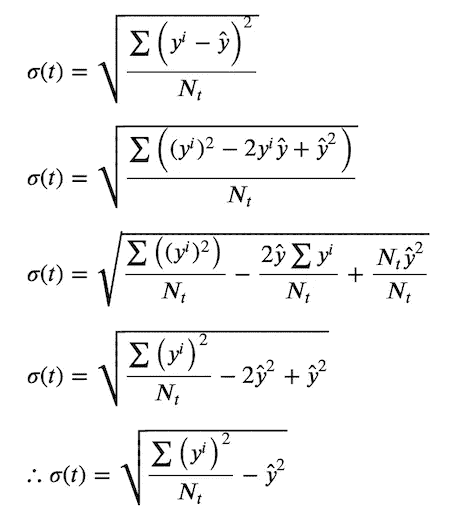

**方程式 2。**将标准差公式处理为平方和减去均方。

这种推导允许我们用均方和的平方根减去均方来确定标准差。听起来很拗口——但本质上，这使得我们的 Python 实现在 O(n)复杂度方面更快更有效。

该公式(或上述任何标准)用于形成*成本函数*，J，其在训练期间*最小化。用于执行拆分的决策树算法称为**分类和回归树(CART)算法** *(Géron，2019，第 179 页)*，它使用以下成本函数:*

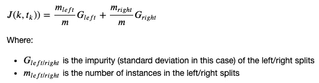

**方程式 3。**决策树递归二叉分裂的 CART 算法损失函数。

这被递归地应用于每个单独的分割，直到达到最大深度。决策树模型最难的概念之一是理解递归是如何工作的。我们的树模型将在每个生成的树模型中被多次调用。每个树节点执行一个二叉分裂(除非它是一个叶子)，这意味着每个节点创建两个分裂(左和右)。每次拆分都会创建一个新的决策树，反过来，每个新的决策树会执行进一步的左右拆分。这个过程一直重复，直到我们的决策树有足够的深度。

基本上，我们为每个随机的森林决策树形成许多树中的树，并且这继续直到我们到达所有左右分裂的叶节点。

最大深度的选择非常重要，它会显著影响我们的模型对数据的拟合不足或过度拟合。例如，我们可以在下面的图中看到它对鱼市场数据的拟合度的影响:

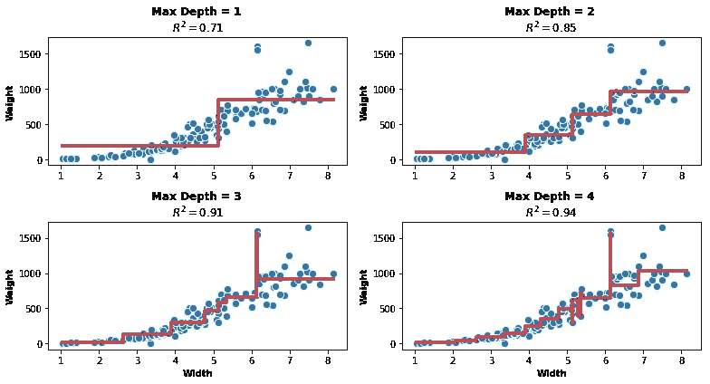

**图 8。**改变树的最大深度的影响。

现在我们已经讨论了基础知识，让我们继续讨论将决策树模型实现为代码的实际元素。

## 1.2.决策树 Python 代码

在形成这个模型的同时，大量的信用需要去杰瑞米·霍华德和 [FastAI 程序员机器学习课程](http://course18.fast.ai/ml)。本课程构建了一个基本的随机森林和决策树模型，这是我的 Python 实现的主要基础。

我们将首先展示决策树的全部代码，然后依次讨论主要方面。

**代码示例 1。**决策树模型的 Python 实现。

让我们开始吧，首先，我们需要用所需的参数初始化决策树，包括:

*   训练数据( *X* )。这将是总训练数据的行样本，行数等于所选的随机林样本大小。
*   给定训练数据 x 的训练标签( *y* )
*   我们的训练数据和标签的索引值( *idxs* )。如果我们只想使用 x 的特定索引，这可能是必需的。默认情况下，这是“无”,并将创建新的索引，最多可达定型数据 x 中的行数。
*   每个决策树的样本大小。
*   在每个二进制分割中使用的特征比例( *feat_proportion* )
*   停止进一步分裂并使该节点成为叶节点的样本数( *min_leaf*
*   Bootstrap，它使我们的模型形成随机样本，并替换我们的每个决策树。如果选择此项，我们的模型将能够计算出出出袋分数。
*   形成模型时，随机种子允许可重复产生的结果。

## 1.3 二进制拆分

当我们形成每一个决策树时，我们希望它立即开始二分分裂。这是通过调用类 init 方法中的 *self.binary_split()* 来实现的，如上所示。

这个函数的目的是遍历我们选择的特性列，并在每一列中找到最佳的二进制拆分。上面的代码使用后续函数 *best_binary_split，*找到给定列的最佳拆分，该函数针对每个特性被迭代调用。

该模型对所有列执行此操作，并为拆分找到最佳得分。这为我们提供了最佳的特征和索引值，在该值处找到了数据样本的最佳左右分割。例如，这将为我们提供一个鱼市场数据分割，如下所示:

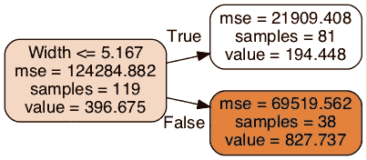

**图 9。**鱼类市场数据的初始二进制分割。

以上，宽度小于或等于(≤) 5.167 的所有数据样本进行第一次分割，而剩余样本形成另一次分割。我们可以看到，81 个样本的宽度≤ 5.167，38 个样本的宽度> 5.167。因此，在这种情况下，我们的模型选择宽度作为进行分割的最佳特征，这是使用我们的标准差成本函数推导出来的。

然后，我们使用更多的决策树形成进一步的分割，以重复相同的过程(除了较小的数据子集):

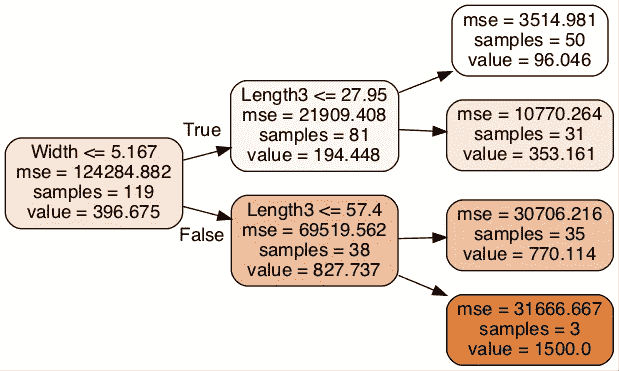

**图 10。**跟进鱼市场数据的每条路径上的二进制拆分。

正如我们所见，“长度 3”被选为每种情况下进行后续分割的最佳特征。我们将简要讨论如何在代码实现中做到这一点。

```
def best_binary_split(self, feat_idx):
    x = self.x.values[self.idxs, feat_idx]
    y = self.y[self.idxs] # sort our data
    sorted_ind = np.argsort(x)
    sorted_x = x[sorted_ind]
    sorted_y = y[sorted_ind] # get count, sum and square sum of lhs and rhs
    lhs_count = 0
    rhs_count = self.rows
    lhs_sum = 0.0
    rhs_sum = sorted_y.sum()
    lhs_sum2 = 0.0
    rhs_sum2 = np.square(sorted_y).sum() # iterate through all values of selected feature - eval score
    for i in range(0, self.rows - self.min_leaf):
        ...
```

在 *best_binary_split* 函数中，我们首先对训练数据 *x* 进行排序，并输出标签 *y* 。传递给函数 *feat_idx* 的参数对应于当前列的索引(记住这个函数是对所有列迭代完成的)。

然后，我们为当前列的数据左右拆分的计数、总和以及平方和形成初始变量。这个想法是我们从左边的 0 开始，从右边的最大值(行数)开始。当我们遍历列数据的每一行时，我们可以动态更新这些值，如下所示:

```
# iterate through all rows of selected feature
for i in range(0, self.rows - self.min_leaf):
    # update count and sums
    lhs_count += 1
    rhs_count -= 1   
    lhs_sum += y_i
    rhs_sum -= y_i
    lhs_sum2 += y_i**2
    rhs_sum2 -= y_i**2
```

在这个值更新之后，我们在继续下一步之前为每个迭代执行两个基本的检查。第一个是我们的左分裂当前是否比在 *min_leaf* 超参数中选择的样本少。第二个是我们是否有一个当前值与下一个匹配(重复)。在这两种情况下，我们跳过当前迭代，进入下一个迭代:

```
# if less than min leaf or dup value - skip
if i < self.min_leaf - 1 or x_i == sorted_x[i + 1]:
    continue
```

现在，我们执行主要功能—使用标准差成本函数查找当前得分:

```
# find standard deviations of left and right sides
lhs_std = self.standard_deviation(lhs_count, lhs_sum, lhs_sum2)
rhs_std = self.standard_deviation(rhs_count, rhs_sum, rhs_sum2)
```

我们需要找到左右劈叉的分数。这是使用前面定义的公式计算出来的，但是对 python 实现的概括如下:

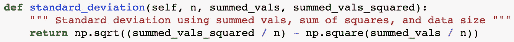

**代码示例 2。**标准差的 Python 实现。

一旦我们计算出每个分数，我们需要形成一个加权成本函数，就像前面等式 3 中定义的那样。我们可以通过多种方式做到这一点，但一种简单的方式是只使用当前的左侧和右侧计数，并将它们乘以各自的标准偏差分数:

```
# find weighted score
current_score = (lhs_count*lhs_std) + (rhs_count*rhs_std)

# if score lower (better) than previous, update
if current_score < self.score:
    self.feat_idx = feat_idx
    self.score = current_score
    self.split = x_i
```

最后，在这样做之后，我们检查这次迭代的当前分数是否比以前的最好分数更好。因为这是一个成本函数，最好的分数是最低的值，所以我们寻求最小化它。如果我们找到更好的分数，我们将当前特征索引(feat_idx)、分数和样本索引(x_i)保存到我们的决策树模型中。

一旦对我们的所有特征发生了这种迭代过程(如从原始函数 binary_split 调用的)，我们就获得对应于最佳得分的数据的左和右分割，并为每个分割形成新的决策树。整个过程递归重复，直到原始数据的所有分割都成为叶节点。

为了更好地理解这一点，让我们快速回顾一下整个 *binary_split* 函数:

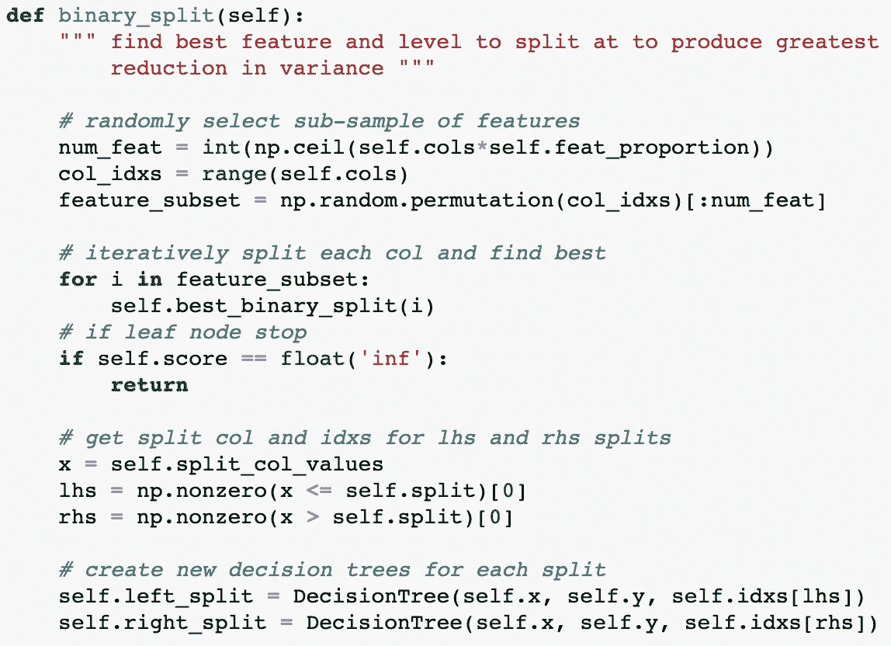

**代码示例 3。**我们决策树模型的二元分裂函数。

我们从仅选择特征的子样本开始，以迭代地搜索最佳二进制分裂。这是为了在整个随机森林模型中去相关我们的大量决策树(稍后将详细介绍)。我们对每个特性反复调用 *best_binary_split* ，更新 self.score、self.feat_idx 和 self.split 中的值

如果 *self.score* 中的分数等于无穷大，那么我们知道我们当前处于一个叶节点，因此想要停止这个节点上的递归过程。这是通过从函数返回来完成的。然而，如果它不是叶节点，我们继续并为找到的最佳左右分裂形成新的决策树。我们将这些新的决策树作为变量存储在当前决策树中，作为 *self.left_split* 和 *self.right_split，*，随后对其中的每一个重复相同的递归过程，直到到达叶节点。

二进制拆分过程到此结束！你会很感激地知道，这是迄今为止理解决策树如何工作最困难的方面，其他一切都相对简单。

## 1.4 预测

为了使用我们的模型对样本值进行预测，我们需要递归地将该值与模型中的树分裂值进行比较。在下图中，我们可以看到样本在预测阶段的典型路径。

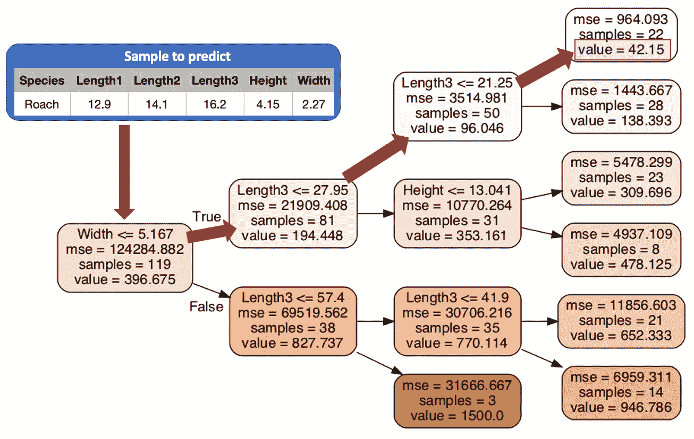

**图 11。**给定样本的预测过程。作者图解。

在上面的表示中，样本宽度和长度 3 特征与我们的决策树模型的分割标准进行了比较。通过红色箭头，我们得到了该样本的预测值，即重量为 42.15(以绿色突出显示)。这个预测值是通过简单地找到这个叶节点中所有 22 个样本的平均权重而获得的。

为了使用代码实现这一点，我们使用了两个函数:

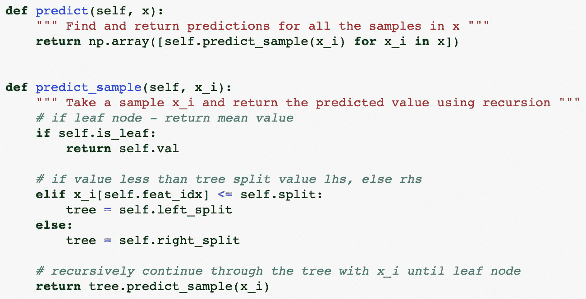

**代码示例 4。**为我们的决策树模型预测函数。

第一个函数( *predict* )使用列表理解迭代调用第二个函数( *predict_sample* )。它这样做是为了给一个输入数组 x 生成一组预测。

第二个函数更详细，通过树分裂递归调用，直到到达一个叶节点。我们首先检查我们是否处于一个叶节点，如果是，那么预测值就是该叶中样本的平均值，等于 *self.val* 。

相反，如果它还不是叶节点，我们将预测样本与该节点的特征分裂值进行比较。如果*predict _ sample*≤*split _ value*，那么我们继续进行左分裂，否则我们选择右分裂。然后，我们重复这个过程，直到到达一个叶节点，以便进行预测。

# 2.实现随机森林

幸运的是，随机森林的实现更短，也更容易。它作为一个更高层次的类，实例化了大量的决策树。

## 2.1 随机森林 Python 代码

我们将从查看代码开始，然后讨论关键特性。

**代码示例 5。**随机森林模型的 Python 实现。

与决策树代码相比，随机森林模型实际上非常简单。为了实例化模型，我们采用一系列参数:

*   培训数据(X)
*   培训标签(y)
*   决策树的数量(num_trees)
*   每个决策树的样本大小
*   在每个二进制分割中使用的功能比例(功能比例)
*   停止进一步分裂并使该节点成为叶节点的样本数(min_leaf)
*   Bootstrap，它使我们的模型形成随机样本，并替换我们的每个决策树。如果选择此项，我们的模型将能够计算出出出袋分数。
*   形成模型时，随机种子允许可重复产生的结果。

一旦我们的模型被初始化，它就创建数量等于 *num_trees* 的决策树，并将它们存储为 *self.trees* :

```
self.trees = [self.create_tree() for i in range(num_trees)]
```

这总共调用了我们的 *create_tree* 方法 *num_tree* 次，其中 *create_tree* 方法给出为:

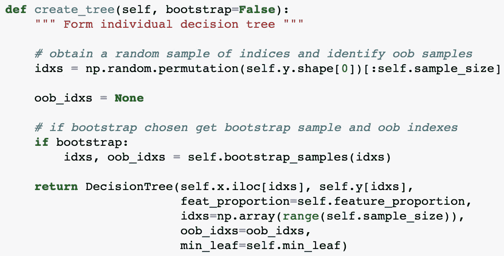

**代码示例 6。**为我们的随机森林模型创建树函数。

这将生成一组大小为 sample_size 的随机索引，表示用于决策树模型的数据样本。假设我们的总训练集比我们的样本量大得多，那么每次调用这个函数时，它都会为每个决策树产生一个唯一的样本集。

此外，如果我们已经用 *bootstrap=True* 实例化了我们的随机森林，那么这个函数将生成带有替换的训练样本集。这将在后面详细解释。

最后，我们为给定的训练样本和标签集实例化一个决策树。我们还向每个决策树传递一些进一步的参数，包括:

*   在每个二进制分割中使用的特征比例( *feat_proportion* )，在第 3.2 节中解释。
*   出袋指数(oob_idxs)，用于记录每个决策树引导样本的出袋样本。这将在下文第 3.3 节中进一步解释。

为了进行**预测**，我们有*预测*函数，它很简单:

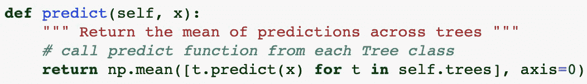

**代码示例 7。**我们的随机森林模型的预测函数。

我们将输入预测样本传递给随机森林模型中的每个决策树*预测*函数。这将给我们一组与每个决策树的预测相对应的值。为了形成我们的总体随机森林预测，我们只需计算这些值的平均值。

这就结束了我们模型的主要部分，然而，与随机森林相关的一些关键点以及它们与上述代码的关系仍然需要解释。这些将在剩余的章节中讨论。

## 2.2 选择特征子集

随机森林通过在每次二进制分裂时选择一个随机特征子集来消除其决策树的相似性。这是随机森林的一个绝对必要的组成部分，也是它不同于基本装袋模型的地方。

要在 Python 中实现这一点，我们需要做的就是确保每次在决策树中执行二分分裂时，我们只选择一部分特征，而不是考虑所有的特征。

```
# randomly select sub-sample of feature indices to use
num_feat = int(np.ceil(self.cols*self.feat_proportion))
col_idxs = range(self.cols)
feature_subset = np.random.permutation(col_idxs)[:num_feat]

# iteratively split each col and find best
for i in feature_subset:    
    self.best_binary_split(i)
```

这是使用传递给决策树的 *feat_proportion* 参数来执行的，如上面的 *create_tree* 代码所示。

## **2.3 自举样本**

Bootstrapping 是从一组数据中随机抽取数据进行替换的过程。这意味着我们会有重复的，也有一些样本根本不包括在每个样本中。

未包含在每个引导样本中的样本称为开箱(OOB)样本。

例如，假设我们想要从 500 个训练样本的范围中形成 500 个样本大小，那么我们可以使用以下公式选择 500 个随机指数:

```
samples = np.random.randint(0, 500, size=500)
```

对于这些样本，并不是所有的 500 个原始索引都存在，因为许多索引是重复的。我们可以找到不包括在内的样品(开箱),如下所示:

```
indices = np.arange(500)
oob_samples = np.array([x for x in indices if x not in samples])
```

出于兴趣，如果我们从 500 个训练样本的数据集形成 500 个引导样本，让我们看看平均得到多少个 OOB 样本:

```
oob_no = []for _ in range(500):
    samples = np.random.randint(0, 500, size=500)
    oob_samples = [x for x in indices if x not in samples]
    oob_no.append(len(oob_samples))

sns.distplot(oob_no)
plt.title("OOB samples - mean size of {0}".format(np.mean(oob_no)))
plt.show()
```

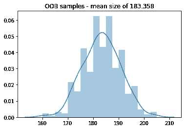

**图 12。**开箱(OOB)样品示例。

如图所示，对于 500 人的训练集，我们的平均 OOB 样本量约为 183。这意味着对于我们创建的每个自举样本，我们有大约 183 个看不见的样本可以用来测试我们形成的树模型的性能。

对于我们的随机森林模型，我们通过包含一个函数来随机采样选定数量的样本(带替换)来支持自举。

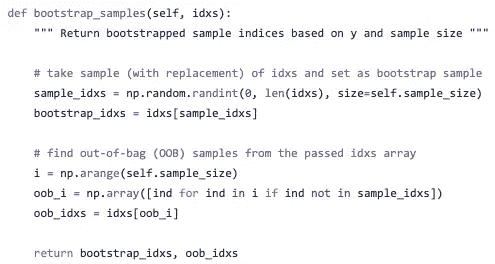

**代码示例 8。**返回引导样本的自定义功能。

您会注意到，该函数需要一个“idxs”参数，这是从中选择引导样本的训练索引值的范围。我们已经包括这一点，以便我们的模型与选定的样本大小成比例地工作。如果我们不包括这一点，当使用大数据集和小样本量(数据集大小>>样本大小)时，我们的自举样本包含重复项的概率将非常低。在这种情况下，我们的 OOB 样本变得更加难以管理，这是我们在上面的代码中采用的方法所避免的。

有了创建 OOB 的自举样本的函数，我们需要做的就是在每个决策树初始化之前调用它:

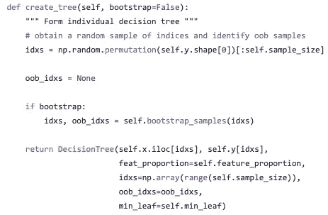

**代码示例 9。**为我们的随机森林模型创建树函数。

如图所示，如果我们已经用 *bootstrap=True* 初始化了我们的随机森林模型，我们仅获得自举样本和 OOB 样本。在初始化每个决策树之后，我们通过将(数据集 x 的)原始索引值存储在名为“ *oob_idxs* ”的属性中来跟踪哪些 OOB 样本被分配给它。正如您接下来将看到的，这允许我们确定每个决策树的 OOB 分数，从而计算出总体平均 OOB 分数。

## 2.4 找到每棵树和我们的整体模型的 OOB 分数

有了之前进行的基础工作，为我们的模型找到 OOB 分数并不太困难。我们所要做的就是遍历每个决策树，对相关的 OOB 样本进行预测，然后与实际的 y 标签进行比较，计算出我们的分数。

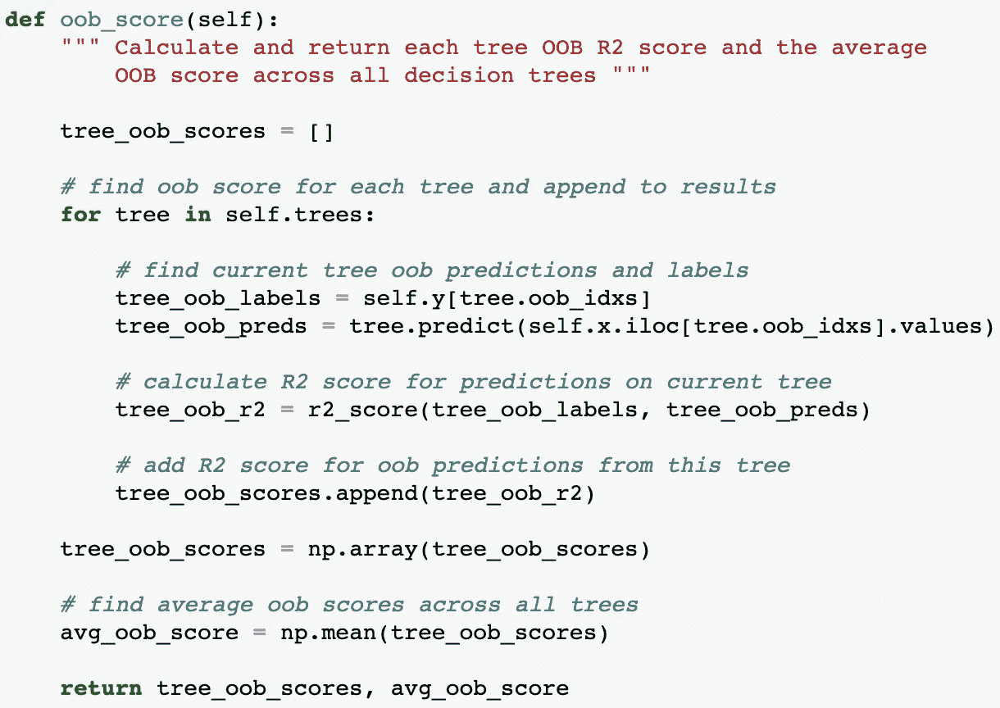

**代码示例 10。**查找袋外(OOB)分数的定制功能。

在这个例子中，我们使用了 R2 分数，但是你可以使用任何你喜欢的度量标准。这将最终取决于我们正在做的任务的性质，例如回归或分类。

注意，我们按顺序遍历每棵树，只计算该树的 OOB 样本的预测，然后找到相关的 R 值。然后，我们将这个分数附加到我们的 *tree_oob_scores* 数组中，这样我们就可以找到所有决策树的总体平均 oob 分数——这对应于我们的随机森林 OOB 分数。

## 2.5 在我们的模型中寻找特征的重要性

最后一个值得一提的随机森林特性是计算特性重要性的能力。我们可以用多种方式对这个特性的重要性进行分级。流行的方法(Scikit-Learn 使用)是测量森林中所有树木的某个特征平均减少杂质的程度。对于我们的模型，这相当于测量平均每个特征在所有树模型中降低标准偏差成本函数的强度。

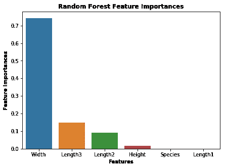

**图十三。**鱼类市场数据的特征重要性。

另一种计算重要性的方法，正如在 [FastAI 面向程序员的机器学习课程](http://course18.fast.ai/ml)中所强调的，是随机打乱每个特性列，并测量它对评估分数的影响程度。这是在数据集上训练模型之后完成的，并且一次对每个特征执行一次，以便比较它降低(甚至提高)评估分数的程度。那些引起最大下降的特征代表最重要的，而那些影响最小的特征是最不重要的。

对于我们的模型，我们使用后一种方法实现了特性重要性:

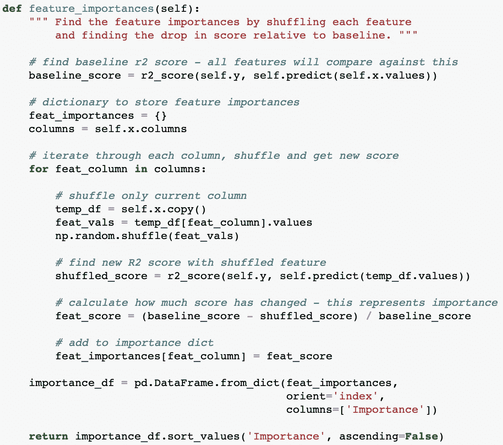

**代码示例 11。**用于查找特征重要性的自定义随机森林函数。

我们首先使用原始数据找到一个基线 R2 分数，然后迭代地分别洗牌并找到分数变化的结果。在任一时刻，只有一个特征列被随机打乱；所有其他列都保持其原始的非混洗状态。我们通过将这些重要性形成一个数据帧来结束这个函数，并且为了方便起见，将这个数据帧按照重要性排序后返回。

通过在我们的随机森林实例上调用这个函数，我们可以很容易地绘制出我们的相对特性重要性，如下所示:

```
feature_importances = random_forest.feature_importances()
feature_importances.plot.bar()
```

这给了我们一个很好的重要性展示，就像这样:

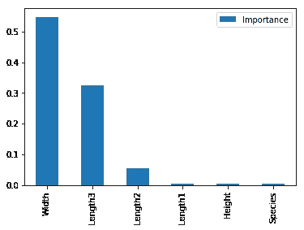

**图 14。**使用我们的自定义函数显示鱼市场数据的重要性。

瞧啊。我特别喜欢这种方法，因为这是一种不太复杂、同样有效的计算数据集特征重要性的方法。然而，这依赖于使用一个好的、有代表性的数据集来获得这些重要性，否则我们的结果将是不可靠的。还应该注意的是，由于它使用了不同的方法，它可能会给出与通过 Scikit-Learn 随机森林模型获得的结果略有不同的结果。

现在完成了……这基本上包含了我们需要在本文中讨论的所有内容。你可以用随机森林做很多其他的事情，但是我认为我们已经设法抓住了本质！我希望你喜欢它！

# 结论

正如我们在本文中所看到的，尽管随机森林和决策树在概念上很简单，但是仍然很难用完整的代码实现和要点来解释它们。尽管这个模型决不是专业的随机森林模型的替代品，但它应该作为一个有用的学习模型。毫无疑问，我们的模型存在许多潜在的低效和用例问题，但是对于理解随机森林来说，这已经足够了！

希望你已经喜欢了这些内容，并且在这个过程中设法学习或修改了关键概念。就像神经网络和其他机器学习算法一样，您永远也不需要从头开始实际实现随机森林或决策树。然而，对基本概念的深刻理解对在实践中使用这些工具有很大帮助，更重要的是，它帮助您获得解释和调整超参数的技能，以最适合您自己的项目。

关于本文中所有内容的完整代码实现，你可以在我的 GitHub repo [这里](https://github.com/BenjaminFraser/data-analysis/blob/master/Random_forests_and_decision_trees.ipynb)找到。