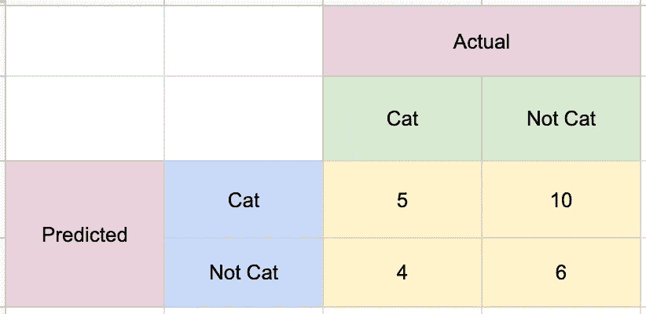

# 解释混淆矩阵的初级读本

> 原文：<https://towardsdatascience.com/a-primer-for-confusion-matrices-ff5efe375c23?source=collection_archive---------61----------------------->

亨利&公司在 [Unsplash](/s/photos/confusion-matrix?utm_source=unsplash&utm_medium=referral&utm_content=creditCopyText) 上拍摄的照片

## 以我的猫为特色！

在我的上一篇文章中，我谈到了混淆矩阵及其在帮助我们确定模型准确性方面的重要性。本周我们将看看混淆矩阵的基本结构，以及它们如何帮助我们确定模型的准确性。

# 让我们从头开始…

正如我在上一篇文章中提到的，混淆矩阵归功于 1904 年的卡尔·皮尔逊，尽管对他来说这是列联表。它们在统计分类和机器学习中很受欢迎，使我们能够直观地表示分类器的性能。混淆矩阵是一种列联表，用于测量真阳性、假阳性、真阴性和假阴性的比率。下面是一个简单的例子:

看起来不太妙，是吧？嗯，它不是，但它充满了有用的信息，告诉我们我们的机器学习模型在分类方面表现如何……是否有猫。真正有用的东西。那么我们如何解读这些数据呢？好吧，让我们看看每个类别对我们意味着什么。

以上，你看到了每一类背后的真谛。在积极的预测和积极的实际相遇的地方，我们有一个真正的积极。在消极的预测和消极的实际相遇的地方，我们有一个真正的消极。这意味着在前者中，一只猫被预言，而图像本身就是一只猫。在后者中，图像被识别为不是猫，而实际图像本身也不是猫。由于我们每天与医学和一些不良医学电视的互动，许多人都知道术语“假阳性”对于那些有点困惑的人来说，这意味着在这种情况下，我们的机器根据实际上不是猫的图像来预测猫。假阴性意味着是猫的图像被预测为不是猫。这是一次通过的情况:

左上:凯文(两次乳腺癌幸存者)，右上:塞斯(瑞普好朋友)

现在我们理解了这些类别，我们可以回头看看我们最初的混淆矩阵，这些数字更有意义。我们的混淆矩阵告诉我们，在这次初始运行中，5 张猫图片被准确分类，10 张被错误分类，4 张非猫图片被错误分类为猫，6 张非猫图片被正确分类为非猫。这表明我们的模型还不太擅长识别猫的图像。

# 混淆矩阵的度量

现在，正如你可能意识到的，一些数学家不能就这么离开。这里我们有一个清晰易读的混淆矩阵，它告诉我们模型的表现有多好。但是为了简洁，易读性和可解释性可能会半途而废。毕竟，如果我们要对我们的模型进行演示，我们不能只显示一个又一个混淆矩阵。有些人就是希望那些硬性的数字来决定成功。这就是我们确定混淆矩阵成功与否的标准。

输入我们的 4 个测试指标:准确度、精确度、召回率和 F1。我不打算在这里做太多的细节，但是我会列出每一个的功能。

**准确率**:准确率可以用下面的公式简单计算:
*准确率=(真阳性+真阴性/总预测)* 100%*
这是一个简单的度量，但并不总是最好的。客观地说，准确性衡量的是正确的猫+正确的没有猫划分的图像的总数。

**Precision** : Precision 表示我们的模型预测为阳性的图像实际上是阳性的图像的比例，可以通过下面的公式计算:
*Precision =(真阳性)/(真阳性+假阳性)* 从这个角度来看，Precision 测量识别为 Cat 的图像中，有多少实际上是 Cat？

**召回**:召回测试我们的模型从所有正面预测中找出正确预测的能力。使用以下公式计算:
*回忆=(真阳性)/(真阳性+假阴性)* 为了正确地看待这个问题，回忆实际上是 Cat 的图像的措施，有多少被准确地预测为 Cat？

**F1 得分** : F1 得分是准确率和召回率的加权平均值，考虑了误报和漏报。这可以使它比准确性更有效，特别是当我们有不平衡的类或多个类时。下面是公式:
*F1 = 2*(精度*召回)/(召回+精度))* F1 评分背后的思路是平衡精度和召回背后的顾虑。由于两者都是相关的指标，F1 让我们能够合并两个分数。

# **现实世界应用**

现在我们知道了一些混淆矩阵的基本知识以及如何测量它们，让我们用这些知识来研究一下现实生活中的混淆矩阵。我将使用我的威士忌项目中的一些旧的混淆矩阵，因为我懒得去挖掘旧的或者做一个新的。这会有点复杂，但请耐心听我说，因为我会尽量让它简单易懂。

观察我们的 KNN 分类器的混淆矩阵。它在苏格兰威士忌的分类方面做得非常出色。这种特殊的分类在许多方面都是独一无二的。首先，它是多等级的，因为威士忌有许多国家。第二，有一个主要的阶级不平衡，我们用我们的训练假人来补偿。但在一天结束时，仍然有许多威士忌和苏格兰威士忌的风味特征随处可见。

正如你在分类报告中看到的，这个模型对苏格兰威士忌有很好的精确度，对波旁威士忌有几乎不可能的精确度。如果我们还记得精度的定义，我们会记得精度就是预测值与实际值的比率。我们可以看到，在苏格兰一栏中，虽然 KNN 在 164 种苏格兰威士忌中答对了 140 种，但它还包括 4 种波旁威士忌、5 种加拿大威士忌、6 种爱尔兰威士忌、4 种日本威士忌和 17 种世界威士忌。如果我们计算一下，我们得到的精度分数是 0.80。

回想一下，在 164 个苏格兰人中，KNN 答对了 140 个，但这次我们将**移过**矩阵，以解决假阴性问题！我们可以看到 KNN 分类器认为 23 个苏格兰人是加拿大人，1 个苏格兰人是爱尔兰人。如果我们对它们进行计算，我们会得到 0.82 的分数。很自然，因为 F1 是这两者的平均值，我们知道我们的 F1 分数是 0.81。

如果我们想对苏格兰威士忌进行分类，这个模型会很棒。不幸的是，当我们在国家列表中往下看时，我们看到一些非常糟糕的分数。数据科学家通常会在这里评估他们构建这些模型的目标。KNN 似乎非常擅长对苏格兰人进行分类，但如果我只想对苏格兰人进行分类，我为什么要费心去做这些其他国家的分类呢？不，根据真阳性和假阴性的分布，结合我们计算的指标，KNN 不是一个伟大的威士忌分类器。

# 关于多类混淆矩阵的一个注记

你们中的一些人可能已经看到了多类混淆矩阵，并认为，你是怎么看出来的？真阳性，真阴性，甚至假阳性在哪里？？好吧，即使我们没有标记所有的东西，我们只需要记住所有东西的相对位置。让我们来看一个混淆矩阵的例子，好吗？

关键:绿色-真阳性，紫色-假阴性，蓝色-假阳性，红色-真阴性

这是一个混乱矩阵，表示猫、狗和老鼠的分类。如果我们想要计算我们的模型对猫进行分类的能力的精确度或召回率，我们将通过以下组来组织我们的混淆矩阵。

**绿色方框**代表*真阳性*。卡特彼勒预测值和实际值。
**红框**代表*真阴性*，这些与 Cat 预测或 Cat 实际无关，所以我们知道图像被正确预测为非 Cat
**蓝框**代表*假阳性*。真正的狗或老鼠，但被归类为猫。
**紫色方框**代表*假阴性*。被归类为狗或老鼠的真正的猫。

所以对于猫，我们知道如下:
真阳性: **8**
真阴性:6+5+5+3 = **19**
假阳性:1 + 5 = **6**
假阴性:7 + 2 = **9**

了解了这些，我们就可以开始计算准确度、精确度、召回率和 F1 分数了。同样的移位和分离可以对狗和老鼠进行，以计算它们的分数。

# 结论

我希望这篇关于混淆矩阵的简介对你们有所帮助。当我第一次开始使用机器学习的时候，我发现它们有点…令人困惑，因为没有更好的词。了解来龙去脉并学会解释它们将有助于您理解模型中发生的事情，进而有助于您成为更好的数据科学家。