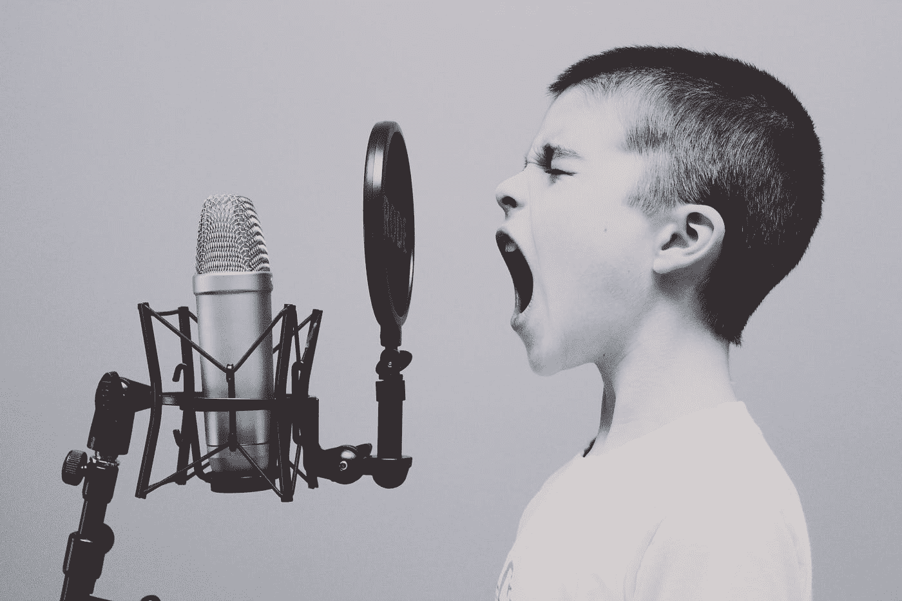
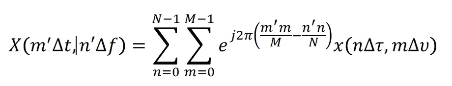
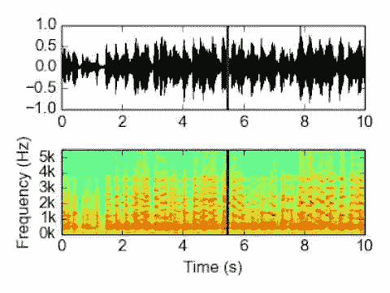
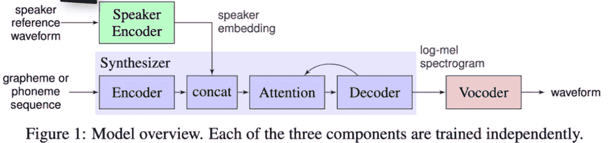
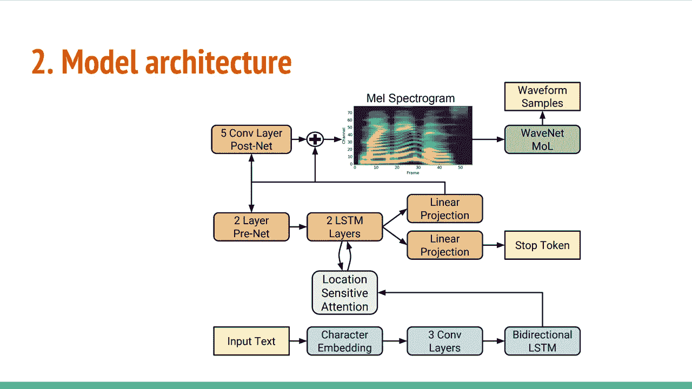

# 生成语音模型初级读本

> 原文：<https://towardsdatascience.com/a-primer-for-generative-voice-models-b41bec0003d2?source=collection_archive---------30----------------------->

## 现在，通过机器学习，音频生成成为可能。学习基础知识开始。

杰森·罗斯韦尔在 [Unsplash](https://unsplash.com?utm_source=medium&utm_medium=referral) 上的照片

C 尖端的机器学习模型和技术已经允许创建几乎任何类型的内容，从图像到视频到声音。这些生成技术允许前所未见的多媒体媒体的创建和操作类型。从技术的角度来看，接下来的过程只是训练一个数学模型来接受输入类型(文本、面部、图像)并输出任何期望的类型(声音、新面部、新图像)。可以用这种方式编译的任何类型的数据都可以用来构建生成模型。

生成模型的一种强大用例是基于任何文本集生成语音选择音频。这项技术有着广泛的应用，从逼真的聊天机器人到书籍、电影和其他媒体的可调叙述。就模型架构而言，这种技术利用了几种不同类型的生成网络。为了理解这些模型是如何组合在一起的，首先要理解声音和声音文件。

**我们听到的任何声音或虚拟声音片段都可以概括为一组采样率间隔的振幅值**。这产生的波型的位置是在任何给定的时间听到的声音，因为它振动耳朵内的敏感毛发。振幅的振荡产生了整体波的频率，这反过来又产生了我们从任何声音中听到的独特音调。另一方面，振幅提供了任何时候振动的大小。振幅模式产生频率和音量，然后被听者听到，就像他们知道的声音一样。

吓人的傅立叶变换方程([来源](https://en.wikipedia.org/wiki/File:Fourier_transform_equation.png))

可以对任何波执行**傅立叶变换**，以找到随时间变化的频谱图或频率密度。这种分析有助于显示什么类型的频率导致已知的声音。虽然这是整个波的导数，但是声谱图不能用于实际产生声音，因为此时波型是未知的。总的来说，这创造了一种动态，其中独特的声音通过频谱图被最好地创造出来，但只有转换回基于振幅的波才能被听到。没有反向 FFT，这为人工智能和机器学习创造了一个诱人的预测任务。

波形(上)和转换后的频谱图(下)(来源: [MindBuilder AI](https://www.mindbuilderai.com) Research)

有了这些知识，很明显，使用生成模型获取文本并将其转换为声音的最佳方式是构建:

**文本— >声谱图**关系，并训练一个模型来执行这个。

事实仍然是声谱图不能产生实际的声音。为了实现这一点，可以利用另一个生成模型来创建:**声谱图— >波转换**。

这两种类型的模型都经过了大量的研究，并且都有当前最先进的方法。对于文本->声谱图，存在 [Tacotron2](https://github.com/NVIDIA/tacotron2) 模型架构，同样，对于声谱图- >波/声音，存在 W [avenet](https://arxiv.org/pdf/1609.03499.pdf) 架构。通过将这些网络组合在一起，就可以实现将文本转换成声音的目标。

[来源](https://arxiv.org/pdf/1806.04558.pdf)

实现这个管道是为了从简单的文本生成语音。在这个总图中，我们的实现对绿色部分使用了经过训练的编码器网络，对合成器部分使用了 Tacotron2，对声码器部分使用了 WaveNet，以最终产生波形。

[实时语音克隆 Github 库](https://github.com/CorentinJ/Real-Time-Voice-Cloning)已经建立了实现两个网络的函数，并创建了 5 秒或更长的声音。由于从零开始积累数据以训练这种模型的困难(需要毫秒文本-声谱图数据)，储存库向预训练的模型提供基于新声音进行微调的方法。这是通过利用音频库来扫描音频并创建所提供语音的权重嵌入来实现的，该权重嵌入被应用于 Tacotron2 预训练模型以生成所提供语音特有的频谱图。接下来，Wavenet 是一个通用模型，它简单地将频谱图转换为波/振幅数据。然后可以将该幅度数据转换为。wav 格式，利用存储库中包含的内置 python 库。在 [demo_cli.py](https://github.com/CorentinJ/Real-Time-Voice-Cloning/blob/master/demo_cli.py) 中提供了该过程的演练，只需用户提供一个音频文件和文本即可生成任何句子。

最后，该模型可用于将原始文本作为输入，并生成频率与任何源音频文件相似的声谱图。如上所述，最后一步是使用 WaveNet 从声谱图到波形生成可用的音频。幸运的是，这是一个跨扬声器的通用转换，因此不需要特定的培训来产生波形。这部分使用了 Nvidia 预先训练好的模型。最终产品是一个从波形生成的. wav 文件，其声音非常类似于有声读物的声音。

图:具有深度 TacoTron 2 单元的端到端架构([来源](https://github.com/CorentinJ/Real-Time-Voice-Cloning))

为了将该体系结构带到生产系统以反映任何提供的语音，不需要在每次运行时都提供音频文件，因为只要语音不需要改变，嵌入就可以简单地保存并永久应用到 Tacotron 模型。Github repo 中的代码将显示用 Tacotron 生成声谱图的方法只需要朗读文本和嵌入。记住这一点，每次保存并简单地传递相同的嵌入是有意义的。这可以作为从 API 接收的文本的入口点。下一步可以按照 GitHub 演示流程，将生成的声谱图传递给波形生成函数。最后。wav 文件将保存到文件系统中，并带有一个指向 API 返回的资源的链接，或者如果进行了配置，可以直接从 API 返回。

该处理流程允许基于一次训练来生成语音，以创建嵌入。接下来，API 可以集成到任何接收文本输入和需要音频的地方。这种灵活的模型也可以用来创建不同声音的切换嵌入。

在未来，这项技术将为娱乐、通信和移动带来许多新的机会。随着越来越多的开发人员继续实现和调整这些架构，所生成内容的准确性和真实性将会继续提高。一个我们可以实现虚拟版自己的世界可能不远了！

在 [Twitter](https://twitter.com/ianrowan29) 或 [LinkedIn](https://www.linkedin.com/in/ian-rowan/) 上继续与我对话！

*在*[*https://www.mindbuilderai.com*](https://www.mindbuilderai.com)看看我目前在做什么

**参考文献**

[1][https://en . Wikipedia . org/wiki/File:Fourier _ transform _ equation . png](https://en.wikipedia.org/wiki/File:Fourier_transform_equation.png)

[2][https://github.com/NVIDIA/tacotron2](https://github.com/NVIDIA/tacotron2)

[3]https://arxiv.org/pdf/1609.03499.pdf

[4]https://arxiv.org/pdf/1806.04558.pdf

[5][https://github.com/CorentinJ/Real-Time-Voice-Cloning](https://github.com/CorentinJ/Real-Time-Voice-Cloning)