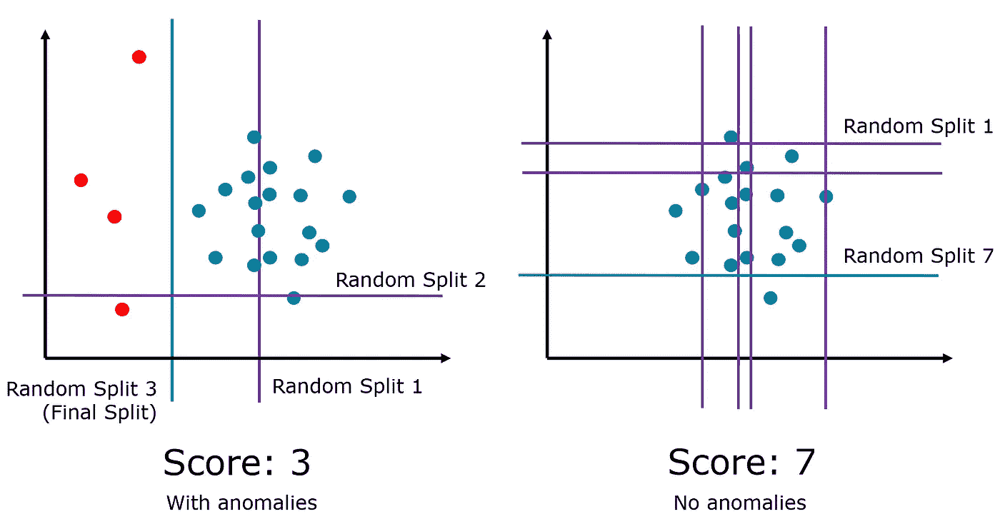

# 异常检测入门:机器学习的隐藏面

> 原文：<https://towardsdatascience.com/a-primer-on-anomaly-detection-the-hidden-side-of-machine-learning-8213297e36af?source=collection_archive---------64----------------------->

来源: [Pixabay](https://pixabay.com/photos/peas-pod-pea-pod-green-fresh-580333/)

## 一项困难且通常无人知晓的任务

异常不断地进入数据，识别它们非常重要。无论是黑客攻击还是巨魔攻击，允许异常出现并运行而不被注意或忽略都将是致命的。然而，不幸的是，许多数据科学课程没有深入探讨算法在异常检测中的应用。机器学习的这一面特别没意思，因为没有监督或非监督解决方案的确定方法(见半监督学习)；相反，有各种创造性的技术和方法从许多角度来解决这个问题。

异常有许多类型，但一般来说，大多数可以分为四类:

*   *点异常*。如果一个数据点离其余数据点太远，这就是点异常。例如，当您通常只进行 10-100 美元的交易时，考虑从您的银行账户中进行 10，000 美元的交易。这也称为附加异常值。
*   *语境异常*。如果一个事件在特定的语境中是不寻常的，那么它就是语境异常。例如，在炎热的*和寒冷的*月份，冰淇淋的销量保持不变。
*   *集体异常*。集体异常表示关于数据集的一组异常，而不是单个对象。例如，考虑心电图中的一系列中断的节律。
*   *时间异常*。暂时异常是指用户数量在短时间内接近零或非常低。举例来说，这可能是服务器停机的结果。

由于一个特殊的原因，发现数据中的异常是一项特别困难的任务:决定阈值是困难的。特别是在高维数据中，当难以可视化数据时，很难决定离群点边界的宽松程度。客观地说，不可能定义什么是“离群值”。因为它的定义非常依赖于上下文，所以这是一项非常困难的任务，需要对数据非常熟悉和理解。

异常检测有各种算法和技术。

*用于异常检测的 KNN*是 K-最近邻算法的再利用，该算法通过根据欧几里德距离聚集 K-最近邻的类来确定邻居的类。KNN 算法不仅仅限于预测数据点的组或值，还可以用于检测异常。因为 KNN 试图对数据中的潜在关系进行细微的归纳(随着 *k* 的增加而增加)，预测中的错误是数据点可能不符合整体趋势的迹象。使用这种方法，任何使用预测模型的算法都可以用来检测异常。理论上，任何异常的数据点都会降低模型的预测能力。使用这些标签，可以训练另一个 KNN 模型来严格识别异常/非异常。这种方法可以与其他预测方法一起使用，在某种意义上，这是一种[半监督](https://medium.com/faun/supervised-learning-but-a-lot-better-semi-supervised-learning-a42dff534781)方法。

*局部异常因子*是一种基于密度的异常检测算法。使用 k 个最近邻居之间的欧几里德距离，可以估计局部密度。局部异常值因子将一个项目的局部密度与其相邻项目的局部密度进行比较，从而确定密度相似的区域以及密度远低于其相邻项目(异常值)的其他项目。LOF 依赖的观点是，离群点周围的密度与其邻居周围的密度有很大不同。本地离群因子是基于一个项目的本地可达性密度和它的 *k* 最近邻居的平均比率来计算的。虽然这是一种基于最近邻的方法，但它是不受监督的，并且不需要任何标签。

*隔离森林*试图通过随机选择一个特征并在最大值和最小值之间的某个分割值处随机分割该特征来隔离观察值。该算法基于这样一种想法，即隔离异常更容易，因为只需要很少的条件就可以从正常观察中分离出案例。另一方面，隔离一个正常的观察需要更多的条件。因此，异常分数可以计算为分离观察所需的条件的数量。

作者图文。

该算法首先通过创建几个隔离树(随机决策树)来构造分离，计算路径长度来隔离每个观察值。因为该方法依赖于随机性，所以 [bagging](https://medium.com/swlh/how-injecting-randomness-can-improve-model-accuracy-11cdc04b3eeb) 是通过聚合许多隔离树的结果来实现的。隔离森林是一个聪明的方法，它依赖于一个沉重的假设，根据上下文的不同，这个假设可能有不同程度的真实性。

*时间序列异常检测*是一种检测时间序列或一段时间内数值异常的方法。在训练一个时间序列模型——无论是 ARIMA(自回归综合移动平均)还是 RNN(递归神经网络)——之后，它将能够根据看不见的数据进行预测。与预测值显著不同的点(高残差)可被标记为异常。使用这种方法时一定要小心:时间序列预测因无法捕捉外部信号而臭名昭著，这些信号经常决定时间序列的值(例如，没有股票价格模型能够预测冠状病毒)，可能会持续产生标记为异常的结果。为了将异常如实地标记为异常值，必须满足几个条件:

*   时间序列必须要么已经被证明是合理的预测，要么不断更新的新信号。
*   最多 5%-10%(视上下文而定)的点可以被标记为异常。否则，它们将不会是作为合法集群/信号的异常，或者，噪声可能只是数据的结构部分。

用于异常检测的各种其他更专业的技术包括:

*   最近邻算法:基于连通性的离群因子(COF)、局部离群概率(LoOP)、受影响离群度(INFLO)、局部相关积分(LOCI)
*   基于聚类的算法:基于聚类的局部离群因子(CBLOF)，基于局部密度聚类的离群因子(LDCOF)
*   基于分类的算法:神经网络，贝叶斯网络，决策树，基于规则
*   基于统计的算法:参数技术，非参数技术

所讨论的每一种算法都彼此特别不同，因为人们可以从许多方向来完成异常检测任务，从无监督、有监督或半监督方法到高方差或高偏差方法，每一种技术都有许多优点，但也有许多需要完全理解的假设，特别是对于这样一个微妙的任务。

# 如果你喜欢，

你可能会对我其他一些关于机器学习的文章感兴趣。

 [## 监督学习，但是更好:半监督学习

### 为什么半监督学习是 ML 的未来

medium.com](https://medium.com/faun/supervised-learning-but-a-lot-better-semi-supervised-learning-a42dff534781)  [## 组合学习是机器学习的未来

### 自 20 世纪 50 年代以来，机器学习已经走过了漫长的道路，当时简单机器学习算法的统计方法…

medium.com](https://medium.com/swlh/compositional-learning-is-the-future-of-machine-learning-22b56ad09edc)