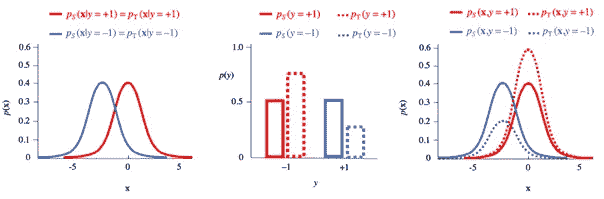
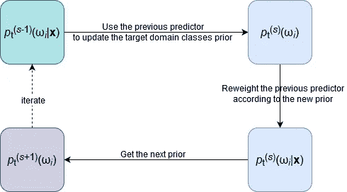
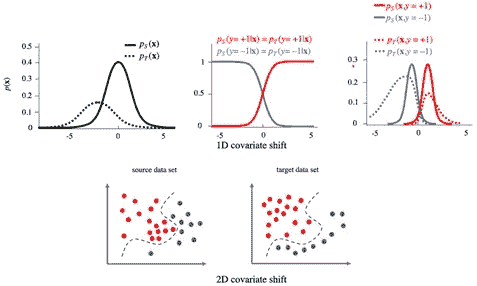
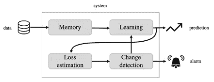
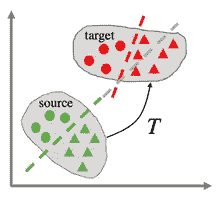

# 领域适应入门

> 原文：<https://towardsdatascience.com/a-primer-on-domain-adaptation-cf6abf7087a3?source=collection_archive---------26----------------------->

## 从理论到应用

> 这篇文章是由皮尔明·伦伯格和 T2·伊万·帕尼科共同完成的一项工作的总结。
> 
> 免责声明:由于介质上仍然缺乏 unicode 中的下标支持，我们选择使用下面的下标符号:p_S = p 下标 S。

# 领域适应——一段丰富而又有些混乱的历史

机器学习的目的是在给定足够数量的适当数据的情况下，对一些现象进行统计预测。在**监督机器学习**中，这些数据来自一组观察值，其中一些目标数量、类别或标签取决于一些可测量的特征。在标准设置中，假设所有观测值都是独立的，并且是从同一个分布中采样的。然后，ML 算法的作用是将该训练数据转换成一个函数，该函数在给定特征的情况下准确地预测看不见的观察结果的标签。

> 经典的最大似然理论假设来自测试集的新观察值(我们希望对其进行预测)来自与来自训练集的观察值相同的群体。然而，这是实践中很少遇到的理想情况。

**训练集相对于测试集**有偏差。正如我们将要看到的，根据情况的不同，这种偏差可以是已知的，也可以是未知的。领域适应(DA)是本综述的主题，是一组旨在以某种方式补偿训练集和测试集之间的统计不对称性的方法。事实上，领域适配在 ML 中是一个全新的话题。然而，有几个原因使得新手很难对领域适应建立一个连贯的概述:

*   关于 DA 的研究论文在某个特定的学科中处理这个主题，使用了在其他地方不适用的专门词汇和概念。
*   即使对于不是专门针对某个特定学科的 DA 研究**，也没有通用的术语协议**来指代不同类型的领域适应。这通常会造成混乱。
*   DA 有时会与迁移学习混淆，后者是当前 NLP 和深度学习领域的热门话题。TL 处理的是将从一个任务中获得的知识转移到另一个任务中，而 DA，也就是我们关注的焦点，处理的是一个训练和测试观察具有不同统计特性的单一任务。
*   从**严格的统计学习角度处理数据挖掘的文献有时充斥着数学术语**,这使得它对于更有实践经验的数据科学家来说很难阅读。
*   另一方面，**更实用的论文常常对“达”作过于描述性的叙述，在概念的一致性方面还有许多不足之处。**

因此，本教学综述的目的不是展示冗长的方法目录，而是连贯地呈现四种重要的特殊情况:****【协变量移位】******概念移位*** 和 ***子空间映射*** ，我们将很快对其进行定义。这篇介绍性综述的目的是帮助读者对这个广阔的领域建立一种直觉。更深入的探讨，可以参考我们的 [***技术文章***](https://arxiv.org/abs/2001.09994) 。*

*现在让我们继续描述我们所考虑的 DA 的四种特殊情况。此后，源域将指从中提取训练观察值的群体，而目标域将指从中提取测试观察值的群体。与源域相关的对象将被“下标”,而与目标域相关的对象将被“下标”*

# *领域适应的四个重要案例*

## *先前班次*

*先验偏移指的是这样一种情况，其中用于挑选训练观测值的源分布 *p* _S 相对于目标分布 *p* _T 是有偏差的，因为在两个域**中标签** *y* _ *i* 的**先验分布是不同的**。这里我们将关注分类，其中{ω_1，…，ω_ *n* }是一个有限的标签集。最有趣和最困难的情况是目标中标记的先验分布是未知的，而源中的观察值是根据它们的标记使用一些已知的策略选择的。例如，分层抽样在每一类ω *_k* 中选择相同数量的观察值(*y*_*j*=ω*_ k*， **x_** *j* )。另一方面，**类条件分布***p*_ S(**x**|*y*)=*p*_ T(**x**|*y*)在两个域中应该是**相同的**。图 1 说明了这种情况。*

**

*图 1:先验移位对应于标签上的先验分布 p_S(y)和 p_T(y)在源和目标(中间)中不同的情况。另一方面，假设类别条件分布 p_S( **x** |y)和 p_T( **x** |y)在两个域中是相同的(左)。由此产生的联合分布显示在右侧。*

*不涉及技术细节，处理这种情况的一个好方法是基于 ML 的**最大似然**框架内的**期望最大化** (EM)算法。回想一下，这种 ML 方法假设未知分布 *p* _T( **x** ， *y* )由参数 **θ** 参数化，然后寻找参数 **θ** _ML，使给定训练集中的观察概率最大化。另一方面，EM 算法是一种迭代方法，当概率 *p* _T 因忽略未观察到的(或潜在的)变量而导致时，该方法在特定情况下找到 **θ** _ML。于是，当使用 EM 来处理先前移位时，想法是**将目标观察值**中未观察到的类别变量** *y* _ *i* 作为潜在变量**，将类别的未知先前概率列表 *p* _T(ω *_j* 作为参数θ *_j* 。一旦 **EM** 产生了对这些先验概率的估计，我们就可以用它们来计算目标的后验概率*p*_ T(*y*=ω_*j*|**x**)，从而做出预测。直观地说，在该过程的每一步，当前预测值被用于更新目标的先验概率，该先验概率又被用于通过依赖于它的因子来校正预测值。请参见图 2 中的直观图示。*

**

*图 2:应用于先前移位的 EM 算法的直观视图。这里(s)代表程序步骤的索引。*

*我们描述的方法的一个好处是，它带有一个统计测试，可以区分你应该或不应该使用它的情况。*

## *协变量移位*

*协变量偏移，有时也称为“真实概念漂移”，描述了源分布有偏差的情况，因为根据其特征 **以比例** *p* _S( **x** ) **对**训练观测值进行采样，与目标分布** *p* _T( **x** )不匹配。这应该与我们之前讨论的偏移形成对比，在先前的偏移中，源分布中存在偏差，因为观测值是根据它们的标签 *y* 按比例 *p* _S( *y* )选择的，与 *p* _T( *y* )不匹配。然而，协变量 shift 假设响应 *y* 对特征 **x** 的依赖性，如源中的条件概率*p*_ S(*y*|**x**所描述的，与目标群体中的*p*_ T(*y*|**x**相同。图 3 描述了 **x** 为 1D 或 2D 的情况。***

**

*图 3:协变量移位对应源 p_S( **x** )和目标 p_T( **x** )特征分布不同的情况。上图:1D 的例子。下图:2D 的例子，虚线象征性地表示不变的条件概率 p _ S(y |**x**)= p _ S(y |**x**)。*

*我们强调目标特征分布 *p* _T( **x** )假设在存在协变量偏移的情况下是已知的。这再次与先前的移位形成对比，在先前的移位中，目标标签分布 *p* _T( *y* )被假定为未知。换句话说，协变量和前一次移位是 ***而不是*** 对称的情况，这是通过简单地交换带有标签 *y* 的特征 **x** 而产生的。*

*当挑选具有给定特征的观察值 **x** 的成本或难度强烈影响选择观察值( **x** ， *y* )的概率，从而实际上不可能在训练集中复制目标特征分布 *p* _T( **x** )时，通常会发生协变量偏移。一个典型的例子可能是一项调查，其中一些类别的个人比其他人更难达到，而模型应该能够对所有类别进行分类。*

*与之前的转变相反，我们在本文中提出的方法基于 ML 的 **PAC 公式。非常粗略地说，PAC 理论旨在使用源中可用的数据来找到一个预测器，该预测器将(大概和近似地)最小化目标域中的预测风险。由于我们知道边际 *p* _S( **x** )相对于 *p* _T( **x** )是有偏差的，所以策略是引入一个**再加权因子** *w* ( **x** )，使得修正后的版本*w*(**x**)*p*_ S(**分布之间的各种差异度量是可用的。我们选择深入研究所谓的 **MMD** 度量(**最大均值差异**)，既是因为它的优雅，也是因为它很好地阐释了内核方法。最小化*w*(**x**)*p*_ S(**x**)和 *p* _T( **x** )之间关于 *w* 的 MMD 测度称为 KMM ( **核均值匹配**)。它最终导致一个简单的二次优化问题，即寻找 *w* ( **x** )，对于这个问题有许多解算器可用。*****

*在这种情况下，没有统计测试能够准确地表明该方法是否有用，但主要的指导原则是 *p* _S( **x** )和 *p* _T( **x** )不应相差太大。*

## *观念转变*

*概念转换，或者有时称为真正的概念转换，描述了目标变量 *y* 对特征 **x** 的依赖性在源和目标中不同的情况。换句话说，条件分布*p*_ S(*y*|**x**)≦*p*_ T(*y*|**x**)不同。然而，特征的先验分布应该是一致的，*p*_ S(**x**)=*p*_ T(**x**)。图 4 象征性地描述了这种情况。*

**

*图 4:在概念转换中，条件分布 p_S(y| **x** 和 pT(y| **x** )在源和目标中是不同的，而先前的分布 p_S( **x** )和 p_T( **x** )是相等的。*

*就像我们之前讨论的前一次转移一样，我们通常对这里的目标标签一无所知。因此，我们不能简单地通过在我们想要最小化的真实风险的定义中插入一个重新加权因子*w*:=*p*_ T(*y*|**x**)/*p*_ S(*y*|**x**)来处理概念的转变。*

*概念转变通常以*概念漂移*的形式出现，其中条件概率*p*_ T(*y*|**x**)明确取决于时间，换句话说，它发生在*非平稳*环境中，例如在动态渐进变化的老化系统中。*

*处理漂移的算法在全球范围内被称为*自适应算法*，因为它们被设计为动态适应不断变化的设置。在这种动态环境中，人们面临的困难的核心是能够区分响应变量 *y* 的随机异常值和绑定 **x** 和 *y* 的关系中的真实漂移。这里有一些基本策略可以用来应对观念的转变:*

1.  *使用从滑动时间窗口中选择的新数据定期重新训练模型。*
2.  *定期用新数据更新模型，同时保留部分旧数据。*
3.  *重量训练数据与他们的年龄成反比，如果算法允许的话。*
4.  *使用迭代方案，其中新模型学习修正最近的模型(类似于助推)。*
5.  *检测漂移并相应选择新型号。*

*组织处理概念转换问题的现有方法本身就是一个挑战。这样做的一种方法是，任何这样的自适应系统都有四个部分，如图所示:*

*   *实际得到训练的*学习算法模块*，*
*   *一个*存储模块*定义哪些数据被呈现给学习算法，*
*   *跟踪学习算法性能的*损失估计模块*，*
*   **变化检测模块*，其处理由损失估计模块提供给它的信息，并在必要时更新学习算法模块。*

**

*图 5:自适应系统的四个模块。*

*对这四个模块的所有选项的深入描述超出了本介绍的范围。*

*处理概念漂移的应用数量如此之大，以至于所有的研究都致力于将这些任务归类到一个连贯的框架中。已经确定了三组具有不同目标并使用不同类型数据的应用程序:*

*   ***监测和控制应用**:该组中的应用旨在监测一些自动化生产过程，以测量其质量或检测可能的异常值。变化发生得很快，通常在几分钟或几秒钟内。*
*   ***信息管理应用**:该组中的应用旨在组织信息。通常情况下，数据以一系列带有时间戳的 web 文档的形式出现，应该对这些文档进行分类或描述。漂移可能在几天或几周内逐渐或突然发生。*
*   ***诊断应用**。该组的任务旨在描述几个月或几年内逐渐发生的经济群体的健康状况。*

*每个类别中的每个应用程序通常使用不同的技术来处理它们所面临的概念转变。*

*基于 PAC 理论扩展的数学框架，我们在文章中描述了漂移连续且足够慢的情况。*

## *子空间映射*

*我们不要背离传统，想象一下我们要训练一个分类器来识别猫和狗的图片。假设我们的训练集包含在特定光照条件下拍摄的图片，这些条件包括曝光、色彩平衡和特定类型的背景。那么我们应该如何优化我们的分类器来对这些在完全不同的光照条件下拍摄的相同宠物的图像进行分类呢？这是典型的*子空间映射*问题。更一般地，子空间映射处理这样的情况，其中源和目标示例同样被选择，但是在源中描述它们的特征 **x** 和在目标中描述它们的特征**x**' =*T*(**x**)之间存在未知的扭曲或坐标变化 *T* 。更准确地说，根据联合概率分布，我们假设对于子空间映射:*

*   **p*_ T(*T*(**x**)，*y*)=*p*_ S(**x**， *y* )对于源域和目标域中的描述之间的某种未知扭曲 *T* 。*

*通过边缘化和限制上述等式，我们分别获得:*

*   **p*_ T(*T*(**x**)=*p*_ S(**x***
*   **p*_ T(*y*|*T*(**x**)=*p*_ S(*y*|**x**)*

*换句话说:预测值 *y* 与源中的 **x** 和目标中的 *T* ( **x** )所描述的观测值相匹配。特别地，第一个等式意味着*p*_ T(**x**)≦*p*_ S(**x**)，第二个等式意味着*p*_ T(*y*|**|【T35)≦*p*_ S(*y*|【T40)因此，看待子空间映射的另一种方式是将协变量转换与概念转换结合起来，两者都以特征上坐标 *T* 的变化为特征。有很多种方法试图处理子空间映射。我们选择关注图 6 所示的最佳运输方法:***

**

*图 6:最佳传输方法寻找从源到目标的“低成本”非线性转换。*

*最优传输(OT)是目前处理子空间映射最通用、最优雅和最强大的方法。简而言之，**最优传输寻找映射** *T* **，该映射将源关节分布** *p* _S **变形为目标关节分布** *p* _T **，同时使用最小的努力**将质量从一个关节移动到另一个关节。当然，我们不知道目标中的标签 *y* _ *i* (这就是我们想要预测它们的原因)，因此我们不能直接访问 *p* _T。但是我们可以使用预测符*h*(**x**_*I*)作为这些标签的代理。沿着这些路线的 OT 的清楚表述导致双重最小化过程，其中在运输映射 *T* 和预测函数 *h* 上，将 *p* _S 向 *p* _T 移动的努力同时最小化。一个简单的最小化程序在使用固定 *T* 优化 *h* 和使用固定 *h* 优化 *T* 之间交替进行。针对 *h* 的优化可以使用任何 ML API 来完成，而针对 *T* 的优化可以利用 OT 优化器的最新进展。*

*虽然 OT 的数学在几十年前就已经为人所知，但它长期以来一直被数据科学家所忽视，主要是因为它的计算成本很高。但是最近由于各种允许快速优化的计算技巧，事情发生了变化。*

## *结论*

*尽管训练数据集在机器学习中具有实际重要性，但许多从业者仍然低估了处理训练数据集没有如实反映现实世界的情况的系统程序的需要。我们分析认为，这主要是由于可用的方法多种多样，并且缺乏一个统一的、广为接受的术语来描述不同的 DA 场景。出于这些原因，数据科学家通常喜欢各种技巧，如猜测适当的重采样比率或生成虚拟数据，以建立适当的训练集。*

*我们希望这篇综述能够有助于向更广泛的数据科学家受众阐明和传播对数据科学这一重要主题的认识。如果我们成功了，你可能想知道更多的。*