# 广义线性模型入门

> 原文：<https://towardsdatascience.com/a-primer-on-generalized-linear-models-ab1769a03100?source=collection_archive---------29----------------------->

## 应用统计学的支柱

线性模型非常非常重要。而其他线性模型存在(分级、比例风险等。)，GLMs 提供了一个很好的起点。

第一，业务方面。对于提出建议和交流结果，可解释性是关键。我想不出比 GLM 更具解释性的机器学习(ML)模型了。频率主义者可以使用 GLM 进行[似然比测试](/the-most-important-statistical-test-dee01f4d50cf)来测试假设，而贝叶斯主义者可以通过使用先验拟合 GLM 来获得后验概率。

第二，技术方面。即使当可解释性不是一个问题，正则化 GLM 可能是最常用的 ML 模型。对于数据科学项目来说，它通常是“最不可行的产品”,因为它易于培训和部署，同时性能相当好。Booking.com 在[的这篇文章](https://booking.ai/https-booking-ai-machine-learning-production-3ee8fe943c70)中详细介绍了他们如何快速大规模生产模型(剧透:从 GLMs 开始)。如果您有许多可能的项目要做，那么更值得的是坚持使用 GLM，只有在您完成了所有高优先级的项目之后，才返回来改进模型。

几年前有一条病毒式的推特:

> 当你在筹款时，它是人工智能。
> 
> 当你在招人的时候，就是 ML。
> 
> 当你实施时，它是线性回归。
> 
> 当你在调试时，它是 printf()。

还有人讽刺地开玩笑说:

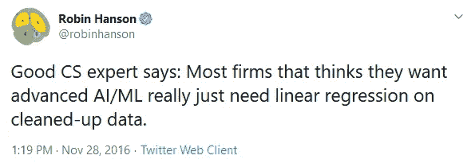

虽然这些说法并不完全属实，但其中有一点是真实的。当然，许多工作需要的是相反的极端:深度学习。尝试使用线性回归做 NLP 或计算机视觉，祝你好运。但是深度学习不就是一堆逻辑回归堆在一起吗？(我开玩笑。)

希望你相信 GLM 是分析和数据科学中需要掌握的一项重要技能。我想把 GLMs 的精髓提炼到这篇短文中，这样你只需要花 20 分钟就可以很好地理解，而不是阅读整本教科书。

本文将首先讨论逻辑回归，因为它是最常见和最熟悉的类型。然后，它将作为一个例子来解释总体 GLM 概念。然后我们将深入研究其他类型的 GLMs。假定了解普通最小二乘(OLS)回归。

# 二元结果:逻辑回归

逻辑回归用于编码为 1 或 0、真或假的二进制响应。当汇总时，我们可能将成功的比例或计数作为响应变量。我们假设数据是像掷硬币一样产生的([二项式分布](https://en.wikipedia.org/wiki/Binomial_distribution))，我们希望根据预测因素来预测成功的概率。

我们将使用[号航天飞机挑战者](https://en.wikipedia.org/wiki/Space_Shuttle_Challenger) [号 O 型圈](https://en.wikipedia.org/wiki/O-ring)数据集进行演示。1986 年，航天飞机[在发射](https://en.wikipedia.org/wiki/Space_Shuttle_Challenger_disaster)后不久解体，所有乘客遇难，原因是 O 型环故障。

这一事件是可以避免的。工程师们表达了担忧，并强烈建议因天气原因推迟发射，但警告被美国宇航局管理层忽视。发射的前一天晚上，工程师艾柏林告诉他的妻子“它要爆炸了。”

工程师是怎么知道的？以下是他们所掌握的数据(要点略显紧张):

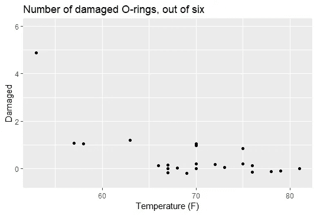

发射时，外部温度为 31 华氏度。即使通过目测，我们也应该警惕。工程师们要求等到温度上升到 53 华氏度以上。美国宇航局认为发射失败的几率为 0.001%。这次发射的风险到底有多大？

回答这个问题最天真的方法是使用 OLS 回归来预测概率:

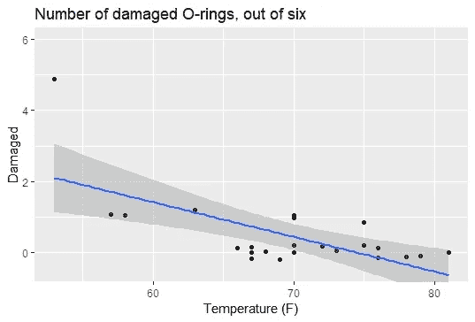

然而，这种模式没有意义。首先，它可以预测[0，1]之外的概率，或者在这种情况下，预测[0，6]之外的预期计数。与 OLS 拟合直线不同，逻辑回归拟合的是逻辑函数，一种 S 形函数:


[来源](https://commons.wikimedia.org/wiki/File:Logistic-curve.svg)

我们可以为我们的预测设定一个下限和上限。事实证明，预测对数概率(logit)并将其输入逻辑(逆 logit)函数可以实现我们的目标。我们的回归模型是:


注意没有ε。不可约误差来自二项式分布，它是 p 的函数。

在 R 中，我们可以用一个函数来拟合模型:

```
model <- glm(
  damage/6 ~ temp, 
  data = faraway::orings, 
  family = 'binomial', 
  weights = rep(6, nrow(faraway::orings))
)
```

有两种方法可以将分组二项数据输入到 R 的 glm 中。我更喜欢这个，这里的响应是比例，权重是试验次数。在 95%置信区间的情况下，预测的平均值为:

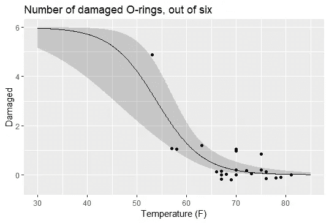

根据模型假设，我们预计在发射条件下，平均有 5 或 6 个 O 型圈会失效。发射注定要失败。

现在我们已经看到了我们的第一个例子，我们将在讨论其他发行版之前讨论 GLM 的一般方面。

## 理论:链接功能

GLMs 预测链接函数而不是原始观察值。把它们看作是把你的观察和你的模型联系起来的一种方式。

解释链接函数的最好方法是将其与转换函数进行对比。对数变换常用于处理 OLS 回归中的右偏残差，以预测函数的条件期望 E[ln(y)|X]。使用具有对数链路的高斯 GLM 代替预测 ln(E[y|X])，**作为条件期望**的函数。

当我们看到假设ε服从正态分布的回归方程时，这种差异就变得更加明显:

*   对数变换:ln(y) = Xβ + ε。y 的条件分布是*对数正态*。
*   日志链接:ln(y + ε) = Xβ。y 的条件分布是*正态*。

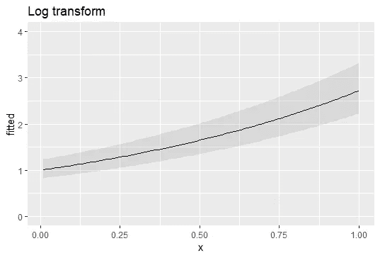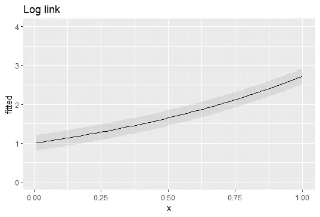

在对数变换中，exp(fitted)不是预测的平均值，而是众数。没有一个比另一个更好:他们做了不同的假设。

链接函数在计数和二进制观测中显示了它们的惊人之处。我们经常使用 log link 函数来模拟计数。您多久会因为无法记录日志(0)而感到沮丧？在泊松假设下，即使条件均值非零，你也能观察到 0。取条件平均值的对数没有问题。

逻辑回归中的典型关联函数是 logit(对数优势)函数


我们说典范是因为它是我们从二项分布本身得到的。logit 函数是转换(0，1) → R 的一种方便的方法，但是有很多函数可供选择。为什么是这个？

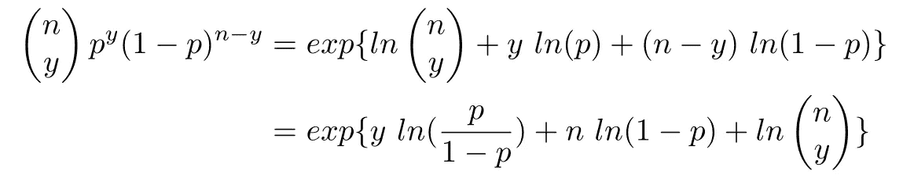

看到什么熟悉的东西了吗？我们称 logit(p)为二项式分布的自然参数，因为它是与 y 相互作用的参数。练习:对泊松做同样的操作，以说明为什么 ln(λ)是规范链接。

当然，没有人强迫你使用规范链接。例如, [probit](https://en.wikipedia.org/wiki/Probit) 链接通常用于对罕见事件建模。

## 理论:GLMs 如何工作

有几种算法可以拟合 GLM，但本文将只讨论迭代加权最小二乘法(IRLS)，因为它提供了最佳的直觉。透过渐变的镜头来看太抽象了。一些数学问题将被抛到一边，这样我们就可以专注于直觉。我们从 OLS 的封闭解开始:


在 OLS，所有的观察值都被假定为独立的，并且误差来自具有共同方差的同一个正态分布。如果观察值的权重不相等，则解决方案看起来像:


在 OLS，W 是单位矩阵，因此被省略。但是如果不是恒等式呢，比如在[加权最小二乘](https://en.wikipedia.org/wiki/Weighted_least_squares)中？我们保持独立性假设，所以 W 是对角矩阵。对角线上的每个条目应该是精度，或者 1/方差。

这最后一点是统计学中一个常见且重要的主题。统计学中如此多的东西可以被视为一个**精确加权平均值**。当我们确实对某件事有把握时(方差很小)，我们希望在计算我们的估计值时给它一个很高的权重——精度告诉我们每个观察值包含多少信息。

作为一个更具体的例子，我们知道样本均值 s 的[标准误差可以计算为](https://en.wikipedia.org/wiki/Standard_error)


如果我们对数据进行分组，并假设每个单独的观察值都来自共享相同方差的特定于组的正态分布，会怎么样？如果我们有三个组，我们可以计算全局平均值为

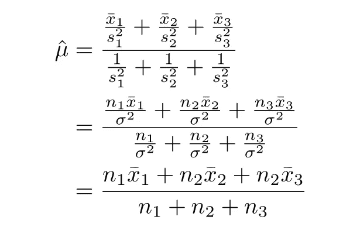

在这种情况下，精确加权平均值与常规加权平均值完全相同。记住这种直觉。非正态分布的 GLM 中的 W 变得更复杂，但条目仍然是精确的。

下一步是用工作因变量 z 替换 y。我们并不试图直接预测 y，所以我们需要修改它以与链接函数一起工作。


这里的 e 是实际预测误差。在我们的逻辑回归例子中，如果 Xb = 1，那么我们的预测概率是 inv.logit(1) = 0.73。如果我们观察到一个成功，那么 e = 1 - 0.73 = 0.27。σ来自我们的选择分布。由于 logistic 回归使用的是二项式，所以σ = p(1 - p)。

如果我们假设正态分布有恒等环节 g(x) = x 呢？那么最后一项是


也就是刚刚的 [**标准化公式**](https://en.wikipedia.org/wiki/Standard_score) ！所以我们的工作因变量是我们的预测值加上多少标准差就是我们的实际值。

我们配备了 1)权重以获取加权平均值，以及 2)一个“标准化”变量以获取平均值。

最后一步是认识到 **W 和σ取决于预测值，反之亦然**。上面两个方程看起来是递归的吧？事实上，当且仅当样本来自正态分布时，样本均值和样本方差才是独立的。这是一个深刻的陈述——除了正态分布，没有其他分布有这个性质，这就是为什么我们可以一步解决 OLS。

我们可以把 IRLS 看作是一种期望最大化算法。我们保持预测值不变，并计算 W 和 z。然后，保持 W 和 z 不变，以计算新的预测值。迭代直到收敛。

现在我们有了。直观地说，GLM 是一种以巧妙的方式进行精确加权平均的算法。

## 诊断:异常

如果模型非常适合，则偏差，-2 对数似然性(+一些被忽略的常数)应遵循χ分布。根据经验，如果偏差远远高于模型自由度，那么模型可能不太符合数据。处理分组数据时要小心，因为 R 会输出不正确的偏差，您应该手动计算。简单演示:

```
dat <- data.frame(
  y = 5:7 / 10,
  n = rep(10, 3),
  x = 1:3
)
model <- glm(
  y~x, 
  data = dat, 
  weights = n, 
  family = 'binomial'
)
summary(model)
```


r 错误地认为 3 行= 3 个观察值，尽管我们有 30 个观察值。剩余偏差应该有 28 个自由度。

```
binom_deviance <- -2 * sum(
  log(choose(dat$n, dat$y * dat$n)) + 
    log(fitted(model)) * dat$y * dat$n + 
    log(1-fitted(model)) * (1-dat$y) * dat$n 
)
pchisq(
  q = binom_deviance, 
  df = sum(dat$n) - length(model$coefficients),
  lower.tail = FALSE
)
```

因为 p 值很大，为 0.9999，所以我们无法拒绝模型非常适合的零假设。

## 诊断:皮尔逊残差

为了直观地检查 GLM，我建议查看皮尔逊残差，即残差除以理论标准差，就像二项式的 sqrt(p × (1-p))和泊松的 sqrt(λ) 。因为方差取决于拟合值，所以这样做可以获得相同单位尺度上的所有残差，并且您可以使用标准正态的经验规则来观察。只有少数皮尔逊残差应该落在(-2，2)之外，极少情况下应该落在(-3，3)之外。

```
set.seed(123)
x_val <- rnorm(100)
y_poisson <- sapply(
  x_val, 
  function(x) rpois(n = 1, lambda = exp(x))
)
y_negbin <- sapply(
  x_val, 
  function(x) rnbinom(n = 1, size = 0.8, mu = exp(x))
)model_correct <- glm(y_poisson~x_val, family = 'poisson')
model_wrong <- glm(y_negbin~x_val, family = 'poisson')plot(
  fitted(model_correct), 
  residuals(model_correct, type = 'pearson'),
  main = 'Good fit',
  ylab = 'Pearson residuals',
  xlab = 'Fitted values'
)
```

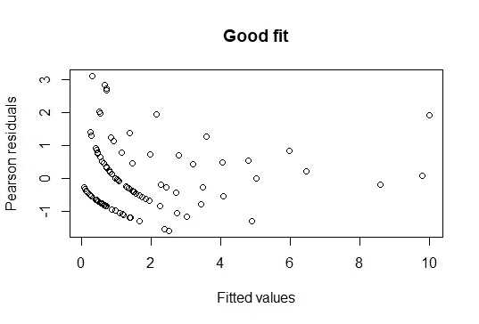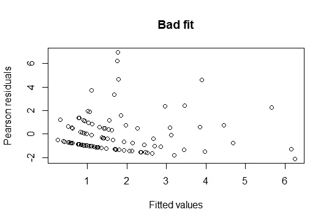

一般来说，我们不希望皮尔逊残差遵循正态分布，因为误差项的条件分布通常是偏斜的，计数不能低于 0，概率介于 0 和 1 之间。因此，一个正常的 QQ 图从表面上看是没有帮助的。

然而，如果你取皮尔逊残差的绝对值，如果模型非常适合，它们应该类似于半正态分布。一个快速而简单的方法是复制第二份皮尔逊残差，然后翻转符号，做一个普通的 QQ 图。

```
double_resid <- c(
  residuals(model_correct, type = 'pearson'),
  -residuals(model_correct, type = 'pearson')
)
qqnorm(double_resid, main = 'Good fit')
qqline(double_resid)
```

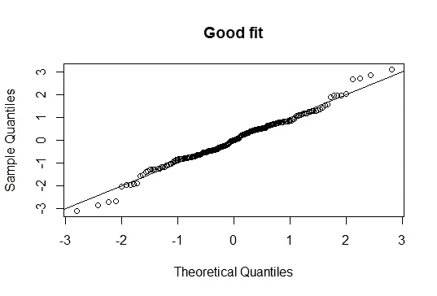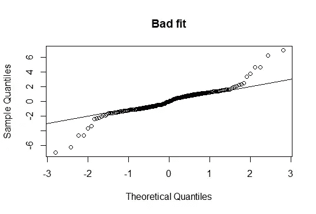

## 假设检验:似然比检验

GLMs 测试可以通过 LRT 完成。查看我的[上一篇文章](/the-most-important-statistical-test-dee01f4d50cf)详细解释。基本思想是我们想要比较两个模型，一个嵌套在另一个中。较小模型的预测值是较大模型预测值的子集。系列、数据、链接功能等。必须都一样。我们将偏差差异与χ分布进行比较，df =估计的附加参数数量:

```
dat <- data.frame(
  x1 = rnorm(10),
  x2 = rnorm(10)
)
dat$y <- dat$x1 + dat$x2 + rnorm(10)
model_small <- glm(y~x1, data = dat)
model_large <- glm(y~x1+x2, data = dat)pchisq(
  q = model_small$deviance - model_large$deviance,
  df = model_small$df.residual - model_large$df.residual,
  lower.tail = FALSE
) # Likelihood Ratio Testsummary(model_large)$coefficients # Wald test
```

在这种情况下，LRT 计算 H0 的 p 值:coef(x2) = 0。它优于回归总结中包含的 p 值，后者是通过 Wald 测试得到的一个*方便的近似值*(根据回归公式，甚至可能无法回答正确的问题)。当二次近似法失败时，贝叶斯主义者可以进行类比。

## 实践中:正规化和交叉验证

当你关心 p 值和无偏估计(在模型假设下)时，你使用香草 GLM。但是如果你想让**更好的预测**，你可以使用[正则化](https://en.wikipedia.org/wiki/Regularization_(mathematics)) GLM。当你有比观测值更多的预测值(p > n)时，你无论如何都不得不使用正则化，因为 MLE 不存在。

谈论正规化是困难的，因为不同的软件包有不同的公式。虽然最终结果是等效的，但参数的定义是不同的(C 或λ)。我将坚持使用 R 的 glmnet 文档。

GLM 最大限度地减少偏差。正则化的 GLM 将偏差最小化(乘以一个常数，我将挥去)+一个惩罚项:

*   拉索增加了 L1 规范作为惩罚。将系数的绝对值(截距除外)相加，并乘以常数λ。
*   里奇增加了 L2 标准作为惩罚。你将系数的平方和(截距除外)乘以一个常数λ。
*   elasticnet 对这两种惩罚进行加权平均。你选一个常数α，罚项设为α × L1 + (1-α)/2 × L2。

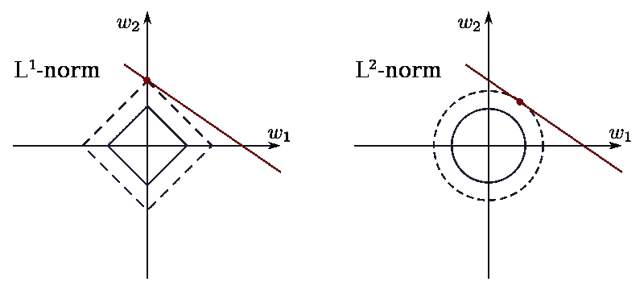

正则化的几何解释([来源](https://commons.wikimedia.org/wiki/File:L1_and_L2_balls.svg))

L1 范数鼓励稀疏性，可以将许多系数设置为 0，而岭将系数向 0 收缩，但永远不会达到 0。把λ项想象成设定一个“预算”，这样每个系数都不会花费太多(数量巨大)。

你需要标准化预测器(glmnet 默认这样做)来公平地分配预算。如果一个预测值是 g，而另一个是 kg，那么给 kg 更大的预算可能更有意义。(我们能生产多少蛋糕？也许每公斤面粉+1，但每克糖+0.001。)标准化把所有的预测器放在同一个尺度上。

有一点值得注意，很多人可能会忽略:通过正则化，您应该对所有级别的预测值进行编码。如果您有一个具有 k 个可能值的分类预测值，传统的哑编码将丢弃一个作为参考级别，然后创建 k-1 个指示列。通过正则化，**你应该创建 k 个指示器列**。拦截不会受到处罚。因为下降的电平被吸收到截距中，系数将根据下降的电平而变化，这是不希望的。

我们仍然需要设置超参数λ和α。最简单的方法是对α使用网格搜索(因为它在 0 和 1 之间，所以很容易做到均匀间隔)，对λ使用 k 倍[交叉验证](https://en.wikipedia.org/wiki/Cross-validation_(statistics))。关于 CV 的具体细节可以在别处找到。

我注意到统计学和计算机科学之间的一个主要区别是他们如何从 CV 中选择λ(或 C)。Python 中的实现返回产生最小目标函数(lambda.min)的λ，您没有选择。在 R 中，您可以在λ. min 和最大λ之间进行选择，最大λ在最小值(λ. 1s)的一个标准误差内。

根据简约法则([奥卡姆剃刀](https://en.wikipedia.org/wiki/Occam%27s_razor))，一些人更喜欢λ. 1se，因为它产生一个更简单的模型，其性能与λ. min 差不多。此外，λ. 1se 往往更稳定。将数据重新随机化成 k 倍可以产生非常不同的λmin，但是更相似的λ1s

所有的谈话都会变得令人困惑，所以让我们装一个套索来看看它的作用。r 代码:

```
library(glmnet)# The 0+ makes Species not drop a reference level
X <- model.matrix(Sepal.Length~0+., data = iris)
y <- iris$Sepal.Lengthset.seed(123)
train <- sample(1:nrow(X), floor(nrow(X) * 2/3))
model_cv <- cv.glmnet(X[train,], y[train])
plot(model_cv)model_1se <- glmnet(
  X[train,], 
  y[train], 
  lambda = model_cv$lambda.1se
)
model_min <- glmnet(
  X[train,], 
  y[train], 
  lambda = model_cv$lambda.min
)mse <- function(pred, actual){
  mean((actual - pred)^2)
}# while sometimes model_min yields lower MSE
# generally model_1se performs better in this examplemse(predict(model_1se, X[-train,]), y[-train]) # 0.09685109
mse(predict(model_min, X[-train,]), y[-train]) # 0.1022131
```

是的，你可以抱怨，因为我们用了虹膜数据集。我们想预测萼片。长度使用所有其他变量。plot()函数返回

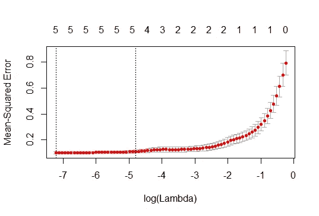

这里 log(λmin)大约为-7，而 log(λ1s)大约为-5，如虚线所示。随意尝试不同的种子值来比较 MSE，但通常 lambda.1se 表现更好。(不知道为什么 Python 里这不是默认而不是 lambda.min。手动编写交叉验证来获得 lambda.1se 是一件痛苦的事情。)

我将数据分为训练集和测试集，以说明保留数据的性能，但在实践中，您应该*而不是*进行这种划分。来自 CV 的误差比来自测试集的误差更可信。对整个数据进行 CV 以选择λ，然后对整个数据集进行改装。

我希望你们注意估计的系数:


versicolor 的系数被设置为 0，因为它是中间值。拉索学会了吸收云芝，而不是其他物种，进入拦截。

直观地说，如果{virginica，versicolor，setosa}是{1，2，3}并且我们去掉了 versicolor，那么 MLE 系数将是{-1，/，1}，并且它们收缩相等。但是如果我们去掉 setosa，因为我们按字母顺序，那么 MLE 系数将是{-2，-1，/}，并且-2 将比-1 收缩得更多。这没有意义，因为数据和现实世界都没有改变。我们不希望预测依赖于我们手动降低的水平。

现在我们已经对 GLMs 有了很好的理解，我们将继续学习其他类型。我们将只简要介绍这些内容，因为它们是建立在我们之前讨论的基础之上的。

# 计数数据:泊松和负二项式回归

泊松使用对数链接，因此回归方程看起来像


如前所述，log 链接的魔力允许我们采用 ln()，即使计数可以是 0。

有时，由于曝光单位不同，我们对速率而不是计数感兴趣。如果我们想模拟每个城市有多少人生病，仅从人口规模来看，一个有 10 万居民的城市应该比一个有 1000 居民的小城市多。

在逻辑回归中，我们使用权重参数，但是在泊松回归中，权重实际上不应该被触及。相反，我们使用偏移量。其中 y 是事件数，我们重新排列回归方程:

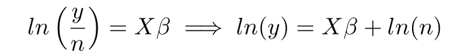

偏移仅仅意味着我们不估计斜率，而是将其固定为 1，例如 RHS 中的 ln(n)。在 R 中:

```
glm(y~x+offset(log(n)), family = 'poisson')
```

在实践中，泊松回归是不够的。许多数据表现出过度分散，即观察值的方差高于泊松分布所表明的值。这可以通过检查皮尔逊残差来发现；它们中的许多将位于(-2，2)之外。

我建议先试试泊松回归。如果有过度分散的证据，尝试负二项式回归，它也使用对数链接，但方差有一个过度分散参数。在 R 中，这是 glm.nb()函数。

[负二项式](https://en.wikipedia.org/wiki/Negative_binomial_distribution#Gamma%E2%80%93Poisson_mixture)真的很工整。如果对泊松分布求平均，其中每个泊松分布的λ根据伽马分布而变化，则得到负二项分布。换句话说，我们明确地建模，即使两个单元可能具有相同的 X，它们的λ 可能不同。这是解释过度离差的好方法，因为你有泊松和伽马的方差。

有时，你有比泊松或负二项式建议更多的零。如果你对数据生成过程有所了解，你可以使用[零膨胀回归](https://en.wikipedia.org/wiki/Zero-inflated_model)或栅栏模型(尽管这些在计算上很昂贵)。直觉参见[此螺纹](https://stats.stackexchange.com/questions/81457/what-is-the-difference-between-zero-inflated-and-hurdle-models)。

# 列联表:对数线性模型

如果我们有一组泊松随机变量，并且约束它们的总数是固定的，那么我们[得到多项式分布](https://online.stat.psu.edu/stat504/node/48/)。因此，即使列联表感觉应该被建模为多项式，泊松回归也可以完成这项工作。你应该高兴，因为处理多项式是一件痛苦的事。

对数线性模型是泊松回归的一个奇特术语，其中所有预测值都是分类的-在这种情况下，无论列联表中的类别是什么。我以前写过这方面的文章，所以如果你对更多感兴趣，请参考关于 [G-test](/the-most-important-statistical-test-dee01f4d50cf) 的部分。

# 分类结果:多项式回归

多项式回归是一种逻辑回归，它被扩展到预测二进制以上的结果。其实就是几个逻辑回归包在一起。在逻辑回归中，我们预测对数优势，其中优势是 p/(1-p)。在多项式回归中，我们做同样的事情，除了选择一个参考类别来计算概率。

假设我们有三个类别 A、B 和 c。如果我们使用 A 作为参考类别，那么我们拟合两个逻辑回归模型:

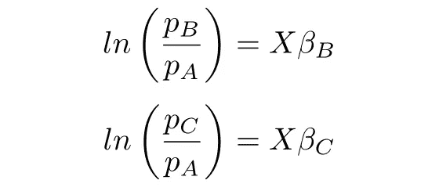

第一个模型仅针对响应为 A 或 B 的数据进行训练，第二个模型仅针对响应为 A 或 c 的数据进行训练。我们将预测值传递给 [softmax 函数](https://en.wikipedia.org/wiki/Softmax_function)以获得

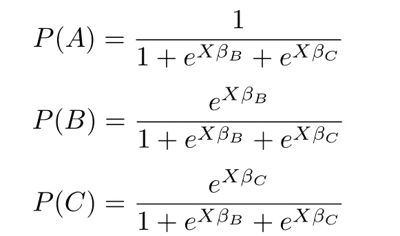

1 看起来很不合适，但请记住 log(pA/pA) = log(1) = 0。

softmax 函数只是一个逻辑函数，它可以推广到两个以上的类别。它经常被用来方便地将预测转化为概率，但在这里它不仅仅是方便:它是有意义的。假设除截距外没有其他预测值，我们观察到 70 A、20 B 和 10 C，则:

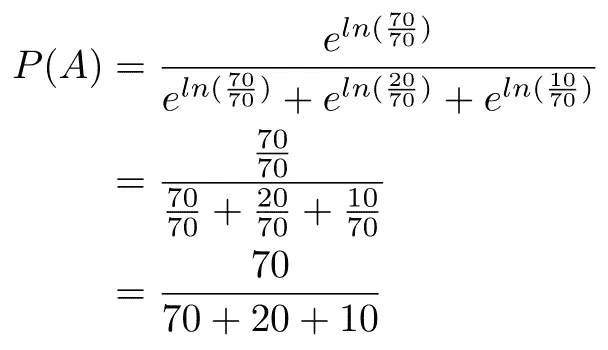

使用 MLE，选择哪个类别作为参考类别并不重要。对于正则化，如果你这样做就很重要了，所以正则化多项式回归通常不是作为一组逻辑回归来实现的。

所有这些关于 sigmoid 和 softmax 函数的讨论听起来都像是神经网络。事实上，最原始的神经网络是一堆与 softmax 函数捆绑在一起的逻辑回归，尽管自那以后该领域已经取得了很大进展。

# 有序结果:有序回归

我个人认为有序回归很不直观。您希望将 y 编码为 1，2，3，…，k，并希望预测 y = i 的概率，其中 I 是 1 到 k 之间的整数。我们使用累积链接函数:


我们的回归方程看起来像

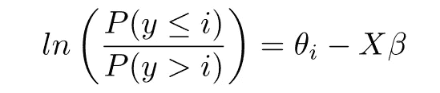

我只上到 k-1。记住 P(y > k)是 0。在回归方程中，β**T5 不包括截距。我们用一个基本事实来做预测**

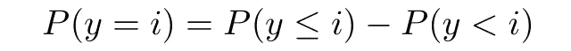

并且从

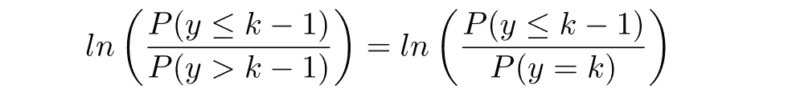

好的，那么这些等式是什么意思呢？我们正在拟合一个 sigmoid 函数来预测以 X 为条件的 [CDF](https://en.wikipedia.org/wiki/Cumulative_distribution_function) 。在回归方程中，β对于所有 I 都是固定的，但θ会随着 I 而变化。当 X 固定时，我们拟合一个单一函数，而θ决定分界点。

问题和直觉就在这里。概率总和必须为 1。想象一根长度为 1 的棍子，我们在{1，2，3，4，5}中有一个序数变量 y。我们想把棍子分成 5 段，每段的长度对应于落入某一类别的概率。最简单的解决方案是选择 4 个点进行切割:k-1θ。

# 更多资源

我是这个[课程网站](https://online.stat.psu.edu/stat504/node/49/)的忠实粉丝，它是我自学旅程中的好伙伴。和往常一样，如果你有改进的建议，请告诉我。