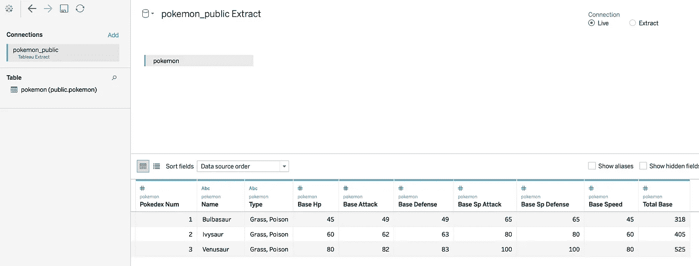
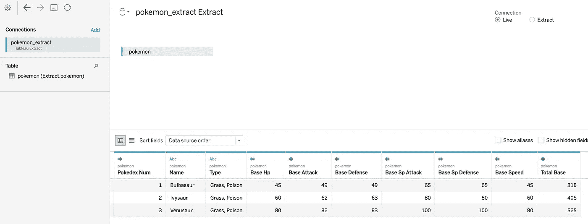
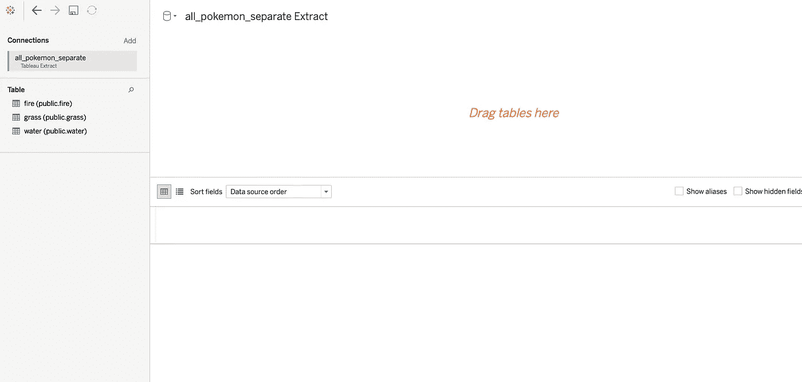
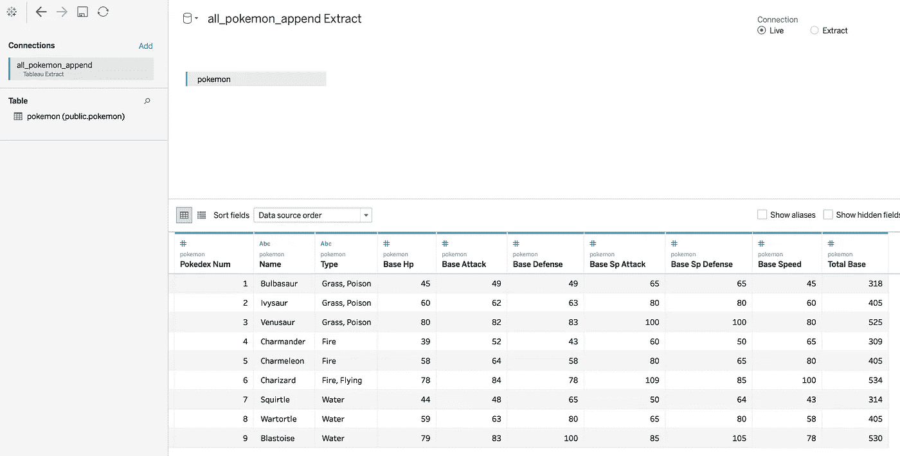

# pantab 入门

> 原文：<https://towardsdatascience.com/a-primer-on-pantab-81a9dae81b2c?source=collection_archive---------35----------------------->

## 如何在数据工作流中组合熊猫和 Tableau

Python 中的 [pandas](https://pandas.pydata.org/) 库是数据分析的基本工具，但是您知道吗，您可以将它与 Tableau Hyper API 结合使用，使您从原始数据记录到可视化的管道更加容易。这正是 Will Ayd 在 innobi 开发的 [pantab](https://pantab.readthedocs.io/en/latest/index.html) 库的确切目的，它是 Tableau 的 [Hyper API](https://help.tableau.com/current/api/hyper_api/en-us/index.html) 的 Python 包装器。在这里，我将通过一个指导性的例子来说明如何在数据工作流程中使用 pantab。

# 必备材料

*   只需在您选择的环境的终端中运行`pip install pantab`即可安装 pantab
*   在相同的环境中运行`pip install tableauhyperapi` 来安装 Tableau Hyper API
*   从 Github 克隆我的示例 [repo，因为它包含了我们将要进行的练习的所有数据(这些数据只是我在网上搜集的一些初级口袋妖怪统计数据)](https://github.com/c-l-nguyen/pantab-pokemon)

# 为什么要用 pantab？

在我们开始之前，我们为什么要首先使用 pantab 和 Hyper API 呢？Hyper API 允许你用 Tableau Hyper extract 文件创建自动化数据处理的函数。Hyper 是 Tableau 的内存数据引擎技术，摘录用“.”表示。hyper”扩展。所以基本上，Hyper API 允许你创建”。用于 Tableau 的“hyper”文件。您将能够使用 Python、Java 或 C++之类的语言创建和更新摘录。然而，有时使用 API 会有点麻烦。例如，下面是将数据从 CSV 转换为 Hyper 文件的 Python 代码片段:

将数据从 CSV 文件插入到超级文件中。多痛苦啊！

在一个超级文件中只包含 3 行数据需要付出很大的努力！(事实上，编写和调试这段代码花费了我更多的时间和精力，比本文中的所有代码加起来还要多)

好消息是，pantab 通过将它与 pandas 相结合并抽象 Hyper API 来简化它，使这一过程变得容易得多。如果你已经是一个熊猫从业者，这甚至更好，因为这将为你提供一个熟悉的框架来处理数据和生成你的超级文件。

这方面的一个用例是我在目前的职位上经常遇到的:有时运行提取需要很长时间，可能需要几个小时，但是如果有什么问题，我想调查一下。但是，我想通过连接到作为数据源的提取并对其进行 EDA 来研究提取的精确版本，以便在第二天数据被覆盖之前检查一些假设。使用 Python/pandas 之类的工具是最简单的，因为 Tableau 本身主要是一个数据可视化工具，但我想以一种更程序化的方式检查我的调查中的某些分组或聚合。

pantab 也是 ETL 数据管道中的一个有用工具，当您需要的数据必须从一个或多个来源转换时，它可以通过管道输出超级文件。有点像 Tableau Prep 的替代物(或者如果你没有权限的话，它的替代品)。

在撰写本文时，在 [pantab API](https://pantab.readthedocs.io/en/latest/api.html) 中只有 4 个函数可以调用:

*   **frame_to_hyper** :写一个数据帧到一个. hyper extract
*   **frame_from_hyper** :从 hyper extract 中提取一个数据帧
*   **frames_to_hyper** :将多个数据帧写入. hyper extract
*   **frames_from_hyper** :从一个. hyper extract 中提取多个数据帧

让我们使用我的回购中的数据，逐一查看这些例子。

# 将数据帧写入 Hyper

函数的作用是将 pandas 数据帧转换成 hyper 文件中的表格。导入所需的库后，您只需读入数据作为 pandas 数据帧，然后使用 frame_to_hyper 将数据帧写入指定的 hyper 文件，如下所示:

框架到超级示例

超级提取中的结果表

这是两行代码，与直接使用 Hyper API 的代码做完全相同的事情。代码减少了很多！现在，您可以使用 pandas 直接转换数据，或者在将数据写入超级文件之前对其进行任何检查。

注意，我实际上在上面创建了两个数据帧。我这样做是为了演示您可以将表保存在不同模式的 Hyper 文件中(有关这方面的更多背景信息，请参考 [Hyper API 参考](https://help.tableau.com/current/api/hyper_api/en-us/docs/hyper_api_create_update.html))。默认模式是“public”模式，但是您可以明确地命名一个模式，就像我对上面的“Extract”模式所做的那样。为此，您必须从 *tableauhyperapi* 库中导入“TableName”对象(因此您确实不能 100%避免 hyperapi，但您肯定可以减少直接使用它的次数！).

# 从 Hyper 读取到数据帧

为什么我要费心保存我的数据两次，但是用不同的模式？我这样做是为了证明并不是 Hyper extract 文件中的所有表都在公共模式中，所以有时您需要检查它们在哪里。(特别是，如果用于创建提取的 Tableau 版本低于 10.5 版，则默认情况下它可能位于提取模式中，而不是公共模式中。)要演示这一点，请使用 pokemon_extract.hyper 文件，并尝试使用具有默认表位置的 **frame_from_hyper** 函数将它读入 pandas 数据帧。它以消息“*出错:指定的表不存在:口袋妖怪。*”因为 Tableau 10.5 及以上版本“口袋妖怪”表不在默认位置。您需要使用 TableName 对象指定模式，如下面代码片段中的第二行代码所示:

在 frame_to_hyper 函数中指定模式

将数据帧写入 Hyper 时，您可以轻松检查默认模式是否为公共模式，因为这几行具有完全相同的结果文件:

如果没有给定特定的模式，则默认为公共模式

注意左边写着“public.pokemon”

注意左边写着“Extract.pokemon”

# 如何将多个表读入数据帧并检查现有的表和模式

对于现有的超级文件，现有模式中可能已经有表。我们如何检查这些现有的表和模式？我们可以使用 **frames_from_hyper** 函数来帮助我们。frames_from_hyper 函数返回一个字典对象，其中模式/表存储为字典键，熊猫数据帧是值。查看这些键将揭示任何预先存在的模式和表。

返回我们已经拥有的模式和表

在这里，我们可以看到 public.pokemon 存在于 pokemon_public.hyper 文件中，而 Extract.pokemon 存在于 pokemon_extract.hyper 文件中。

# 将多个数据帧写入 Hyper

最后，我们可以通过使用 **frames_to_hyper** 函数将多个 pandas 数据帧写入一个 Hyper 文件。它需要一个数据帧字典作为输入，将每个数据帧写出到一个超级提取的表中，如下所示:

将多个数据帧写入超级文件

但是请注意，这将在 Hyper 文件中创建三个单独的表，无法将它们合并或联合成一个表:

都是分开的，不能用并集或合集

但是如果我们想把所有的表合并成一个呢？在这里，我们所有的表都有相同的形状和字段，所以我们最终想把它们组合起来。我们可以通过两种方式实现这一点:或者在写入超级文件之前将它们合并为一个 pandas 数据帧，或者使用 frame_to_hyper 中的 append 模式(table_mode = 'a '):

在 Hyper 中将数据帧合并到一个表中的两种方法

追加数据帧的结果

追加超级表的结果

熊猫图书馆可以使许多事情变得更容易，包括使用 Tableau 工作流程。我希望这本初级读本能帮助您了解更多关于如何使用 pantab 的知识，并为您的数据项目生成一些用例！