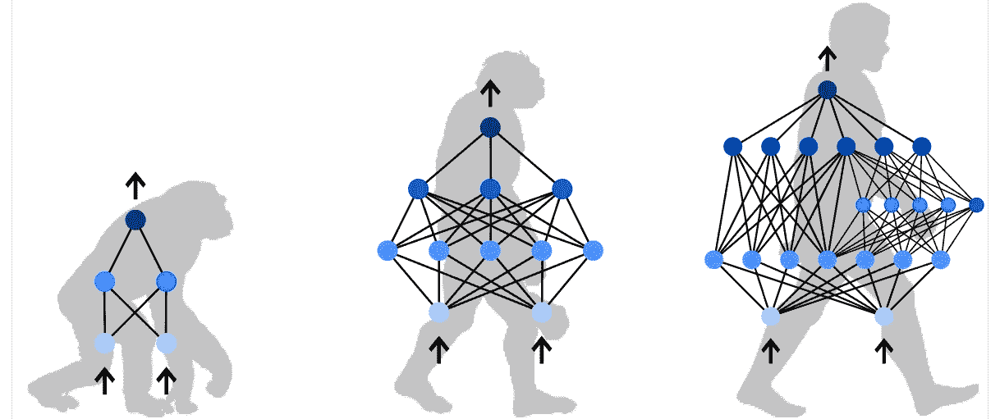
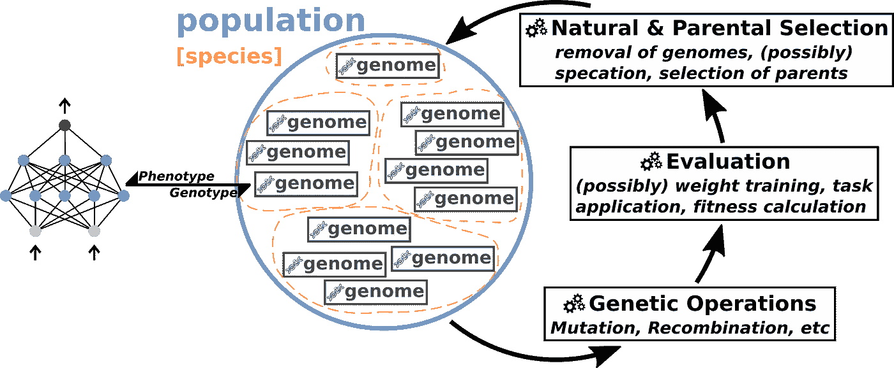
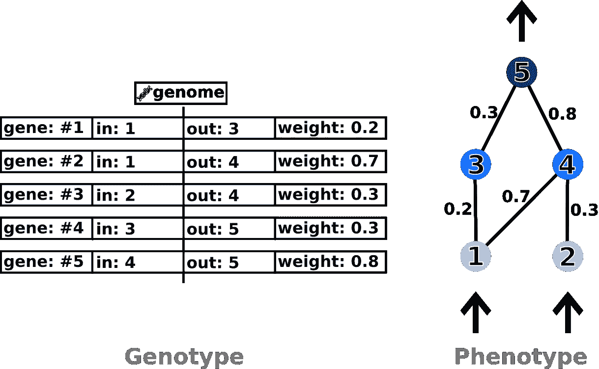
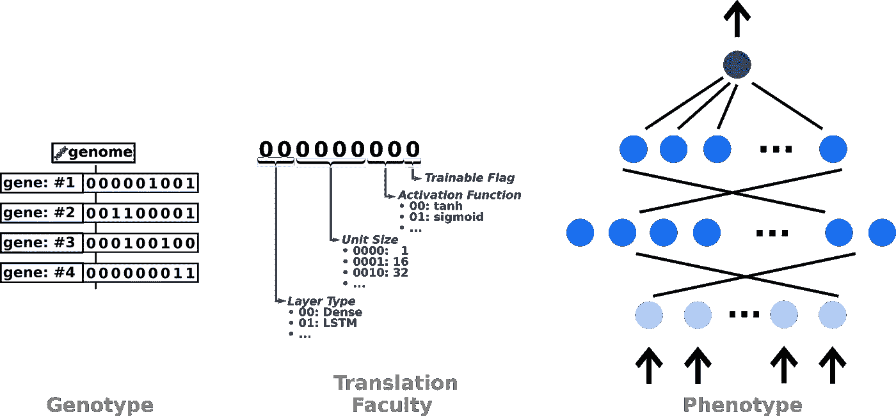
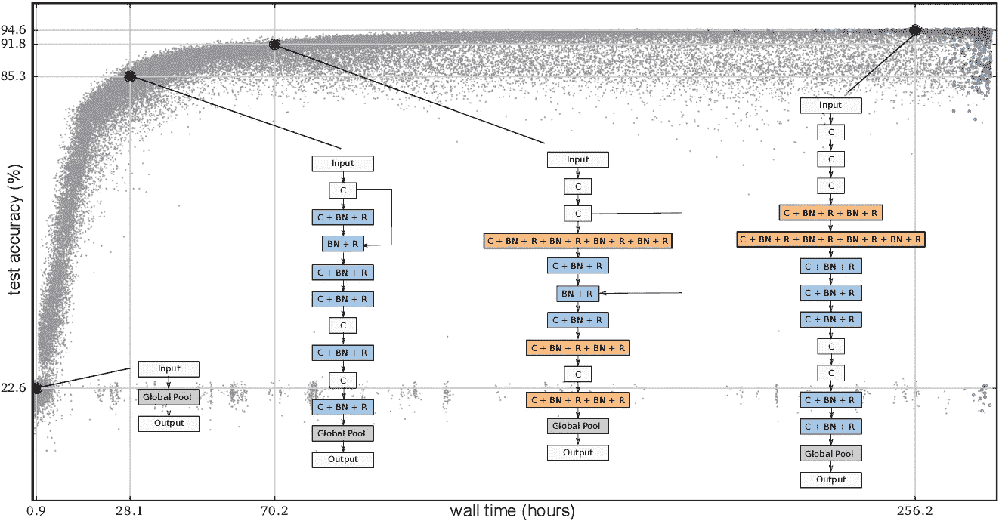

# 神经进化基本概念的初级读本

> 原文：<https://towardsdatascience.com/a-primer-on-the-fundamental-concepts-of-neuroevolution-9068f532f7f7?source=collection_archive---------14----------------------->

## [深入研究神经进化](https://towardsdatascience.com/tagged/deep-dive-into-ne)

## 对神经进化的广泛介绍，它的理论基础和领域的里程碑式的研究。这篇博文是我关于这个话题的专栏系列的第一篇文章。

N euroevolution 是一种机器学习技术，它通过进化算法的方式生成越来越好的拓扑结构、权重和超参数，来改善大脑即人工神经网络(简称 ann)的粗略抽象。正如大自然通过突变、交叉或删除一些潜在的遗传代码来提高大脑的能力一样，神经进化是否会改变人工神经网络的拓扑结构和权重，结合高性能人工神经网络的特征或消除低性能人工神经网络，以便找到越来越好的解决方案。这篇博客是三篇系列文章中的第一篇，将广泛介绍神经进化的基础知识，指出自己设计神经进化算法时需要考虑的方面，并强调该研究领域的重要和最新贡献。接下来的两个部分将深入探讨围绕神经进化的开源景观，特别关注我与[rezza fara Hani](https://www.linkedin.com/in/rezsa)在 2019 年谷歌代码之夏期间共同创建的[tensor flow-神经进化框架](https://github.com/PaulPauls/Tensorflow-Neuroevolution)【1】的设计和使用。

# 神经进化

神经进化是一种机器学习技术，通过使用基于*群体*的优化方法，不断提高该群体中每个神经网络的质量，为其应用的问题生成越来越好的神经网络。该群体中的每个个体不是作为复杂的神经网络存储的，而是作为一个*基因组*，它是一个简化的遗传表示，可以映射到神经网络。神经进化过程本身首先初始化一组这些基因组，然后将它们应用于问题环境，之后根据神经网络解决应用问题的程度，为每个基因组分配一个*适应度*分数。例如，该适应度分数可以是在图像识别任务中实现的准确度、机器人手臂移动到预定轨迹的接近程度或者代理在虚拟环境(如视频游戏)中表现如何的函数。

一旦创建了初始群体，优化循环就开始了，群体被不断地变异、重组、评估和自然选择。如果这些步骤是迭代执行的，整个种群一次只进行一步，我们说的是*世代神经进化*。如果神经进化算法的设计允许异步，并且优化循环在每个基因组的基础上执行，这通常被称为*竞争协同进化*。在这两种情况下，引入创新，评估创新，然后对创新进行分类的无尽循环构成了一个优化过程，最终将产生一个神经网络，它可以很好地解决应用问题，但可能无法用手来实现。下面的图 1 展示了一代神经进化算法的典型优化过程——可视化上述训练循环的所有步骤。

图 1:典型的世代神经进化过程图解

神经进化是一个不可知论的过程，它虽然需要参数用于其自身的进化过程，但并不为生成的神经网络规定任何特定的拓扑或超参数。相反，人工神经网络是通过对在问题环境中有效工作的反馈来开发的。可用于生成的神经网络的形成和完整规范的选择范围(拓扑、权重、超参数等)通常被称为*搜索空间*。虽然神经进化过程的不可知论性质允许非常广泛的搜索空间，但是限制搜索空间的粒度以便更快地遍历它是否是明智的。将基因组映射到相应神经网络的能力通过限制基因组编码的复杂性来负责搜索空间的粒度。这种能力因此被称为*基因编码。*

为了允许具有适当粒度的广阔搜索空间，根据问题环境的要求设计遗传编码和对其进行操作的神经进化算法是至关重要的。因此，为了设计一个好的神经进化方案，我们首先需要建立对基因编码的基本理解，这将在下一节中完成。接下来，我们将按照相关的顺序仔细查看图 1 中显示的上述进化优化循环的每一步。

## 遗传编码

为了有效地变异和重组人工神经网络，一种有效的人工神经网络表示是必要的。神经网络的有效表示允许频繁使用的遗传操作不必分析高度复杂的数据结构，而是让它们分析可以快速处理的紧凑遗传代码。因此，基因操作能否快速确定敏感的突变，或者两个基因组是否适合重组。因此，神经进化算法只对遗传编码进行操作，而不是对流行的机器学习框架所操作的复杂数据结构进行操作。当然，基因编码允许两种表达之间的映射。

基因组的这些有效遗传表示被称为*基因型*，而相应绘制的神经网络被称为*表现型*。该术语来自遗传进化，因为神经进化严格来说是遗传进化，其限制条件是所有表型都是神经网络。

图 2:示例性直接遗传编码的图示

遗传编码一般可以分为两个子类:*直接编码*和*间接编码*。虽然也有第三类*发育编码*我们省略了这种编码，因为它在最近几年几乎没有相关性。直接编码代表了神经网络的每一个方面，它们以遗传表示法明确编码。上面的图 2 是一个直接编码的例子，它被流行的 NEAT 算法所采用[3][4][5]。它直接在基因型中对每个连接及其相应的权重进行编码，但通过排除所得人工神经网络中偏差和激活函数的可能性来限制搜索空间。这种直接编码可以表示任意的前馈和递归拓扑，允许可能完全适合同时最小的拓扑。然而，允许拓扑中的这种高度灵活性导致具有精细粒度的巨大搜索空间，需要设计良好的神经进化算法，以便快速遍历该搜索空间。

图 3:间接遗传编码的例子

另一方面，间接编码规定了通常不能直观地翻译成 ANN 的定制编码，但是需要也由间接编码规定的独立翻译能力，以便将基因型映射到神经网络。上面的图 3 展示了一个间接层编码的例子，以及将规定的间接编码映射到人工神经网络的能力。如果间接编码被很好地设计，这允许通过甚至简单的突变(例如，在上面的例子中的位翻转)有意义地和快速地遍历搜索空间，以及快速地重组否则复杂的神经网络。

然而，虽然直接编码可以快速创建人工神经网络，但间接编码的翻译能力会降低处理速度，并且可能过于粗糙。在决定采用哪种编码之前，必须考虑这两种编码的优点和缺点，尤其是这两种编码的具体实现与问题领域的匹配程度。

然而，两种遗传编码都很好地展示了遗传编码如何确定搜索空间的大小，例如通过不允许激活函数或某些层类型，以及确定其粒度，例如通过仅允许将隐藏层大小调整 32 的倍数。

## 再现的方法和解决方案探索

与神经进化方案所采用的遗传编码密切相关的是实际遍历所定义的搜索空间的方法。这种方法是繁殖的过程，通常分解为通过突变或重组被认为适合作为下一代父母的基因组来创造新的基因组。突变让后代基因组探索新的人工神经网络结构、权重分布和超参数的可行性。重组基因组，本质上是合并两个有希望的基因组和它们不同的特征的过程，将有益的特征传播到整个群体的其余部分。

突变与遗传编码密切相关，因为它只能将神经网络的参数突变到遗传编码中所表示的程度。因此，为神经进化算法定义突变是在遗传编码允许的可能范围内定义三个方面。第一，基因编码的哪一部分会发生变异？它可以是拓扑、权重、超参数，或者在上述间接编码的例子中是随机选择的比特。再者，基因组中被选择的部分会变异到什么程度？例如，神经进化算法可以对低适应度基因组采用广泛的突变，对高性能基因组采用微小的突变——如果人工神经网络不起作用，则有效地表达出彻底改变人工神经网络设计的方法，或者如果人工神经网络工作良好，则表达出人工神经网络的细节。突变的最后一个定义是，它是定向的还是随机的。权重的突变通常在缺乏明确基础事实的环境中随机执行，尽管通过例如从以当前值为中心的正态分布中获得新的随机值来防止这种情况。然而，如果神经进化算法能够将问题环境中的性能缺乏映射到神经网络的设计或参数中的不足，则定向突变也是可能的。

图 4:竞争惯例问题的说明(来源:[5])

另一方面，重组不会使基因组突变，但仍然通过将两个亲代基因组及其独特的特征组合成一个创新的后代基因组来创造新奇事物。如果重组方法设计得很好，并且能够以无损的方式合并双亲基因组的有益特征，这是否允许前面提到的有益特征在整个群体中传播——提高所有现有基因组的适合度。因此，设计良好的重组方法的核心问题是其无损性质，即合并(也称为*交叉*)两个基因组的遗传编码而不丢失任何编码的 ANN 特征的性质。在神经进化算法 NEAT 之前，利用直接编码的神经进化方案确实面临着在突变和随后两个独立基因组的重组过程中出现的有损交叉的问题。上面的图 4 说明了这个被称为*竞争惯例问题*的问题。NEAT 算法提出了一种叫做*历史标记*的方法，它为每个突变提供了一个唯一的标识符，最终实现了基因组的无损重组，使其至今仍是一种基准神经进化算法。

## 评估的方法

尽管在问题环境中评估基因组的步骤似乎是总体优化循环中最简单的一步，但简短地解决它仍然很重要——即使只是指出潜在的警告和可能性。从根本上来说，评估方法只是将基因组映射到神经网络的过程，如其遗传编码所规定的，将其应用于问题环境，然后根据人工神经网络的表现计算适应值。一些神经进化算法还包括在将神经网络应用于实际健康评分运行之前对其进行权重训练的附加步骤。虽然这种方法非常合理，但只有当问题环境展现出清晰的基础事实时，这种方法才有可能。

在整个评估过程中，唯一可合理修改的方面是确定适合度的方式，尽管这完全取决于所应用问题的性质，并且必须根据具体情况来决定。用于确定适合度值的普通方法是将其设置为等于其在图像识别环境中的准确度或者等于在视频游戏环境中获得的点数。

*新颖性搜索*也是确定适合度计算时要考虑的一个重要概念，因为这个概念奖励具有较高适合度值的问题的新方法的基因组。例如，在视频游戏环境中的代理如果进入未知区域，尽管总体上获得的分数较少，但是他将获得健康提升。这促进了基因库中的创新，从而促进了更广泛、更有前途的进化过程。新颖性搜索是在 2010 年的论文“用新颖性搜索进化塑料神经网络”[7]中引入的。

创建一个设计良好的评估方法主要是一个具体实施的问题。记录可能的基本事实或充分并行化评估环境——因为拥有多个完全独立的神经网络的性质使其成为一个平凡的并行化问题。虽然这不是一个研究问题，但在实现神经进化方案时，这是一个同样重要的考虑因素吗？

## 自然选择和亲代选择

虽然繁殖方法决定了探索搜索空间的方式，但选择哪些基因组将作为后代的父母，哪些基因组将从基因库中删除，这是神经进化方案的另一个非常重要的方面吗？选择基因组作为后代父母的方法也很大程度上依赖于所使用的神经进化算法。

在世代神经进化中，选择适合作为下一代父母的基因组通常归结为选择当前世代中表现最好的基因组的规定部分。这个分数通常作为仍然可以配置预定义的神经进化算法的许多参数之一来提供。被选择作为亲本的基因组部分不必与被选择从基因库中去除的基因组部分互补，因为基因组可能足够有希望保证创新突变的潜力，尽管在下一代中它们自己可能被去除。神经进化算法的示例性配置是选择利用前 20%的基因组作为父代，尽管为下一代移除 90%表现最差的基因组。取决于世代神经进化算法是否采用了*物种形成*，被选择作为亲本或被选择移除的基因组的选择是否会发生显著变化，通常能够实现更具指导性的进化过程。

物种形成是一种世代神经进化的工具，它根据表观特征(如表型中的拓扑相似性)或更隐蔽的特征(如在应用的问题环境中达到某些状态)来聚集群体中的个体。由此产生的簇被认为是物种，理想情况下——取决于物种形成方法的选择——代表了解决手头问题的真正不同的方法。这使得生殖过程能够通过将更多的后代分配给平均适合度更高的物种来引导进化，从而有利于独特和有前途的后代的发展。然而，设计良好的物种形成也保护了基因库中的创新，仍然将一些后代分配给具有新颖独特特征的物种，这些物种还没有时间进行优化(例如，人工神经网络中独特的拓扑添加，其权重还没有优化)。因此，设计一种适当的物种形成方法，基于真正不同的解决问题的方法，将种群中的个体分离成不同的物种，可以成为更大的神经进化方法中的一个非常强大的工具，既可以将进化引导到有益的方向，又可以保护创新的新路径。

另一方面，在竞争性的共同进化方案中，基因组通常被随机配对并进行比较，更适合或更具创新性的基因组被选为亲本，而另一个则被从基因库中剔除。由于竞争协同进化的异步性质，不可能一次对群体中的所有基因组进行分类，这大大限制了用物种形成等方法指导进化的可能性。虽然自然选择和亲代选择的方法在竞争协同进化中更简单，但这是由有效的完美并行性和可扩展性弥补的。

## 关于神经进化的结束语

神经进化是一种非常广泛的优化人工神经网络的方法，以更好地处理问题环境。它是一种多功能的工具，不局限于机器学习的一个方面，而是可以应用于改善计算机视觉、自然语言处理或基于代理的环境的方法——因为它的多功能性和搜索空间只受其遗传编码的表达能力的限制。创建神经进化算法时要考虑和组合的方面很多，但首先需要通过对问题及其具体特征的准确分析来确定，以便可以最有效地利用问题环境。

# 神经进化的里程碑式研究

如果不提及该领域的重要研究，尤其是近年来的研究，对神经进化的广泛介绍是不完整的。尽管位于奥斯汀的德克萨斯大学的神经进化研究小组可能拥有该领域最完整的出版物收藏，但下面列出的里程碑式的研究及其创新想法是否提供了一个良好的开端。虽然在这个列表中的第一个条目之前已经产生了大量的研究(参见姚 1999 年的《进化的人工神经网络》[2])，但是我们是否专注于与今天最相关的研究。

***通过扩充拓扑进化神经网络，2002 [3][4][5]*** 引入了扩充拓扑的神经进化(NEAT)算法，超越了当时大多数已建立的神经进化算法。NEAT 通过突变和无损重组以严格的加法方式进化出有限的直接编码，同时通过物种形成保护创新。由于其简单性和同步能力，NEAT 可以被认为是典型的神经进化算法，因此至今被认为是关键的基准算法。

***一种用于进化大规模神经网络的基于超立方体的编码，2009 [6]*** 引入了 HyperNEAT，它是 NEAT 的一种扩展，使用相同的原理，但采用了一种称为组合模式产生网络(CPPNs)的间接编码。这些 CPPNs 允许神经网络复制对称和重复的基序，不仅更准确地反映人类大脑的组成，而且通过将其映射到网络拓扑来利用应用问题中固有的几何和结构。

**进化超净基质中神经元的位置和密度*，2010【8】***引入了 ES-HyperNEAT，它通过在更高信息区域的 CPPN 编码模式中允许更密集的基质来进一步扩展超净。虽然 HyperNEAT 让用户决定在一个潜在的无限密集的几何结构中何处放置隐藏的神经元，但 ES-HyperNEAT 是否采用了一种类似四叉树的结构来决定这些隐藏节点的密度和位置。在其迭代形式[9]中，它能够在关键基准测试中胜过经典的 HyperNEAT。

***通用雅达利游戏的神经进化方法，2014 [10]*** 本文展示了神经进化在通用视频游戏(GVGP)中的潜力，因为它采用了 CNE、CMA-ES、NEAT 和 HyperNEAT 算法来解决 61 个雅达利 2600 视频游戏。虽然神经进化在 GVGP 或 videograme AI 的研究之前已经部署，但就我们所知，这是否构成了最大规模的演示。结果如预期的那样，它们表明直接编码方法在紧凑的状态表示上工作得最好，而间接编码允许缩放到更高维的表示。

***DLNE:深度学习和神经进化的杂交，用于视觉控制，2017 [11]*** 通过将神经进化与 CNN 的结合用于图像识别，介绍了在我看来最有趣和最有前途的用法之一。本文通过 CNN 进行图像识别，将识别的图像转换为特征表示，然后将其输入神经进化优化的神经网络，研究了复杂的第一人称射击视频游戏环境中神经进化的潜力。虽然这种方法的有效性在很大程度上取决于特征表示的质量，但即使采用简单的方法也表明了一个有前途的研究方向。

***图像分类器大规模进化，2017【12】***通过在 CIFAR-10/100 数据集上以前所未有的规模进化图像分类器网络，展示了神经进化的巨大潜力。研究人员利用了一个简单的竞争共同进化方案，没有物种形成或交叉，只利用基本操作来变异张量流模型，随后训练它们，然后相互评估它们。因此，所有基因组都是独立的，并且可以并行化，从而实现了巨大的规模，通过利用 Tensorflow 模型的快速 GPU 实现进一步加速了这一规模。

***进化中的深度神经网络，2018【13】***针对近年来深度学习的兴起，引入了对成熟的 NEAT 算法的扩展 CoDeepNEAT。本文首先定义了 DeepNEAT，一种层间接编码(包括超参数等)来以紧凑的形式表示整个深度神经网络。这些深度基因组然后被视为*模块*，并与*蓝图*共同进化，后者由多个重复模块组成，因此利用了大多数成功网络(如 GoogleNet/ResNet)由重复基元组成的事实。该网络在 CIFAR-10 数据集上进行了基准测试，结果令人满意。

***图像分类器架构搜索的正则化进化，2018【14】***本文是 Real 等人早期论文*图像分类器大规模进化*的扩展，介绍了进化后的图像分类器 AmoebaNet-A，它超越了之前的任何设计——包括手工设计——并设定了[新的最先进的 83.9% top-1 / 96.6% top-5 ImageNet 精度](https://paperswithcode.com/sota/image-classification-on-imagenet)。他们通过修改早期定义的简单竞争共同进化方案来实现这一目标，该方案具有有利于年轻基因型的年龄属性。他们这样做的同时，与一个众所周知的强化学习算法进行了对照比较，这证明了进化可以在相同的硬件上更快地获得结果。

***通过神经进化设计神经网络，2019【15】***这篇论文是对现代神经进化的优秀综述，由该领域最杰出的四位研究人员共同撰写。它总结并说明了神经进化的每个重要方面，尽管它没有引入新的概念，但这篇综述的目的是重新激发对该领域的兴趣，就像这篇博文一样。我们强烈推荐任何对该领域感兴趣的人阅读这篇文章。

**用于深度学习的进化神经 AutoML*，2019【16】***引入了名为 LEAF 的强大进化 AutoML 框架，利用了来自相同作者的现有最先进的进化算法 CoDeepNEAT。虽然作者没有公开他们的源代码，但他们提供了对其设计的广泛讨论，并提供了有价值的输入。evolutionary AutoML 框架的性能在医学图像分类和自然语言分析任务上进行了评估，非常有前途，超过了现有的最先进的 AutoML 系统和最好的手工设计的解决方案。

# 第二部分和第三部分展望

本博客系列的第二和第三部分将关注围绕神经进化的开源环境，特别关注 [Tensorflow-Neuroevolution 框架](https://github.com/PaulPauls/Tensorflow-Neuroevolution)【1】。第 2 部分将重点介绍 Tensorflow-Neuroevolution 框架的设计和性能，介绍其模块化方法，给出一个自己设计自定义神经进化算法的具体示例，并为其他库提供性能基准。第 3 部分将广泛介绍 AmoebaNET 和 CoDeepNEAT 的高级神经进化方法，同时还将密切参考代码库并给出它们用法的具体示例。

# 承认

我要感谢[rezza fara Hani](https://www.linkedin.com/in/rezsa)，他是我 2019 年谷歌代码之夏的导师，我与他在神经进化和 TFNE 框架方面密切合作。我还要感谢伟大的谷歌代码之夏和 Tensorflow 团队，特别是 [Paige Bailey](https://www.linkedin.com/in/dynamicwebpaige) 的持续支持和反馈以及一个伟大的项目。

# 最后一点

所有未注明出处的插图都是我创作的，并上传到与这一系列博文相关的[我的 github 库。我还打算在同一个存储库中发布本系列未来的博客文章中创建的任何代码或材料。](https://github.com/PaulPauls/Primer_on_Neuroevolution_Blog_Post)

# 参考

[1]保尔斯，法拉哈尼；[**tensor flow-神经进化框架**](https://github.com/PaulPauls/Tensorflow-Neuroevolution)；2019

[2]姚； [**进化人工神经网络**](https://ieeexplore.ieee.org/abstract/document/784219)；IEEE1999

[3]欧·斯坦利，米库莱宁； [**通过扩充拓扑进化神经网络**](http://nn.cs.utexas.edu/downloads/papers/stanley.ec02.pdf)；麻省理工学院出版社；2002

[4]欧·斯坦利，米库莱宁； [**高效进化的神经网络拓扑**](http://nn.cs.utexas.edu/downloads/papers/stanley.cec02.pdf)；德克萨斯大学奥斯汀分校；2002

[5]欧·斯坦利； [**通过复杂化高效进化神经网络**](http://nn.cs.utexas.edu/downloads/papers/stanley.phd04.pdf)；德克萨斯大学奥斯汀分校；2004

[6]欧·斯坦利、德安布罗休、高西； [**一种用于进化大规模神经网络的超立方体编码**](https://ieeexplore.ieee.org/document/6792316)；MITP；2009

[7]瑞西，休斯，欧·斯坦利； [**进化具有新颖性搜索的塑料神经网络**](https://doi.org/10.1177%2F1059712310379923)；适应性行为——动物、动画、软件代理、机器人、适应性系统；2010

[8]瑞西、雷曼、欧·斯坦利； [**进化出超净基底中神经元的位置和密度**](https://eplex.cs.ucf.edu/papers/risi_gecco10.pdf)；GECCO2011

[9]里西，欧·斯坦利； [**增强 ES-HyperNEAT 进化出更复杂的规则神经网络**](http://eplex.cs.ucf.edu/papers/risi_gecco11.pdf)；GECCO2011

[10] Hausknecht，Lehman，Miikkulainen， [**一种用神经进化方法玩一般雅达利游戏的方法**](https://ieeexplore.ieee.org/document/6756960)；IEEE2014

[11]普雷希特·鲍尔森、索霍格、赫维什赫·冯奇、里西； [**DLNE:深度学习和神经进化的杂交，用于视觉控制**](https://ieeexplore.ieee.org/document/8080444)；IEEE2017

[12] Real，Moore，Selle，Saxena，leon Suematsu，Tan，Le，Kurakin [**大规模进化的图像分类器**](https://arxiv.org/abs/1703.01041)；CoRR2017

[13]米库莱宁、梁、迈耶森、拉瓦尔、芬克、弗兰肯、拉朱、沙尔扎德、纳夫鲁兹扬、达菲、霍德贾特； [**不断进化的深度神经网络**](http://nn.cs.utexas.edu/?miikkulainen:chapter18)；神经网络和大脑计算时代的人工智能；2018

[14] Real，Aggarwal，黄，乐； [**用于图像分类器架构搜索的正则化进化**](https://arxiv.org/abs/1802.01548)；CoRR2018

[15]欧·斯坦利、克吕纳、雷曼、米库莱宁； [**通过神经进化设计神经网络**](https://doi.org/10.1038/s42256-018-0006-z)；自然机器智能；2019

[16]梁，迈耶森，霍德贾特，芬克，，米库拉宁； [**深度学习的进化神经 AutoML**](http://nn.cs.utexas.edu/?liang:gecco19)；GECCO2019

[17]得克萨斯大学奥斯汀分校； [**神经进化研究组**](http://nn.cs.utexas.edu/?neuroevolution)