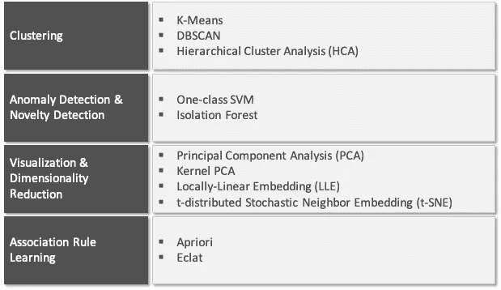

# 最重要的机器学习方法入门

> 原文：<https://towardsdatascience.com/a-primer-on-the-most-important-machine-learning-methods-7b08daa79ae0?source=collection_archive---------34----------------------->

麦克斯威尔·尼尔森[https://unsplash.com/@maxcodes](https://unsplash.com/@maxcodes)拍摄的照片

机器学习已经存在于我们的日常生活中，并且是我们经常使用的许多产品和服务的重要部分。公司使用机器学习来创造新的令人惊叹的产品，使他们现有的产品和服务更好，并解决广泛的商业问题。随着公司急于将机器学习用于自己的优势，他们将大部分转型努力和预算集中在使用这些技术来实现增长上。

为了在商业环境中成功地应用机器学习，不管专业背景或以前的机器学习经验如何，理解方法的差异是关键。知道何时使用哪种方法以及如何开始，有助于发现和实现增长潜力。当处理不同类型的挑战时，能够为特定用例找到正确的技术对成功至关重要。从图像分类或营销活动影响预测，关于不同机器学习方法的知识有助于朝着正确的方向前进。

本文将介绍机器学习，它的范围和三个重要的区别，这有助于决定哪种机器学习技术用于哪种类型的问题。

# **机器学习的定义和主要范围**

机器学习有许多定义，从不同的角度来看——有些更通用，有些更面向工程。

下面的定义应该能给我们所讨论的内容一个好的印象:

> *“机器学习是给计算机编程的科学(和艺术)，让它们能够从数据中学习。”*(未知)

这里是一个更强调学习部分的一般定义:

> *“[机器学习是]一个研究领域，它赋予计算机无需明确编程就能学习的能力。”(阿瑟·塞缪尔，1959)*

最后一个定义代表了更加面向工程的观点:

> *“如果一个计算机程序在 T 上的性能(由 P 测量)随着经验 E 而提高，则称该程序从关于某个任务 T 和某个性能测量 P 的经验 E 中学习。”(Tom Mitchell，1997)*

机器学习可以用来解决各种各样的问题。在向它输入训练数据(包括输入特征和相关结果的示例)后，它会计算出一个规则集，用于对未来进行预测。规则集是通过所选技术采用的算法在幕后生成的。这是传统数据分析方法的一个主要区别，传统数据分析方法经常手动构建显式逻辑。如果一个问题很复杂，并且涉及各种不同的参数，这可能会变得很乏味。尤其是当情况发生变化时，手动生成的规则集需要更新，有时甚至需要完全重新校准。此外，消化大量数据和手动检测底层逻辑在传统方法中可能是一个巨大的问题，而机器学习很好地解决了这个问题。

垃圾邮件分类的例子可以说明机器学习的好处。通过使用机器学习来构建垃圾邮件过滤逻辑，可以避免为电子邮件中的垃圾邮件短语手动实现长的规则列表。如果实施更复杂的垃圾邮件攻击，手动列表方法会变得非常复杂。在这种情况下，这种方法通常不适合根据不断变化的攻击来调整过滤逻辑。相比之下，机器学习是毫不费力地为成功的垃圾邮件分类建立复杂逻辑的方法。它避免了大量的手动调整，可以处理波动的环境和大量的数据。

# **机器学习方法的不同点**

有各种角度，可以用来区分机器学习方法。三种常见的是:

*   人工监督
*   在线或批量学习
*   基于实例或基于模型的学习

## **人工监督**

当涉及到人类监督时，主要类型有监督学习、非监督学习、半监督学习和强化学习。

**监督学习**

监督学习的关键特征是输出的标签是预先定义的。人类决定结果的结构，从而直接监督模型的训练工作。在监督学习中，主要的任务类型是分类和回归。

**分类**预测数据集属于或导致预定义输出类别的可能性。在分类训练期间，由特征(也称为预测值)和标签(也称为类别)组成的数据被输入算法，每个数据集与类别和类别分配的关系的可能性就出来了。分类问题的一个常见例子是上述电子邮件垃圾邮件过滤，其中对“垃圾邮件”和“非垃圾邮件”进行了明确的分类。

另一种主要方法是**回归**，目的是根据输入数据的特征预测一个特定的数值。与分类一样，训练是基于输入特征以及相应的结果来完成的。当新数据输入模型时，可以预测输出值。监督学习中回归任务的用例包括股票价格预测、经济统计和客户满意度得分。

对于分类和回归这两种方法，经常使用以下算法:

*   k-最近邻
*   线性回归
*   逻辑回归
*   支持向量机
*   决策树和随机森林
*   神经网络

虽然一些算法自然倾向于这两种方法中的一种，但是它们也可以用于另一种。

**无监督学习**

与监督学习(人类通过指定输出的标签来决定输出的结构)相比，无监督学习完全不考虑预定义标签的使用-系统独立学习并建议输出结构。

无监督学习问题的主要类型是聚类、异常和新奇检测、可视化和降维以及关联规则学习。

通过使用**聚类**算法，您可以将数据集分成组，例如，将客户分成具有相似特征或行为的不同客户群。最重要的是，层次聚类允许在已经找到的聚类中进行额外的细分，因此客户细分可以被分割成更小的单元。

**异常检测**可用于检测和移除数据中的异常值。这种技术用于检测不正常的信用卡交易，从而防止欺诈活动。它还可用于预测性维护工作，以识别潜在的机器数据异常，并在早期阶段防止缺陷。与异常检测密切相关的是新奇检测，其仅在正常数据上训练，并且在该过程中不期望异常值。

**可视化**也属于无监督学习方法。通过提供大量非结构化和无标签的信息，该方法产生了信息的图形可观察的描绘(主要是二维或三维的)。这可以很容易地绘制出来，以了解信息是如何组成的，从而得出潜在的模式。与之密切相关的是**降维**，其目标是在不丢失重要信息的情况下减少数据量。这在特征提取中也起作用。它通过降低模型的维度(即从三阶函数到二阶函数)来平衡模型的复杂性和手头的问题。这种技术可以用来避免过度拟合。除了通过降维模型生成的增强洞察力之外，您还可以将结果用作其他机器学习方法的输入。

**关联规则学习**是我们无监督学习概述中的最后一种方法，旨在揭示大型数据集中有趣的关系，主要是通过找出特征之间的联系。突出的应用通常出现在零售领域，其中经常一起购买的商品通过关联规则学习工作来识别，并因此在超市货架上彼此靠近放置。

用于无监督学习方法的主要算法有:

无监督学习方法的算法

**半监督学习**

在半监督学习这个术语的背后，是监督学习和非监督学习这两个领域的方法的结合。这种混合方法适用于部分标记的训练数据，其中大部分实际上是未标记的，小部分是标记的。半监督学习的突出例子是科技公司(如谷歌、苹果)的照片应用程序，该应用程序可以识别哪些人经常出现在照片中，并相应地对照片进行聚类(=无监督)，让用户为这些聚类提供标签，这些标签是被识别的人的名字(=有监督)。

半监督学习的流行算法是**深度信念网络** (DBNs)，它与**受限波尔兹曼机器** (RBMs)，一种特定类型的人工神经网络一起工作，用于无监督部分。它们也可以相互堆叠。在训练 RBMs(无监督的)之后，可以通过使用各种监督学习方法来增强它们。

**强化学习**

与监督、非监督和半监督学习相比，强化学习是一种非常不同的动物。这种技术集中于学习系统、它运行的环境、它所具有的状态以及改变它以便更接近预定目标的方法。

强化学习系统被称为**代理**，它具有感知**环境**以及决定和执行**动作**的能力。每次行动后，系统都会收到一份**奖励**，奖励可以是积极的，也可以是消极的，这取决于该行动是否有助于实现目标。在训练期间，强化学习系统必须学习最佳策略(= **策略**)以最大化回报。策略可以被理解为当系统被放置到一个环境中并朝着一个目标前进时要执行的行动计划。

强化学习最受欢迎的例子之一是 AlphaGo，这是一台基于人工智能的超级计算机，在围棋比赛中击败了人类世界冠军。AlphaGo 在很大程度上基于深度强化学习，并制定了一种策略来赢得围棋比赛。AlphaGo 成功的一个令人惊讶的方面是，该系统能够开发出非常非常规的策略，这些策略最初被人类对手认为是有害的，并导致混乱。然而，它们被证明是为人工智能在稍后的时间点最终赢得游戏而做的准备，这使人们认识到人工智能已经能够做到什么。

## **在线与批量学习**

对机器学习方法进行分类的第二个角度是区分它是否可以增量学习，即从数据流中学习，或者需要在单独的批次中训练。

**批量学习**

批量学习不适用于基于输入数据的增量适应，而是必须使用一部分可访问的数据一次性进行。由于批量学习在计算上是昂贵的，并且不是在线进行的，而是作为一个不连续的作业，所以它也被称为离线学习。在对系统进行训练并将其投入生产环境后，它将使用学到的功能，而无需重新训练，直至另行通知。

批量学习是大多数机器学习应用程序的标准情况，只要每条新信息对模型的质量都不是至关重要的。在涉及边缘设备的物联网使用案例中，如联网农业，几乎不可能建立自我再培训基础设施。在这种情况下，物联网设备携带一个版本的模型，该模型已经过批量数据训练，并在现场进行预测，直到预测质量变得不足。在这种情况下，设备将离线，并使用重新训练模型进行更新。

**在线学习**

与批量学习相反，在线学习以增量方式训练机器学习系统。数据以单个数据片段或所谓的小批量顺序发送到系统。通过这种方法，模型可以即时消化新的数据，使其成为任何给定时间的最佳预测器。学习率用于衡量模型适应新输入数据的能力。对于在线学习，增量学习迭代在计算上是廉价的。您可以在使用数据流的用例中找到在线学习方法，每条新信息对模型的质量都很重要。一个典型的例子是金融市场中的算法交易。

## **基于实例与基于模型的学习**

比较机器学习系统的第三个角度是指处理输入数据的方法。这里的关键区别在于，新信息是仅仅与现有数据进行比较，还是用于建立模型，该模型用作检测到的模式的近似，以进行预测。

**基于实例的学习**

作为一种专注于新数据与历史数据比较的方法，基于实例的学习擅长记住以前数据的确切表示。在模型应用期间，通过采用相似性度量将新数据与历史数据进行比较，该相似性度量可以简单到数据集之间的公共数据点的数量。

基于实例的学习在推荐系统中得到应用，因为它评估相似性，即客户兴趣，这可以用于推荐相似客户观看的电影或相似客户购买的文章。

**基于模型的学习**

基于模型的学习不直接与训练数据进行比较，而是从训练示例中构建新的模型来预测结果。由于模型是基于从训练中提取的规则进行概括的，因此可能容易出现训练数据中的不准确性，这应该通过探索性数据分析和特征工程来发现并最小化。此外，所选择的模型类型应该适合手头任务的复杂性和类型。为了测量预测的质量，使用性能度量，其可以是效用函数或成本函数。效用函数衡量模型的“正确”程度，而成本函数评估误差的大小。

基于模型的学习是大多数非平凡机器学习应用的典型方法，因为非常复杂的问题通常可以通过模型而不是实例相似性比较来更有效地近似。

# **总结**

**机器学习定义|** 机器学习是给计算机编程的科学(和艺术)，以便它们可以从数据中学习。

**机器学习的目的|** 机器学习是一种基于复杂逻辑、波动环境和大量数据进行预测的方法。

**监督学习|** 输入算法的训练数据包括所需的标签。监督学习可以执行关于类分配(=分类)或数值分配(=回归)的预测。

**无监督学习|** 训练数据是无标签的，系统独立学习以揭示数据中的模式——方法有聚类、异常和新奇检测、可视化和维数减少以及关联规则学习。

**半监督学习|** 使用非监督和监督学习算法的机器学习方法。它处理部分标记的训练数据。

**强化学习|** 专注于学习系统(=代理)的方法，该系统在环境中行动，并试图制定行动策略以达到目标状态——根据行动的成功获得积极或消极的奖励。

**批量学习|** 基于所有可访问数据的高强度训练，无需增量再训练——用于没有完整训练基础设施的环境，即物联网边缘设备。

**在线学习|** 一种计算成本低廉的方法，它以增量方式训练机器学习系统，使模型在任何给定时间都可能成为最佳预测器。

**基于实例的学习|** 将新数据与现有数据进行比较并采用相似性度量的训练方法。

**基于模型的学习|** 从训练样本中建立新模型的学习方法，以效用或成本函数衡量的准确度预测结果。

_________________________________________________________________

本文的灵感来自《使用 Scikit-Learn、Keras 和 TensorFlow 进行机器学习:构建智能系统的概念、工具和技术》一书[，该书提供了更多的深度和实践练习。](https://www.amazon.de/gp/product/1492032646/ref=as_li_tl?ie=UTF8&camp=1638&creative=6742&creativeASIN=1492032646&linkCode=as2&tag=felixfrohboes-21&linkId=e8d9415d67caf9daede156b645b2e5ed)