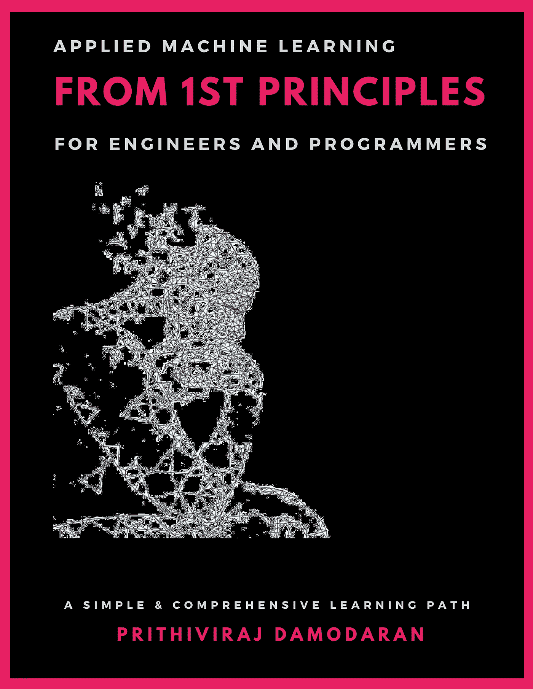

# 对机器学习的以原则为中心的理解是一种超能力

> 原文：<https://towardsdatascience.com/a-principle-first-understanding-of-machine-learning-is-a-superpower-75e96d79d176?source=collection_archive---------39----------------------->

## *想象一本以原理为中心的机器学习书*

如果你一直在关注这个趋势，那么一个在网络上越来越流行的问题就是“我该如何开始或者从哪里开始学习 ML？”人们总是用不同的方式问同一个问题。听起来这个问题还没有得到充分的回答。我的诊断是，人们得到了善意的答案，却没有就什么是最好的教学方法或学习途径达成一致。这背后的原因是，大多数推荐的学习路径都属于以*技术为中心或以*方法为中心的学习方法。我推荐采取 ***以原则为中心的方法。***

以原则为中心的方法一直存在，并且一直被推荐。传奇人物[吉姆·凯勒推荐(直到第二分钟)](https://www.youtube.com/watch?v=1CSeY10zbqo&feature=youtu.be&t=15&target=_blank)推荐一种以原则为中心的方法，如果你想擅长某件事，可以用**“执行一个食谱 vs 了解烹饪”+** 类比

# 为什么是超级大国？

将你的第一个**逻辑回归**或**递归神经网络(RNN)** 模型拟合在一个表现良好的精选数据集上会感觉像是魔术一样，直到你面临一个复杂的现实世界的业务问题，数据集非常混乱，甚至更糟，根本没有数据集。大多数 ML 从业者，尤其是那些有编程背景的人，想知道为什么他们会在 ML 的旅程中碰壁。这完全是基于当前流行的以方法为中心或以技术为中心的 ML 教学法。一种以技术为中心的教育学将强制的严格性剥离，以实现一些狭隘的承诺。在我的第一次 Kaggle 游乐场比赛中，我花了 188 份作品才进入前 1%。当我们没有很好地掌握原则时，就会发生这种情况。所以请相信我的话。

***“方法可以有一百万种以上，原理却很少。掌握原则的人能够成功地选择自己的方法。尝试方法的人，忽视原则，肯定会有麻烦。”*——**哈林顿·埃默森

套用哈林顿的话，如果你知道这些原则，你就可以定制特定问题的方法来创造性地应用 ML。在像 ML 这样的超衍生领域，掌握好原则是你超越同行的独特竞争优势。

*   职业灵活性:它为从业者提供了一条坚实的道路，使他们能够转变为经验丰富的 ML 从业者(或基于倾向的 ML 研究者)。ML 从业者是应用 ML 解决现实世界问题的人，而 ML 研究者是寻找 ML 下一个前沿的边界推进者。但是与传统智慧相反，也就是说，不要认为**洗钱实践**和**洗钱研究**是两条独立的职业道路，认为洗钱研究是洗钱实践的自然进展有更好的效用。以原则为中心的教学法可以帮助你轻松地通过这个范围。

**入门级 M** L 从业者 **→资深 ML** 从业者 **→资深 ML** 从业者 **→** **ML 研究员**

*   **整体产品思维:**以原则为中心的方法可以帮助您超越仅仅拟合模型，并从整体上对产品进行推理，该模型将如何以及在哪里使用，谁是用户，用户体验和 SLA 承诺是什么，有哪些约束，什么是成功的关键，以及有哪些权衡。
*   **学习速度:** ML 是一个非常跨学科的领域，由于最近的大肆宣传，它以极快的速度发展，所以你不能通过放弃原则和从 10 或 100 个食谱中学习来线性扩展你的技能。不仅仅是在 ML 中，更快地自学硬东西的能力也是一种竞争优势。了解这些原则会缩短你的学习周期。你将能够进行广泛而深入的推理。
*   **通用语:**因为 ML 非常跨学科，它吸引了来自不同行业的从业者，从应用统计学家到物理学博士，可能还有参加深度学习课程的音乐家或艺术家。ML 从业者的人口是非常异质的，不像普通的程序员。所以对原则有一个很好的理解可以帮助你和它们进行有意义的对话。
*   **遗留包袱和兔子洞:**因为 ML 是非常跨学科的，所以根据你来自哪个阵营，它带有大量的多义词(一词多义)和负载词(多词一义)。这通常会让你掉进兔子洞。了解这些原则可以帮助你更容易地理解复杂的概念。
*   **躲避炒作:**你会知道什么是技术上可行的。这样你就可以教育自己和他人 ML 的局限性，做出有意义的承诺。

# 点击这里查看我的新书

**** *我不是想卖书，这本书是* [***免费阅读***](https://ml1st.com) ***。*** *我的分享纯粹是基于人类利他主义的精神*****

****

**[https://ml1st.com](https://ml1st.com)**