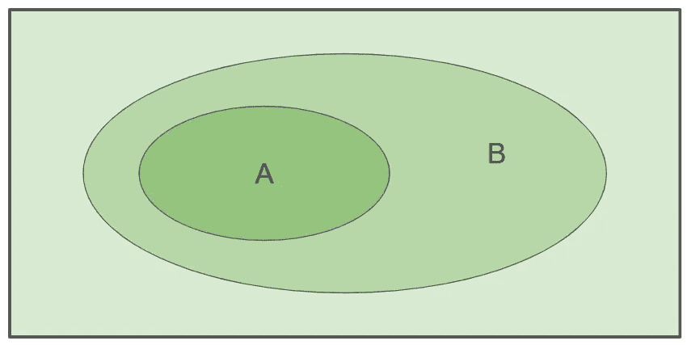
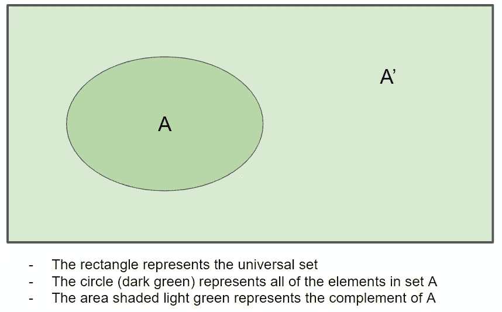
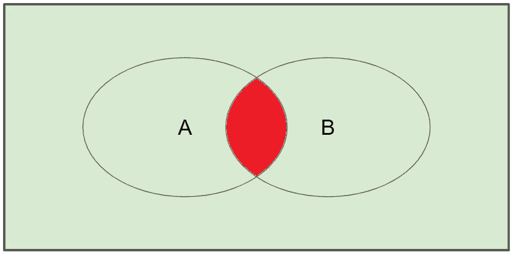
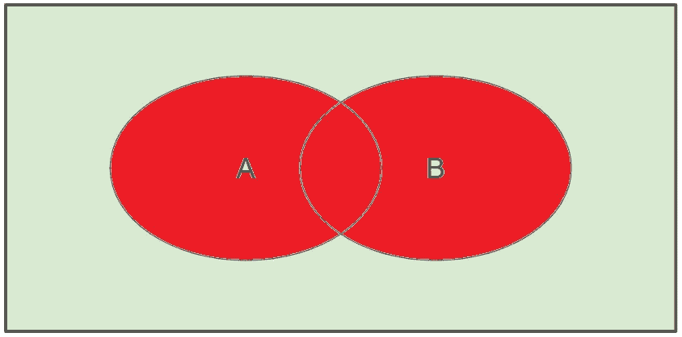
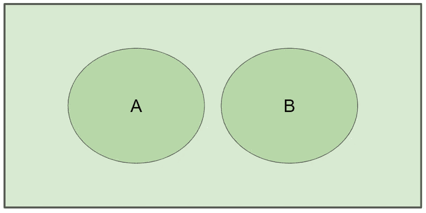
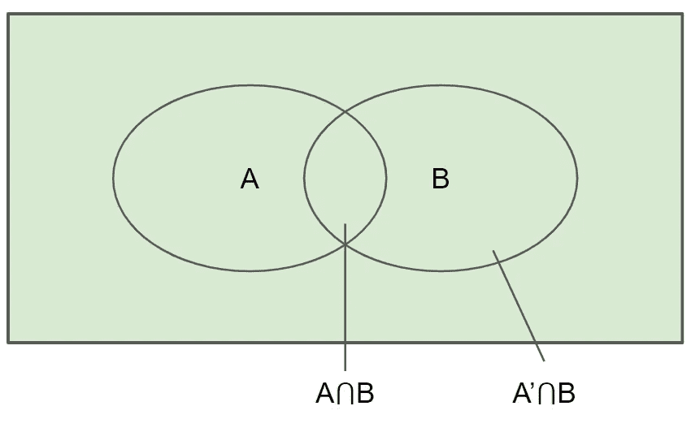
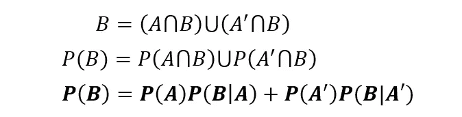
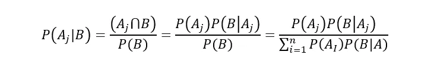

# 数据科学的深入概率速成课程

> 原文：<https://towardsdatascience.com/a-probability-crash-course-for-data-science-cd4b4fae03bc?source=collection_archive---------19----------------------->

## 集合论，概率性质，样本空间，计数技术，条件概率，贝叶斯定理

图片由来自 [Pixabay](https://pixabay.com/?utm_source=link-attribution&utm_medium=referral&utm_campaign=image&utm_content=1655118) 的[埃里克·斯坦](https://pixabay.com/users/erik_stein-2524241/?utm_source=link-attribution&utm_medium=referral&utm_campaign=image&utm_content=1655118)拍摄

# 目录

1.  介绍
2.  集合论
3.  可能性
4.  计数技术
5.  条件概率
6.  贝叶斯定理

# 介绍

无论你是否从事数据科学职业，理解概率的基本原理都将大有裨益。不管怎样都是好知识。我的目标是提供一个全面的概率基础速成课程，你应该知道，以便你的数据科学之旅(或一般的旅程)更顺利地前进。

说了这么多，让我们开始吧！

# 集合论

## 条款

*   一个**集合**是元素的集合。
*   更具体地说，**样本空间**(表示为 S) 是给定实验的所有**可能结果的集合。例如，骰子(骰子的单数)所有可能结果的样本空间是 S = {1，2，3，4，5，6}。**
*   **有限样本空间**是具有 n 个小于无穷大的不同元素的样本空间。
*   **简单样本空间** (SSS)是一个有限的样本空间，其中所有的结果都是同等可能的。
*   **通用集合**，记为 **U** ，是万物的集合。
*   **空集**，记为 **∅** ，是一个里面什么也没有的集合。它是…空的。
*   **基数**定义为集合 A 中元素的个数，记为 **|A|** 。
*   如果集合 a 中的所有元素也在集合 b 中，则集合 a 是集合 b 的子集，符号等价为⊆。
*   一个**事件**是一组可能的结果。S 的任何子集都是事件。

a 是 B 的子集

*   给定集合 A 的**补集**是具有集合 A 所没有的所有元素的集合，记为**A’**。*见下图。*

*   集合 a 和集合 b 的**交集**是集合 A **和集合 b**中的元素，记为 **A⋂B** 。*见下图。*

A 和 B 的交点

*   集合 a 和集合 b 的**并**是集合 A **或集合 b**中的元素，记为 **A⋃B** 。*见下图。*

A 和 B 的结合

如果集合 a 和集合 b 的交集等于空集(A⋂B=∅). ),则称集合 a 和集合 b 不相交

集合 A 与集合 B 不相交的例子

## 集合运算定律

**补充**

*   **a⋃a' = u**(a 和补 a 的并集等于泛集)
*   **a⋂a' =∅**(a 和补 a 的交集等于空集)
*   **A ' ' = A**(A 的补码的补码等于 A)

**换位定律**

*   **a⋃b = b⋃a**(a 和 b 的并等于 b 和 a 的并)
*   **a⋂b = b⋂a**(a 和 b 的交集等于 b 和 a 的交集)

**摩根定律**

*   **(A⋃B)' = A'⋂B'** )
*   **(A⋂B)' = A'⋃B'** )

**结合律**

*   【a⋃(b⋃c】=(a⋃b)⋃c = a⋃b⋃c
*   【a⋂(b⋂c】=(a⋂b)⋂c = a⋂b⋂c

**分配定律**

*   **A⋃(B⋂C) = (A⋃B)⋂(A⋃C)**
*   **A⋂(B⋃C) = (A⋂B)⋃(A⋂C)**

# 可能性

对于作为样本空间 S 的子集的每个事件 A，存在概率 A，表示为 P(A)。

## 概率公理

1.  0 ≤ P(A) ≤ 1
2.  P(S) = 1
3.  如果 A⋂B = ∅，那么 p(a⋃b = p(a)+p(b)
4.  假设有 k 个不相交的事件。所有 k 个事件联合的概率等于每个个体概率之和。

## 概率的性质

*注意:我不打算看样张，所以如果你想知道样张，你可以在谷歌上搜索样张或者在 LinkedIn 上给我发短信。*

1.  P(∅) = 0
2.  P(A') = 1 — P(A)
3.  对于任何两个事件 a 和 b，P(A⋃B) = P(A) + P(B) - P(A⋂B)
4.  对于任何三个事件 a，b，c，p(a⋃b⋃c)= p(a)+p(b)+p(c)-p(a⋂b)-p(b⋂c)-p(a⋂c)+p(a⋂b⋂c)
5.  如果 A 是 B 的子集，那么 P(A) ≤ P(B)

# 计数技术

*注意:这些技术严格用于简单样本空间(SSS)。*

## 加法规则

**定义:**如果做一件事有 n 种方式，做另一件事有 m 种方式而你不能同时做，那么就有 n+m 种方式选择一件事去做。

例如，有 5 种冰淇淋口味可供选择，4 种冷冻酸奶口味可供选择，而你只能选择一种，那么你有 9 个选项可供选择(4+5)。

这可以扩展到 1 次操作之外。

## 乘法法则

**定义:**如果做一件事有 n 种方式，做另一件事有 m 种方式，那么这两种动作都有 n*m 种执行方式，其中一件事在另一件事之前执行。

例如，如果从加拿大到美国有 2 种不同的方式，从美国到墨西哥有 4 种不同的方式，那么从加拿大到墨西哥有 8 种不同的方式(2*4)。

这可以扩展到 1 次操作之外。

## 排列

**定义:**n 个元素的排列是那 n 个元素按照**确定的顺序**的任意排列。有 n 个阶乘(n！)排列 n 个元素的方式。注意粗体字:顺序很重要！

**一次取 r 的 n 个事物的排列数**被定义为可以从 n 个不同元素中取出的 r 元组的数目，并且等于以下等式:

例子:一个 6 位数的车牌有多少种排列？

## 组合

定义:从 n 个对象中选择 r 的方法的数量，其中**顺序无关紧要**。

**一次取 r 的 n 个事物的组合数**被定义为一个具有 n 个元素的集合中具有 r 个元素的子集的数目，等于以下等式:

示例:从一副 52 张牌中抽取 6 张牌有多少种方法？

# 条件概率

**条件概率**是在一个事件已经发生的情况下，另一个事件发生的概率。形式上，如果 P(B) > 0，那么给定 B 的条件概率等于下面的等式:

给定这个等式，我们可以推导出下面的等式…

## 性能

1.  0 ≤ P(A|B) ≤ 1
2.  P(S|B) = 1
3.  如果 a1⋂a2 =∅→p(a1⋃a2|b)= p(a1 | b)+p(a2 | b)

## 独立性ˌ自立性

*   如果 a 和 B 互不相关，则称它们相互独立。
*   a 和 b 是独立的当且仅当 P(A⋂B) = P(A)P(B)
*   如果 P(B) > 0 并且 A 和 B 是独立的，那么 P(A|B) = P(A)

# 贝叶斯定理

## 全概率定律

全概率定律如下。

在上面的一个例子中，你实际上已经看到了这一点。(还记得下图吗？)

考虑全概率定律以及下面的等式:

考虑到这两个方程，我们来看看贝叶斯定理。

## **贝叶斯定理**

如果 n 个事件 A 构成 S 的一个划分，B 是任意事件，那么:

贝叶斯定理在数据科学中的主要应用之一是朴素贝叶斯分类器。如果你想了解更多，请查看我的文章，[5 分钟内对朴素贝叶斯的数学解释](/a-mathematical-explanation-of-naive-bayes-in-5-minutes-44adebcdb5f8)！

# 感谢阅读！

## 特伦斯·申

*创始人*[*ShinTwin*](https://shintwin.com/)*|我们来连线一下*[*LinkedIn*](https://www.linkedin.com/in/terenceshin/)*|项目组合这里是***。**