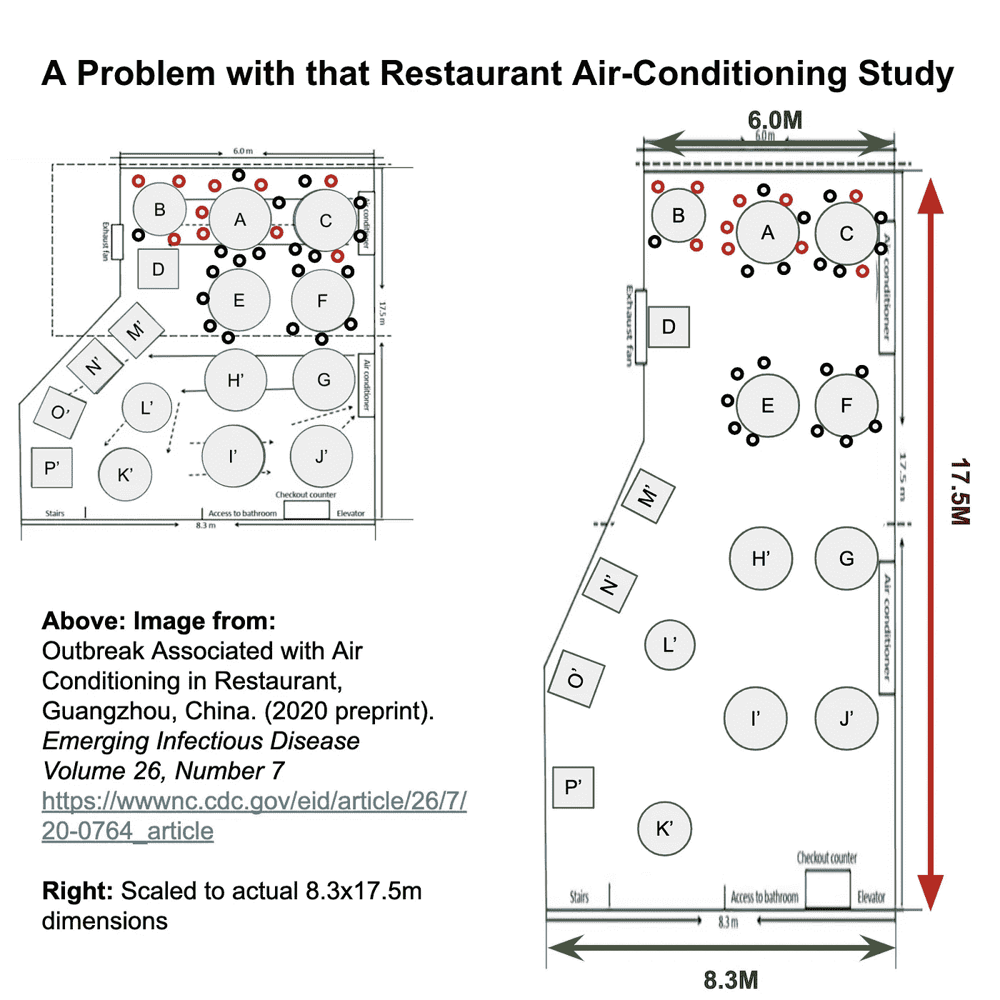
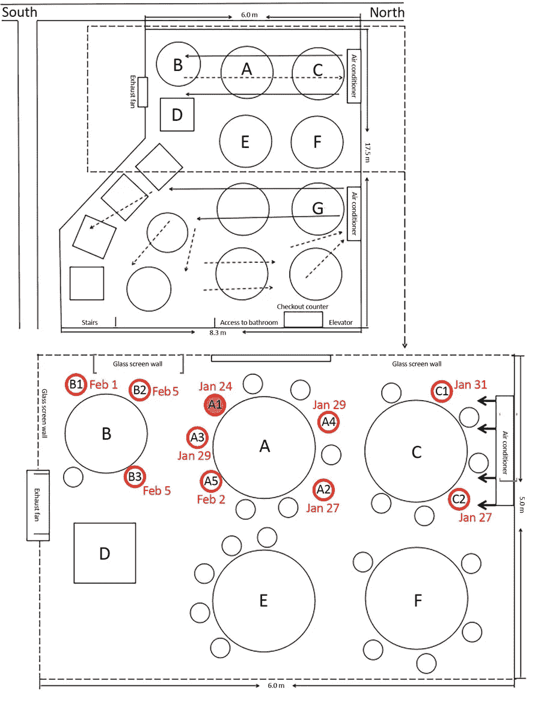
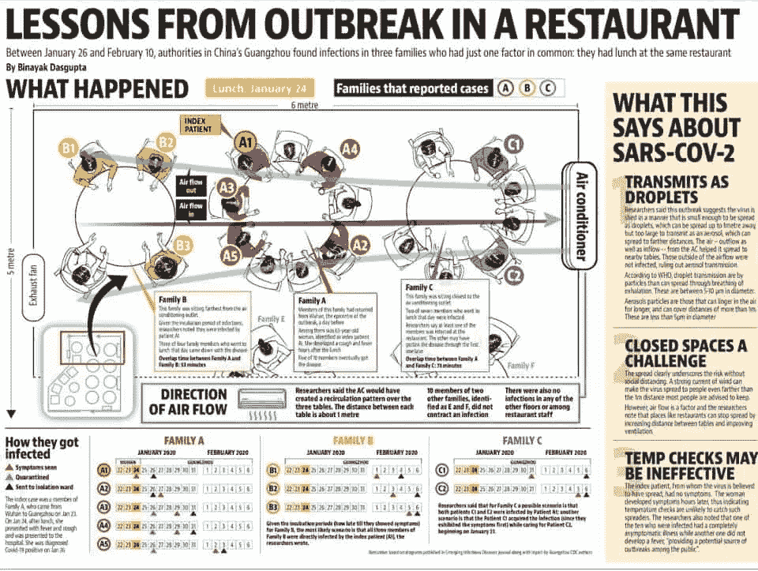

# 餐厅空调研究的一个问题

> 原文：<https://towardsdatascience.com/a-problem-with-that-restaurant-air-conditioning-study-52b149815f2?source=collection_archive---------62----------------------->

你可能最近在广州的一家餐馆看到了新型冠状病毒病毒的潜在传播。它摘自《新兴传染病》杂志上一篇尚未定稿的论文。令人担忧的是，如此多的媒体将这篇文章和图片作为事实分享。

该研究报告了相邻三桌的人后来如何被检测出新型冠状病毒阳性，但餐厅中其他不同桌的人却没有。作者总结道:“空调通风促进了飞沫传播。”作者报告了桌子之间的平均距离，但没有给出确切的距离。当你看下面左边的图表时，你可以看到他们将 8.3 米和 17.5 米视为完全相同的距离，将一个狭长的餐厅变成了一个正方形。这使得没有感染的桌子看起来比我们根据实际尺寸将它们平均隔开时更近:



来自广州的餐厅布局，在这里重新安排以显示餐厅的实际尺寸。

正如你在图中看到的，当我们更精确地绘制距离时，没有感染者的桌子看起来更远。作为参考，本文如下:

[](https://wwwnc.cdc.gov/eid/article/26/7/20-0764-f1) [## 图-2020 年中国广州与餐馆空调有关的新冠肺炎病毒爆发…

### 2020 年 1 月 26 日-2 月 10 日期间，2019 年新型冠状病毒疾病在…

wwwnc.cdc.gov](https://wwwnc.cdc.gov/eid/article/26/7/20-0764-f1) 

这是那篇论文的原始图表:



【https://wwwnc.cdc.gov/eid/article/26/7/20-0764-f1】来源:

这个错误似乎不仅仅是“17.5 米”的错误，因为作者报告的空间总平方米数为 145 平方米，这与 8.3 米 x 17.5m 米的尺寸一致。“6.0 米”和“8.3 米”的水平尺寸似乎成比例，因此只有垂直尺寸有问题。

我从事流行病跟踪和灾难响应工作多年，包括空间数据建模，我从未见过有人像这样压缩维度(尽管我从未在室内从事灾难响应的空间数据建模工作)。特别值得关注的是，在垂直维度上的压缩使得图像支持他们的结论，但是在该论文中没有提到压缩及其原因。

时间重叠也让人摸不着头脑。根据该论文，表 A 与表 B 重叠了 53 分钟，与表 C 重叠了 73 分钟。表格 A 与 E 或 F 重叠了多久？这是没有报道的。

世界上最大的媒体机构转载了这一扭曲的形象，却没有对此发表评论。例如，《纽约时报》以“[冠状病毒如何在一家餐馆](https://www.nytimes.com/2020/04/20/health/airflow-coronavirus-restaurants.html)感染了一些人，但不是所有人”为标题报道了这张图片。《印度斯坦时报》以“[空调气流在中国餐厅](https://www.hindustantimes.com/world-news/ac-air-flow-spread-covid-19-in-china-restaurant/story-4XU9YVC3bAyAkHahV7bMOO.html)传播新冠肺炎”为标题进行了报道，并进一步精心制作了一个新版本的图形，在那里他们将其介绍为“发生了什么”:



《印度斯坦时报》仔细复制了整个图像，并为每张被感染的桌子制作了日历，但没有注意到，如果与“6 米”尺寸在同一尺度上，它们的“5 米”尺寸实际上大约是“3.5 米”。他们还危险地将模棱两可的发现报道为“发生了什么”。**来源:**[https://www . hindustantimes . com/world-news/AC-air-flow-spread-新冠肺炎-在中国-餐厅/story-4x u9 yvc 3 bayakahv 7 bmoo . html](https://www.hindustantimes.com/world-news/ac-air-flow-spread-covid-19-in-china-restaurant/story-4XU9YVC3bAyAkHahV7bMOO.html)

## 我们能相信这项研究吗？

不，这个研究不可信。我们已经知道距离是传播的主要因素之一，这项研究没有提供证据来改变这一点。在报告 A 桌的人和 B 桌、C 桌、E 桌和 F 桌的人之间的确切距离以及他们重叠的时间长度之前，该论文是不可信的。目前，该论文仅报告了表之间的距离为“大约 1 米”，当我们查看非失真图中的可用空间时，这对于表 E 和 F 是极不可能的。

即使人与人之间的距离和时间重叠*是*一样的，就像论文暗示的那样，结果仍然是微弱的。例如，有 21 人*不*在 A 桌，但被呈现为坐在 A 桌附近，其中 5 人后来检测为阳性:

```
5/21 = 23.8% chance of being infected
```

E 桌和 F 桌有 5 个人。那么，一张 5 人的桌子上至少有一个人被 23.8%的传染率感染的可能性有多大？

```
1-(1-(5/21))⁵ = 74.3% chance that at least one person at a table of 5 is infected.
```

这不是很有力的证据。换句话说，与表 A 相邻的所有表的感染率有 1/4 的几率是完全随机的。没有哪个科学领域应该接受只有 74.3%正确几率的结论。

对于本文而言，74.3%是*最佳*情况。作者指出，传播可能只针对邻桌的一个人，然后再传播给其他人。在这种情况下，邻桌至少有一人被感染的可能性只有 39.4%:

```
1-(1-(2/21))⁵ = 39.4% chance that at least one person at a table of 5 is infected.
```

因此，如果模式是 A 桌的一个人感染 B 桌和 C 桌的一个人，这些人又感染他们组中的其他人，那么 E 桌和 F 桌更有可能*而不是*被感染，即使它们离 A 桌的距离相同，并且人们在那里停留的时间相同。

我还期待一个更复杂的数学模型，包括更长距离的更大分散，我很惊讶这没有出现在原始论文中。气流箭头似乎是推测的，而不是基于观察。还有许多其他因素:A 桌的源人是否走近 B 桌和 C 桌(他们在去洗手间的路上会经过 B 桌或 C 桌)；是否靠近空调增加了表 C 的传播机会，因为鼻腔干燥；以及感染完全来自其他地方的可能性。考虑到所有这些因素，以及距离和时间重叠的正确建模，附近赌桌的 74.3%和 39.4%的概率几乎肯定会下降。

如此小的样本数，置信区间也会非常高。例如，如果我们只带走一个感染者，并得出结论，只有 4 个人在 E 桌坐了足够长的时间，那么 74.3%就变成了 61.2%。从这么少的数据点中获取精确的信息是不可能的。有了所有人之间的距离和重叠时间的准确细节，这些数据*就可以*整合到更大的研究中，包括其他地方记录的潜在传输。但是没有这些信息，这篇文章不能帮助我们得出可操作的结论。

虽然我在灾难应对领域工作多年，包括流行病跟踪，但我不是流行病学家或传染病传播方面的专家。因此，即使我能从他们的研究中得出有力的结论，我也不会分享它们。如果你没有这方面的经验，你也不应该这样做:已经有太多的流行病学专家了。然而，你对任何媒体报道背后的科学方法进行批判性分析是正确的，特别是像维度压缩超过 50%这样的不一致。

请注意，*可以拒绝*基于简单的最佳情况模型的结论，就像我上面所做的那样。然而，一个简单的最佳情况模型不能用来*支持*其他一些结论。如果你有数据科学技能，并希望为新冠肺炎应对措施做出贡献，那么有许多方法可以帮助你，而不需要事先了解感染知识。我推荐我的文章:[数据科学家可以帮助应对新冠肺炎的 5 种方式和避免的 5 种行动](/5-ways-data-scientists-can-help-respond-to-covid-19-and-5-actions-to-avoid-d2accab283d1):

[](/5-ways-data-scientists-can-help-respond-to-covid-19-and-5-actions-to-avoid-d2accab283d1) [## 数据科学家可以帮助应对新冠肺炎的 5 种方式和应避免的 5 种行动

### 数据科学家如何在其组织内以及更广泛的范围内帮助应对新冠肺炎疫情？

towardsdatascience.com](/5-ways-data-scientists-can-help-respond-to-covid-19-and-5-actions-to-avoid-d2accab283d1) 

你将在文章中看到第三种方法是“准备可能与回答直接相关的数据”。这正是我想做的。在新冠肺炎病毒爆发前，我在食品安全部门工作，我试图整理数据，以帮助流行病学家更好地模拟传播风险。

我们知道气流可能是病毒传播的一个因素，所以这是一个值得研究的问题。但是，目前形式的论文根本没有提供证据来支持这样的结论，即除了距离之外，其他任何因素都是这家餐厅传播的主要因素。在我意识到他们压缩了图表中的一个维度之前，我曾经读过这篇论文，并在我的社交媒体订阅中看过这张图片十几次甚至更多次。

这是一个很大的问题，因为像《纽约时报》和《印度斯坦时报》这样的媒体机构正在报道这项研究，而大多数人(像我一样)在第一次看到它时并没有注意到图像的问题。我目前正在帮助数千万人传达新冠肺炎应对措施的信息，当这样的研究被报道为事实时，这对每个人都是不利的。如果人们改变他们的行为的原因不是基于可靠的科学，这很可能使事情变得更糟。

罗伯特·芒罗

2020 年 5 月

***作者注:*** *本文非医学建议。这篇文章中其他人的建议不一定适用于你。向您信任的医疗服务提供者咨询您的医疗建议。*

***编者按:*** [*走向数据科学*](http://towardsdatascience.com/) *是一份以数据科学和机器学习研究为主的中型刊物。我们不是健康专家或流行病学家，本文的观点不应被解释为专业建议。想了解更多关于疫情冠状病毒的信息，可以点击* [*这里*](https://www.who.int/emergencies/diseases/novel-coronavirus-2019/situation-reports) *。*