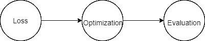
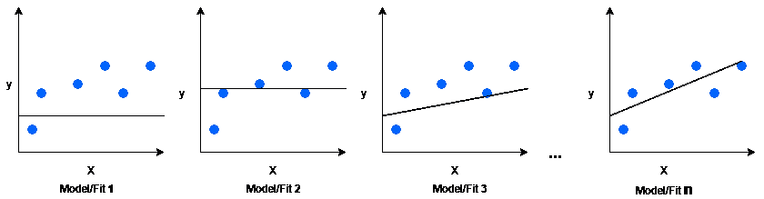
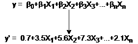
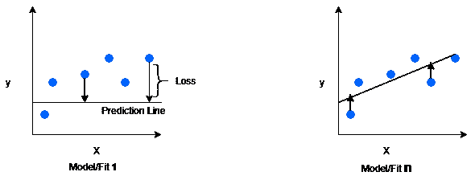
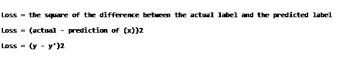
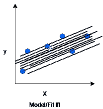
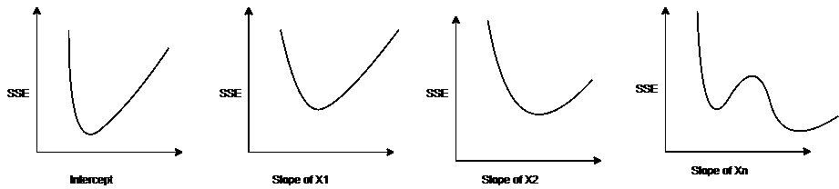

# 产品经理机器学习指南:核心思想

> 原文：<https://towardsdatascience.com/a-product-managers-guide-to-machine-learning-core-ideas-ba837885d5a?source=collection_archive---------45----------------------->

## 在进入机器学习的树叶和小树枝之前，先了解一下树干和大树枝。

辛金·托马斯在 [Unsplash](https://unsplash.com/s/photos/seqouia?utm_source=unsplash&utm_medium=referral&utm_content=creditCopyText) 上的照片

# 语境

对于产品经理来说，通过机器学习来推动业务影响的需求越来越大。在写这篇文章的时候，我作为亚马逊的高级产品经理正在发布 ML 驱动的产品/特性。在这段时间里，我花了很多时间在日常工作中学习和使用 ML 概念。希望我的经历能对你的学习有所启发，在“产品经理机器学习指南”系列中，我将记录我的收获。

这篇文章是为那些产品经理而写的，他们想比核心 ML 过程概念更深入一点:设定目标、获取数据、分割数据、培训、验证、测试、评估和发布。

# 文章:路线图

以上面提到的 ML 过程为背景，我发现 3 个核心概念是 ML 的主干和大分支。

3 个核心概念是 1)损失 2)优化和 3)评估。

你不必知道这些概念的细枝末节。我将使用简单的视觉和语言来交流这些线性回归算法的概念。

*免责声明——每一个主题都是如此广泛和详细，以至于人们可以就每个主题写一本书。本文是对主要思想的简单介绍。*

图 1:核心概念

# 介绍

“要做的工作”理论也可以应用于机器学习。在我们进入 3 个核心概念之前，让我们花点时间来理解——线性回归算法的工作是什么？为什么我们要雇佣这个算法？

线性回归算法的目的是在数据点之间定位一条线(图 1:蓝点)。目标是我们想要学习信息 *X，*称之为特征，有关于 *y (* 称之为目标/标签*)，*以便我们可以预测一个新的或未知的 *X* 的 *y* 。这里 *X* 和 y 本质上是定量的。

例如:我们能多准确地估计出 *X* 对 *y 的影响？*广告(X)对销售额(y)，房间数(X)对房价(y)，身高(X)对体重(y)等。如果只有一个特征，它被称为简单线性回归，我们在 X 和 y 之间拟合一条线。如果有许多 X *s* ，它被称为多元线性回归，你在 *Xs* 和 *y* 之间拟合一个平面。

图 2:拟合模型的简单图示

如图 2 所示，该算法遍历了许多不同的线，为我们提供了一个最佳模型。即使是小孩也能看出最合适的是最合适的。

# fit 作业的输出是什么？

线性回归模型的输出是一个等式，该等式捕获了 *Xs* 关于 y 的信息。当模型准确地学习到参数β时，就会发生这种情况。如图 3 所示。企业需要这些参数来了解如何分配有限的资源或产生影响。

图 3:多元线性回归

# 嗯，模特怎么知道最合适的？

之前我说过，一个孩子可以看出图 1 中最右边的拟合是最佳拟合。但是怎么做呢？这样的结论背后的直觉是什么。这种直觉可以通过观察实际值(蓝点)和预测值(线上的一点)之间的距离来捕捉。

图 3:损失的简单说明

# 失败

实际值和预测值之间的距离越大，预测就越差。你是说——啊！这就是所谓的损失，一种糟糕预测的惩罚。任何算法都有一种或多种类型的损失。这些也被称为损失函数。我们将在这里检验的线性回归模型使用了一个称为平方损失的损失函数。单个示例的平方损耗如下:

图 4:平方损失

我们希望降低模型无法对未知数据产生良好预测的风险，因此我们引入了训练集和测试集的概念。这些不同的数据集将引入方差的概念(模型为不同的数据集生成不同的拟合)，即过拟合和欠拟合等。我们想使模型不被训练集的特性所影响，这一意图向我们介绍了另一个叫做正则化的概念。正则化建立在残差平方和的基础上，这是我们最初的损失函数。

*   普通回归:残差平方和-(1)
*   岭回归，也称为 L2 正则化，通过惩罚权重平方来最小化模型的复杂性:(1) + λ *权重平方和-(2)
*   Lasso 回归，也称为 L1 正则化，通过使无信息系数等于零来最小化模型的复杂性:(1)+λ*绝对权重之和| — (3)
*   弹性网= (1) + (2) + (3)

# 最佳化

我想你可能会问这个问题——在数据点之间放置线可能有成千上万种变化。这是如何实现的？为了形象化，请看图 5。图 5 的目的是展示为了得到合适的拟合，实际上会发生什么。

图 5:拟合的变化

你可以找到关于这个主题的大量书籍，这些书籍可以填满一个小型图书馆。作为一名产品经理，我不需要也不期望我知道这些书中描述的优化的枝叶。这个想法很简单——优化。如果你有一个送报路线，你就优化了路线，也就是说，在最少的时间内送更多的报纸。如果你有孩子，你会选择制造最少混乱的玩具。如果你是一个 ML 模型，你优化拟合产生最小损失函数。

在我们的例子中，我们最小化实际 *y* 和预测*y*之间的平方距离。这个最小化损失的过程可能需要几毫秒到几天。有不同的方法来优化我们寻找最小平方和的过程。也就是说，有各种优化算法来完成目标。例如:1)梯度下降 2)随机 GD 3) Adagard 4) RMS Prop 等是一些优化算法，仅举几个例子。按照惯例，大多数优化算法都与最小化有关。

例如，在图 6 中，我们可以使用梯度下降到损失函数的最低点，该点将成为图 3 中输出方程的截距和其他参数。

图 6:参数的错误率

# 估价

一旦损失被确定并减少，我们就到达了最后的核心概念:评估。通常，这是业务所有者会面并熟悉模型性能以实现业务目标的地方。

在线性回归中，可以根据均方误差(损失函数)评估模型，越小越好，R 平方，调整 R 平方，越高越好。

*   **R** - **平方**测量线性回归模型中自变量(X)解释的因变量(Y)的变化比例。
*   **调整后的 R** - **平方**根据模型中独立变量的数量调整统计数据。

# 邀请

机器学习的应用令人敬畏。不要让数学和词汇阻止你追求机器学习。如你所见，核心概念是熟悉和基本的。正如产品经理需要机器学习一样，它需要充分利用机器学习的产品经理。我希望这些核心观点能帮助你在与你的 ML 团队合作时思考正确的问题。