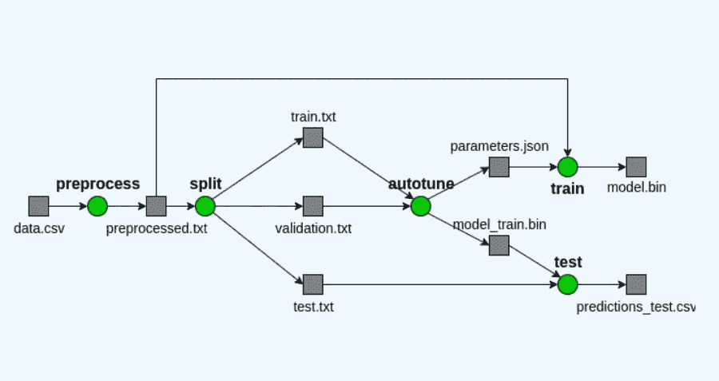
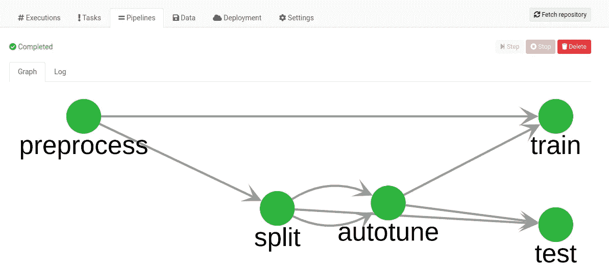
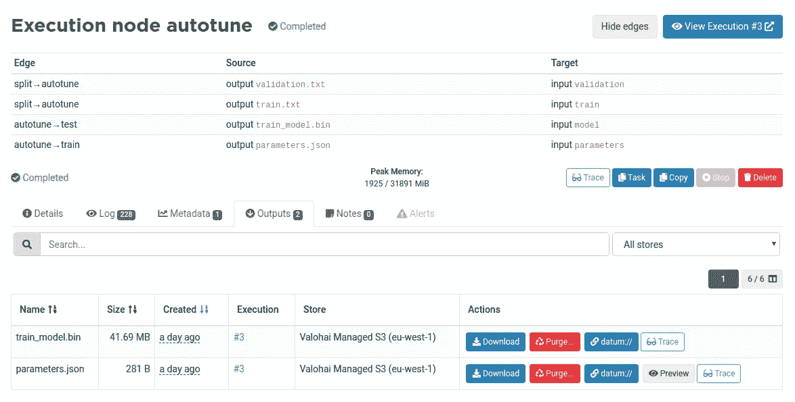
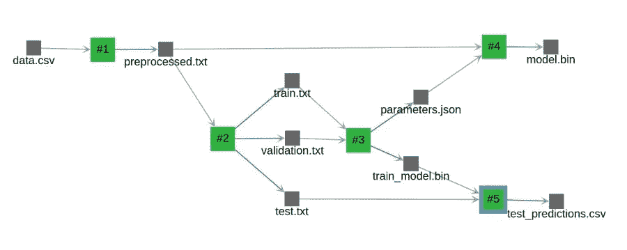
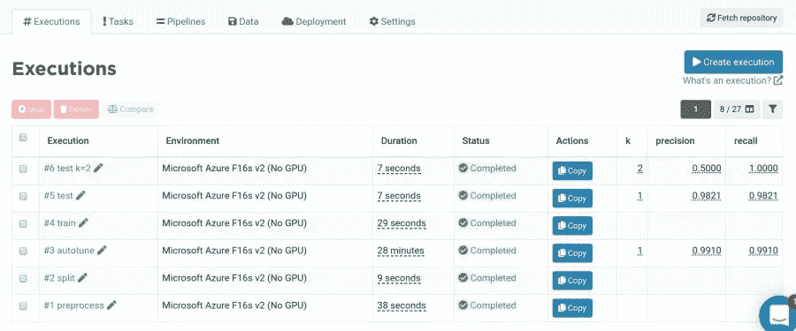
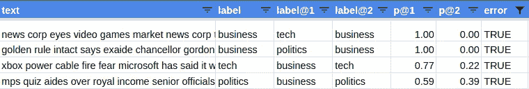
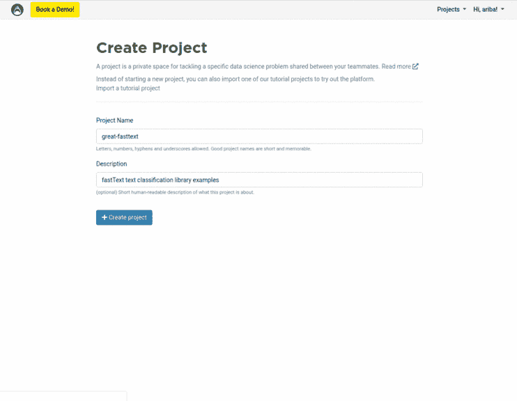

# 基于 fastText 的文本分类生产机器学习流水线

> 原文：<https://towardsdatascience.com/a-production-machine-learning-pipeline-for-text-classification-with-fasttext-7e2d3132c781?source=collection_archive---------35----------------------->

## 了解如何在多个步骤中组织您的 ML 代码，并使用 Valohai 创建受版本控制的 ML 管道。

带有执行和工件的数据谱系图。

在生产中做机器学习的时候，**模型的选择只是众多重要标准中的一个**。同样重要的是正确定义问题，收集高质量的数据并构建机器学习管道。

本文着重于为一个流行的问题构建一个机器学习管道:文本分类。管道获取带标签的数据，对其进行预处理，自动调优 fastText 模型，在所有数据中重新训练模型，并输出度量和预测以进行迭代。

我使用 [Valohai](https://valohai.com) 创建一个 ML 管道，并对每一步进行版本控制。最后，只需点击几下鼠标，您就可以在云上运行管道，并探索每个中间结果。

# 构建生产就绪基线

在 Kaggle 竞赛中，你在一个确定的问题和一个冻结的数据集上工作。你对排行榜上的好成绩有所了解。

在现实世界的应用中，**数据集不断发展，模型会定期重新训练**。例如，在文本分类中，添加新的标签数据和更新标签空间是很常见的。

为了构建 ML 管道，我使用了来自 BBC 新闻的 2225 份文件的数据集，分为五个主题:商业、娱乐、政治、体育和科技。数据集为每个文档分配一个标签，这就是所谓的多类问题。

您可以在任何包含两列的 CSV 文件上运行管道:文本和标签。如果您想为多标签问题训练它，您可以添加具有相同文本和不同标签的额外行。

# 使用快速文本进行文本分类

脸书在 2016 年宣布 fastText 是一个高效的文本分类和表示学习库。[官方快速文本文件](https://arxiv.org/abs/1607.01759)中报告的一些优势:

*   在标准多核 CPU 上几分钟内训练 10 亿个单词。
*   在不到一分钟的时间内对 312K 个类别中的 50 万个句子进行分类。
*   创建对拼写错误具有鲁棒性的子词向量。
*   包括易于使用的 CLI 和 Python 绑定。

2019 年，脸书为 fastText 添加了[自动超参数调谐，我将它作为管道中的一个步骤。](https://fasttext.cc/docs/en/autotune.html)

# 集成 fastText 和 Valohai

我用 [Click](https://click.palletsprojects.com/) 为每个 ML 步骤创建一个命令，这是一个 Python 库，它修饰函数，将它们转换成命令。**每个命令接受数据和参数，并生成数据和指标**。

例如，autotune 命令在训练分割上训练几个模型，以找到验证分割上的最佳参数。

[检查 Github 中所有 commands.py 代码。](https://github.com/arimbr/valohai-fasttext-example/blob/master/models/classification/commands.py)

*get_input_path* 和 *get_output_path* 函数在本地和 Valohai 云环境上返回不同的路径。 *train_supervised* 方法接受参数来限制训练的持续时间和模型的大小。保存最佳参数，以便以后根据所有数据重新训练模型。

为了在云中运行 autotune 命令，我将它添加到 [valohai.yaml.](https://docs.valohai.com/valohai-yaml/index.html)

[检查 Github](https://github.com/arimbr/valohai-fasttext-example/blob/master/models/classification/commands.py) 中的所有 valohai.yaml 代码。

# 创建机器学习管道

[Valohai 管道](https://docs.valohai.com/core-concepts/pipelines/)是一个版本控制的步骤集合，在图中表示为节点。每个数据依赖导致步骤之间的边缘。

文本分类管道有 5 个步骤:

1.  **预处理**:对 fastText 使用的原始数据进行预处理。
2.  **拆分**:将预处理后的数据拆分成训练、验证和测试数据。
3.  **自动调优**:在验证数据上找到最佳参数。
4.  **训练**:用所有数据上的最佳参数训练最终模型。
5.  **测试**:获取测试数据的度量和预测。

与执行类似，管道在 valohai.yaml 文件中由两部分声明:节点和边缘。

[检查 Github](https://github.com/arimbr/valohai-fasttext-example/blob/master/models/classification/commands.py) 中所有的 valohai.yaml 代码。

一旦声明了管道，就可以运行它，并通过单击它来检查每个管道节点。下面您可以看到自动调优节点的详细信息。

Valohai 管道是声明性的，很容易与您的代码集成。对于动态管道，可以[将 Valohai 与气流](https://blog.valohai.com/scaling-airflow-machine-learning)整合。

# 自动跟踪数据沿袭

数据沿袭图显示了执行和工件之间的数据依赖关系。在 Valohai 中，您可以跟踪每个依赖项，以便更快地调试管道。

Valohai 生成的数据谱系图。

# 迭代问题、数据和模型

自动调优步骤是获得良好结果的关键。F1 分数从默认参数的 0.3 变为测试数据集的**最终 F1 分数 0.982。中间结果由 fastText autotune 命令记录，可以在日志中读取。最终得分记录在 JSON 中，并由 Valohai 存储为执行指标。**

但是只看一个指标不足以知道你的模型是否工作良好。最有趣的信息在 test_predictions.csv 文件中。它包含模型在 222 条记录的测试数据集上产生的 4 个错误。

## 反复讨论这个问题

第四个错误将 0.59 的概率分配给商业标签，而不是 0.39 的政治标签。探究全文可以发现，文章谈到了这两个话题。该观察可能导致**对问题进行迭代，以变成多标签**，并分配高于概率阈值的所有标签。

## 对数据进行迭代

总的来说，标记的数据是高质量的。我们可以认为一些 p@1 较高的误差是对标记数据的修正。在另一个具有由不同过程产生的标记数据的数据集中，**模型预测可用于校正标记数据**。

## 在模型上迭代

如果最终指标对您的业务案例不满意，**可以添加新功能，并培训不同的模型**。但是我认为最好从正确的问题定义和数据开始。这些是你的 ML 管道的成分。

# 使用 Valohai 在您自己的数据集上尝试 fastText

自己在云端运行管道很容易。下面的按钮将邀请您注册/登录到您的 Valohai 帐户，并创建一个项目来尝试这个管道。

创建项目后，请按照以下步骤操作:

1.  在设置选项卡>常规选项卡中，将默认环境设置为**微软 Azure F16s v2(无 GPU)** 。
2.  在 Pipeline 选项卡中，使用蓝图 **fasttext-train** *创建一个管道。*
3.  点击**创建管道**运行管道。

当管道运行时，您可以单击图中的每个节点，并查看日志和输出。管道完成后，您可以单击一个节点，并通过单击 Trace 按钮获得数据谱系图。

恭喜你，你已经运行了你的第一个 ML 管道！现在你可以用你自己的数据来尝试一下，为你的文本分类问题获得一个基线:

1.  在数据选项卡>上传选项卡中，上传数据集。数据集应该是一个包含两列的 CSV 文件:文本和标签。
2.  在运行管道之前，单击预处理节点。在输入部分，用步骤 1 中上传的数据替换默认输入数据。

# 结论和下一步措施

在多个步骤中组织你的 ML 代码是创建受版本控制且易于调试的**生产机器学习管道的关键。CLI 是 ML 代码工业化的一个流行选择。**

对于文本分类等常见问题，fastText 是一个强大的基线构建库。有了 [Valohai](https://valohai.com) 你就有了一个版本控制的机器学习管道，你可以在你的数据上运行。在另一篇文章中，我重用了管道来[将 400 万个 Reddit 帖子分类到 4k 个子编辑中](/classifying-4m-reddit-posts-in-4k-subreddits-an-end-to-end-machine-learning-pipeline-ee511d26b362?source=friends_link&sk=e5e631fed93a2e99ce6746ebd6b36583)。

# 有用的资源

*   [Github 上的代码库](https://github.com/arimbr/valohai-fasttext-example)
*   [快速文本文档](https://fasttext.cc/docs/en/support.html)
*   [瓦罗海文档](https://docs.valohai.com/core-concepts/pipelines/)