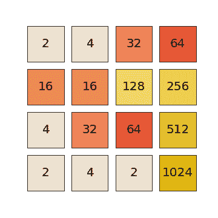
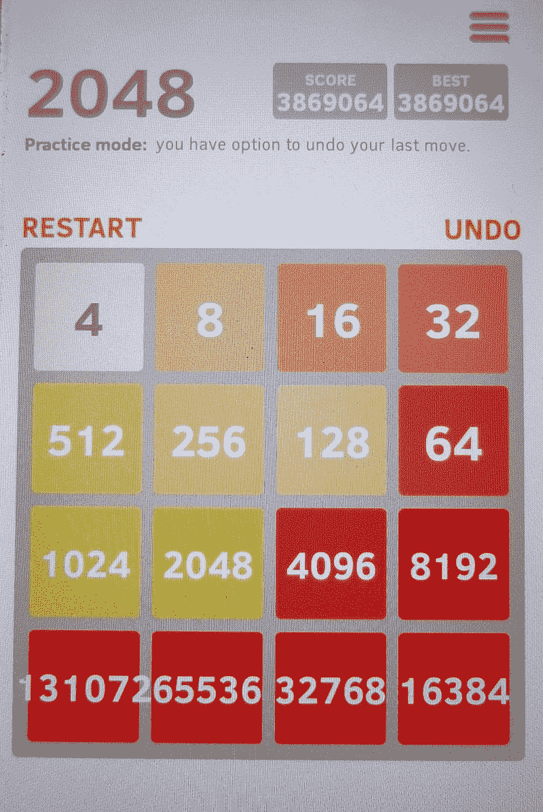
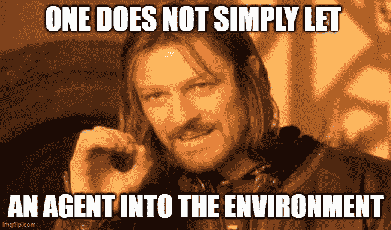
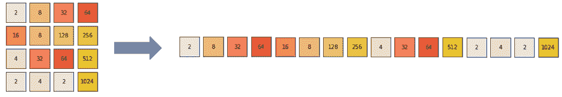
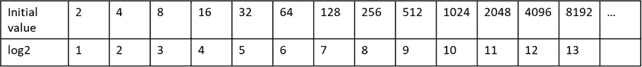
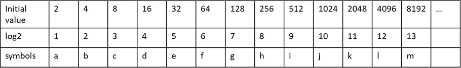
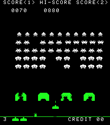
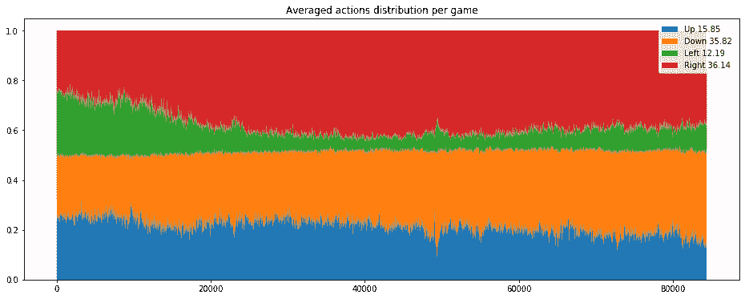
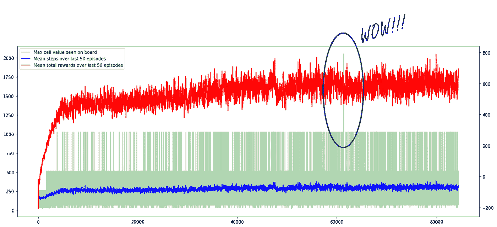
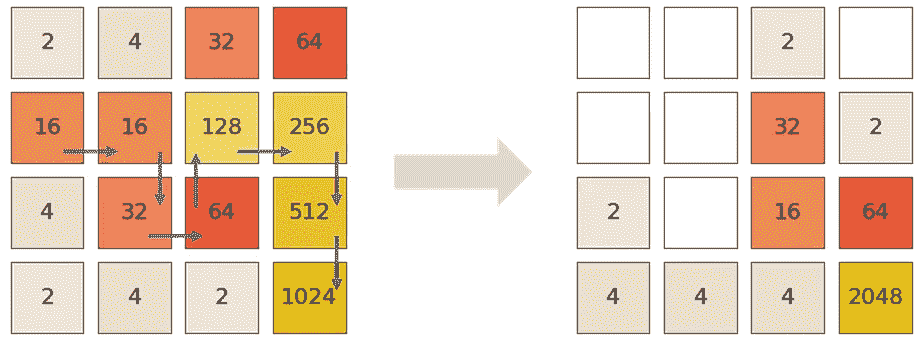

# 人工智能的一个难题

> 原文：<https://towardsdatascience.com/a-puzzle-for-ai-eb7a3cb8e599?source=collection_archive---------19----------------------->

## *我如何教一个 AI 玩 2048*

作者图片

嗨！我叫 Rinat Maksutov，在俄罗斯埃森哲技术公司的智能工程服务部门工作，负责定制开发项目。在我在埃森哲的漫长职业生涯中，我经历了许多不同的领域:移动开发、前端、后端，甚至是带有机器学习的数据科学。然而，我的故事不会是关于工作，而是关于一个爱好。我真的很喜欢通过我个人喜欢的项目来学习和探索新的领域。今天我将告诉你其中的一个——我如何教一个强化学习(RL)代理玩著名的益智游戏“2048”。这篇文章故意不包含代码、数学、最先进的方法和该领域的最新发现，所以对 RL 非常熟悉的人不会为自己发现任何新东西。这篇文章是给大众的一个故事，讲述了我是如何给自己设定一个不寻常的目标并实现它的。

我们公司在持续的员工培训上投资巨大。例如，去年推出了一个项目，员工可以免费参加 Udacity 上的一个纳米学位课程(纳米学位是一系列课程和一个最终项目)。我已经在这个平台上做过深度学习 Nanodegree，所以这次我决定上强化学习的课程。

该课程很好地揭示了 RL 的基础，但有一个很大的缺点:该课程提供的教育项目是基于现成的任务——在这些任务中，代理运行的环境已经由某人为您编写好了。也就是说，您只需实现学习算法并调整超参数，以达到目标分数并通过考试。

因此，在完成课程后，你将无法完全应用 RL 并解决你自己的问题，因为你只学习了这个领域的一部分。以及如何为代理人正确地构建环境、如何为其正式化任务、如何为各种行为正确地分配奖励等问题——留在括号之外，你必须自己解决(所有这些术语的含义，我将在下面解释)。

为了弥合这一差距，我试图解决一些以前没有人解决过的问题(至少在 RL 的帮助下)，并用它来研究为代理人构建环境的各个方面。作为这样一个任务，一个机械简单的益智游戏 2048 被选中(你可以在这里的浏览器中玩它:[https://play2048.co/](https://play2048.co/)或者在谷歌 play 或应用商店搜索你的智能手机)。在这个游戏中，玩家通过在四个方向(上、下、右、左)之一移动细胞，需要将具有相同值的细胞组合起来，并尝试收集具有最大可能值的细胞。当你进行移位时，一个新的 2(概率为 0.9)或 4(概率为 0.1)出现在随机的自由单元格上。当场上没有空的格子，并且玩家不能组合任何格子时，游戏结束。

尽管名字如此，2048 并不是游戏中最大的单元格值。经过适当的训练，您可以得到值 4096、8192 个单元格等等。理论上可能的最大单元值是 131，072，即 2 ^ 17:

来源:[维基百科](https://ru.wikipedia.org/wiki/2048_(%D0%B8%D0%B3%D1%80%D0%B0)#/media/%D0%A4%D0%B0%D0%B9%D0%BB:2048_Final_Position.jpg)

但是获得这个值是非常困难的。这是因为这个游戏没有一个策略可以保证获得尽可能多的分数。只有一种策略能增加你实现它的机会。粗略地说，它包括定义两个优先的垂直方向(例如，向下和向右)，大多数移动只在这些方向上移动细胞，很少在其他方向上移动。因此，较大的值将在四个角中的一个角上彼此靠近地“累积”，并且将它们组合起来以获得甚至更大的值将会方便得多。

为什么这个策略不能保证胜利？

1.  空的单元格被随机地填入两个或四个新的数字——也就是说，你可能很幸运，一个“方便”的单元格会被填满，或者它可能不幸运，一个单元格会被填满，使你不容易收集到所需的组合。
2.  收集每个下一个值的复杂性(所需的步骤数)近似呈指数增长。而且越深入，它就越依赖于新价值的“成功”出现，错误行为的代价就越高。

因此，代理人的任务将是学习这种策略，以便在每一步选择最有可能在未来允许的行动，以在游戏中获得单元的最大可能值。

# 强化学习的小介绍

上面我写道，我不会让你沉浸在 RL 的理论中，但仍然值得简要回顾一下主要观点。强化学习是机器学习的一个领域，其目标是教会智能体在某种环境下执行必要的动作。这里的代理是一个虚拟实体(程序、模型),它接收其运行环境的当前状态作为输入。然后，根据这种状态，它选择最有价值的动作，将其传达给环境，并从环境接收反馈和新的状态。如此循环，直到环境达到最终状态。

在代理的引擎盖下，可能存在一些数学模型，该模型基于环境的当前状态来确定哪个动作将是最佳的。最初，一般来说，代理人不知道什么样的环境给他，以及它的行动如何影响它。代理人通过所谓的“奖励”接收来自环境的反馈。这是一个数字，代理可以通过它来判断所选择的动作有多正确。代理的任务是学习一种“策略”——一种在代理存在于环境中的整个时期内使代理的报酬最大化的行动策略。这种奖励正是“强化”，这意味着正确的行为得到积极奖励的支持，错误的行为受到消极奖励的阻碍。因此，通过多次迭代，代理(或者更确切地说，模型)开始更准确地预测每个可能的行动的潜在回报，并选择最有价值的行动。

Udacity 有一个有趣的小狗训练类比。你给它一个命令，起初它不明白你想要什么。它开始执行随机的动作来响应你的命令:吠叫、跳跃、仰卧、跑来跑去。当它随机选择正确的动作时，你就给了它一个奖励。狗意识到，你很可能希望它按照这个指令做那个动作。这样反复几次——命令——动作——好吃，之后狗就确信了所选动作的正确性。

近年来，大量关于人工智能的大型媒体故事都与强化学习有关:AlphaGo 算法的胜利，在专业水平上玩星际争霸，等等。但你需要明白，在强化学习领域仍有许多未解决的问题，其中一个主要问题是所学技能对其他任务的可移植性差，以及学习的高度不稳定性，这甚至会受到环境最轻微变化的影响。也就是说，如果算法在一个游戏中学习玩得很好，那么它很可能在另一个游戏中显示糟糕的结果。在这个方向上有一些进展，但距离相对通用的算法还有很长的路要走，最有可能的是，开发它们在经济上尚不可行。

另一个重要的问题是，在实践中，很少有任务可以借助强化学习来解决。与花时间训练代理相比，实现解决问题的已知算法通常更容易、更快、更可靠。由于这个原因，强化学习还没有像机器学习的其他领域一样受到重视。

事实是，传统上机器学习用于自动化任务:1)难以算法化，2)由受过充分训练的人容易执行，但是 3)需要人花费大量时间来完成任务。例如，在图像识别任务中，一个人可以很容易地确定想要的对象是否在上面，但是很难编写一个足够可靠并且或多或少通用的算法来确定对象，同时，对于大量的图像，一个人将在很长的时间内完成这项工作。或者，例如，欺诈检测:受过训练的人将能够通过交易序列识别可疑活动，但他们的搜索和分析将花费大量时间，并且这项任务也很难用普遍预定义的规则集来描述。

现在我们从这个角度来看强化学习。这个领域的目的是教一个代理在特定的环境中行动，也就是说，根据当前的情况做出决定。没有多少任务符合这一想法——主要是在控制某些东西的领域，例如，装配线上的机械臂，路上的汽车，星际争霸中的一群 zergs，等等。但是通常人们已经知道了达到预期结果的规则或策略。我们不希望一个装配线上的操作者在开始做正确的事情之前，先学会把一个零件放在正确的位置上几万个周期，然后毁掉几万个产品。编写一个在装配过程的每一步精确定位机械臂的程序要安全得多。我们不希望汽车行驶数百万公里，并通过一周内的罚款来了解每个路标的意思——最初输入这些知识要快得多，也更可靠。这就是为什么强化学习仍然是一个非常实验性的领域，它的实际应用很少。[三年前](https://www.alexirpan.com/2018/02/14/rl-hard.html)的一篇关于这个话题的精彩文章仍然很有意义，并且很好地描述了这个问题，我建议你读一读。介绍到此结束，我们回到我们的任务。

# 耙子和自行车

博罗米尔的另一个迷因。图片作者。

到达 cell 2048(虽然对于一个或多或少有经验的玩家来说，2048 根本不是一个成就)是一个漫长的尝试、错误、失望、最愚蠢的 bug、灵感和喜悦的旅程。

起初，一切看起来都很简单:我们从我在 Udacity 上的作业中获得了实现 Deep Q-network 的现成代码，将其稍加修改以适应我们自己的环境，一切都会迎刃而解。太天真了。

这样你就能理解 3 个月的实验都花在了什么上(如果什么都不清楚，你可以对子弹的数量感到惊讶，并进一步滚动):

**环境状态表示**

*   独热编码向量(16 个单元*每个单元 18 个可能的状态)

也试过:

*   具有“原样”单元格值的向量
*   具有 Log2 像元值的向量
*   卷积网络的 4 乘 4 矩阵

**奖励**

*   当前步骤中棋盘上折叠单元格的 log2 值之和减去移动单元格的罚分和错误移动的罚分

*也试过:*

*   板上单元格值的总和
*   所有时间内折叠单元格值的总和
*   整个时间内折叠单元格的 log2 值之和

**训练**

*   每场比赛后 10 次训练迭代，批次大小为 1024，初始ε: 0.05，递减因子为ε: 0.9999，

*也试过:*

*   每场比赛后 1、3、5、20 次训练迭代
*   从 1.0 到 0.01 的不同ε值(行动的因子随机化)

**经验的积累和运用**

*   缓冲 100，000 个最近的动作

*也试过:*

*   随机经验抽样(无优先顺序)
*   5 万和 20 万的缓冲
*   通过棋盘上的总和、最大单元格、错误值、奖励(包括行动分配的平衡)来确定经验优先级

**协助学习(作弊)**

*   不

*也试过:*

*   “从中间开始”:每 N 集让代理人在一个随机产生大细胞的环境中发射，以便让他熟悉他以前从未达到过的价值观。
*   “平行宇宙”:除了一个选定的步骤，其余 3 个可能的步骤被计算并保存在历史中，以便在训练中有更多可比较的例子

**什么被最大化**

*   提前两步折扣奖励

*也试过:*

*   下一步中的帐户
*   所有后续步骤中的折扣分数
*   下一步奖励

**神经网络**

*   5 层:288–3x 1024–4，ReLU 和 Adam 优化器激活

*也试过:*

*   2，4 个隐藏层
*   其他优化器和激活
*   隐藏层中有 256，512 个神经元
*   不同的学习率值
*   卷积网络

如果神经网络配置和训练参数是一个人每次都必须处理的非常标准的事情，当你解决深度学习中的一个问题时，那么其他的都是强化学习特有的。

我不得不面对的第一件事是在培训代理人方面毫无进展。这与代理人从环境中接收的信息有关。

# 代理的环境

为游戏编写棋盘逻辑变得非常简单，只需要几个小时。几个简单的矩阵技巧，引擎就准备好了。它根据选定的操作执行单元格的“折叠”和移动，填充新的单元格并计算点数。因此，环境的当前状态由一个简单的 4x4 矩阵描述，其中每个单元包含相应单元的值。由于我使用了常规的全连接神经网络，因此在将环境状态发送到神经网络之前，必须将其转换为 1x16 向量:

游戏板转型。作者图片

第一个问题出现了。当代理到达 512 单元时，训练质量停止增长。不管我怎么训练它，它都不能收集更多的了。这里的问题出在单元格的值上，它有一个巨大的范围:从 0 到几十万。让专家们见谅，但这里对这种行为的原因有一个非常松散的解释——我故意简化，以便大致思路清晰。

每个输入值都是神经网络的信号。这个信号的强度与输入值成正比，神经网络输出端的误差也将与其成正比。药剂到达的细胞越大，来自这些大细胞的信号就越强，而来自较小细胞的信号就越弱。然而，发现小像元的数量级比大像元多，并且它们比大像元更重要，因为通过正确收集小值可以获得大值。事实证明，代理学习收集的值越大，它开始与较小的细胞一起工作就越差，因为它们的信号对于神经网络来说越来越弱。

事实证明，解决这个问题相当简单。我只是将这些值放到了一个更统一的尺度上:单元格值的 log2。然后指数增长的值变成了一个普通的序列:

也就是说，在每次移动之前，计算当前棋盘的每个单元格的 log2，然后将这个矩阵输入到神经网络中。这个技巧使得克服值 512 的上限并达到 1024 成为可能。但是学习过程仍然非常缓慢。很明显，这种环境对于神经网络来说信息不够丰富。

在某种程度上，我认为代理并不真正关心单元格的值。将一种价值观转化为另一种价值观的机制才是重要的，也就是说，一种新的价值观是从另外两种相同的价值观中产生的。我们可以用下面一行来补充我们的表:

对代理人来说，唯一的意义就是 a + a = b，b + b = c，等等。，而不是 a、b、c 后面藏着什么值(这里的“+”不是加法，同样是“折叠”)。这意味着单元格的值不能被视为数值，而是分类值。因为我们知道一个单元的最大可能值，所以每个单元可以表示为一个独热编码向量。也就是说，对于每个单元，不使用它的值，而是使用 18 维的向量，其中所有值都是零，并且只有一个值等于 1，该值的位置对应于我们可能的值之一。这样的向量——通过细胞的数量。我仍然不清楚为什么，但正是这个，而不是数字表示，帮助代理更快地达到更高的值。

# 报酬

最初，奖励简单地计算为棋盘上所有单元格的值之和。看起来这个分数将是代理人进步的引擎，因为通过分数的逐渐增加，人们可以判断是否选择了正确的行动，这可以用作奖励。事实证明不是。原因就在于游戏的机制。

就拿《太空入侵者》这种非常简单的游戏来说吧。几年前，谷歌对其代理进行了这方面的培训。

来源:[维基百科](https://en.wikipedia.org/wiki/File:SpaceInvaders-Gameplay.gif#/media/File:SpaceInvaders-Gameplay.gif)

在这个游戏中，每击中一个外星人，分数就会增加。即动作(“出手”)、环境中的结果(“命中”)与分数之间有直接关系。

在 2048 年，这种方法不起作用。原因如下。假设您有两个相邻的值相同的单元格。你把它们折叠起来，然后…黑板上的分数没有改变。因为它们的值分别等于新单元的值。也就是说，在执行了正确的动作之后，代理人将不会得到积极的强化，也不会学到任何东西。此外，在每个动作之后，一个新的随机单元格被填充值 2 或 4。因此，无论代理执行什么操作，它都会收到一个值作为响应，该值等于[计数到步骤+ 2 或 4]。显然，这些信息不足以理解代理人如何选择动作。正因为如此，训练实际上没有进展。

因此，该奖项必须以不同的方式实现。起初我试图给它的不是棋盘上细胞的当前值，而是游戏开始以来折叠细胞的值。现在代理人有了一个更可靠的参考点，训练进行得更快了:代理人看到哪个动作大大增加了分数，哪个没有。但即使如此，训练并没有像我希望的那样快，所以这个想法提出了一个更具体的指标:只给出当前步骤中崩溃细胞的总价值作为奖励。这使它能够清楚地了解什么样的行动应该导致什么样的结果，并大大加快学习过程。

但是还有一个与游戏机制相关的细节。向两个相反的方向移动的回报将是相同的，但棋盘将处于不同的状态，并将在接下来的步骤中导致不同的后果。但是更重要的是，如果你记得的话，转变应该主要发生在选定的方向上。也就是说，如果我们收集右下角的细胞，那么只有在特殊情况下才应该进行左移。因此，我们可以假设向右移位的预期报酬较大，向左移位的预期报酬较小。这意味着我们不仅需要预测当前步骤的预期回报，还需要预测下一步的预期回报。

为了训练模型来预测奖励，我使用了“玩过”游戏的历史记录——以前游戏的每一步都保存在一个特殊的缓冲区中，用于训练。首先，我尝试使用从当前步骤到游戏结束的所有奖励的总和作为预测的目标值。此外，离当前的一步越远，其回报的总和权重就越小。为此，我将它乘以一个几何递减级数的相应序数值。但是这种方法，由于动作变化太多，给出了糟糕的预测。然后我把预测深度限制在当前步骤，权重为 1.0，下一步权重为 0.1。查看日志，我发现随着时间的推移，对潜在回报和最有价值的行动的预测实际上变得越来越接近实际发生的情况。但是，这个模型还是经常在非优先方向上移动，从而破坏了棋盘上的局面。有必要以某种方式“劝阻”行为者不要做出对自己有害的行为，而这是在惩罚的帮助下完成的。

# 惩罚

这种方法在 RL 中经常使用，这样代理不仅可以学习如何执行任务，还能以最简单的方式完成任务。为了告诉它哪些步骤是精益的，哪些是浪费的，你需要把这些信息放在奖励里。在我的例子中，我决定在每次移动时惩罚代理，因为所有的细胞在选择的动作后都移动了(也就是说，改变了它们的位置)。移动的细胞越多，惩罚就越高。也就是说，如果它在右下角累积了较大的值，并继续向右或向下移动，则只有新单元格的值会成为它每一步的惩罚。如果它突然决定向上或向左移动，那么不仅新的细胞会移动，所有集中在右下角的细胞也会移动，惩罚将是巨大的。随着时间的推移，代理人意识到，最大的奖励不仅是在它折叠更大的细胞时获得的，而且是在它移动最少数量的细胞时获得的——这迫使它坚持所选择的策略，并且只有在特殊情况下才会在“非优先”方向上采取步骤——当预期的奖励(包括罚款)确实更高时。

在每个游戏中所选移动方向的份额分配。图片作者。

在这张图片上，我们可以看到策略是如何逐渐向正确的方向变化的:在第一场游戏中，移动的方向被均匀地选择，但随后“优先”的方向出现了——向右和向下。

特工的行为还有一个搞笑的瞬间，大大拖慢了训练进度。正如我上面写的，代理人并不知道游戏规则。因此，它不知道，如果你已经把所有的细胞都压到了棋盘的右边，就不可能再移动了，比如说，向右移动。也就是说，即使你做了这样的移动，棋盘上的任何东西都不会改变。在某些时候，神经网络出于某种原因决定，最有利可图的移动是没有一个细胞移动的移动，因为如果没有移动，那么就不会有惩罚。也许是因为它们的大小，轮班惩罚比没有得到倒塌细胞的奖励更糟糕。因为在这样的移动之后，棋盘没有改变，所以下一步的输入保持不变。当然，选择了相同的动作。如此反复数千次，直到“随机”移动发生(在每次迭代中，以非常低的概率——十分之一或百分之一——随机移动而不是计算的移动，以便，除了别的以外，摆脱这样的循环)。这个问题本来可以通过调整惩罚和奖励来解决，但我只是决定非常严厉地惩罚“不可能”移动的代理，它很快就放弃了这样做。

# 结果

哇信号。图片作者。

绿色图表显示了每场游戏中的最大单元格值。离群值—在一个游戏中，单元格的最大值是 2048。

去 2048 号牢房。图片作者。

为了学会组装细胞 2048，代理必须玩六万多一点的游戏。然而，一个重要的细节是，一个单一的成就并不意味着代理已经学会了持续地做这件事。请看绿色图表的开头，您可以看到代理是如何学习到达 1024 单元的。起初有同样的爆发，然后 1024 越来越频繁地出现，然后在 3 万场比赛后的某个地方，代理人开始非常自信地达到 1024。所以如果我们说代理人真的“学习”如何收集 2048，那么，外推模式，我们可以估计代理人将需要超过一百万场比赛来巩固这一技能，并奔向下一个目标——4096。

你可能已经厌倦了阅读，所以我用 20 分钟的 cell 2048 聚会视频(从 16:40 开始)来结束我的长篇阅读:

我在我的笔记本电脑上进行训练，所以花了大约两天时间才得到这个结果。但是正如我上面写的，2048 年在这个游戏中远远不是极限。因此，如果你有计算能力和时间，这是很有可能达到更大的细胞-采取[我的代码在 GitHub](https://github.com/voice32/2048_RL) 和尝试训练自己的代理人！如果你设法击败我的成就，请在评论中发送你的结果的 gif 和链接。感谢阅读！