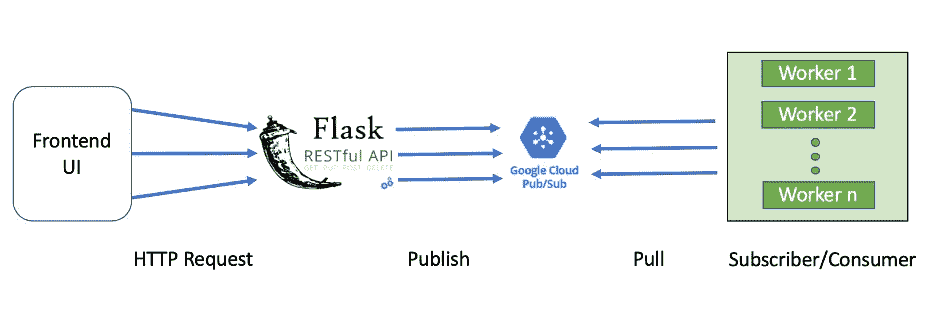

# Google 云平台发布/订阅的并发消费者通用框架

> 原文：<https://towardsdatascience.com/a-python-implementation-of-concurrent-consumers-for-google-cloud-platform-pub-sub-991ae8b9841d?source=collection_archive---------29----------------------->

## 一个示例展示了如何将消息发布到 Pub/Sub，并使用 Python 多处理模块构建一个服务来同时使用这些消息

这个博客也可以在 [Linkedin](https://www.linkedin.com/pulse/python-implementation-concurrent-consumers-google-cloud-boning-zhang) 找到。

本博客将向您介绍谷歌云平台(GCP)中的实时消息队列，即 Pub/Sub。首先，我将解释什么是消息队列，以及我们何时需要消息队列。其次，我将向你介绍 GCP 酒吧。之后，我将展示如何向 GCP 发布消息。最后，我将解释一个使用 Python 中的*多处理*模块实现的并发消费者。我将在这一部分花大部分时间，因为它是使用 Python *多处理*模块的并发消费者的通用代码框架，可以在您的项目中无需任何修改地重用。

## 我们什么时候需要消息队列？

消息/任务队列接收来自一个或多个应用程序的消息，另一方面将这些请求/消息分派给多个分布式工作器来消费这些任务。在此过程中，产生任务并将其发布到任务队列中的应用程序称为生产者，而从任务队列中接收和消费任务的工作者称为消费者。一个好的任务队列应该能够支持分布式的工人/生产者，并以可接受的延迟分派任务。

GCP 发布/订阅的并发消费者示例

在后台运行异步任务的应用程序中需要任务队列，如下所示。我们有一个前端用户界面，用户通过点击提交按钮触发一系列的工作。这些作业需要异步运行，因为它们非常耗时。作为一个解决方案，我们在这个项目中需要一个任务队列，以守护模式将从生产者(即这个场景中的前端 UI)接收的任务分派给消费者。您可以提出一个解决方案，将从前端接收的任务信息记录在一个 MySQL 表中，然后让工人使用 MySQL 表中的任务。嗯，MySQL 表不适合做任务队列的原因有很多。在 MySQL 表作为任务队列的那种情况下，(1)你的工作人员需要从 MySQL 服务器上一遍又一遍的查询表，这会给你的服务器带来很大的负担，可能会影响你的其他 MySQL 操作。(2)也可能发生两个工作者试图同时消耗相同的任务，尽管使用适当的锁定逻辑，这种概率很小。(3)由于 MySQL 服务器不是分布式的，所以这种设计是不可扩展的。因此，我们应该考虑在这个场景中使用任务队列。

## 什么是谷歌云平台 Pub/Sub？

谷歌云平台(GCP) [Pub/Sub](https://cloud.google.com/pubsub/docs/overview) 是一个消息队列管理系统。它类似于芹菜消息队列，但好处是您不需要构建和维护基础设施。在 GCP 发布/订阅中，一个**主题**是一个接收生产者发布的消息的任务队列。对于一个主题，我们可以创建一个或多个**订阅**。发布/订阅会将主题中的所有消息发送给每个订阅。多重订阅适用于有多个应用程序使用相同的消息但目的不同的情况。在我们的场景中，单一订阅就足够了。现在你可能会想，如果只有一个订阅，我们怎么会有多个消费者。嗯，订阅不是消费者，在 Pub/Sub 中表示为**订阅者**。一个订阅可以有多个分布式订阅者，因此发布/订阅会将消息分派给这些订阅者，以便他们可以并发地使用异步任务。

本文将实现一个消费者/订阅者从发布/订阅请求多个消息，并并发运行工作器。要在实际项目中扩大规模，您只需要在不同的计算引擎中运行多个连接到同一个订户的消费者。

## 如何向 GCP 发布消息？

请参阅以下伪代码作为示例。类似的例子也可以在 GCP 的 [GitHub](https://github.com/GoogleCloudPlatform/python-docs-samples/tree/master/pubsub/cloud-client) 中找到。

这里，我们在对 Pub/Sub 的单个调用中批量处理多个消息，以提高吞吐量，因为在我们的场景中，延迟并不是那么关键。 *BatchSettings()* 如果批量消息的大小达到 10240 字节或每 60 秒发布一次。在*from _ service _ account _ JSON()*中，我们使用 gcp_key 文件作为对 gcp 的认证。并且每次 *message_data* 发布后，都会触发一个回调函数 *log_pub_result()* 来显示其发布状态。这里注意，在 Python3 中， *PublisherClient* 只接受字节串作为数据类型，这就是为什么我们需要将“ *message_data* ”编码为“ *utf-8* ”。

在我们的示例中，Rest API 将触发这个 publisher 模块，以便发布从前端接收到的消息。

## 如何接收 GCP 酒馆/订阅的消息？

从 Pub/Sub 接收消息的方法有两种: *pull* 和 *push* 。在*拉*的情况下，订阅者/消费者向 Pub/Sub 发送请求以拉消息，而 Pub/Sub 基于消息的发布率向订阅者/消费者推送消息。在我们的场景中，我们将实现消费者从发布/订阅获取消息，因为我们可以控制吞吐量，延迟对我们来说并不重要。在拉取过程中，我们还可以控制每次从服务中拉取的消息数量，这样我们就可以控制单个订阅者/消费者中并发工作人员的数量。一旦消息被发送给订户/消费者，在处理该消息时，它将不会被再次发送给其他订户/消费者。但是，如果消息在确认窗口内没有被确认，那么发布/订阅将考虑再次调度它。因此，在任务完成后确认消息并在任务完成前更新确认窗口非常重要。

## 使用 Python 多重处理模块的并发消费者通用代码框架

在这一部分中，我将解释使用 Python 中的多处理模块实现的并发消费者的通用代码框架。因为我们的任务是 CPU 受限的，所以我们将使用 Python 中的多处理模块实现并发订阅者/消费者。(1)我们将首先为每个员工分配一条消息/任务。我们将等待所有的工人完成他们的任务。(3)当我们等待工作者时，我们将定期检查消息的确认窗口是否需要每隔一段时间更新。(4)一旦工作者完成其任务，我们将确认该消息。在这样的实现中，如果在消息运行期间抛出任何异常，则消息将不会被确认，这样，发布/订阅将在以后再次将它们分派给订阅者。

然后我将详细解释守护程序服务。完整的示例代码可以在我的 [GitHub](https://github.com/BoningZhang/GCP_PubSub_example) 中找到。为守护进程服务实现了两个文件， *service.py* 和 *internal/subscriber.py* 。 *service.py* 由 *main* 函数和任务组成，而 *internal/subscriber.py* 由从 Pub/Sub 提取消息并启动并发工作器的所有助手函数组成。 *internal/subscriber.py* 中的代码对于 Pub/Sub 的并发消费者来说是通用的，这些代码无需任何修改就可以在其他项目中重用。

我们先来看看驱动部分，也就是 *service.py* 中的 *main* 函数。在这个例子中，它配置了*日志*，但这与我们的主题无关。除了*日志*部分，它除了 *start_service()* 之外什么都不做。

*start_service()* 函数由 python decorator 包装，它是实现我们的任务的地方，例如示例中的 *run_step1()* 和 *run_step2()* 。需要提到的一点是 *start_service()* 的输入参数。很容易知道“ *message* ”是从 Pub/Sub 接收的消息，分配给这个 worker，而“ *return_vals* 是一个字典，用于与 worker 的调用函数进行通信。

装饰器“ *listen* ”在 *internal/subscriber.py* 中实现。为了解释 *service.py* 的作用，我需要展示它的实现。

基本上，“ *listen* ”接收一个函数作为输入参数，并返回一个新函数 *subscriber_wrapper()* ，该函数包装了原始函数。因此， *service.py* 试图启动的服务是包装器:

首先，它通过 *connect_to_queue()* 连接到 GCP 发布/订阅。然后运行死循环，直到守护程序服务被终止。在循环中， *process_messages()* 将拉取消息并启动 workers 来完成 *start_service* 中实现的任务。在所有工作器完成这一轮的任务后，守护进程服务会休眠一段时间，然后反复启动下一轮，直到被杀死。

在上面的解释中，我们实际上使用了普通函数来代替装饰器。在我们的实现中引入装饰器的原因是因为“ *listen* 中的包装器可以重用，因此我们使用装饰器将它包含在 *internal/service.py* 中。

现在我们来看 *connect_to_queue()* ，就是连接 GCP Pub/Sub，没什么特别的。同样，我们使用 json 密钥文件作为对 GCP 的认证。

现在让我们来近距离观察一下 *process_messages()* 。

它首先从发布/订阅中提取 8 条消息。并调用 *start_workers()* 衍生出 8 个进程，在每个进程中运行 *start_service()* 。

在 *start_workers()* 中使用了*多重处理*模块。对于每条消息，都会产生一个单独的进程来运行 *start_service()* (作为参数“ *fn* ”)函数。如前所述， *return_vals* 是使用*多重处理* *管理器*创建的，用于与工人通信。注意"*workers[worker]=(message . ack _ id，msg_data，1，worker_num)"* 记录每个 worker 的消息的 *ack_id* ，以便在任务完成后用于确认消息。

让我们回到 *process_messages()* 。创建并启动 8 个进程后，主进程将继续监控这 8 个进程，直到全部完成。在每一轮监控过程中，它都会检查每一个工蚁，看它是活着还是不活着。如果它已经死了，那么我们将检查由 *return_vals* 返回的任务状态。如果任务完成，没有任何异常，那么我们将需要确认消息，否则不要确认，稍后 Pub/Sub 将再次调度它。

如果工作者仍然活着，那么我们需要检查是否需要扩展确认窗口。否则，在确认窗口到期后，当工作进程仍在处理该消息时，Pub/Sub 将再次调度该消息。如果工作者已经运行了太长时间并且超过了 SLA，那么我们将终止工作者而不延长确认窗口。请注意，每次我们将确认窗口延长 *ACK_DEADLINE_SECONDS* 秒，这应该大于监控工人的睡眠间隔*ACK _ SLEEP _ INTERVALS _ SECONDS*。否则，可能会发生确认窗口没有及时更新的情况。

## 结论

希望现在你已经清楚地了解为什么我们需要任务队列，什么是 GCP 发布/订阅，我们可以用它做什么。此外，希望在 *internal/service.py* 中实现的代码可以在您自己的项目中重用。