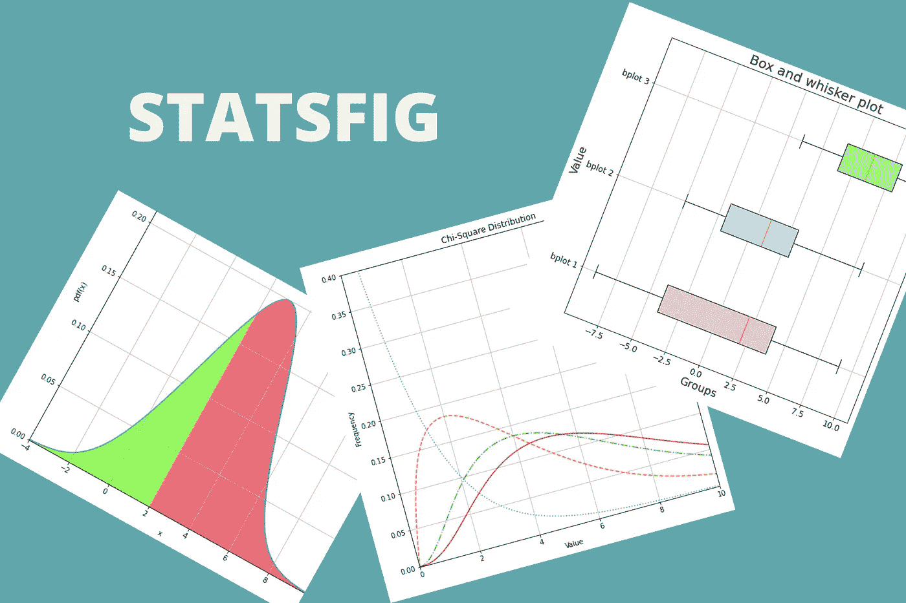
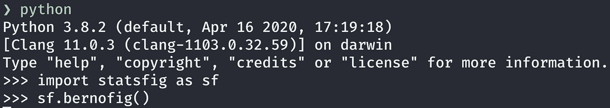
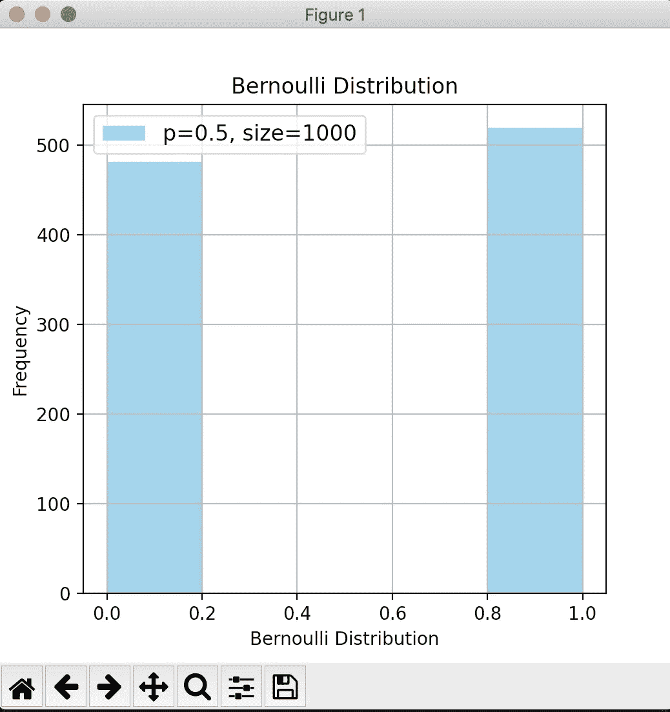

# 轻松创建统计数据的 Python 包

> 原文：<https://towardsdatascience.com/a-python-package-to-create-stats-figures-with-ease-503cf6ec0b26?source=collection_archive---------57----------------------->

## Statsfig 可以用一行代码创建分布图和盒须图



作者创造的形象。

```
**Table of Contents**[**Introduction**](#52fd)1\. [Installation](#8ea6)
2\. [List of Functions](#678c)
3\. [Bernoulli distribution: bernofig()](#86cc)
4\. [Binomial Distribution: binofig()](#fac1)
5\. [Box and Whisker Plot: boxplot()](#299a)
6\. [Chi-square Distribution: chifig()](#1c71)
7\. [Exponential Distribution: expofig()](#912f)
8\. [Gamma Distribution: gammafig()](#ce92)
9\. [Normal Distribution: normcdf](#f25a)
10\. [Poisson Distribution: poisfig()](#53fe)
11\. [Uniform Distribution: uniformfig()](#b08e)
12\. [Terminal](#21fd)[**Conclusion**](#5040)
```

# 介绍

有时，您可能需要幻灯片或课程的分布图。由于您没有使用数据，您需要一个快速的解决方案。

Python 包 [Statsfig](https://pypi.org/project/statsfig/) 可以用一行代码创建不同的分布图。

我将向您展示创建每个图形是多么容易。

# 装置

使用`pip`:

```
pip install statsfig
```

然后导入。

```
import statsfig as sf
```

# 功能列表

您可以使用 11 种功能。十个分布函数和一个图。

函数名称和描述。

# 伯努利分布:伯诺菲格()

`bernofig()`函数创建了一个伯努利分布，下表显示了所有参数。

伯诺菲格参数。

默认函数的概率为 0.5，大小为 1000。

fernofig()默认函数。

下面的例子显示了概率为 0.6，不同的颜色，没有网格。

具有不同概率、颜色和网格的 bernofig()。

# 二项式分布:二项式()

`binofig()`函数创建了一个二项式分布，下表显示了所有参数。

binofig()参数。

默认函数的概率为 0.5，大小为 1000。

binofig()默认函数。

以下示例的概率为 0.7，数字为 30 次试验，向右移动 1。

具有不同参数的 binofig()示例。

[](/how-to-run-jupyter-notebook-on-docker-7c9748ed209f) [## 如何在 Docker 上运行 Jupyter 笔记本

### 不再有 Python 环境和包更新

towardsdatascience.com](/how-to-run-jupyter-notebook-on-docker-7c9748ed209f) 

# 盒须图:盒图()

这是唯一一个不是分布图的。

`boxplot()`功能创建一个盒须图，下表显示了所有参数。

boxplot()参数。

默认函数的`info`参数有以下值。

```
{‘bplot 1’:[-9, -4, 2, 4, 9], ‘bplot 2’:[-5, -2, 1, 3, 8], ‘bplot 3’:[1, 4, 6, 8, 10]}
```

`info`必须有带`name:[min, lower quartile, median, upper quartile, max]`的字典形式。

boxplot()默认函数。

如果只想显示一个盒须图，可以这样做:

具有不同参数的 boxplot()示例。

改变`vert=False`水平显示图形。

具有不同参数的 boxplot()示例。

# 卡方分布:chifig()

`chifig()`函数创建卡方分布，下表显示了所有参数。

chifig()参数。

默认函数的自由度为[1，4，6，7]。

chifig()默认函数。

您可以通过使用 python 列表更改`dof`参数来更改自由度，如下所示。

具有不同参数的 chifig()示例。

# 指数分布:指数函数()

`expofig()`函数创建一个指数分布，下表显示了所有参数。

expofig()参数。

默认函数的标准差为 1，大小为 1000。

expofig()默认函数。

您可以通过将`hist`参数更改为`False`来隐藏直方图。

具有不同参数的 expofig()示例。

# Gamma 分布:gammafig()

`gammafig()`功能创建伽马分布，下表显示了所有参数。

gammafig()参数。

默认函数的形状参数为 5，大小为 1000。

gammafig()默认函数。

你可以通过改变`color`参数来改变颜色。您可以使用字符`{'b', 'g', 'r', 'c', 'm', 'y', 'k', 'w'}`中的一个，它们是蓝色、绿色、红色、青色、品红色、黄色、黑色和白色的缩写。您也可以使用十六进制 RGB 或 RGBA 字符串(如`'#4287f5'`或`'#4287f580'`)。

具有不同参数的 gammafig()示例。

# 正态分布:normcdf

`normcdf()`函数创建正态分布，下表显示了所有参数。

normcdf()参数。

默认函数的平均值为 0，标准差为 1。

normcdf()默认函数。

如果您愿意，可以将大多数参数更改如下:

具有不同参数的 normcdf()示例。

改变下四分位数`lb`和上四分位数`ub`，可以找到两个值之间的概率。

另一个不同参数的 normcdf()示例。

**norm pdf _ STD** `normpdf_std()`函数创建具有不同标准差的正态分布。下表显示了所有参数。

normpdf_std()参数。

默认函数显示的自由度为[1，2，3，4]。

normpdf_std()默认函数。

您可以使用 Python 列表来更改不同自由度的`val`参数。

具有不同参数的 normpdf_std()示例。

**normpdf _ mean** `normpdf_mean()`函数用不同的平均值创建正态分布。下表显示了所有参数。

normpdf_mean()参数。

默认函数有[0，1，2，3]用于显示平均值。

normpdf_mean()默认函数。

您可以按如下方式更改标题、x 轴最小值和最大值:

具有不同参数的 normpdf_mean()示例。

# 泊松分布:泊松分布()

`poisfig()`函数创建泊松分布，下表显示了所有参数。

poisfig()参数。

默认函数的值为 4μ，大小为 1000。

poisfig()默认函数。

具有不同参数的 poisfig()示例。

# 均匀分布:uniformfig()

`uniformfig()`函数创建均匀分布，下表显示了所有参数。

uniformfig()参数。

默认函数的大小为 1000，从 10 开始，宽度为 20。

uniformfig()默认函数。

在这里，我们正在改变颜色，网格，以及图形的宽度和长度。

具有不同参数的 uniformfig()示例。

# 末端的

您也可以从您的终端创建一个图形。



从终端创建图形。



# 结论

我希望你发现用 [Statsfig](https://github.com/shinokada/statsfig) 软件包创建图形要容易得多。我很想听听关于这个包的任何意见。欢迎在下面留言，或者通过[推特](https://twitter.com/shinokada)联系我。

请继续关注下一篇文章。

**通过** [**成为**](https://blog.codewithshin.com/membership) **会员，获得媒体上所有故事的访问权限。**


[https://blog.codewithshin.com/subscribe](https://blog.codewithshin.com/subscribe)