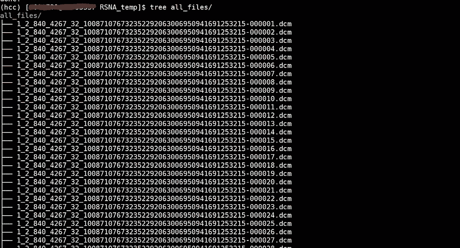
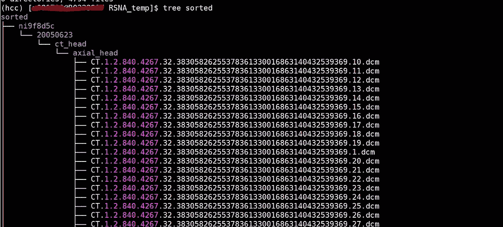

# 对 DICOM 文件进行排序的 Python 脚本

> 原文：<https://towardsdatascience.com/a-python-script-to-sort-dicom-files-f1623a7f40b8?source=collection_archive---------12----------------------->

## 这个脚本将帮助您理解和组织您的医学图像数据集

这篇文章是我之前介绍 DICOM 文件的后续文章。特别感谢我的好朋友吉安·马可·康特博士帮助我写这篇文章。

简单回顾一下，DICOM 文件是存储医学图像的主要格式。所有临床算法必须能够读写 DICOM。但是这些文件很难组织。DICOM 文件在文件头中保存了与图像相关的信息，文件头可能很大。文件分为 4 层:

1.  病人
2.  研究
3.  系列
4.  情况

在本教程中，我将分享一些 python 代码，这些代码读取一组 DICOM 文件，提取标题信息，并将文件复制到分层的文件夹结构中，以便轻松加载数据科学任务。

有许多很好的资源可以用来使用 Python 或其他语言解析 DICOM。 [DicomSort](https://dicomsort.com/documentation.html) 有一个灵活的 GUI，可以根据文件头中的任何字段来组织文件(DicomSort 也可以作为一个带有“pip install dicomsort”的 Python 包获得)。我还想感谢[这个报告](https://gist.github.com/somada141/8dd67a02e330a657cf9e)让我开始阅读 DICOM 像素数据集的代码。最后，[这篇伟大的论文](https://www.ncbi.nlm.nih.gov/pmc/articles/PMC3354356/)中有一节是关于图像压缩的，我在这里简单地提一下。

最终，我决定编写自己的实用程序，因为我喜欢确切地知道我的代码在做什么，它还提供了对 DICOM 头的介绍，这是任何从事医学成像项目的数据科学家的基本知识。

我已经为 CT 和 MRI 检查验证了这个代码；它应该适用于任何设备——所有 DICOM 文件都会报告患者、研究和系列信息。

## **所需的代码包**

这段代码使用 Python 包 [PyDicom](https://pydicom.github.io/) 来读写 Dicom 文件。

我想简单提一下 [GDCM 包](http://gdcm.sourceforge.net/wiki/index.php/Main_Page)。DICOM 文件可能在存储期间或通过 DICOM 接收器传输期间进行图像压缩。例如，在我们的机构，所有的 DICOMs 都有 JPEG2000 压缩。GDCM 是一个基于 C 的包，允许 PyDicom 读取这些加密文件。它以 conda 包(“conda install gdcm”)的形式提供，或者使用 cmake 从源代码构建。我在下面的代码中偷偷添加了几行代码，使用 GDCM 来解压缩像素数据，这样我以后就不用担心了。

*更新——自从写了这篇文章，我开始使用比 GDCM 更容易安装的*[*pylibjpeg*](https://github.com/pydicom/pylibjpeg)*包。我在文章末尾补充了更多的信息。*

## **代码演练**

完整的、不间断的代码版本在本文末尾。

首先，我们指定哪个目录包含我们的 DICOM 文件(“src”)，以及它们将被复制到哪里(“dst”)。请注意，该文件是复制的，而不是移动的，因此我们最终将存储每个文件的 2 个副本。我们将不分先后地阅读 DICOM 文件——每个文件在文件头中都包含足够的信息，可以准确地识别它来自哪里。

对于列表中的每个文件，我们将使用 PyDicom 包将文件头作为字典加载。

我们将在*患者*、*研究*和*系列*级别对 DICOM 文件进行分类(有关这些术语含义的更多信息，我鼓励您通读我的[之前的介绍](/understanding-dicom-bce665e62b72))。我还添加了一个额外的级别，即*研究日期*，如果您希望对同一患者进行多项研究，这将是非常有用的信息。

有两个字段分别与*患者*、*研究*和*系列*相关联:一个*唯一标识符(UID)* 和一个*文本描述*。您将看到的大多数 DICOM 数据集都是使用 uid 排序的。尽管 uid 总是唯一的，但是它们会导致很长的文件夹树，不容易理解。我已选择将每个文件保存在*文本描述*下，同时保留*患者 ID* 以提供一层匿名性(尽管患者姓名仍将出现在标题中)。

在几个数据集上使用这段代码，我还没有遇到过*病历报告*或*系列*信息丢失的情况，但是在极小的可能性下，我们会用“NA”替换它。

最后，我将包含一个小函数，用于清理“禁止”字符的文本描述，删除空格，并将文本转换为小写，这使得目录名更加清晰。

文件名将由*设备* (CT、MRI 等)连接而成。)、*系列 UID* 和*实例号*。我将包含*研究 UID* ，但是这会产生一个很长的文件名。

最后，我将删除任何 JPEG2000 或任何其他文件压缩。这是使用 GDCM 包完成的，它是一个可选的包，可以安装在 PyDicom 的下面。这不是 100%万无一失的(像 DICOM 的大部分内容一样)，因此我的新手尝试/例外语句:

脚本的其余部分创建了我们的分层文件夹树。同样，我增加了一个额外的按研究日期排序的级别。否则，可能很难区分我们单独的病历报告，并且如果两份病历报告有相同的描述，所有系列将被集中在一个文件夹中。

## **使用数据集上的代码**

为了测试这段代码，让我们在数据集上运行它。我选择了 2019 年 RSNA·卡格尔比赛，该比赛以诊断颅内出血的头部 CT 为特色。

现在，所有的文件都保存在一个目录中，这也是数据最初可用的方式。让我们看看这个脚本是否能帮助我们组织它:



图一。该代码按照患者、日期、研究描述和系列描述(右)将我们的非结构化 DICOM 文件列表(左)解析为嵌套的文件夹结构。文件也根据设备、系列 UID 和实例号进行重命名。图片作者。

虽然文件列表很长，我们只能看到最上面的文件夹，但是请注意，文件已经按照*患者 ID* (已被取消识别)*扫描日期*、以及*系列*和*研究*描述进行了分类，这些描述告诉我们一些关于我们正在查看的图像的信息。此外，这些文件已被重命名为*模态*、*系列 UID* 和*实例号*，以便于按行排序。

## 完整代码

## 更新—用于文件压缩的新软件包

自从写了这篇文章，我遇到了比我上面提到的 GDCM 包更容易安装和配置的 pylibjpeg 包。

Pylibjpeg 有几个依赖项，下面是我从我的 *requirements.txt* 中复制的列表

```
pylibjpeg
pylibjpeg-openjpeg
pylibjpeg-libjpeg
pydicom
```