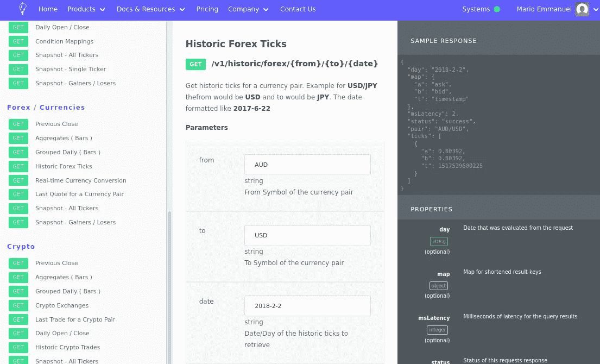

# 如何建立量化交易市场数据仓库

> 原文：<https://towardsdatascience.com/a-quantitative-trading-market-data-infrastructure-4ca7578e0291?source=collection_archive---------15----------------------->

## 如何组织从 Polygon.io 获得的数据的回顾和示例


图片由 Pixabay 的 Pexels 提供

# 为什么交易基础设施战略是相关的

定量金融需要大量的数据工程。一旦您开始处理小于每日数据的时段，这一点尤其正确。通过数据工程，我定义了用于检索、存储、解析、确保质量和向最终客户分发数据的方法、技术、软件、程序和基础设施。

虽然这个领域的光芒不及获得成功交易策略的算法，但它是一个重要的部分，必须正确处理。这种基础设施的设置是专业操作的一部分，也是业余人员和专业人员在该领域的不同之处之一。定义正确的基础设施是*业务运营*的一部分，在利用量化交易赚钱的中长期旅程中扮演着重要角色。

# 不同的方法

有不同的方法来满足这种数据工程的需要。所有方法都同样有效，但它们之间存在明显的权衡，了解您的资源和环境以选择正确的方法非常重要。我将描述我所看到的，这些信息来自我的实验，从行业人士那里收集的信息，由富有的量化交易者提供的信息，以及我从成熟的交易公司收集的信息(主要是自营交易和商品，不幸的是，我不知道这个行业有多少参与者)。

## 供应商环境方法

不需要高速或精细时间粒度来移动大量交易资本的大公司可以选择专有环境(如微软生态系统)来移动和存储数据。通过这样做，你可以指望友好的编程环境，无论何时需要定制任何东西(C#和 Python)，通过 Azure 和微软 ETL 工具集成云存储，以建立一个易于维护的数据管道——微软这么说的——。这种方法的优点是对所有事情都使用相同的技术，并且您可以期望不同组件之间的平滑集成。使用商业解决方案还提供了供应商支持，这总是好的。作为一个权衡:它是昂贵的，您依赖于一个供应商，它涉及经常性成本，并且某些活动不能正确地完成，因为您正在使用通用工具。我在一家信誉卓著的商品交易公司看到过这种方法。如果你需要处理高速的或者非常定制的或者 ML 密集型的策略，这可能不是最好的环境。

## 全 Python 方法

业界广泛使用的另一种方法是构建纯 Python 解决方案。对于那些在过去读过其他文章的人来说，你可能已经知道我个人对 Python 的感觉是复杂的。Python 的一个优点是非常容易编码，并且可以使用许多 ML 库，Jupyter 笔记本可以简化结构的维护，并且它促进了程序的自文档化。这不是最佳解决方案，但在混合环境中，我真的认为它可以在运营方面提供真正的好处。我一直在想，Python 无论从性能还是速度上来说都不是一个好的选择，但是编码高级别的可维护软件层却是极好的。更短的开发时间和更容易的团队协作的好处胜过性能障碍。有经验的 Python 开发人员也可以采用其他方法来提高 Python 的速度，尽管您正在将 Python 推向超越其本质的极限。我看到这种方法在一家规模较小、声誉卓著的对冲基金公司得到了非常成功的应用。

## C++/Java 方法

另一种方法是使用 C++或 Java 作为环境，开发一个定制的框架来处理数据。这是公司在一天内或高频率操作大量数据时使用的方法。对于分笔成交点数据，您可能至少在基础设施的某些领域需要这种方法。关于要使用的具体语言，C++是旗舰机构公司的首选，但 Java 可以以更低的运营成本使用，我已经看到非常成功的小公司用 Java 交付所有东西。事实上，你可以拥有与 C++几乎相同的性能，但是比 C++更容易管理语言和开发/调试环境。我最近在用 Java 做很多东西，因为我不是一个特别好的程序员。交易软件的某些方面用 C/C++语言来表示要好得多(具体来说，我发现用 C 为 OHLC 和分笔成交点数据定义数据结构比用 Java 更自然)。在交易中使用 Java 总是涉及到以一种对 Java 程序员来说不太自然的方式编码，因为你需要总是从低级编程和性能的角度来考虑，因此 C 语言背景是有益的。

## 存储替代方案

数据本身可以(并且通常存储在)数据库中，但这可能是一个错误。SQL 和非 SQL 方法都可以使用。我不再将 SQL 用于市场数据——我最开始使用它——但这是因为我现在的重点是用很少的工具进行日内策略，所以我必须处理大量非常同质的数据。关系数据库在这方面没有任何价值。另一种方法是使用 CSV 文件(是的，它们被广泛使用，这是有原因的)或其他纯文本方法(比如我使用的方法，我将在后面描述)。这种方法的优点是可以轻松地使用、检查和访问数据，并且有效地消除了另一个维护点和难点:数据库。

这些描述的方法的共同点是它们通常依赖于给定的语言或技术，而不是系统工程方法。这并不意味着不涉及某些系统工程，但往往不是主要的方法。

另一种方法可以被成功使用，特别是对于个体交易者、资源有限的小型对冲基金或小型自营交易公司(或初创公司)。声明:这种方法会伤害感情，因为它提倡重复使用 40 年的老技术。

# UNIX:基于文件的协作小工具方法

在追求简单性的过程中，我尽可能地去除了许多层和软件，同时也减少了需要交付的定制代码的数量。任何有助于实现这一目标的因素都有助于降低运营费用，减少需要完成的总工作量和维护量。在思考这个问题时，我发现，基于 UNIX 系统工程而不是基于 DevOps 或基于编程语言的基础设施，重用文件和小型协作工具的经典 UNIX 方法可能非常有利于设置操作。

我总是使用 UNIX 这个词，因为我使用 FreeBSD，但它同样适用于 Linux。

有一本 1985 年由 *Kernighan & Pike* 写的名为《UNIX 编程环境》的书。它是一本非常古老的书，C 代码甚至是 K & R pre-ANSI 风格，但在 C 编程社区中仍然广为人知；这可能是你能阅读的理解什么是真正的 UNIX 的最好的一本书:一个编程环境，可以轻松地重用小程序和工具，不费吹灰之力地构建解决方案。

诸如广泛的文件使用(“*一切都是文件”* UNIX 方法)这样的概念已经在很大程度上被抛弃，以包含更复杂的结构和解决方案。但是你总是可以停下来花一分钟思考一下:你真的需要一个数据库吗？或者你只是假设你需要一个数据库，因为每个人都这么告诉你？你真的需要一个基于 API 的云存储吗？或者你可以使用一个普通的文件系统——它可以完美地备份或存储在云上，这没什么不对的。您真的需要使用最新的流行框架在 Python 中编写 API 访问代码吗？或者在您的数据文件系统上安装一个 HTTP 服务或远程文件服务器就足够了吗？第一个选项甚至允许构建一个 REST 访问系统，而无需编写任何代码。

这些问题通常不受有偏见的专业人士的欢迎，尤其是那些*专攻某项技术或语言的专业人士，因为它用简单的工具和零维护的方法来挑战当前普遍膨胀的实践。*

零维护对于像我这样已经达到一定年龄(经验)的人来说非常重要，因为我们在过去已经犯过建造复杂东西的错误。对于缺乏资源和团队的小型企业，部署简单的解决方案是必要的。

我将在以下部分描述如何建立一个 1 秒钟的外汇数据基础设施服务。这是我的最新基础设施设置的一部分，用于回测和分析外汇中的量化策略，我将说明依靠 UNIX 系统中的小型合作工具的混合环境如何能够加快操作。

# 业务需求:定量分析

在我上次的定量分析中，我想使用外汇数据，使用 1 分钟的汇总数据。一分钟汇总数据意味着我想探索价格信息如何取代交易量信息(交易量信息在外汇交易中并不总是可用)。这来自于合并*市场概况*(其中时间和价格等于利息或价值)和成交量概况(其中成交量等于利息或价值)的市场概念。因此，时间和价格可以取代成交量，因此可以用来成功驾驭市场(这是我的前提，也是我想要分析的，它可能是错的，也可能是对的，但听起来是合理的)。

要获得 1 分钟的市场概况，我们需要一定的粒度，最好是分笔成交点数据，但让我们假设 1 秒钟的价格信息就足够了(同样，这是我们的前提、假设或公理，可能是对的，也可能是错的)。

这是我的*业务需求*:分析 1 分钟蜡烛线以上的市场概况信息是否可以用来控制市场。这种*业务需求*转化为*技术或基础设施需求*:我需要能够在我的分析中轻松消耗外汇市场 1 分钟蜡烛线的市场概况。

因此，我需要存储每 1 分钟分组一次的数据，并可能在以后处理这些数据并生成包含聚合信息的附加文件。

> 任何技术需求的背后，总要有一个业务需求。在任何技术解决方案的背后，都必须有完整的成本/资源分析，包括项目和运营费用。这些基本检查并不总是专门为只具有技术背景的人进行的，他们可能对中长期运营成本没有自然的了解。

# 从 Polygon.io 收集市场数据

无论是历史数据还是实时数据，您总是需要一个数据提供者。如果您要使用数据，将数据存储在本地(或您的私有云)作为缓存是有意义的，但专用数据公司将比您更好地确保连续性和可靠性，最终，您需要访问市场数据，并且您可以不支付(或者即使您可以支付也没有意义)交易所市场访问费和相关的项目成本。

让我们检索欧元兑美元的 1 秒钟数据，让我们看看用于此的 [Polygon.oi](http://polygon.io) API:



polygon.io API 从 Forex 检索 1 秒钟的买卖价格信息

有几种方法可以检索和存储这些数据，通常想到的第一种方法是使用编程语言和数据库。所以 Python 和 SQL 可能是一个选项。由于 Polygon.io 返回的记录数量被限制为 10.000，您将需要执行几次调用来填充*偏移量*参数，直到您检索到所有信息，因此某些编程是明确需要的。信息也以 JSON 的形式被检索，但是我们肯定不想存储或处理 JSON，因为它非常低效。

以下是我对这项任务的建议:

## 技巧 1:定义如何存储数据

这里我不会使用任何数据库。相反，我将把所有的出价/要价信息作为空格分隔的值存储在一个文件中。由于我们显然需要某种随机访问，我们将在每个自然日将这些数据分离到一个文件中。20 年来，这造成了最多 7300 个文件，这无疑是任何现代操作系统所能处理的极限数字。

## 技巧 2:简化时区

时区很重要，它们通常是一个挑战和难点。我发现最好的选择是简化它们:我总是使用东部时间。我这样做是因为大多数数据供应商在这个时区提供数据(即使是欧洲的工具/资产)。我这样做是因为就交易而言，纽约的现金交易时段可能是一天中最重要的时段(或者至少是相关的时段)。我这样做是因为知道你所有的数据，不管是什么，都是以东部时间存储的，这非常简单。

## 提示 3:不要担心会议开始的时间

我应该根据纽约的现金交易时段来分组我的数据吗？也许是的。但是根据我存储数据的经验，使用东部时区的自然日要好得多。如果你想分析一个特定的时间(例如 9:30 以后)，你可以在你的分析中这样做。但数据应在自然天数内保存。为什么？我这样做只是因为根据我的经验这是最容易做到的事情。你可能会提出异议，如“亚洲时段可以包括前一个自然日的结束和当前自然日的开始”或“我想处理常规和延长的交易时间，延长的时间跨越两个自然日”，等等。所有的反对意见都是有效的，但是，我发现的最简单的答案，即使在处理这些问题时，也总是一样的:按照东部时间的自然天数来存储你的数据。

## 技巧 4:在目录中排列文件

UNIX 世界的一个伟大成就是目录结构。用吧，免费，零维护。因此，将你的文件按年、年、月或年、月、日分类。在我的例子中，我选择了后者，因为我打算进一步部署更多包含聚合信息的文件。

因此，如果您想要 2019 年 4 月 3 日的欧元美元数据，您已经知道它位于*/data/EURUSD/2019/04/03/EURUSD . 2019 . 04 . 03 . tape .*中，如果您想要读取它，您只需在该文件上执行 *cat* 即可显示其内容:

```
memmanuel@almaz:~ % head /data/EURUSD/2019/06/27/EURUSD.2019.06.27.tape 
1.13735 1.13745 1561593600000
1.13717 1.13761 1561593600256
1.13719 1.13761 1561593600560
1.13718 1.13760 1561593600791
1.13719 1.13761 1561593602595
1.13719 1.13761 1561593602995
1.13740 1.13770 1561593603000
1.13718 1.13760 1561593603222
1.13719 1.13761 1561593603521
1.13735 1.13743 1561593605000
```

看到了吗？它简单得令人尴尬，而且方便。

## 技巧 5:将数据存储为固定大小的字段

不要在 CSV 中存储数据，使用固定大小的字段。这种差别很细微，但对以后的性能有很大的好处。在前一种情况下，字段是可变长度的(1.1373 和 1.13732)，在第二种情况下，您为每个字段定义精确的长度，并在需要时填充零(1.13730 和 1.13732)。在上面的例子中，我们知道 EURUSD 有 5 个小数位和 1 个自然位，所以每个价格正好有 7 个字符。这简化了 C 和 Java 中低级例程的使用，这将使您的回溯测试数据检索更快。不要使用逗号，因为在 UNIX 中，列通常由空格分隔，并且当列由空格分隔时，手动检查文件更容易，通过这样做，您可以始终使用 CSV 技术，但也可以通过读取固定宽度的字段来获得性能。

## 技巧 6:编写一个简单的工具来检索一个自然日

编写一个简单的、自包含的命令行工具来检索给定日期的所有数据并存储它。因为您已经定义了每天的数据去向，所以您可以很容易地做到这一点。令人惊讶的是，你甚至不需要编写任何程序来检索数据，有人，比你我都聪明，已经编写了一个名为 *curl* 的工具，它将为你检索数据。您仍然需要一个小脚本来迭代请求，因为每天可能会有超过 10000 条记录。你可以用 Python 或者 shell 脚本来实现，如下例所示。注意重用现有工具是如何简化编程的:

1.  我们用 curl `curl`消费 REST 服务。
2.  我们使用`jq`将 JSON 转换成文本文件。
3.  我们使用`awk.`将数字转换成固定宽度

从 Polygon.io 下载每日外汇数据的示例命令行工具。用 Bash 编写，可以用 Python 或 Perl 编写。它使用 curl、jq 和 awk 来简化某些任务。

这就是 UNIX 的设计用途:只做一件事的小工具。

## 技巧 7:构建重用基本命令的助手命令。

每天检索数据真的很耗时。所以你可以写一个命令来检索一整年的数据。在这种情况下，用 Python 解析日期更容易，所以用 Python 编写命令。它只是在循环中调用前一个。

这个工具最好用 Python 编写，因为处理日期更容易。它遵循构建小工具的 UNIX 方法，只解决一个具体的需求。

# 摘要

在这篇文章中，我简要回顾了通常是如何根据存储财务数据进行回溯测试的，我还介绍了一种非常简单的检索和存储数据的方法。下一步是对数据进行预处理，以获得您想要的分析(在我的例子中，我希望及时分析出价/要价和价格分布，因此我将相应地生成更多的文件)。这篇特定文章的要点是，通过执行这些简单的步骤，我们已经有效地将数据的检索和存储从我们的策略分析中分离出来(只用了两个简单的工具)。不仅如此，我们还定义了一种存储数据的方法，这种方法非常容易交流、理解和记忆，并且无需维护。解耦在任何软件项目中都非常重要，因为这是制造可重用组件和避免未来问题的最佳策略。

使用普通文件存储数据不会让所有人都满意。“文件太多”、“文件描述符太多”、“速度慢”(未经测试)、“有更好的选项”、“缺乏功能”、“不够酷”。但是最后，你会发现很难找到一个人提出不使用文件的真正好处(在某些情况下可能存在)。

> 不要被复杂的亚马逊 AWS 或任何最新的云存储 API 所困扰。大多数情况下，您不需要这种复杂性。

这些文件很紧凑，很容易按自然日寻址。您可以很容易地定位任何特定的时间，因为每个文件都有固定宽度的记录，大约 80k 字节，这很容易解析，如果您真的需要跳转到特定的位置，也很容易实现搜索算法(不过我认为将整个文件读入内存更容易)。

在下一个聚合阶段，使用您的分析所需的特定聚合数据创建新文件，这强化了这一点。普通列固定宽度文件可以在每种语言或工具(Octave、R、Python、C、Java、sed、awk 等)中使用，如果考虑到每条记录(行)的长度总是相同的话，它甚至会非常有效。

在自营交易运行分析和对历史数据进行回溯测试的情况下尤其如此。主要关心的可能是访问时间，但是回溯测试和分析通常涉及对顺序数据的大量计算*，因此磁盘访问时间通常可以忽略不计。如果没有，数据总是可以放在缓存的 RAM 文件系统中，这解决了问题*，而无需编写一行代码*。*

如果需要远程访问数据，可以使用简单的 NFS，或者部署 HTTP 服务器来分发文件。只需几行配置，您将拥有一个 REST 服务，而无需编写一行简单的代码。从中可以看出，UNIX 有许多旨在简化和重用的工具和服务，不管这项技术看起来有多古老:编程并不总是解决问题的答案。

> 补充说明:如果您正在处理聚集的基本 OHLC 数据，那么根本不存储数据并向数据提供者请求按需数据可能是一种选择。但通常情况下，你总是想用数据、自定义计算或聚合来做事情。或者你正在迭代大量的数据，所以通常情况下，我发现你总是需要下载数据并在本地访问它。