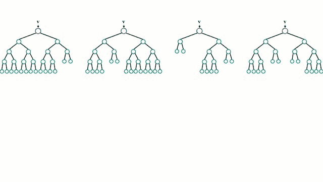
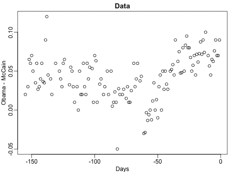

# 随机森林回归快速肮脏指南

> 原文：<https://towardsdatascience.com/a-quick-and-dirty-guide-to-random-forest-regression-52ca0af157f8?source=collection_archive---------15----------------------->


图片由来自 [Pixabay](https://pixabay.com/?utm_source=link-attribution&utm_medium=referral&utm_campaign=image&utm_content=2391033) 的[斯蒂芬·凯勒](https://pixabay.com/users/KELLEPICS-4893063/?utm_source=link-attribution&utm_medium=referral&utm_campaign=image&utm_content=2391033)拍摄

## 随机森林回归的实践方法

作为机器学习实践者，我们会遇到各种各样的机器学习算法，我们可以应用它们来构建我们的模型。在这篇文章中，我将尝试给你一个关于随机森林模型如何从头开始工作的概念的直觉。该算法可用于计算回归和分类问题。

首先，我们将熟悉一些重要的术语，如集成学习和引导聚合，然后我将尝试给你一个算法的直觉，最后，我们将使用随机森林回归器建立我们自己的机器学习模型。

在开始这篇文章之前，我建议你看一下我以前关于决策树的文章[这里](/sowing-the-seeds-of-decision-tree-regression-2bb238dfd768)，这对于任何期待学习这个算法的人来说都是至关重要的先决条件。

# **集成学习:**

假设你想看一部关于网飞的网络连续剧。你会登录你的账户，观看弹出的第一个网站，还是浏览几个网页，比较评分，然后做出决定。是的。很有可能你会选择第二个选项，而不是直接下结论，你也会考虑其他选项。



图片来自[维基共享资源](https://commons.wikimedia.org/wiki/File:Randomforests_ensemble.gif)

这正是集成学习的工作方式。集成学习是一种将来自多个机器学习算法的预测结合起来的技术，可以比任何单独的模型都更准确地预测。简而言之，集合模型是由许多模型组成的模型。有许多综合技术，如堆垛、装袋、混合等。让我们详细看看其中的几个。

## **增压**

顾名思义，Boosting 是一种通过将单个弱学习者分组以形成单个强学习者来促进学习的技术。这是一个连续的过程，每个后续模型都试图纠正前一个模型的错误。后续模型依赖于前一个模型。


图片来自[奥莱利媒体](https://www.oreilly.com/library/view/tensorflow-machine-learning/9781789132212/d3d388ea-3e0b-4095-b01e-a0fe8cb3e575.xhtml)

## **自举聚合**

Bootstrapping 是一种采样技术，其中我们从原始数据集创建观察值的子集。这种技术也被称为装袋。所用子集的大小与原始集的大小相同。在这种技术中，通过组合各种预测模型的结果来获得一般化的结果。为打包创建的子集的大小可能小于原始集。

# **决策树的问题**

尽管决策树是一种有效的回归模型，但仍有一些差异会阻碍决策树的顺利实现。其中一些如下所述:

1.  数据的微小变化可能会导致一组完全不同的数据，从而导致模型给出不正确的预测。
2.  决策树对它们被训练的数据非常敏感，对训练集的微小改变会导致明显不同的树结构**。**
3.  决策树倾向于寻找局部最优解，而不是考虑全局最优解。

为了解决这些问题，兰登森林公司来了。

# **随机森林**

随机森林是一种监督学习算法，它使用集成方法(bagging)来解决回归和分类问题。该算法通过在训练时构建大量决策树并输出各个树的预测均值/模式来运行。


图片来自 [Sefik](https://www.google.com/url?sa=i&url=https%3A%2F%2Fsefiks.com%2F2017%2F11%2F19%2Fhow-random-forests-can-keep-you-from-decision-tree%2F&psig=AOvVaw1F7SNSlrQP5SuPAfQDanhy&ust=1592550068841000&source=images&cd=vfe&ved=0CAMQjB1qFwoTCJilhfbliuoCFQAAAAAdAAAAABAD)

随机森林背后的基本概念是群体的智慧，其中大量不相关的模型作为一个委员会运作，将胜过任何单个的组成模型。

这背后的原因是，这些树相互保护，避免各自的错误。在一个随机森林中，个体树之间没有相互作用。随机森林充当一种估计算法，它聚合许多决策树的结果，然后输出最佳结果。



图片来自[简单统计](https://simplystatistics.org/2017/08/08/code-for-my-educational-gifs/)

现在我们有了什么是随机森林的要点，我们将尝试构建我们自己的随机森林回归器。构建这个回归模型的代码和其他资源可以在[这里](https://github.com/ashwinraj-in/MachineLearningTutorials/blob/master/RandomForestRegression.ipynb)找到。

## **第一步:导入所需的库**

我们的第一步是导入构建模型所需的库。没有必要在一个地方导入所有的库。Python 给了我们在任何地方导入库的灵活性。首先，我们将导入 Pandas、Numpy、Matplotlib 和 Seaborn 库。

```
#Import the Libraries and read the data into a Pandas DataFrameimport pandas as pd
import numpy as np
import matplotlib.pyplot as plt
import seaborn as snstest = pd.read_csv("california_housing_test.csv")
train = pd.read_csv("california_housing_train.csv")
```

一旦导入了这些库，我们的下一步将是获取数据集并将数据加载到我们的笔记本中。对于这个例子，我采用了加州住房数据集。

## **第二步:可视化数据**

成功加载数据后，我们的下一步是可视化这些数据。Seaborn 是一个优秀的库，可以用来可视化数据。

```
#Visualise the dataplt.figure()
sns.heatmap(data.corr(), cmap='coolwarm')
plt.show()sns.lmplot(x='median_income', y='median_house_value', data=train)
sns.lmplot(x='housing_median_age', y='median_house_value', data=train)
```

## **第三步:特征工程**

特征工程是利用领域知识通过数据挖掘技术从原始数据中提取特征的过程。对于这个模型，我选择了只有数值的列。为了处理分类值，应用了标签编码技术。

```
#Select appropriate featuresdata = data[[‘total_rooms’, ‘total_bedrooms’, ‘housing_median_age’, ‘median_income’, ‘population’, ‘households’]]
data.info()data['total_rooms'] = data['total_rooms'].fillna(data['total_rooms'].mean())
data['total_bedrooms'] = data['total_bedrooms'].fillna(data['total_bedrooms'].mean()
```

当特征数量非常大时，特征工程变得更加重要。特征工程最重要的用途之一是减少过度拟合，提高模型的准确性。

## 步骤 4:拟合模型

选择所需参数后，下一步是从 sklearn 库中导入 train_test_split，该库用于将数据集拆分为训练和测试数据。

```
#Split the dataset into training and testing dataimport train_test_split
X_train, X_test, y_train, y_test = train_test_split(train, y, test_size = 0.2, random_state = 0)y_train = y_train.reshape(-1,1)
y_test = y_test.reshape(-1,1)
```

在此之后**从 **sklearn.ensemble** 中导入 RandomForestRegressor** ，并且模型适合训练数据集。参数 n_estimators 决定了森林中树木的数量。默认情况下，该值设置为 100。

```
from sklearn.ensemble import RandomForestRegressor
rfr = RandomForestRegressor(n_estimators = 500, random_state = 0)
rfr.fit(X_train, y_train))
```

如果 bootstrap 设置为 true，则子样本大小由 max_samples 参数控制，否则将使用整个数据集来构建每棵树。

## **随机森林的优势**

1.  它可以在大型数据集上高效运行。
2.  随机森林比其他算法有更高的准确率。
3.  它有一个有效的方法来估计缺失数据，并在大部分数据缺失时保持准确性。


图片来自[维基百科](https://en.wikipedia.org/wiki/Bootstrap_aggregating)

## **随机森林的缺点**

1.  随机森林可能会导致某些数据集过度适应有噪声的回归任务。
2.  对于分类变量具有不同层数的数据，发现随机森林偏向于那些具有更多层数的属性。

至此，我们已经到了这篇文章的结尾。我希望这篇文章能帮助你理解随机森林回归的本质。如果你有任何问题，或者如果你认为我有任何错误，请联系我！您可以通过[邮箱](http://rajashwin812@gmail.com/)或 [LinkedIn](http://linkedin.com/in/rajashwin/) 与我联系。