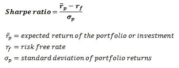
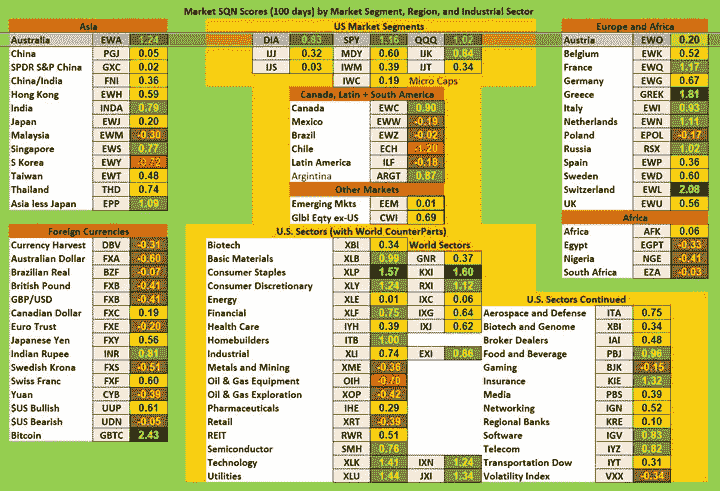

# 建立和测试股票交易策略的快速简单的方法

> 原文：<https://towardsdatascience.com/a-quick-and-easy-way-to-build-and-test-stock-trading-strategies-bce2b58e6ffe?source=collection_archive---------15----------------------->

## 回溯测试、数据、度量、实时实现和缺陷


照片由[像素](https://www.pexels.com/photo/sky-space-dark-galaxy-2150/?utm_content=attributionCopyText&utm_medium=referral&utm_source=pexels)的[皮克斯拜](https://www.pexels.com/@pixabay?utm_content=attributionCopyText&utm_medium=referral&utm_source=pexels)拍摄

***来自《走向数据科学》编辑的提示:*** *虽然我们允许独立作者根据我们的* [*规则和指导方针*](/questions-96667b06af5) *发表文章，但我们并不认可每个作者的贡献。你不应该在没有寻求专业建议的情况下依赖一个作者的作品。详见我们的* [*读者术语*](/readers-terms-b5d780a700a4) *。*

# 算法交易策略开发

回溯测试是量化交易的标志。回溯测试采用历史或综合市场数据，测试算法交易策略的盈利能力。这个主题需要统计学、计算机科学、数学、金融和经济学方面的专业知识。这就是为什么在大型量化交易公司里，对相关学科有丰富知识(通常是博士水平)的人会有特定的角色。专业知识的必要性不可低估，因为它将成功(或看似成功)的交易策略与失败的交易策略区分开来。我这篇文章的目标是将我认为的基本回溯测试过程分成几个不同的部分…

*   **一、**回溯测试引擎
*   **二。**历史和综合数据管理
*   **三。**回溯测试指标
*   **四。**现场实施
*   **五、**战略发展中的陷阱

# 回溯测试引擎

主回溯测试引擎将使用名为 [backtrader](https://www.backtrader.com/) 的库在 Python 中构建。Backtrader 使得建立交易策略并根据历史数据立即实施变得非常容易。整个图书馆以脑波强化器课程为中心。顾名思义，您可以将此视为回溯测试的大脑或引擎。

我决定构建一个函数，这样我就可以动态地参数化回溯测试的不同方面(并最终构建一个管道)。我们需要讨论的下一门反向交易课程是策略课程。如果您查看我为存放 Cerebro 实例而构建的函数，您会看到它将一个策略作为输入——这需要一个 backtrader 策略类或子类。Strategy 类的子类正是我们将用来构建自己的策略的。如果你需要一个多态和继承的复习者或者不知道那是什么意思，请看我的文章 [3 分钟内的 3 个 Python 概念](/3-python-concepts-in-under-3-minutes-d7dd33a14550)。让我们为我们的回溯测试建立一个策略…

在主策略中，我在上面的策略子类中创建了我们在做交易决定之前有兴趣了解的字段。假设每日数据频率，我们在后推过程中每一步可以访问的字段是…

*   开盘当日价格
*   当日收盘价格
*   日低价格
*   日价格高
*   日交易量

不需要天才就能明白，你不能用最高价、最低价和收盘价来做最初或当天的交易决定，因为我们无法实时获得这些信息。但是，如果您想存储它并访问以前的信息，这是很有用的。

你现在脑子里的大问题应该是*数据从哪里来*？

这个问题的答案在反向交易库的结构中。在运行容纳 Cerebro 的函数之前，我们将添加我们想要进行回溯测试的所有策略和一个数据馈送——其余的都由 Strategy 超类处理，因为 Strategy 超类保存了容纳所有市场数据的数据系列。

这让我们的生活变得异常轻松。

让我们通过制定一个简单的只做多均值回归风格的交易策略来结束主策略课。为了访问一个数据点，我们覆盖了下一个函数并添加了交易逻辑…

每天都会得到一个根据我们将买入或卖出股票的数量计算出来的 z 值(与平均值的标准偏差数)。请注意，是的，我使用当天的收盘价来做决定，但我也使用当天的收盘价作为我交易的进场价格——使用第二天的开盘价更明智。

下一步是将策略添加到我们容纳大脑实例的功能中…

在上面的代码中，我将提供给函数的策略添加到了 Cerebro 实例中。这超出了本文的范围，但是我觉得有必要把它包括进来。如果我们进行回溯测试的策略需要额外的数据(一些 AI 模型),我们可以在 args 参数中提供它，并将其添加到策略子类中。

接下来，我们需要找到历史数据或合成数据的来源。

# 历史和综合数据管理

我将历史和合成市场数据作为同义词使用，因为一些研究人员发现合成数据无法与其他市场数据区分开来(因此其生成性更丰富)。出于这个例子的目的，我们将使用 backtrader 提供的 YahooFinance 数据提要，同样使实现变得非常容易…

向我们的回溯测试中添加一个数据馈送是如此容易，这几乎是荒谬的。数据对象使用 backtraders YahooFinanceData 类根据符号、fromdate 和 todate 检索数据。之后，我们只需将这些数据添加到脑波机实例中。backtrader 架构的真正魅力在于实现了数据自动放置在其中，并通过添加到 Cerebro 实例的每个策略进行迭代。

# 回溯测试指标

有很多指标可以用来评估交易策略的表现，我们将在这一部分介绍一些。同样，backtrader 使得添加*分析器*或性能指标变得极其容易。首先，让我们为我们的 Cerebro 实例设置一个初始现金值…

我们可以使用多种指标来评估风险、回报和绩效，让我们来看看其中的一些…

## 夏普比率

正如《show Billions》中提到的，每单位风险的回报率，夏普比率。定义如下…



几次失败和假设。它基于历史表现，假设正态分布，经常被用来错误地比较投资组合。然而，它仍然是任何策略或投资组合的主要部分。

**系统质量号**

这是一个我一直喜欢使用的有趣指标，因为它包括了特定时期的交易量。计算方法是将 SQN 乘以交易次数，然后将乘积除以 100。下面是不同细分市场、地区和行业的价值图表。



图片来自[万瑟普](https://www.vantharp.com/trading/june-2019-system-quality-number-report-the-sqn-report-by-van-k-tharp-ph-d/#:~:text=I%20apply%20a%20version%20of,below%20%2D0.7%20is%20very%20weak.)

现在，让我们将这些指标添加到脑波强化器中，并运行回溯测试…

现在，我们所要做的就是运行上面的代码，我们会根据我们指定的指标获得我们策略的性能…

这是输出…

```
Starting Portfolio Value: 100000.002018-01-30, 160.95
2018-01-30, BUY CREATE, 160.952018-01-31, 161.4
2018-02-01, 161.74
2018-02-02, 154.72
2018-02-02, BUY CREATE, 154.72
2018-02-05, 150.85
2018-02-05, BUY CREATE, 150.85
2018-02-06, 157.16
2018-02-07, 153.792018-02-08, 149.56
2018-02-09, 151.39
2018-02-12, 157.49
2018-02-13, 159.07
2018-02-14, 162.0
2018-02-15, 167.44
2018-02-16, 166.9
2018-02-20, 166.332018-02-21, 165.58
2018-02-22, 166.96
2018-02-23, 169.87
2018-02-26, 173.23
2018-02-27, 172.66
2018-02-28, 172.42018-03-01, 169.38
2018-03-02, 170.55
2018-03-05, 171.15
2018-03-06, 171.0
2018-03-07, 169.41
2018-03-08, 171.26
2018-03-09, 174.2
2018-03-12, 175.89
2018-03-13, 174.19
2018-03-14, 172.71
2018-03-15, 172.92
2018-03-16, 172.31
2018-03-19, 169.67
2018-03-20, 169.62
2018-03-21, 165.77
2018-03-21, BUY CREATE, 165.77
2018-03-22, 163.43
2018-03-22, BUY CREATE, 163.43
2018-03-23, 159.65
2018-03-23, BUY CREATE, 159.652018-03-26, 167.22
2018-03-27, 162.94
2018-03-28, 161.14
2018-03-29, 162.4
2018-04-02, 161.33
2018-04-03, 162.99
2018-04-04, 166.1
2018-04-05, 167.252018-04-06, 162.98
2018-04-09, 164.59
2018-04-10, 167.69
2018-04-11, 166.91
2018-04-12, 168.55
2018-04-13, 169.12
2018-04-16, 170.18
2018-04-17, 172.522018-04-18, 172.13
2018-04-19, 167.25
2018-04-20, 160.4
2018-04-23, 159.94
2018-04-24, 157.71
2018-04-25, 158.4
2018-04-26, 158.952018-04-27, 157.11
2018-04-30, 159.96
2018-05-01, 163.67
2018-05-02, 170.9
2018-05-03, 171.212018-05-04, 177.93
2018-05-07, 179.22
2018-05-08, 180.08
2018-05-09, 181.352018-05-10, 183.94
2018-05-11, 183.24
2018-05-14, 182.81
2018-05-15, 181.15
2018-05-16, 182.842018-05-17, 181.69
2018-05-18, 181.03
2018-05-21, 182.31
2018-05-22, 181.85
2018-05-23, 183.02
2018-05-24, 182.812018-05-25, 183.23
2018-05-29, 182.57
2018-05-30, 182.18
2018-05-31, 181.57
2018-06-01, 184.84
2018-06-04, 186.392018-06-05, 187.83
2018-06-06, 188.482018-06-07, 187.97
2018-06-08, 186.26
2018-06-11, 185.812018-06-12, 186.83
2018-06-13, 185.29
2018-06-14, 185.39
2018-06-15, 183.48
2018-06-18, 183.392018-06-19, 180.42
2018-06-20, 181.21
2018-06-21, 180.2
2018-06-22, 179.68
2018-06-25, 177.0
2018-06-25, BUY CREATE, 177.002018-06-26, 179.2
2018-06-27, 178.94
2018-06-28, 180.24
2018-06-29, 179.862018-07-02, 181.87
2018-07-03, 178.7
2018-07-05, 180.14
2018-07-06, 182.64
2018-07-09, 185.172018-07-10, 184.95
2018-07-11, 182.55
2018-07-12, 185.61
2018-07-13, 185.9
2018-07-16, 185.5
2018-07-17, 186.022018-07-18, 185.0
2018-07-19, 186.44
2018-07-20, 186.01
2018-07-23, 186.18
2018-07-24, 187.53
2018-07-25, 189.292018-07-26, 188.7
2018-07-27, 185.56
2018-07-30, 184.52
2018-07-31, 184.89
2018-08-01, 195.78
2018-08-02, 201.51
2018-08-03, 202.09
2018-08-06, 203.14
2018-08-07, 201.24
2018-08-08, 201.37
2018-08-09, 202.96
2018-08-10, 202.35
2018-08-13, 203.66
2018-08-14, 204.52
2018-08-15, 204.99
2018-08-16, 208.0
2018-08-17, 212.15
2018-08-20, 210.08
2018-08-21, 209.67
2018-08-22, 209.682018-08-23, 210.11
2018-08-24, 210.77
2018-08-27, 212.5
2018-08-28, 214.22
2018-08-29, 217.42
2018-08-30, 219.41
2018-08-31, 221.952018-09-04, 222.66
2018-09-05, 221.21
2018-09-06, 217.53
2018-09-07, 215.78
2018-09-10, 212.882018-09-11, 218.26
2018-09-12, 215.55
2018-09-13, 220.76
2018-09-14, 218.25
2018-09-17, 212.44
2018-09-18, 212.79
2018-09-19, 212.92
2018-09-20, 214.542018-09-21, 212.23
2018-09-24, 215.28
2018-09-25, 216.65
2018-09-26, 214.92
2018-09-27, 219.34
2018-09-28, 220.112018-10-01, 221.59
2018-10-02, 223.56
2018-10-03, 226.282018-10-04, 222.3
2018-10-05, 218.69
2018-10-08, 218.19
2018-10-09, 221.212018-10-10, 210.96
2018-10-11, 209.1
2018-10-12, 216.57
2018-10-15, 211.94
2018-10-16, 216.612018-10-17, 215.67
2018-10-18, 210.63
2018-10-19, 213.84
2018-10-22, 215.14
2018-10-23, 217.172018-10-24, 209.72
2018-10-25, 214.31
2018-10-26, 210.9
2018-10-29, 206.94
2018-10-30, 207.98
2018-10-31, 213.42018-11-01, 216.67
2018-11-02, 202.3
2018-11-02, BUY CREATE, 202.30
2018-11-05, 196.56
2018-11-05, BUY CREATE, 196.562018-11-06, 198.68
2018-11-06, BUY CREATE, 198.68
2018-11-07, 204.71
2018-11-08, 204.02018-11-09, 200.06
2018-11-12, 189.99
2018-11-12, BUY CREATE, 189.99
2018-11-13, 188.09
2018-11-13, BUY CREATE, 188.092018-11-14, 182.77
2018-11-14, BUY CREATE, 182.77
2018-11-15, 187.28
2018-11-16, 189.362018-11-19, 181.85
2018-11-20, 173.17
2018-11-20, BUY CREATE, 173.17
2018-11-21, 172.972018-11-23, 168.58
2018-11-26, 170.86
2018-11-27, 170.48
2018-11-28, 177.042018-11-29, 175.68
2018-11-30, 174.73
2018-12-03, 180.84
2018-12-04, 172.88
2018-12-06, 170.952018-12-07, 164.86
2018-12-10, 165.94
2018-12-11, 165.0
2018-12-12, 165.46
2018-12-13, 167.27
2018-12-14, 161.91
2018-12-17, 160.41
2018-12-18, 162.49
2018-12-19, 157.42
2018-12-20, 153.45
2018-12-20, BUY CREATE, 153.45
2018-12-21, 147.48
2018-12-21, BUY CREATE, 147.48
2018-12-24, 143.67
2018-12-24, BUY CREATE, 143.67
2018-12-26, 153.78
2018-12-27, 152.78
2018-12-28, 152.86
2018-12-31, 154.34
Final Portfolio Value: 100381.48
Return:  OrderedDict([('rtot', 0.0038075421029081335), ('ravg', 1.5169490449833201e-05), ('rnorm', 0.003830027474518453), ('rnorm100', 0.3830027474518453)])
Sharpe Ratio:  OrderedDict([('sharperatio', None)])
System Quality Number:  AutoOrderedDict([('sqn', 345.9089929588268), ('trades', 2)])
```

# 实时实施

这与其说是一部分，不如说是我用来实施交易策略的资源的集合。如果你想向前迈进，并在现实市场中实施你的策略，看看这些文章…

*   [用 Python 进行算法交易](/algorithmic-trading-with-python-8fbf1c279e77)
*   [免费打造 AI 炒股机器人](https://medium.com/swlh/build-an-ai-stock-trading-bot-for-free-4a46bec2a18)
*   [算法交易系统开发](https://medium.com/swlh/algorithmic-trading-system-development-1a5a200af260)
*   [面向金融的 Python 中的多线程](/multithreading-in-python-for-finance-fc1425664e74)
*   [如何打造盈利的股票交易机器人](https://medium.com/swlh/build-a-profitable-stock-trading-bot-6ba376cba955)
*   [建立一个神经网络来管理股票投资组合](https://medium.com/swlh/build-a-neural-network-to-manage-a-stock-portfolio-bb13964990bc)

# 算法交易策略陷阱

*   **不了解策略中盈利的驱动因素:**有些人认为，不管财务或经济驱动因素如何，如果你能获得足够的数据，并以这样的方式激发数据，你就能制定出盈利的交易策略。我年轻的时候也是这样，对算法交易比较陌生，也比较幼稚。事实是，如果你不能理解你自己的交易算法的本质，它永远不会盈利。
*   **不了解如何分割历史数据或合成数据来搜索和优化策略**:这是一个大问题，后果是可怕的。我在大学的一个同事告诉我，他开发了一个有 300%回报的交易系统。很自然地，我马上就知道他完全把一个模型过度拟合到了历史数据上，并且从来没有在实际数据中实现过。问了一个关于他优化过程的简单问题，证实了我的怀疑。
*   **不愿意接受下跌日:**这个很有意思，对新手的影响似乎比经验丰富的交易者更大。老兵们知道会有低潮，会有损失，但是最重要的目标是赢的比输的多。这个问题通常出现在部署中——假设其他流程
*   **不愿意让以前盈利的系统退役:**损失控制，请了解风险管理和损失控制。你的系统是成功的，这太棒了——这意味着你理解了设计过程，并且可以再做一次。不要纠结于*它做得有多好*看看*它做得有多好。*这与理解您战略中的盈利驱动因素有所重叠——如果您理解了系统不再盈利的原因，您就会知道何时以及为何该淘汰系统。